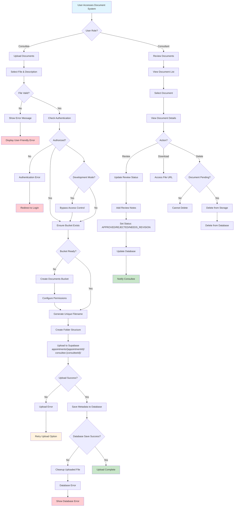
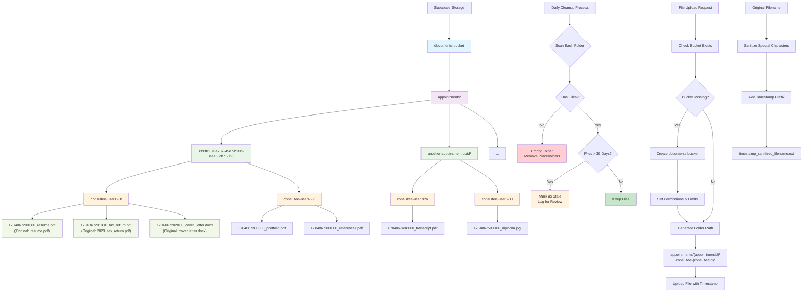
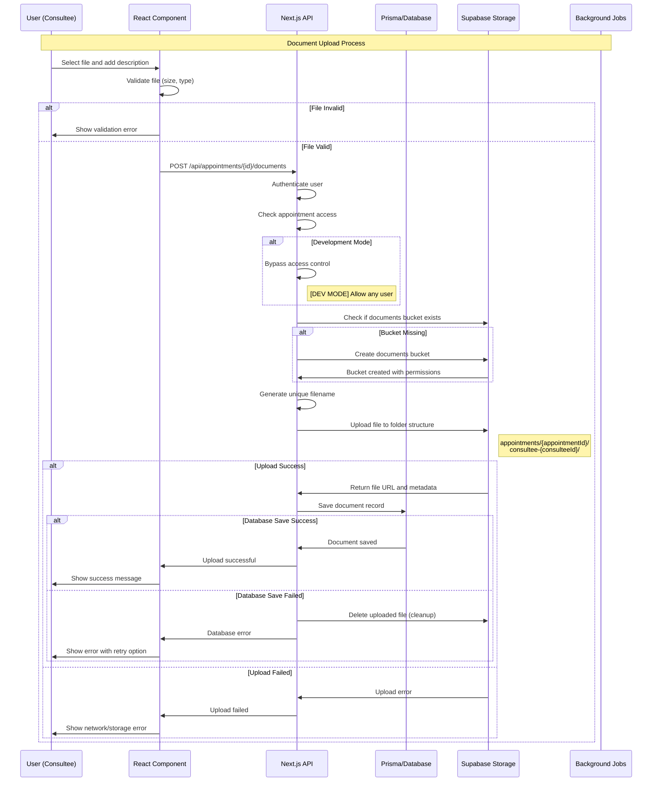
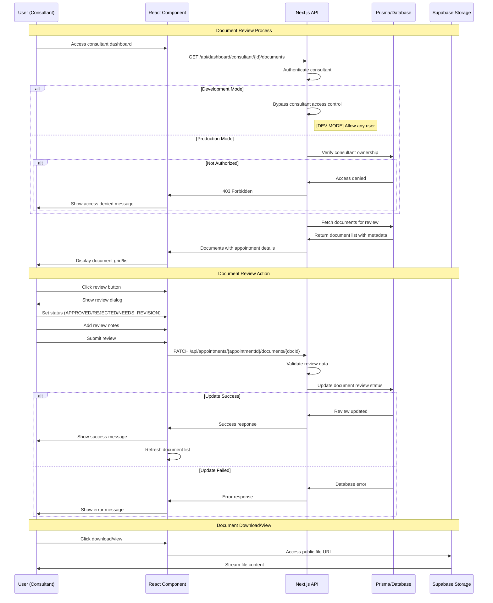
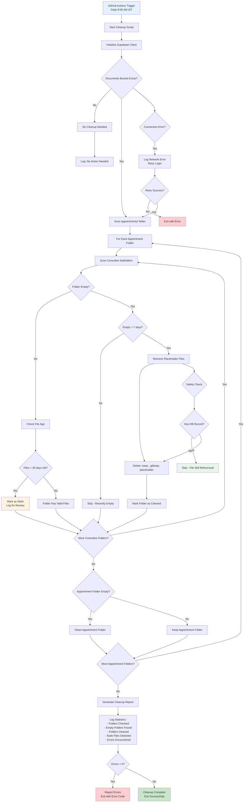
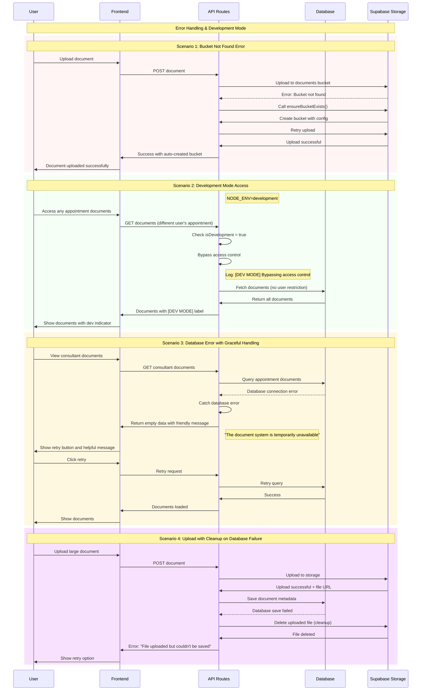

# Storage Management & Cleanup Strategy

## Overview

This document explains our comprehensive approach to managing document storage, including automatic hierarchy creation, stale data cleanup, and maintenance strategies.

## Visual Documentation Index

This document includes comprehensive visual diagrams to illustrate the document system architecture:

### 📊 **Architecture & Flow Diagrams**

1. **[Complete Document Lifecycle Flow](#complete-document-lifecycle-flow)** - Overview of entire system from upload to review
2. **[Visual Storage Organization](#visual-storage-organization)** - Storage hierarchy and folder structure
3. **[Document Upload Sequence Flow](#document-upload-sequence-flow)** - Detailed upload process interactions
4. **[Document Review Sequence Flow](#document-review-sequence-flow)** - Consultant review workflow
5. **[Automated Cleanup Process Flow](#automated-cleanup-process-flow)** - Maintenance and cleanup procedures
6. **[Error Handling & Development Mode Scenarios](#error-handling--development-mode-scenarios)** - Error handling and testing scenarios

### 🎯 **Quick Navigation**

- **For Developers**: See upload/review sequence diagrams for API integration
- **For DevOps**: See cleanup process flow for maintenance understanding
- **For Testing**: See error handling scenarios for development mode features
- **For Architecture**: See storage organization for infrastructure planning

## System Architecture Overview

### Complete Document Lifecycle Flow



## Storage Hierarchy

### Visual Storage Organization



### Folder Structure

```
documents/                                    # Main bucket
├── appointments/                            # Root folder for all appointments
│   ├── {appointmentId}/                    # Individual appointment folder
│   │   ├── consultee-{consulteeId}/        # Consultee-specific folder
│   │   │   ├── {timestamp}_{filename}     # Actual documents
│   │   │   └── ...
│   │   └── consultant-{consultantId}/      # (Future: consultant materials)
│   └── ...
└── temp/                                   # (Future: temporary uploads)
```

### Naming Conventions

- **Appointment Folders**: Use UUID format (e.g., `8b8f818e-a787-45e7-b20b-aee65cb750f9`)
- **Consultee Folders**: Prefixed with `consultee-` followed by consultee profile ID
- **Files**: `{timestamp}_{sanitized_filename}` format for uniqueness and traceability

## On-the-Fly Creation Strategy

### 1. Bucket Management

```typescript
// Automatically creates bucket if it doesn't exist
const ensureBucketExists = async (bucketName: string): Promise<boolean> => {
  // Check existence → Create if missing → Configure permissions
};
```

**Features:**

- **Auto-Detection**: Checks bucket existence before operations
- **Auto-Creation**: Creates bucket with proper configuration if missing
- **Permission Setup**: Configures public access and file type restrictions
- **Size Limits**: Enforces 10MB file size limit

### 2. Folder Creation

```typescript
// Ensures folder structure exists
const ensureFolderExists = async (
  bucketName: string,
  folderPath: string,
): Promise<boolean> => {
  // Supabase creates folders automatically when files are uploaded
  // This function provides explicit checking for validation
};
```

**How it works:**

- **Implicit Creation**: Supabase creates folder structure when first file is uploaded
- **Path Validation**: Ensures the path structure is valid before upload
- **Error Prevention**: Prevents upload failures due to missing folder structure

### 3. Upload Process

#### Document Upload Sequence Flow



#### Upload Implementation

```typescript
// Complete upload process with hierarchy management
const uploadAppointmentDocument = async (options: DocumentUploadOptions) => {
  1. Validate file (size, type)
  2. Ensure bucket exists
  3. Generate unique filename
  4. Create folder path
  5. Ensure folder structure
  6. Upload file
  7. Return public URL
}
```

## Document Review Process

### Document Review Sequence Flow



## Cleanup Strategy

### 1. Daily Automated Cleanup

**Schedule**: Every day at 9:00 AM IST (3:30 AM UTC)
**Trigger**: GitHub Actions workflow

```yaml
# .github/workflows/cleanup-empty-folders.yml
schedule:
  - cron: "30 3 * * *" # 9 AM IST daily
```

**Process:**

1. **Folder Scanning**: Traverses entire appointment hierarchy
2. **Empty Detection**: Identifies folders with no actual files
3. **Cleanup**: Removes placeholder files and empty markers
4. **Reporting**: Logs summary of cleanup actions

#### Automated Cleanup Process Flow



### 2. Stale Data Management

**Definition of Stale Data:**

- **Empty Folders**: Folders with no files for 7+ days
- **Orphaned Files**: Files without corresponding database records
- **Temporary Files**: Failed uploads or incomplete transfers
- **Old Placeholder Files**: `.keep`, `.gitkeep`, `placeholder` files

**Cleanup Criteria:**

```typescript
const STALE_FILE_DAYS = 30; // Files older than 30 days
const MAX_EMPTY_FOLDER_AGE_DAYS = 7; // Empty folders older than 7 days
```

### 3. Cleanup Script Features

```typescript
// Enhanced cleanup with stale file detection
interface CleanupStats {
  foldersChecked: number;
  emptyFoldersFound: number;
  foldersDeleted: number;
  staleFilesFound: number;
  staleFilesDeleted: number;
  errors: string[];
}
```

**Capabilities:**

- **Comprehensive Scanning**: Checks all appointment and consultee folders
- **Smart Detection**: Identifies truly empty vs. temporarily empty folders
- **Safe Deletion**: Only removes placeholder files, not actual documents
- **Error Handling**: Graceful handling of permission or network issues
- **Detailed Reporting**: Comprehensive logs and statistics

### 4. Data Integrity Safeguards

**Database Synchronization:**

- Files are only deleted if no corresponding database record exists
- Database records are checked before any file deletion
- Orphaned database records trigger cleanup of storage files

**Backup Strategy:**

- **Soft Deletion**: Database records marked as deleted before file removal
- **Grace Period**: 7-day grace period before permanent deletion
- **Recovery Options**: Ability to restore recently deleted files

**Safety Checks:**

```typescript
// Never delete files that:
- Are referenced in active appointments
- Have been accessed recently (< 30 days)
- Are in pending review status
- Have successful upload status
```

## Development Mode Enhancements

### Access Control Bypass

```typescript
const isDevelopment = process.env.NODE_ENV === 'development';

// In development mode:
- Allow access to any appointment's documents
- Bypass consultee/consultant access restrictions
- Enable upload/review by any authenticated user
- Log all access control bypasses
```

**Benefits:**

- **Testing Flexibility**: Easy testing across different user roles
- **Data Visibility**: View all documents for debugging
- **Development Speed**: No need to switch between different user accounts
- **Clear Marking**: All responses marked with `[DEV MODE]` for clarity

### Error Handling & Development Mode Scenarios



## Monitoring & Maintenance

### 1. Storage Metrics

- **Folder Count**: Track growth of appointment folders
- **File Count**: Monitor total documents uploaded
- **Storage Size**: Track total storage usage
- **Cleanup Efficiency**: Monitor empty folder cleanup success rate

### 2. Health Checks

```bash
# Manual cleanup execution
npm run scripts:cleanup-empty-folders

# Development cleanup with detailed output
npm run scripts:cleanup-empty-folders:dev
```

### 3. Error Monitoring

- **Failed Uploads**: Track and investigate upload failures
- **Cleanup Errors**: Monitor cleanup script failures
- **Permission Issues**: Track access control problems
- **Storage Quotas**: Monitor approaching storage limits

## Performance Optimizations

### 1. Upload Optimizations

- **File Validation**: Client-side validation before upload
- **Unique Naming**: Prevents conflicts and overwrites
- **Concurrent Uploads**: Support for multiple file uploads
- **Progress Tracking**: Real-time upload progress feedback

### 2. Cleanup Optimizations

- **Batch Operations**: Process multiple items efficiently
- **Rate Limiting**: Prevent API throttling during cleanup
- **Selective Scanning**: Only scan recently modified folders
- **Parallel Processing**: Handle multiple folders concurrently

### 3. Storage Optimizations

- **CDN Caching**: Cache public URLs for faster access
- **Compression**: Automatic compression for supported file types
- **Deduplication**: Prevent duplicate file storage
- **Archive Strategy**: Move old files to cheaper storage tiers

## Security Considerations

### 1. Access Control

- **Role-Based Access**: Consultees can only upload, consultants can review
- **Appointment Isolation**: Users only access their appointment documents
- **File Type Restrictions**: Only allow safe file types
- **Size Limits**: Prevent storage abuse with file size limits

### 2. Data Protection

- **Public URLs**: Secure public URL generation
- **File Scanning**: Virus scanning for uploaded files (future)
- **Audit Logging**: Track all file operations
- **Encryption**: At-rest encryption through Supabase

### 3. Cleanup Safety

- **Verification Steps**: Multiple checks before deletion
- **Rollback Capability**: Ability to restore accidentally deleted files
- **Audit Trail**: Complete log of all cleanup operations
- **Manual Override**: Ability to exclude specific files/folders from cleanup

## Future Enhancements

### 1. Advanced Cleanup

- **AI-Powered Detection**: Machine learning to identify truly stale data
- **Usage Analytics**: Track file access patterns for better cleanup decisions
- **Predictive Cleanup**: Predict which files will become stale
- **Smart Archival**: Automatically move old files to cheaper storage

### 2. Enhanced Monitoring

- **Real-Time Dashboards**: Visual monitoring of storage health
- **Alerting System**: Notifications for cleanup failures or storage issues
- **Performance Metrics**: Detailed performance tracking and optimization
- **Cost Optimization**: Monitor and optimize storage costs

### 3. Extended Features

- **Version Control**: Track file versions and changes
- **Collaborative Editing**: Support for document collaboration
- **Advanced Search**: Full-text search within documents
- **Integration**: Deeper integration with appointment scheduling system

## Troubleshooting Guide

### Common Issues

**1. "Bucket not found" Error**

```bash
Solution: The system will automatically create the bucket on first upload
Status: Fixed with ensureBucketExists() function
```

**2. Empty Folder Accumulation**

```bash
Solution: Daily cleanup script removes empty folders automatically
Manual: Run `npm run scripts:cleanup-empty-folders`
```

**3. Permission Denied**

```bash
Check: SUPABASE_SERVICE_ROLE_KEY environment variable
Verify: Bucket permissions and user roles
Debug: Enable development mode for testing
```

**4. Upload Failures**

```bash
Check: File size (max 10MB), file type (PDF, DOC, images)
Verify: Network connectivity and Supabase service status
Debug: Check browser console for detailed error messages
```

### Recovery Procedures

**1. Restore Deleted Files**

- Check Supabase dashboard for recently deleted files
- Review cleanup script logs for deletion details
- Contact support if files were accidentally deleted

**2. Fix Broken Hierarchy**

- Run cleanup script to reset folder structure
- Re-upload documents if necessary
- Verify database consistency

**3. Handle Cleanup Script Failures**

- Check GitHub Actions logs for detailed error information
- Manually run cleanup script with debug output
- Report issues to development team

This comprehensive strategy ensures reliable, efficient, and secure document storage management while providing robust cleanup and maintenance capabilities.
