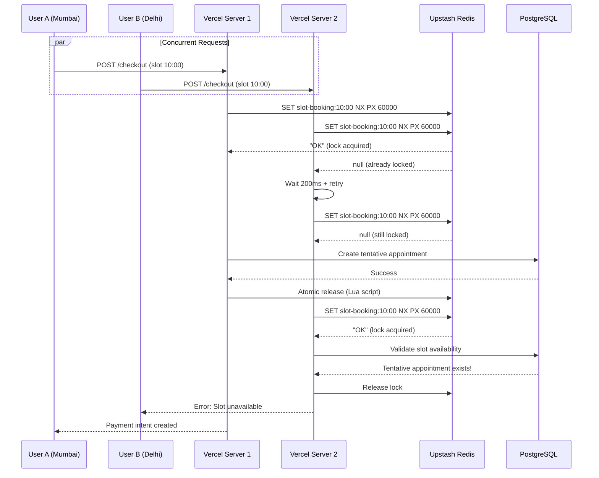
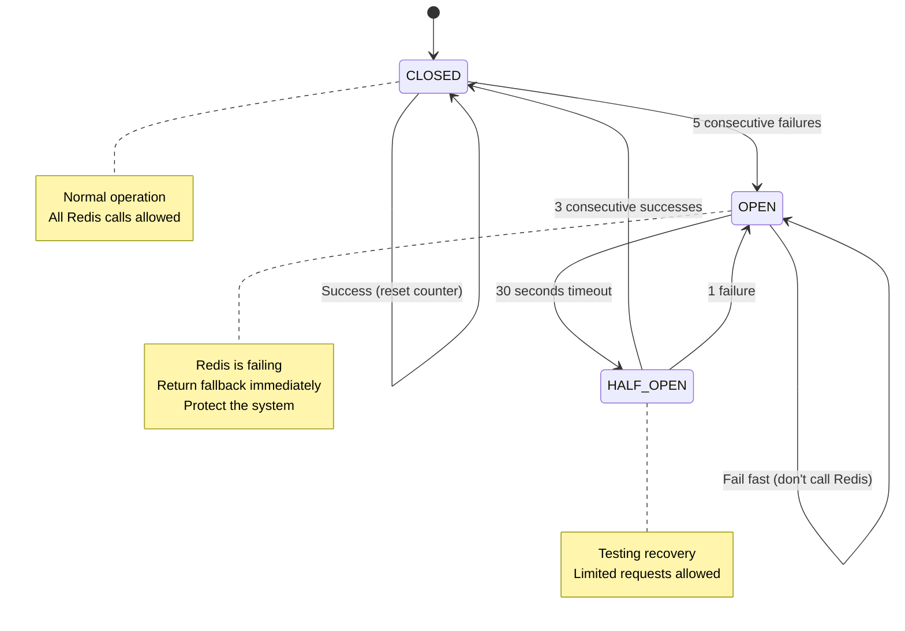

# Distributed Systems Architecture: Locking & Caching

This document explains how distributed locking and caching are implemented in Familiarise Web & Mobile apps.

---

## Table of Contents

1. [Distributed Locking (IMPLEMENTED)](#1-distributed-locking-implemented)
2. [Caching (PARTIALLY IMPLEMENTED)](#2-caching-partially-implemented)
3. [Mobile App Architecture](#3-mobile-app-architecture)
4. [What's Required vs Overkill](#4-whats-required-vs-overkill)

---

## 1. Distributed Locking (IMPLEMENTED)

### What is Distributed Locking?

When multiple users try to book the same consultation slot simultaneously, you need a way to ensure only ONE booking succeeds. Distributed locking is like a "digital mutex" that works across multiple servers.

### Your Implementation

```
┌─────────────────────────────────────────────────────────────────────────────┐
│                        DISTRIBUTED LOCKING FLOW                              │
│                     (Prevents Double Bookings)                               │
└─────────────────────────────────────────────────────────────────────────────┘

   User A (Mumbai)                    User B (Delhi)
        │                                  │
        │  POST /api/checkout              │  POST /api/checkout
        │  (Same slot: 10:00 AM)           │  (Same slot: 10:00 AM)
        ▼                                  ▼
┌───────────────┐                  ┌───────────────┐
│   Vercel      │                  │   Vercel      │
│   Server 1    │                  │   Server 2    │
│   (Edge)      │                  │   (Edge)      │
└───────┬───────┘                  └───────┬───────┘
        │                                  │
        │ 1. Try acquire lock              │ 1. Try acquire lock
        │    SET NX PX 60000               │    SET NX PX 60000
        │                                  │
        ▼                                  ▼
┌─────────────────────────────────────────────────────────────────────────────┐
│                           UPSTASH REDIS                                      │
│                        (Global Edge Network)                                 │
│                                                                              │
│   Key: "slot-booking:consultant123:2024-01-15T10:00:00Z"                    │
│   Value: "uuid-a1b2c3d4"  ◄── User A's unique token                        │
│   TTL: 60 seconds                                                           │
│                                                                              │
│   ┌────────────────────────────────────────────────────────────────────┐    │
│   │ SET NX (Set if Not eXists) - ATOMIC OPERATION                      │    │
│   │                                                                     │    │
│   │ User A: SET key "uuid-a1b2" NX PX 60000 → "OK" ✅ (Lock acquired)  │    │
│   │ User B: SET key "uuid-x9y8" NX PX 60000 → null ❌ (Already locked) │    │
│   └────────────────────────────────────────────────────────────────────┘    │
└─────────────────────────────────────────────────────────────────────────────┘
        │                                  │
        │ ✅ Lock acquired                 │ ❌ Lock failed
        │                                  │
        ▼                                  ▼
┌───────────────────────┐          ┌───────────────────────┐
│ Create tentative      │          │ RETRY with            │
│ appointment           │          │ exponential backoff   │
│                       │          │                       │
│ Create payment intent │          │ Attempt 1: wait 200ms │
│                       │          │ Attempt 2: wait 400ms │
│ Return to user        │          │ Attempt 3: wait 800ms │
└───────────────────────┘          │ ...                   │
        │                          │ Attempt 10: fail      │
        │                          └───────────────────────┘
        │                                  │
        │ 2. After payment                 │
        │    completes                     ▼
        │                          ┌───────────────────────┐
        ▼                          │ Return error:         │
┌───────────────────────┐          │ "Slot unavailable,    │
│ Release lock          │          │  please try again"    │
│ (Atomic Lua script)   │          └───────────────────────┘
│                       │
│ if GET key == token   │
│   then DEL key        │
│   else ignore         │
└───────────────────────┘
```

### Lock Types in Your Codebase

```
┌─────────────────────────────────────────────────────────────────────────────┐
│                         LOCK TYPES & USE CASES                               │
└─────────────────────────────────────────────────────────────────────────────┘

┌─────────────────────────┐     ┌─────────────────────────┐
│ 1. SLOT BOOKING LOCK    │     │ 2. CONSULTATION         │
│                         │     │    APPROVAL LOCK        │
│ Key Pattern:            │     │                         │
│ slot-booking:           │     │ Key Pattern:            │
│   {consultantId}:       │     │ consultation-approval:  │
│   {slotTimeUTC}         │     │   {consultationId}      │
│                         │     │                         │
│ TTL: 60 seconds         │     │ TTL: 60 seconds         │
│                         │     │                         │
│ Prevents:               │     │ Prevents:               │
│ Two users booking       │     │ Consultant approving    │
│ same slot               │     │ while payment pending   │
└─────────────────────────┘     └─────────────────────────┘

┌─────────────────────────┐     ┌─────────────────────────┐
│ 3. SUBSCRIPTION         │     │ 4. EVENT CHECKOUT       │
│    APPROVAL LOCK        │     │    LOCK                 │
│                         │     │                         │
│ Key Pattern:            │     │ Key Pattern:            │
│ subscription-approval:  │     │ event-checkout:         │
│   {subscriptionId}      │     │   {eventType}:          │
│                         │     │   {eventId}             │
│ TTL: 60 seconds         │     │                         │
│                         │     │ TTL: 60 seconds         │
│ Prevents:               │     │                         │
│ Double approval of      │     │ Prevents:               │
│ subscription            │     │ Race in webinar/class   │
└─────────────────────────┘     │ registration            │
                                └─────────────────────────┘

┌─────────────────────────────────────────────────────────────────────────────┐
│ 5. EVENT SLOT SEMAPHORE (for multi-participant events)                       │
│                                                                              │
│ Key Pattern: event-counter:{eventType}:{eventId}                            │
│ Value: Current participant count                                             │
│ TTL: 5 minutes (for payment completion)                                      │
│                                                                              │
│ Example: Webinar with 100 max participants                                   │
│                                                                              │
│ ┌──────────────────────────────────────────────────────────────────────┐    │
│ │  User 1: INCR counter → 1 ✅ (under 100)                             │    │
│ │  User 2: INCR counter → 2 ✅ (under 100)                             │    │
│ │  ...                                                                  │    │
│ │  User 99: INCR counter → 99 ✅ (under 100)                           │    │
│ │  User 100: INCR counter → 100 ✅ (at limit)                          │    │
│ │  User 101: CHECK counter → 100 ❌ (reject, event full)               │    │
│ └──────────────────────────────────────────────────────────────────────┘    │
│                                                                              │
│ On payment failure: DECR counter (release slot for others)                   │
│ On payment success: Keep counter, store in database                          │
└─────────────────────────────────────────────────────────────────────────────┘
```

### The Atomic Lua Script (Critical!)

```lua
-- This runs ATOMICALLY in Redis (no race condition possible)
-- Problem it solves: What if lock expires BETWEEN "GET" and "DEL"?

-- WITHOUT Lua (DANGEROUS):
GET key → returns "my-token"
-- Lock expires here! Another user gets lock with "their-token"
DEL key → DELETED! (But we just deleted someone else's lock!)

-- WITH Lua (SAFE - your implementation):
if redis.call("get", KEYS[1]) == ARGV[1] then
  return redis.call("del", KEYS[1])  -- Only delete if WE own it
else
  return 0  -- Someone else owns it, do nothing
end
```

### Retry Logic with Exponential Backoff

```
┌─────────────────────────────────────────────────────────────────────────────┐
│                    RETRY STRATEGY (10 attempts)                              │
└─────────────────────────────────────────────────────────────────────────────┘

Attempt │ Base Delay │ Backoff (2^n) │ Jitter (0-200ms) │ Total Wait
────────┼────────────┼───────────────┼──────────────────┼────────────
   1    │   200ms    │   200 × 2⁰    │   + random(200)  │  200-400ms
   2    │   200ms    │   200 × 2¹    │   + random(200)  │  400-600ms
   3    │   200ms    │   200 × 2²    │   + random(200)  │  800-1000ms
   4    │   200ms    │   200 × 2³    │   + random(200)  │  1600-1800ms
   5    │   200ms    │   200 × 2⁴    │   + random(200)  │  3200-3400ms
   6    │   200ms    │   200 × 2⁵    │   + random(200)  │  6400-6600ms
   7    │   200ms    │   200 × 2⁶    │   + random(200)  │  12.8-13s
   8    │   200ms    │   200 × 2⁷    │   + random(200)  │  25.6-25.8s
   9    │   200ms    │   200 × 2⁸    │   + random(200)  │  51.2-51.4s
  10    │   200ms    │   200 × 2⁹    │   + random(200)  │  102-103s

Total max wait time: ~3.5 minutes before giving up

WHY JITTER? Prevents "thundering herd" where all waiting users
           retry at exact same time after lock release.
```

---

## 2. Caching (PARTIALLY IMPLEMENTED)

### Current State

```
┌─────────────────────────────────────────────────────────────────────────────┐
│                         CACHING ARCHITECTURE                                 │
│                                                                              │
│  ⚠️  PROBLEM: Stream cache is IN-MEMORY, not distributed!                   │
└─────────────────────────────────────────────────────────────────────────────┘

CURRENT IMPLEMENTATION:

┌─────────────────┐     ┌─────────────────┐     ┌─────────────────┐
│  Vercel Edge    │     │  Vercel Edge    │     │  Vercel Edge    │
│  Server 1       │     │  Server 2       │     │  Server 3       │
│                 │     │                 │     │                 │
│ ┌─────────────┐ │     │ ┌─────────────┐ │     │ ┌─────────────┐ │
│ │ Stream Cache│ │     │ │ Stream Cache│ │     │ │ Stream Cache│ │
│ │ (Map)       │ │     │ │ (Map)       │ │     │ │ (Map)       │ │
│ │             │ │     │ │             │ │     │ │             │ │
│ │ user:123 ✓  │ │     │ │ (empty)     │ │     │ │ (empty)     │ │
│ │ user:456 ✓  │ │     │ │             │ │     │ │             │ │
│ └─────────────┘ │     │ └─────────────┘ │     │ └─────────────┘ │
└─────────────────┘     └─────────────────┘     └─────────────────┘
        │                       │                       │
        └───────────────────────┴───────────────────────┘
                                │
                    ❌ CACHES NOT SHARED!

User hits Server 1 → Synced to Stream, cached
User hits Server 2 → NOT cached! → Syncs AGAIN (wasted API call)


SHOULD BE (DISTRIBUTED CACHE):

┌─────────────────┐     ┌─────────────────┐     ┌─────────────────┐
│  Vercel Edge    │     │  Vercel Edge    │     │  Vercel Edge    │
│  Server 1       │     │  Server 2       │     │  Server 3       │
└────────┬────────┘     └────────┬────────┘     └────────┬────────┘
         │                       │                       │
         └───────────────────────┼───────────────────────┘
                                 │
                                 ▼
                    ┌─────────────────────────┐
                    │     UPSTASH REDIS       │
                    │   (Distributed Cache)   │
                    │                         │
                    │  stream:user-sync:123   │
                    │  stream:user-sync:456   │
                    │  stream:channel:abc     │
                    │                         │
                    │  ✅ ALL SERVERS SHARE   │
                    │     THE SAME CACHE      │
                    └─────────────────────────┘
```

### Cache Types in Your Codebase

```
┌─────────────────────────────────────────────────────────────────────────────┐
│                         CURRENT CACHE TYPES                                  │
└─────────────────────────────────────────────────────────────────────────────┘

┌─────────────────────────────────────────────────────────────────────────────┐
│ 1. STREAM USER SYNC CACHE (lib/stream-cache.ts)                             │
│                                                                              │
│    Type: In-memory Map (TTLCache)                                           │
│    TTL: 5 minutes                                                           │
│    Purpose: Track if user was synced to Stream.io                           │
│    Problem: ❌ NOT DISTRIBUTED - each server has its own cache              │
│                                                                              │
│    const userSyncCache = new TTLCache<boolean>(5 * 60 * 1000);              │
└─────────────────────────────────────────────────────────────────────────────┘

┌─────────────────────────────────────────────────────────────────────────────┐
│ 2. CHANNEL EXISTS CACHE (lib/stream-cache.ts)                               │
│                                                                              │
│    Type: In-memory Map (TTLCache)                                           │
│    TTL: 2 minutes                                                           │
│    Purpose: Track if a Stream channel exists                                │
│    Problem: ❌ NOT DISTRIBUTED                                              │
└─────────────────────────────────────────────────────────────────────────────┘

┌─────────────────────────────────────────────────────────────────────────────┐
│ 3. MEMBERSHIP CACHE (lib/stream-cache.ts)                                   │
│                                                                              │
│    Type: In-memory Map (TTLCache)                                           │
│    TTL: 1 minute                                                            │
│    Purpose: Track user-to-channel membership                                │
│    Problem: ❌ NOT DISTRIBUTED                                              │
└─────────────────────────────────────────────────────────────────────────────┘

┌─────────────────────────────────────────────────────────────────────────────┐
│ 4. REACT QUERY CACHE (client-side)                                          │
│                                                                              │
│    Type: Client-side cache (browser)                                        │
│    TTL: Configurable per query                                              │
│    Purpose: Cache API responses on client                                   │
│    Status: ✅ FINE (client-side caching is per-user anyway)                 │
└─────────────────────────────────────────────────────────────────────────────┘
```

### Why In-Memory Cache is a Problem at Scale

```
                           AT LOW SCALE (1 server)
┌─────────────────────────────────────────────────────────────────────────────┐
│                                                                              │
│  All requests → Same server → Same cache → Works fine!                      │
│                                                                              │
│  Request 1: Cache MISS → Sync user to Stream → Cache HIT                    │
│  Request 2: Cache HIT → Skip sync → Fast!                                   │
│  Request 3: Cache HIT → Skip sync → Fast!                                   │
│                                                                              │
└─────────────────────────────────────────────────────────────────────────────┘


                           AT SCALE (multiple servers)
┌─────────────────────────────────────────────────────────────────────────────┐
│                                                                              │
│  Load balancer distributes requests across servers                          │
│                                                                              │
│  User visits site:                                                          │
│  Request 1 → Server A → Cache MISS → Sync to Stream ✓                      │
│  Request 2 → Server B → Cache MISS → Sync AGAIN! (redundant)               │
│  Request 3 → Server C → Cache MISS → Sync AGAIN! (redundant)               │
│  Request 4 → Server A → Cache HIT → Skip sync                               │
│  Request 5 → Server B → Cache MISS → Sync AGAIN! (cache expired or cold)   │
│                                                                              │
│  RESULT: 5x more Stream API calls than necessary                            │
│          = Higher latency                                                   │
│          = Higher costs (Stream charges per API call)                       │
│          = Potential rate limiting                                          │
│                                                                              │
└─────────────────────────────────────────────────────────────────────────────┘
```

### Circuit Breaker Pattern (IMPLEMENTED)

```
┌─────────────────────────────────────────────────────────────────────────────┐
│                      CIRCUIT BREAKER STATE MACHINE                           │
│                     (Protects against Redis failures)                        │
└─────────────────────────────────────────────────────────────────────────────┘

                    ┌──────────────────────┐
                    │       CLOSED         │ ◄── Normal operation
                    │   (All requests go   │     All Redis calls allowed
                    │    to Redis)         │
                    └──────────┬───────────┘
                               │
                               │ 5 consecutive failures
                               ▼
                    ┌──────────────────────┐
                    │        OPEN          │ ◄── Redis is failing
                    │   (Fail fast, don't  │     Return fallback immediately
                    │    call Redis)       │     Don't overwhelm Redis
                    └──────────┬───────────┘
                               │
                               │ 30 seconds timeout
                               ▼
                    ┌──────────────────────┐
                    │      HALF_OPEN       │ ◄── Testing recovery
                    │   (Allow limited     │     Let some requests through
                    │    test requests)    │
                    └──────────┬───────────┘
                               │
              ┌────────────────┴────────────────┐
              │                                 │
              │ 3 successes                     │ 1 failure
              ▼                                 ▼
     ┌────────────────┐                ┌────────────────┐
     │     CLOSED     │                │      OPEN      │
     │  (Back to      │                │  (Back to      │
     │   normal)      │                │   failing)     │
     └────────────────┘                └────────────────┘


Configuration (lib/redis.ts):
- failureThreshold: 5     ← Open after 5 consecutive failures
- resetTimeout: 30000     ← Try again after 30 seconds
- halfOpenSuccessThreshold: 3  ← Close after 3 successful tests
```

---

## 3. Mobile App Architecture

### How Mobile Handles Backend Failures

```
┌─────────────────────────────────────────────────────────────────────────────┐
│                     MOBILE APP RESILIENCE                                    │
│                   (familiarise_mobile)                                       │
└─────────────────────────────────────────────────────────────────────────────┘

┌────────────────────────────────────────┐
│            FLUTTER APP                  │
│                                         │
│  ┌─────────────────────────────────┐   │
│  │     Network Connectivity        │   │
│  │     (connectivity_plus)         │   │
│  │                                 │   │
│  │  Monitors: WiFi, Mobile, None   │   │
│  └───────────────┬─────────────────┘   │
│                  │                      │
│                  ▼                      │
│  ┌─────────────────────────────────┐   │
│  │     Repository Layer            │   │
│  │                                 │   │
│  │  if (!isConnected) {           │   │
│  │    return Failure.network();   │   │ ◄── Fail fast if offline
│  │  }                             │   │
│  │  try {                         │   │
│  │    return api.checkout();      │   │
│  │  } catch (e) {                 │   │
│  │    return Failure.from(e);     │   │
│  │  }                             │   │
│  └───────────────┬─────────────────┘   │
│                  │                      │
│                  ▼                      │
│  ┌─────────────────────────────────┐   │
│  │     Dio HTTP Client             │   │
│  │                                 │   │
│  │  Timeouts:                      │   │
│  │  - Connect: 30 seconds          │   │
│  │  - Send: 30 seconds             │   │
│  │  - Receive: 30 seconds          │   │
│  │                                 │   │
│  │  Interceptors:                  │   │
│  │  1. AuthInterceptor (add token) │   │
│  │  2. ErrorInterceptor (map errs) │   │
│  │  3. LogInterceptor (debug)      │   │
│  └───────────────┬─────────────────┘   │
│                  │                      │
└──────────────────┼──────────────────────┘
                   │
                   ▼
┌─────────────────────────────────────────────────────────────────────────────┐
│                            NEXT.JS API                                       │
│                       (familiarise_web)                                      │
└─────────────────────────────────────────────────────────────────────────────┘


ERROR MAPPING (Mobile):

┌─────────────────────┐     ┌─────────────────────┐
│ DioException        │     │ AppException        │
│                     │     │                     │
│ connectionTimeout   │ ──▶ │ NetworkException    │
│ sendTimeout         │     │ "Connection timed   │
│ receiveTimeout      │     │  out"               │
│                     │     │                     │
│ connectionError     │ ──▶ │ NetworkException    │
│                     │     │ "No internet"       │
│                     │     │                     │
│ 401 status          │ ──▶ │ AuthException       │
│                     │     │ (auto-logout)       │
│                     │     │                     │
│ 409 status (slot)   │ ──▶ │ SlotConflictExc.    │
│                     │     │ "Slot unavailable"  │
│                     │     │                     │
│ 5xx status          │ ──▶ │ ServerException     │
│                     │     │ "Server error"      │
└─────────────────────┘     └─────────────────────┘


PAYMENT RETRY FLOW:

User taps "Pay" → Payment fails → Show retry screen → User taps "Retry"
                        │
                        ▼
              ┌─────────────────────┐
              │ Razorpay has        │
              │ built-in retry      │
              │ (up to 3 attempts)  │
              └─────────────────────┘
```

### Mobile → Web Communication

```
┌─────────────────────────────────────────────────────────────────────────────┐
│                    MOBILE ↔ WEB API COMMUNICATION                            │
└─────────────────────────────────────────────────────────────────────────────┘

NORMAL FLOW:

  📱 Mobile App              🌐 Next.js API              🗄️ Database
       │                          │                          │
       │ POST /api/checkout       │                          │
       │ ───────────────────────▶ │                          │
       │                          │                          │
       │                          │ 1. Acquire Redis lock    │
       │                          │ 2. Validate slot         │
       │                          │ 3. Create tentative apt  │
       │                          │ ─────────────────────────▶
       │                          │                          │
       │                          │ ◀────────────────────────
       │                          │ 4. Create payment intent │
       │                          │ 5. Release lock          │
       │                          │                          │
       │ ◀─────────────────────── │                          │
       │ { paymentIntent,         │                          │
       │   razorpayOrderId }      │                          │
       │                          │                          │
       │ ───────────────────────▶ │                          │
       │ (Razorpay SDK handles    │                          │
       │  payment in-app)         │                          │
       │                          │                          │
       │                          │ ◀── Webhook from Razorpay
       │                          │                          │
       │                          │ Confirm appointment      │
       │                          │ ─────────────────────────▶


WEB DOWN, MOBILE UP:

  📱 Mobile App              🌐 Next.js API (DOWN)
       │                          │
       │ POST /api/checkout       │
       │ ──────────────────────▶  ╳  Connection timeout
       │                          │
       │ ◀────────────────────────┤
       │ NetworkException:        │
       │ "Unable to connect"      │
       │                          │
       │ Show error screen        │
       │ with "Retry" button      │
       │                          │


BOTH APPS SHARE SAME BACKEND:

┌─────────────────────────────────────────────────────────────────────────────┐
│                                                                              │
│   📱 Mobile App ─────────┐                                                  │
│                          │                                                  │
│                          ▼                                                  │
│                    ┌───────────┐     ┌────────────┐     ┌─────────────┐    │
│                    │  Next.js  │────▶│ Supabase   │────▶│ PostgreSQL  │    │
│                    │   API     │     │ (Prisma)   │     │             │    │
│                    └───────────┘     └────────────┘     └─────────────┘    │
│                          ▲                                                  │
│   💻 Web App ────────────┘                                                  │
│                                                                              │
│   BENEFIT: Single source of truth                                           │
│            No sync issues between mobile/web                                │
│            If booking made on web, mobile sees it immediately               │
│                                                                              │
└─────────────────────────────────────────────────────────────────────────────┘
```

---

## 4. What's Required vs Overkill

### Your Friends' Terms Explained

```
┌─────────────────────────────────────────────────────────────────────────────┐
│                    TERM ANALYSIS: REQUIRED vs OVERKILL                       │
└─────────────────────────────────────────────────────────────────────────────┘

┌─────────────────────────────────────────────────────────────────────────────┐
│ DISTRIBUTED LOCKING                                                          │
├─────────────────────────────────────────────────────────────────────────────┤
│                                                                              │
│ Status: ✅ REQUIRED (and you have it!)                                       │
│                                                                              │
│ Why needed:                                                                  │
│ - Multiple servers can receive checkout requests simultaneously             │
│ - Without locking, both could create bookings for same slot                 │
│ - You handle real money - double charges = refunds = unhappy users          │
│                                                                              │
│ Your implementation: Upstash Redis with atomic Lua scripts                  │
│ Assessment: Excellent, production-ready                                      │
│                                                                              │
└─────────────────────────────────────────────────────────────────────────────┘

┌─────────────────────────────────────────────────────────────────────────────┐
│ OPTIMISTIC LOCKING                                                           │
├─────────────────────────────────────────────────────────────────────────────┤
│                                                                              │
│ Status: ✅ NOT NEEDED (you have something better)                            │
│                                                                              │
│ What it is:                                                                  │
│ - Add "version" column to database rows                                      │
│ - UPDATE ... WHERE version = old_version                                     │
│ - If version changed, someone else modified it → retry                      │
│                                                                              │
│ Why you don't need it:                                                       │
│ - Your "tentative appointment" pattern is superior for bookings             │
│ - Tentative apt is created INSIDE distributed lock                          │
│ - Second user's validation sees tentative apt → fails immediately           │
│ - No need for version checking                                               │
│                                                                              │
│ When you might need it later:                                                │
│ - If consultants edit profiles simultaneously                               │
│ - If users update their profiles from multiple devices                      │
│ - For now: Not a priority                                                    │
│                                                                              │
└─────────────────────────────────────────────────────────────────────────────┘

┌─────────────────────────────────────────────────────────────────────────────┐
│ DISTRIBUTED CACHING                                                          │
├─────────────────────────────────────────────────────────────────────────────┤
│                                                                              │
│ Status: ⚠️ PARTIALLY NEEDED (Stream cache should move to Redis)             │
│                                                                              │
│ What you have:                                                               │
│ - In-memory TTLCache for Stream operations                                   │
│ - React Query for client-side caching                                        │
│                                                                              │
│ What you need:                                                               │
│ - Move Stream cache to Redis (shared across servers)                         │
│ - Add Redis cache for frequently accessed data:                              │
│   - Consultant profiles (high read, low write)                               │
│   - Pricing plans (almost never changes)                                     │
│   - Availability slots (moderate churn)                                      │
│                                                                              │
│ What you DON'T need:                                                         │
│ - Memcached cluster                                                          │
│ - Redis Cluster (single Upstash instance is fine for now)                   │
│ - CDN for API responses (maybe later)                                        │
│                                                                              │
└─────────────────────────────────────────────────────────────────────────────┘

┌─────────────────────────────────────────────────────────────────────────────┐
│ RATE LIMITING                                                                │
├─────────────────────────────────────────────────────────────────────────────┤
│                                                                              │
│ Status: ❌ REQUIRED (and you DON'T have it yet!)                             │
│                                                                              │
│ Why needed:                                                                  │
│ - DDoS protection (malicious traffic floods)                                 │
│ - Prevent abuse (scraping consultant data)                                   │
│ - Protect expensive operations (checkout, payment)                           │
│                                                                              │
│ What to implement:                                                           │
│ - Use @upstash/ratelimit (you have Redis already)                           │
│ - General API: 100 requests/minute per IP                                   │
│ - Checkout API: 10 requests/minute per user                                 │
│ - Auth API: 5 requests/minute per IP (brute force protection)               │
│                                                                              │
│ Priority: HIGH - implement before scale                                      │
│                                                                              │
└─────────────────────────────────────────────────────────────────────────────┘
```

### What Would Be Overkill (For Now)

```
┌─────────────────────────────────────────────────────────────────────────────┐
│                         OVERKILL FOR YOUR SCALE                              │
└─────────────────────────────────────────────────────────────────────────────┘

❌ KUBERNETES
   You have: Vercel (auto-scaling, zero config)
   K8s needed when: Self-hosting, need custom networking, >10M users
   Your scale: Vercel handles this fine until 10M+ users

❌ MICROSERVICES
   You have: Monolithic Next.js (perfectly fine)
   Microservices needed when: Teams can't work on same codebase
   Your scale: Keep monolith until team > 20 engineers

❌ EVENT SOURCING
   You have: Normal CRUD with Prisma
   Event sourcing needed when: Need complete audit trail, time-travel
   Your scale: Simple booking app doesn't need this complexity

❌ MULTI-REGION DEPLOYMENT
   You have: Single region (probably US or Singapore)
   Multi-region needed when: <100ms latency required globally
   Your scale: India users → Singapore region is fine

❌ DATABASE SHARDING
   You have: Single PostgreSQL with Supabase
   Sharding needed when: >100M rows, write bottlenecks
   Your scale: PostgreSQL handles billions of rows fine

❌ MESSAGE QUEUES (Kafka, RabbitMQ)
   You have: Synchronous API calls
   Queues needed when: Need guaranteed delivery, complex workflows
   Your scale: Webhook retries can use simple Redis queue

❌ CQRS (Command Query Responsibility Segregation)
   You have: Same database for reads and writes
   CQRS needed when: Reads vastly outnumber writes, different scaling
   Your scale: Supabase read replicas are sufficient when needed
```

### Summary Decision Matrix

```
┌─────────────────────────────────────────────────────────────────────────────┐
│                         DECISION MATRIX                                      │
│                                                                              │
│  Pattern/Tool          │ Have It? │ Need It? │ Priority │ Effort           │
│  ─────────────────────────────────────────────────────────────────────────  │
│  Distributed Locking   │ ✅ Yes   │ ✅ Yes   │ Done     │ -                │
│  Circuit Breaker       │ ✅ Yes   │ ✅ Yes   │ Done     │ -                │
│  Tentative Booking     │ ✅ Yes   │ ✅ Yes   │ Done     │ -                │
│  Atomic Lua Scripts    │ ✅ Yes   │ ✅ Yes   │ Done     │ -                │
│  Exponential Backoff   │ ✅ Yes   │ ✅ Yes   │ Done     │ -                │
│  ─────────────────────────────────────────────────────────────────────────  │
│  Rate Limiting         │ ❌ No    │ ✅ Yes   │ P0       │ 3-4 hours        │
│  Sentry Monitoring     │ ❌ No    │ ✅ Yes   │ P0       │ 4-6 hours        │
│  Distributed Cache     │ ❌ No    │ ✅ Yes   │ P1       │ 3-4 hours        │
│  Database Indexes      │ Partial  │ ✅ Yes   │ P1       │ 2-3 hours        │
│  ─────────────────────────────────────────────────────────────────────────  │
│  Optimistic Locking    │ ❌ No    │ ⚠️ Maybe │ P3       │ 4-6 hours        │
│  Read Replicas         │ ❌ No    │ ⚠️ Later │ P3       │ $$ (Supabase)    │
│  Redis Cluster         │ ❌ No    │ ❌ No    │ -        │ -                │
│  Kubernetes            │ ❌ No    │ ❌ No    │ -        │ -                │
│  Microservices         │ ❌ No    │ ❌ No    │ -        │ -                │
│                                                                              │
└─────────────────────────────────────────────────────────────────────────────┘
```

---

## Mermaid Diagrams

### Distributed Lock Flow



### Circuit Breaker State Machine



---

## TL;DR

1. **Distributed Locking**: ✅ You have it, it's excellent
2. **Distributed Caching**: ⚠️ Stream cache needs to move to Redis
3. **Rate Limiting**: ❌ Critical gap, implement ASAP
4. **Optimistic Locking**: Not needed (tentative booking is better)
5. **Kubernetes/Microservices**: Overkill for your scale
6. **Your architecture is NOT overengineered** - these patterns are required for payment systems

**Action Items**:

1. Add rate limiting (3-4 hours)
2. Add Sentry monitoring (4-6 hours)
3. Move Stream cache to Redis (3-4 hours)
