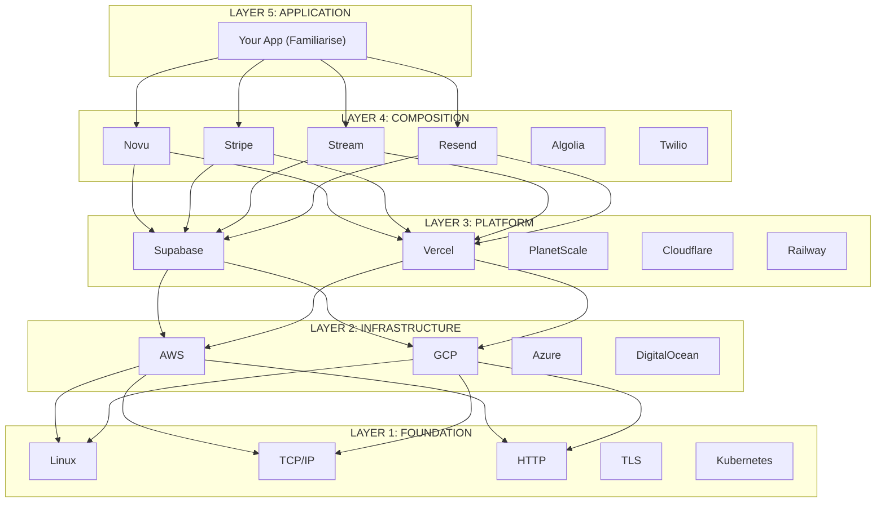
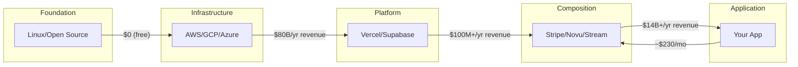
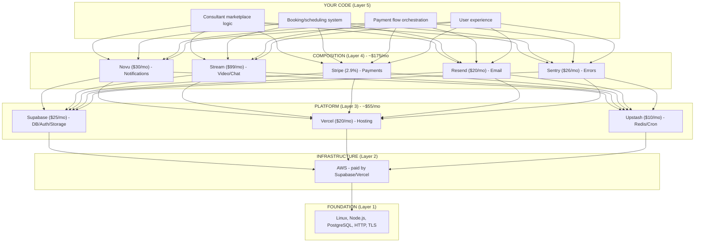
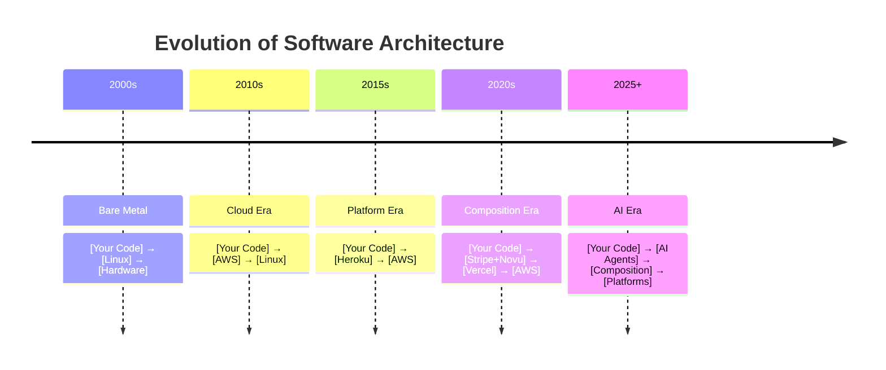

# The Modern Software Abstraction Pyramid

> Every software company is building on top of every other software company.

## The Pyramid

---

## The 5 Layers Explained

### Layer 1: Foundation (Protocols & Standards)

**What:** The bedrock that everything runs on
**Who builds:** Open source communities, standards bodies, core infrastructure companies

| Category           | Examples                        |
| ------------------ | ------------------------------- |
| Operating Systems  | Linux, Windows Server           |
| Protocols          | TCP/IP, HTTP/2, gRPC, WebSocket |
| Security           | TLS, OAuth, JWT                 |
| Containerization   | Docker, Kubernetes, containerd  |
| Languages/Runtimes | V8, Node.js, JVM, BEAM          |

**Business model:** Mostly open source, some enterprise support (Red Hat, Docker Inc)

---

### Layer 2: Infrastructure (Compute & Storage)

**What:** Raw computing resources abstracted from hardware
**Who builds:** Cloud giants with massive capital

| Category        | Examples                        |
| --------------- | ------------------------------- |
| Compute         | AWS EC2, GCP Compute, Azure VMs |
| Storage         | S3, GCS, Azure Blob             |
| Networking      | VPCs, Load Balancers, CDNs      |
| Databases (raw) | RDS, Cloud SQL, DynamoDB        |

**Business model:** Pay-per-use, volume discounts
**Margins:** 30-60%

---

### Layer 3: Platform (Developer Experience)

**What:** Infrastructure wrapped with better DX
**Who builds:** Companies that abstract away DevOps complexity

| Category             | Examples                 | Built On  |
| -------------------- | ------------------------ | --------- |
| Backend-as-a-Service | Supabase, Firebase       | AWS/GCP   |
| Deployment           | Vercel, Netlify, Railway | AWS/GCP   |
| Databases            | PlanetScale, Neon, Turso | AWS/GCP   |
| Edge/CDN             | Cloudflare, Fastly       | Own infra |
| Serverless           | AWS Lambda, CF Workers   | Own infra |

**Business model:** Freemium + usage-based
**Margins:** 50-70%

---

### Layer 4: Composition (Specialized Services)

**What:** Single-purpose APIs that solve one problem extremely well
**Who builds:** Vertical specialists

| Category      | Examples               | Built On         |
| ------------- | ---------------------- | ---------------- |
| Payments      | Stripe, Razorpay       | AWS + banks      |
| Notifications | Novu, Knock, OneSignal | AWS + FCM/APNS   |
| Email         | Resend, SendGrid       | AWS + SMTP infra |
| Auth          | Auth0, Clerk, WorkOS   | AWS              |
| Search        | Algolia, Typesense     | AWS              |
| Video/Chat    | Stream, Twilio, Agora  | AWS + WebRTC     |
| Analytics     | Mixpanel, Amplitude    | AWS/GCP          |
| CMS           | Sanity, Contentful     | AWS              |
| AI/ML         | OpenAI, Anthropic      | Azure/GCP        |

**Business model:** API calls / seats / usage
**Margins:** 60-80%

---

### Layer 5: Application (Your Product)

**What:** End-user applications that solve real-world problems
**Who builds:** You, startups, enterprises

| Category     | Examples              | Built On                     |
| ------------ | --------------------- | ---------------------------- |
| Marketplaces | Airbnb, Uber          | Stripe + Maps + Twilio + AWS |
| SaaS         | Notion, Figma, Slack  | AWS + various APIs           |
| EdTech       | Familiarise, Coursera | Supabase + Stream + Novu     |
| Fintech      | Robinhood, Plaid      | AWS + banking APIs           |
| E-commerce   | Shopify stores        | Shopify + Stripe             |

**Business model:** Subscriptions, transactions, ads
**Margins:** Varies (20-90%)

---

## The Value Chain

---

## Build vs Buy at Each Layer

| Layer          | Build Cost           | Buy Cost           | Winner    |
| -------------- | -------------------- | ------------------ | --------- |
| Foundation     | Impossible           | Free (open source) | Buy       |
| Infrastructure | $100M+ data centers  | ~$0.01/hour        | Buy       |
| Platform       | $500K/yr DevOps team | ~$20-100/month     | Buy       |
| Composition    | $10K-50K per feature | ~$30-200/month     | Buy       |
| Application    | **YOUR CORE VALUE**  | N/A                | **BUILD** |

> **Rule of thumb:** Only build what differentiates you. Buy everything else.

---

## Familiarise's Position in the Pyramid

**Your Total:** ~$230/month
**Equivalent Build Cost:** ~$15,000/month

---

## Industry Names for These Layers

| Layer   | Common Names                                                 |
| ------- | ------------------------------------------------------------ |
| Layer 5 | Application Layer, Product Layer, Solution Layer             |
| Layer 4 | Composition Layer, API Layer, Service Layer, "Best-of-Breed" |
| Layer 3 | Platform Layer, PaaS, Developer Platform, "Modern Stack"     |
| Layer 2 | Infrastructure Layer, IaaS, Cloud Layer                      |
| Layer 1 | Foundation Layer, Protocol Layer, Standards Layer            |

---

## The Trend: Layers Keep Adding

**Each new layer = more abstraction = faster development = focus on your unique value**

---

## Key Insight

> Your job is NOT to rebuild the wheel.
> Your job IS to combine existing wheels into a vehicle nobody has built before.

- Stripe didn't build AWS. They used it.
- Vercel didn't build Linux. They used it.
- Familiarise didn't build payments. You used Stripe.

**The winners are those who pick the right tools and focus on their unique value.**

---

_Created: January 2026_
_Context: Novu Integration Planning_
