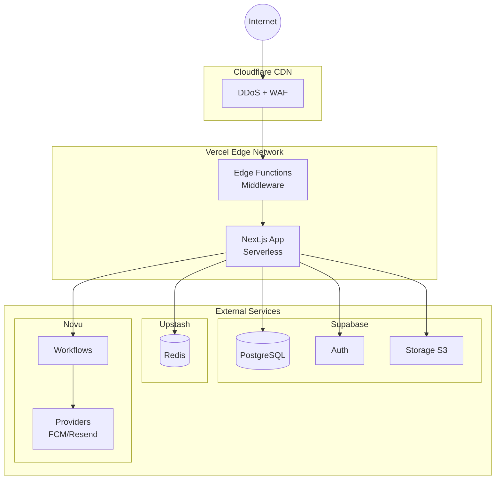
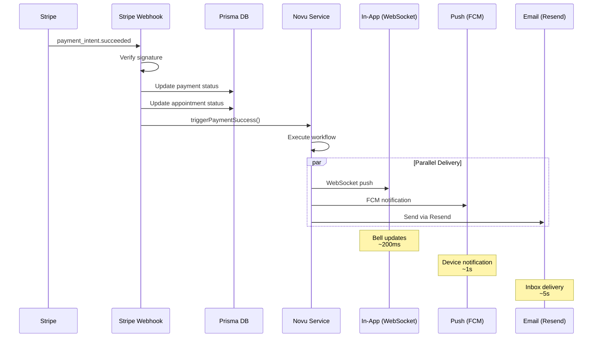
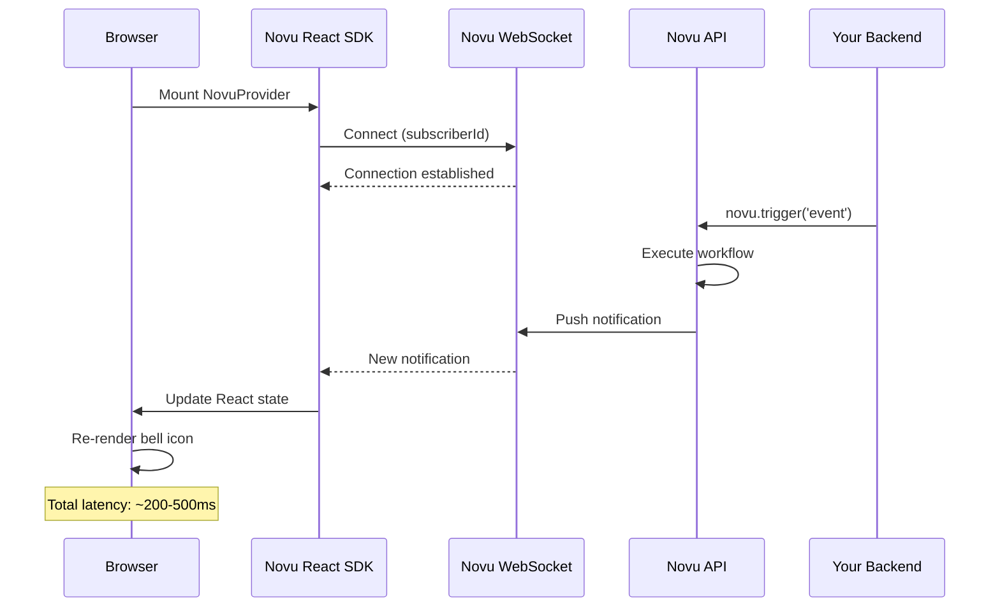
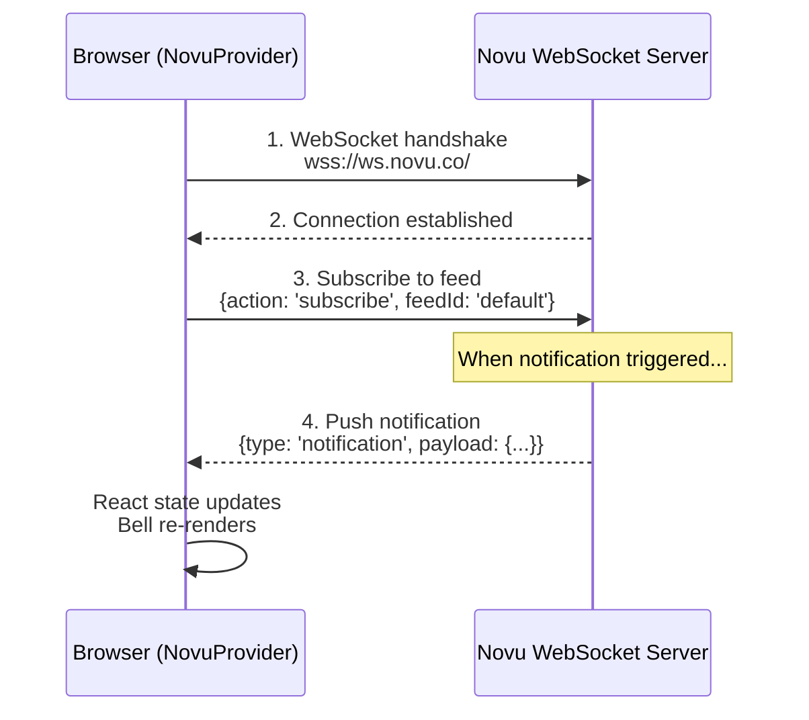
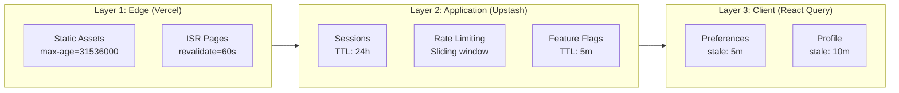
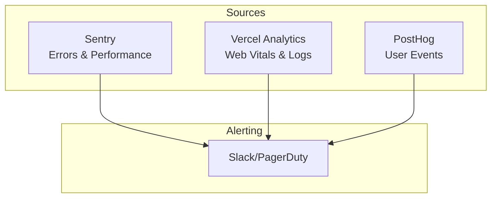
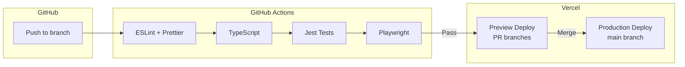

# Notification System Design: Next.js + Serverless Architecture

> SDE2/SDE3 Technical Deep Dive

**Document Version:** 1.0
**Architecture Style:** Serverless, Edge-First, Composition-Based
**Target Scale:** 10K - 1M users
**Team Size:** 2-10 engineers

---

## Table of Contents

1. [Architecture Overview](#1-architecture-overview)
2. [High-Level System Design](#2-high-level-system-design)
3. [Component Deep Dive](#3-component-deep-dive)
4. [Data Flow Diagrams](#4-data-flow-diagrams)
5. [Database Design](#5-database-design)
6. [API Design](#6-api-design)
7. [Real-Time Architecture](#7-real-time-architecture)
8. [Caching Strategy](#8-caching-strategy)
9. [Security Architecture](#9-security-architecture)
10. [Monitoring & Observability](#10-monitoring--observability)
11. [CI/CD Pipeline](#11-cicd-pipeline)
12. [Scaling Strategy](#12-scaling-strategy)
13. [Cost Analysis](#13-cost-analysis)
14. [Trade-offs & Decisions](#14-trade-offs--decisions)
15. [Interview Discussion Points](#15-interview-discussion-points)

---

## 1. Architecture Overview

### Design Philosophy

- **Serverless-first:** Pay only for what you use
- **Edge computing:** Minimize latency globally
- **Composition over custom:** Use best-in-class services
- **Developer velocity:** Ship features fast

### Tech Stack

| Layer           | Technology              | Purpose                     |
| --------------- | ----------------------- | --------------------------- |
| Frontend        | Next.js 15 (App Router) | React Server Components     |
| Hosting         | Vercel                  | Edge deployment, CDN        |
| Database        | Supabase (PostgreSQL)   | Managed Postgres + Auth     |
| Cache           | Upstash Redis           | Serverless Redis            |
| Notifications   | Novu                    | Multi-channel orchestration |
| Email           | Resend                  | Transactional email         |
| Push            | FCM/APNS via Novu       | Mobile push delivery        |
| Video/Chat      | Stream                  | Real-time communication     |
| Payments        | Stripe + Razorpay       | Payment processing          |
| File Storage    | Supabase Storage (S3)   | User uploads                |
| Background Jobs | Upstash QStash          | Scheduled tasks             |
| Error Tracking  | Sentry                  | Error monitoring            |
| Analytics       | PostHog                 | Product analytics           |

---

## 2. High-Level System Design



---

## 3. Component Deep Dive

### 3.1 Next.js Application Structure

```
familiarise_web/
├── app/                          # App Router (Next.js 15)
│   ├── (marketing)/              # Public pages (SSG)
│   │   ├── page.tsx              # Landing page
│   │   └── pricing/page.tsx      # Pricing page
│   │
│   ├── (auth)/                   # Auth pages
│   │   ├── sign-in/page.tsx
│   │   └── sign-up/page.tsx
│   │
│   ├── dashboard/                # Protected routes (SSR)
│   │   ├── layout.tsx            # Auth check + NovuProvider
│   │   ├── consultee/[id]/
│   │   └── consultant/[id]/
│   │
│   └── api/                      # API Routes (Serverless Functions)
│       ├── auth/[...nextauth]/   # NextAuth handlers
│       ├── notifications/        # Notification endpoints
│       ├── webhooks/             # External webhooks
│       │   ├── stripe/
│       │   ├── razorpay/
│       │   └── novu/
│       └── trpc/[trpc]/          # tRPC router (optional)
│
├── lib/                          # Shared libraries
│   ├── prisma.ts                 # Prisma client singleton
│   ├── novu/
│   │   ├── client.ts             # Novu server client
│   │   ├── service.ts            # Notification triggers
│   │   └── workflows.ts          # Workflow IDs
│   └── redis.ts                  # Upstash Redis client
│
└── components/
    ├── notifications/
    │   ├── NotificationBell.tsx  # Bell icon (client)
    │   └── NotificationList.tsx  # Notification list
    └── providers/
        └── NovuProvider.tsx      # Novu context wrapper
```

### 3.2 Serverless Function Design

```typescript
// app/api/notifications/subscribe/route.ts

import { NextRequest, NextResponse } from "next/server";
import { getServerSession } from "next-auth";
import { novuService } from "@/lib/novu/service";
import { rateLimit } from "@/lib/rate-limit";

export async function POST(req: NextRequest) {
  // 1. Rate limiting (Upstash Redis)
  const ip = req.headers.get("x-forwarded-for");
  const { success } = await rateLimit.limit(ip);
  if (!success) {
    return NextResponse.json({ error: "Rate limited" }, { status: 429 });
  }

  // 2. Authentication
  const session = await getServerSession();
  if (!session?.user) {
    return NextResponse.json({ error: "Unauthorized" }, { status: 401 });
  }

  // 3. Business logic
  const subscriberId = await novuService.createOrUpdateSubscriber(
    session.user.id,
  );

  // 4. Response
  return NextResponse.json({ subscriberId });
}

// Vercel Config: Max 10s execution, 1GB memory
export const runtime = "nodejs";
export const maxDuration = 10;
```

### 3.3 Novu Service Implementation

```typescript
// lib/novu/service.ts

import { Novu } from "@novu/node";
import prisma from "@/lib/prisma";
import { WORKFLOWS } from "./workflows";

class NovuService {
  private client: Novu;

  constructor() {
    this.client = new Novu(process.env.NOVU_API_KEY!);
  }

  async createOrUpdateSubscriber(userId: string): Promise<string> {
    const user = await prisma.user.findUniqueOrThrow({
      where: { id: userId },
      select: {
        id: true,
        email: true,
        name: true,
        phone: true,
        image: true,
        timezone: true,
        role: true,
      },
    });

    await this.client.subscribers.identify(userId, {
      email: user.email ?? undefined,
      phone: user.phone ?? undefined,
      firstName: user.name?.split(" ")[0],
      lastName: user.name?.split(" ").slice(1).join(" "),
      avatar: user.image ?? undefined,
      locale: "en",
      data: { role: user.role, timezone: user.timezone },
    });

    return userId;
  }

  async triggerAppointmentApproved(params: {
    userId: string;
    appointmentId: string;
    consultantName: string;
    planTitle: string;
    dateTime: Date;
    paymentUrl?: string;
  }) {
    await this.client.trigger(WORKFLOWS.APPOINTMENT_APPROVED, {
      to: { subscriberId: params.userId },
      payload: {
        consultantName: params.consultantName,
        planTitle: params.planTitle,
        dateTime: params.dateTime.toISOString(),
        paymentUrl: params.paymentUrl,
        requiresPayment: !!params.paymentUrl,
        route: `/appointments/${params.appointmentId}`,
      },
    });
  }

  async triggerPaymentSuccess(params: {
    userId: string;
    paymentId: string;
    amount: number;
    currency: string;
    consultantName: string;
  }) {
    await this.client.trigger(WORKFLOWS.PAYMENT_SUCCESS, {
      to: { subscriberId: params.userId },
      payload: {
        amount: params.amount,
        currency: params.currency,
        consultantName: params.consultantName,
        formattedAmount: new Intl.NumberFormat("en-IN", {
          style: "currency",
          currency: params.currency,
        }).format(params.amount / 100),
        route: `/payments/${params.paymentId}`,
      },
    });
  }
}

export const novuService = new NovuService();
```

---

## 4. Data Flow Diagrams

### 4.1 Notification Trigger Flow



### 4.2 Real-Time Update Flow



---

## 5. Database Design

### 5.1 Notification-Related Tables

```prisma
model User {
  id                    String    @id @default(cuid())
  email                 String?   @unique
  name                  String?
  phone                 String?
  image                 String?
  timezone              String    @default("Asia/Kolkata")
  role                  UserRole  @default(CONSULTEE)

  // Novu integration
  novuSubscriberId      String?   @unique

  notificationPreferences NotificationPreference?
}

model NotificationPreference {
  id                    String    @id @default(cuid())
  userId                String    @unique
  user                  User      @relation(...)

  // Channel toggles
  inAppEnabled          Boolean   @default(true)
  pushEnabled           Boolean   @default(true)
  emailEnabled          Boolean   @default(true)

  // Category toggles
  appointmentReminders  Boolean   @default(true)
  appointmentUpdates    Boolean   @default(true)
  paymentNotifications  Boolean   @default(true)
  supportTicketUpdates  Boolean   @default(true)
  marketingEmails       Boolean   @default(false)

  // Quiet hours (DND)
  quietHoursEnabled     Boolean   @default(false)
  quietHoursStart       DateTime? @db.Time
  quietHoursEnd         DateTime? @db.Time

  createdAt             DateTime  @default(now())
  updatedAt             DateTime  @updatedAt

  @@map("notification_preferences")
}
```

### 5.2 Why We Don't Store Notifications Locally

| Approach      | Storage                           | Cleanup Jobs | Real-time      | Cost at Scale |
| ------------- | --------------------------------- | ------------ | -------------- | ------------- |
| **Custom DB** | 1M users × 100 notifs = 100M rows | Required     | Build yourself | $$$$          |
| **Novu**      | They handle it                    | Not needed   | Built-in       | $30/mo fixed  |

---

## 6. API Design

### 6.1 Notification Endpoints

| Endpoint                         | Method | Purpose                |
| -------------------------------- | ------ | ---------------------- |
| `/api/notifications/subscribe`   | POST   | Create Novu subscriber |
| `/api/notifications/preferences` | GET    | Get user preferences   |
| `/api/notifications/preferences` | PUT    | Update preferences     |
| `/api/notifications/fcm-token`   | POST   | Register FCM token     |
| `/api/webhooks/novu`             | POST   | Novu webhook handler   |

> **Note:** Most notification operations (list, mark read, etc.) are handled client-side by Novu's React SDK - no custom API needed.

### 6.2 Webhook Security

```typescript
// app/api/webhooks/novu/route.ts

import { headers } from "next/headers";
import crypto from "crypto";

export async function POST(req: Request) {
  const headersList = headers();
  const signature = headersList.get("x-novu-signature");
  const body = await req.text();

  // Verify HMAC signature
  const expectedSignature = crypto
    .createHmac("sha256", process.env.NOVU_WEBHOOK_SECRET!)
    .update(body)
    .digest("hex");

  if (signature !== expectedSignature) {
    return Response.json({ error: "Invalid signature" }, { status: 401 });
  }

  const event = JSON.parse(body);

  switch (event.type) {
    case "notification.delivered":
      // Analytics tracking
      break;
    case "notification.failed":
      // Alert on failures
      break;
  }

  return Response.json({ received: true });
}
```

---

## 7. Real-Time Architecture

### 7.1 Novu WebSocket Connection



**Connection Management (handled by SDK):**

- Auto-reconnect on disconnect
- Exponential backoff
- Heartbeat every 30s

### 7.2 Fallback Strategy

If WebSocket fails (corporate firewalls, etc.):

- Novu SDK falls back to long-polling
- Updates every 5-10 seconds
- Transparent to application code

---

## 8. Caching Strategy

### Cache Layers



### Rate Limiting

```typescript
// lib/rate-limit.ts

import { Ratelimit } from "@upstash/ratelimit";
import { Redis } from "@upstash/redis";

const redis = Redis.fromEnv();

// API rate limits
export const apiRateLimit = new Ratelimit({
  redis,
  limiter: Ratelimit.slidingWindow(100, "1m"), // 100 req/min
  analytics: true,
});

// Notification trigger rate limits
export const notificationRateLimit = new Ratelimit({
  redis,
  limiter: Ratelimit.slidingWindow(10, "1m"), // 10 notifications/min
  prefix: "notification",
});
```

---

## 9. Security Architecture

| Security Layer       | Implementation                            |
| -------------------- | ----------------------------------------- |
| DDoS Protection      | Cloudflare (via Vercel)                   |
| WAF                  | Vercel Firewall                           |
| TLS                  | Automatic (Vercel)                        |
| Authentication       | NextAuth.js + JWT                         |
| Authorization        | Role-based (CONSULTEE, CONSULTANT, ADMIN) |
| API Authentication   | Bearer tokens / Session cookies           |
| Webhook Verification | HMAC signatures                           |
| Rate Limiting        | Upstash Redis                             |
| Input Validation     | Zod schemas                               |
| SQL Injection        | Prisma (parameterized queries)            |
| XSS                  | React (auto-escaping) + CSP headers       |
| CSRF                 | SameSite cookies + CSRF tokens            |
| Secrets Management   | Vercel Environment Variables              |

---

## 10. Monitoring & Observability



**Metrics to Track:**

- Notification delivery rate (via Novu dashboard)
- API latency (p50, p95, p99)
- Error rate by endpoint
- WebSocket connection stability
- Database query performance

---

## 11. CI/CD Pipeline



**Deployment Time:** ~60-90 seconds

---

## 12. Scaling Strategy

### Serverless Auto-Scaling

- No capacity planning needed
- Pay per invocation
- Scales to zero when idle
- Scales to thousands of concurrent functions

### Bottleneck Analysis

| Component        | Scaling Limit             | Mitigation          |
| ---------------- | ------------------------- | ------------------- |
| Vercel Functions | 1000 concurrent (Pro)     | Upgrade or use Edge |
| Supabase DB      | Connection limit (50-500) | Connection pooling  |
| Novu             | 10K-1M notifications      | Upgrade plan        |
| Upstash Redis    | 10K commands/day (free)   | Upgrade plan        |

---

## 13. Cost Analysis

### Monthly Cost Breakdown (10K Users)

| Service             | Plan          | Monthly Cost    |
| ------------------- | ------------- | --------------- |
| Vercel              | Pro           | $20             |
| Supabase            | Pro           | $25             |
| Novu                | Starter       | $30             |
| Upstash Redis       | Pay-as-you-go | $10             |
| Resend              | Pro           | $20             |
| Sentry              | Team          | $26             |
| Stream (Video/Chat) | Starter       | $99             |
| **TOTAL**           |               | **~$230/month** |

### Comparison with Custom Build

- Custom notification system development: $10,000-15,000
- Custom real-time infrastructure: $5,000-10,000
- Monthly maintenance (DevOps): $2,000-5,000
- **Total Year 1 Custom:** ~$40,000-60,000
- **Total Year 1 Serverless:** ~$2,760

**Savings: ~$37,000-57,000 in Year 1**

---

## 14. Trade-offs & Decisions

| Decision                       | Pros                              | Cons                         |
| ------------------------------ | --------------------------------- | ---------------------------- |
| **Serverless over containers** | No DevOps overhead, Auto-scaling  | Cold starts, Function limits |
| **Novu over custom**           | 80% less code, Real-time included | Vendor dependency            |
| **Supabase over raw Postgres** | Managed + Auth + Storage          | Vendor lock-in               |
| **No local notification DB**   | Less storage, No cleanup jobs     | Can't do custom analytics    |

---

## 15. Interview Discussion Points

**Q: Why serverless instead of containers?**

> For a startup with variable traffic, serverless provides zero DevOps overhead, true pay-per-use, automatic scaling, and faster time to market. Containers make sense at 100K+ DAU with predictable traffic.

**Q: How do you handle cold starts?**

> Edge functions for latency-critical paths, keep-warm for critical API routes, streaming responses for perceived performance. Most routes are fast enough that cold starts aren't noticeable.

**Q: Why not build notifications in-house?**

> Build vs Buy analysis showed 20+ days saved, complex WebSocket infrastructure, multi-channel orchestration is hard, and $30/month is cheaper than engineering time.

**Q: What if Novu goes down?**

> Novu has 99.9% SLA, critical flows also send direct email via Resend as backup, notifications aren't system-critical (degraded UX, not broken app), and could migrate to Knock/OneSignal if needed.

**Q: How would you scale to 1M users?**

> The architecture already handles it: Vercel scales functions automatically, Supabase scales with read replicas, Novu scales with plan upgrade. Main bottleneck is database connections → use connection pooling.

---

_Document created: January 2026_
_Architecture style: Serverless + Composition_
_Target scale: 10K - 1M users_
