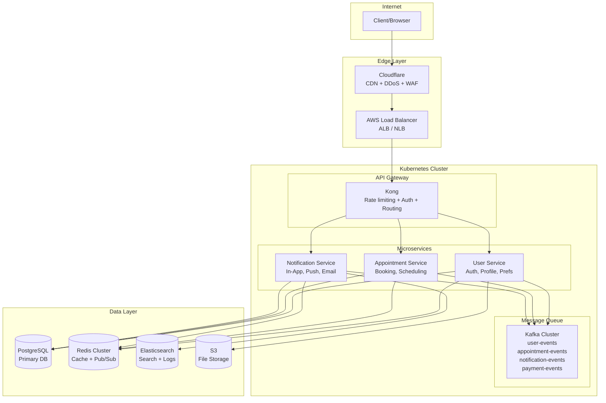
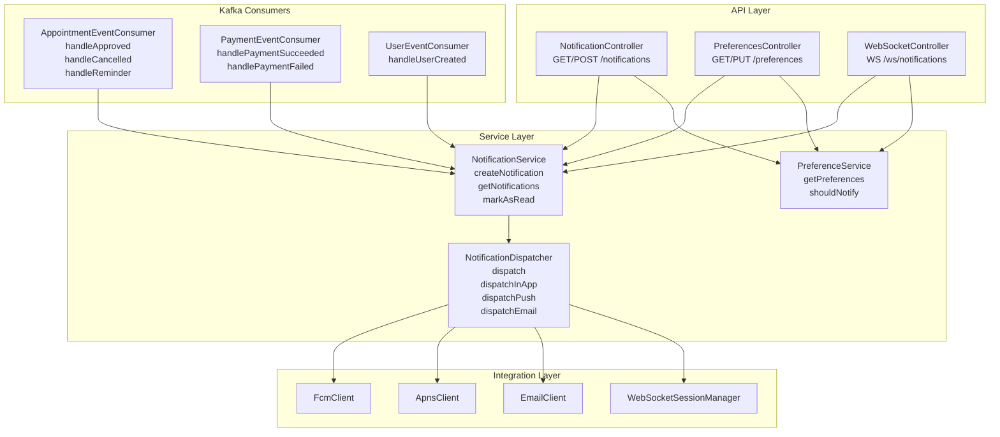
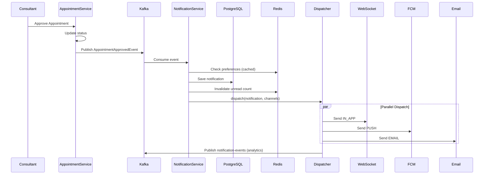
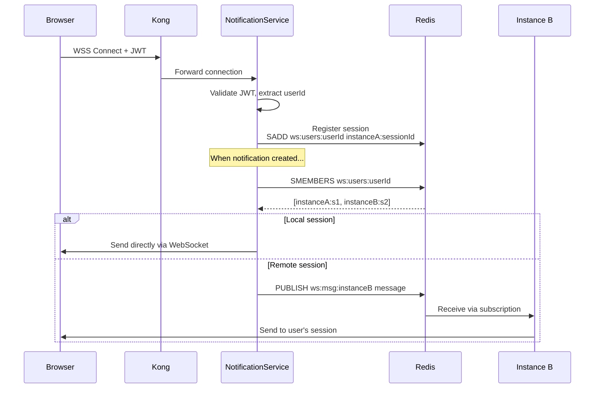
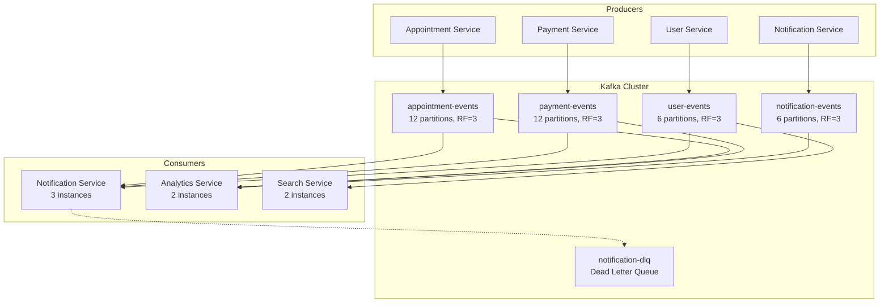
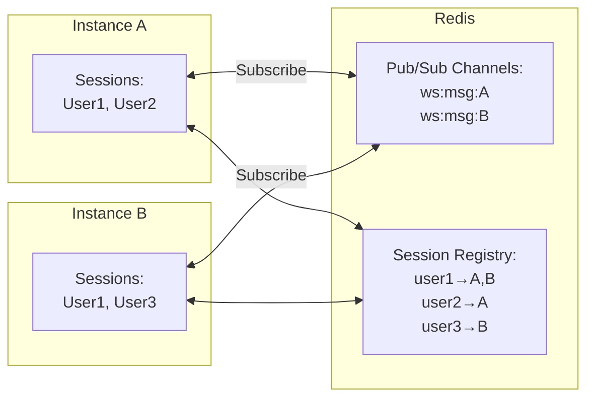
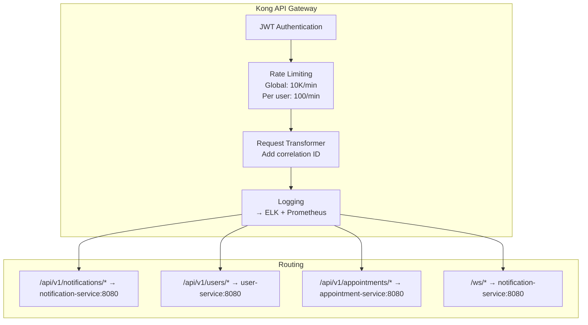
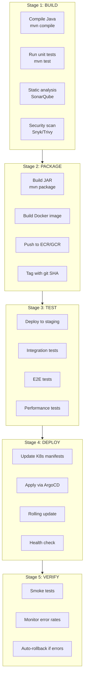
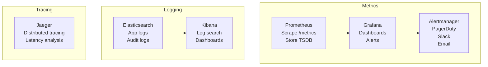

# Notification System Design: Enterprise Spring Boot + Kubernetes

> SDE2/SDE3 Technical Deep Dive

**Document Version:** 1.0
**Architecture Style:** Microservices, Container-Orchestrated, Self-Managed
**Target Scale:** 100K - 10M+ users
**Team Size:** 10-50+ engineers

---

## Table of Contents

1. [Architecture Overview](#1-architecture-overview)
2. [High-Level System Design](#2-high-level-system-design)
3. [Microservices Breakdown](#3-microservices-breakdown)
4. [Notification Service Deep Dive](#4-notification-service-deep-dive)
5. [Data Flow Diagrams](#5-data-flow-diagrams)
6. [Database Design](#6-database-design)
7. [Message Queue Architecture](#7-message-queue-architecture)
8. [Real-Time Architecture](#8-real-time-architecture)
9. [Caching Strategy](#9-caching-strategy)
10. [API Gateway & Load Balancing](#10-api-gateway--load-balancing)
11. [Kubernetes Deployment](#11-kubernetes-deployment)
12. [Auto-Scaling Configuration](#12-auto-scaling-configuration)
13. [CI/CD Pipeline](#13-cicd-pipeline)
14. [Security Architecture](#14-security-architecture)
15. [Monitoring & Observability](#15-monitoring--observability)
16. [Disaster Recovery](#16-disaster-recovery)
17. [Cost Analysis](#17-cost-analysis)
18. [Trade-offs & Decisions](#18-trade-offs--decisions)
19. [Interview Discussion Points](#19-interview-discussion-points)

---

## 1. Architecture Overview

### Design Philosophy

- **Microservices:** Each service owns its domain
- **Container-first:** Docker + Kubernetes for orchestration
- **Event-driven:** Async communication via message queues
- **Self-managed:** Full control over infrastructure
- **Horizontally scalable:** Scale individual services independently

### Tech Stack

| Layer              | Technology             | Purpose                     |
| ------------------ | ---------------------- | --------------------------- |
| API Gateway        | Kong / AWS API Gateway | Routing, rate limiting      |
| Backend Framework  | Spring Boot 3.x        | Microservices               |
| Language           | Java 21 / Kotlin       | Type-safe, mature ecosystem |
| Database           | PostgreSQL (Primary)   | ACID transactions           |
| Cache              | Redis Cluster          | Session, rate limiting      |
| Message Queue      | Apache Kafka           | Event streaming             |
| Search             | Elasticsearch          | Full-text search            |
| Container Runtime  | Docker                 | Containerization            |
| Orchestration      | Kubernetes (EKS/GKE)   | Container orchestration     |
| Service Mesh       | Istio (optional)       | Service-to-service security |
| CI/CD              | Jenkins / GitLab CI    | Build & deployment          |
| Monitoring         | Prometheus + Grafana   | Metrics & dashboards        |
| Logging            | ELK Stack              | Centralized logging         |
| Tracing            | Jaeger / Zipkin        | Distributed tracing         |
| Push Notifications | FCM / APNS (self-impl) | Mobile push                 |
| Email              | SES / SendGrid         | Email delivery              |
| Object Storage     | S3 / MinIO             | File storage                |

---

## 2. High-Level System Design



---

## 3. Microservices Breakdown

| Service              | Responsibility                | Database           |
| -------------------- | ----------------------------- | ------------------ |
| user-service         | Auth, profiles, preferences   | PostgreSQL         |
| appointment-service  | Booking, scheduling, calendar | PostgreSQL         |
| payment-service      | Payments, refunds, invoices   | PostgreSQL         |
| notification-service | All notification channels     | PostgreSQL + Redis |
| chat-service         | Real-time messaging           | PostgreSQL + Redis |
| video-service        | Video call management         | PostgreSQL         |
| analytics-service    | Events, metrics, reporting    | ClickHouse         |
| search-service       | Full-text search              | Elasticsearch      |
| file-service         | Upload, storage, CDN          | S3 + PostgreSQL    |
| email-service        | Email rendering & delivery    | PostgreSQL         |
| push-service         | FCM/APNS token management     | PostgreSQL + Redis |

### Service Communication Patterns

- **Synchronous:** REST/gRPC for queries
- **Asynchronous:** Kafka for events/commands

---

## 4. Notification Service Deep Dive

### 4.1 Service Architecture



### 4.2 Spring Boot Project Structure

```
notification-service/
├── src/main/java/com/familiarise/notification/
│   ├── NotificationServiceApplication.java
│   │
│   ├── config/
│   │   ├── KafkaConfig.java
│   │   ├── RedisConfig.java
│   │   ├── WebSocketConfig.java
│   │   ├── SecurityConfig.java
│   │   └── AsyncConfig.java
│   │
│   ├── controller/
│   │   ├── NotificationController.java
│   │   ├── PreferencesController.java
│   │   └── WebSocketController.java
│   │
│   ├── service/
│   │   ├── NotificationService.java
│   │   ├── NotificationDispatcher.java
│   │   ├── PreferenceService.java
│   │   ├── TemplateService.java
│   │   └── impl/
│   │       └── NotificationServiceImpl.java
│   │
│   ├── consumer/
│   │   ├── AppointmentEventConsumer.java
│   │   ├── PaymentEventConsumer.java
│   │   └── UserEventConsumer.java
│   │
│   ├── client/
│   │   ├── FcmClient.java
│   │   ├── ApnsClient.java
│   │   ├── EmailClient.java
│   │   └── UserServiceClient.java
│   │
│   ├── model/
│   │   ├── entity/
│   │   │   ├── Notification.java
│   │   │   ├── NotificationPreference.java
│   │   │   └── DeviceToken.java
│   │   ├── dto/
│   │   │   ├── NotificationDTO.java
│   │   │   └── PreferenceDTO.java
│   │   └── event/
│   │       ├── AppointmentEvent.java
│   │       └── PaymentEvent.java
│   │
│   ├── repository/
│   │   ├── NotificationRepository.java
│   │   ├── PreferenceRepository.java
│   │   └── DeviceTokenRepository.java
│   │
│   ├── websocket/
│   │   ├── WebSocketSessionManager.java
│   │   └── NotificationWebSocketHandler.java
│   │
│   └── exception/
│       └── GlobalExceptionHandler.java
│
├── src/main/resources/
│   ├── application.yml
│   ├── application-dev.yml
│   ├── application-prod.yml
│   └── templates/
│       └── email/
│           └── payment-success.html
│
├── Dockerfile
├── docker-compose.yml
└── pom.xml
```

### 4.3 Core Classes Implementation

#### NotificationService

```java
@Service
@Transactional
@Slf4j
public class NotificationServiceImpl implements NotificationService {

    private final NotificationRepository notificationRepository;
    private final PreferenceService preferenceService;
    private final NotificationDispatcher dispatcher;
    private final RedisTemplate<String, Object> redisTemplate;
    private final KafkaTemplate<String, NotificationEvent> kafkaTemplate;

    @Override
    public Notification createNotification(NotificationRequest request) {
        // 1. Check user preferences
        if (!preferenceService.shouldNotify(
                request.getUserId(),
                request.getType(),
                request.getChannel())) {
            log.info("Notification suppressed by user preferences");
            return null;
        }

        // 2. Check quiet hours
        if (preferenceService.isQuietHours(request.getUserId())) {
            scheduleForLater(request);
            return null;
        }

        // 3. Create notification entity
        Notification notification = Notification.builder()
            .id(UUID.randomUUID().toString())
            .userId(request.getUserId())
            .type(request.getType())
            .title(request.getTitle())
            .body(request.getBody())
            .data(request.getData())
            .isRead(false)
            .createdAt(Instant.now())
            .build();

        // 4. Save to database
        notification = notificationRepository.save(notification);

        // 5. Invalidate cache
        invalidateUnreadCountCache(request.getUserId());

        // 6. Dispatch to channels (async)
        dispatcher.dispatch(notification, request.getChannels());

        // 7. Publish event for analytics
        kafkaTemplate.send("notification-events",
            new NotificationCreatedEvent(notification));

        return notification;
    }

    @Override
    @Cacheable(value = "unread-count", key = "#userId")
    public long getUnreadCount(String userId) {
        return notificationRepository.countByUserIdAndIsReadFalse(userId);
    }

    @Override
    @CacheEvict(value = "unread-count", key = "#userId")
    public void markAsRead(String userId, String notificationId) {
        notificationRepository.markAsRead(notificationId, Instant.now());
        webSocketSessionManager.sendToUser(userId,
            new WebSocketMessage("READ", notificationId));
    }
}
```

#### NotificationDispatcher

```java
@Service
@Slf4j
public class NotificationDispatcher {

    private final WebSocketSessionManager webSocketManager;
    private final FcmClient fcmClient;
    private final ApnsClient apnsClient;
    private final EmailClient emailClient;
    private final DeviceTokenRepository deviceTokenRepository;

    @Async("notificationExecutor")
    public void dispatch(Notification notification, List<Channel> channels) {
        for (Channel channel : channels) {
            try {
                switch (channel) {
                    case IN_APP -> dispatchInApp(notification);
                    case PUSH -> dispatchPush(notification);
                    case EMAIL -> dispatchEmail(notification);
                }
            } catch (Exception e) {
                log.error("Failed to dispatch to {}: {}", channel, e.getMessage());
                recordDeliveryFailure(notification, channel, e);
            }
        }
    }

    private void dispatchPush(Notification notification) {
        List<DeviceToken> tokens = deviceTokenRepository
            .findActiveByUserId(notification.getUserId());

        for (DeviceToken token : tokens) {
            PushMessage push = PushMessage.builder()
                .token(token.getToken())
                .title(notification.getTitle())
                .body(notification.getBody())
                .data(notification.getData())
                .build();

            CompletableFuture<SendResult> result = switch (token.getPlatform()) {
                case ANDROID -> fcmClient.send(push);
                case IOS -> apnsClient.send(push);
            };

            result.whenComplete((sendResult, throwable) -> {
                if (throwable != null) {
                    handlePushFailure(token, throwable);
                }
            });
        }
    }
}
```

#### Kafka Event Consumer

```java
@Component
@Slf4j
public class AppointmentEventConsumer {

    private final NotificationService notificationService;

    @KafkaListener(
        topics = "appointment-events",
        groupId = "notification-service",
        containerFactory = "kafkaListenerContainerFactory"
    )
    public void handleAppointmentEvent(
            @Payload AppointmentEvent event,
            @Header(KafkaHeaders.RECEIVED_KEY) String key,
            Acknowledgment ack) {

        log.info("Received appointment event: {} for {}",
            event.getEventType(), event.getAppointmentId());

        try {
            switch (event.getEventType()) {
                case APPROVED -> handleApproved(event);
                case CANCELLED -> handleCancelled(event);
                case REMINDER -> handleReminder(event);
            }
            ack.acknowledge();
        } catch (Exception e) {
            log.error("Failed to process appointment event", e);
            throw e; // Don't ack - will be retried
        }
    }

    private void handleApproved(AppointmentEvent event) {
        notificationService.createNotification(
            NotificationRequest.builder()
                .userId(event.getConsulteeId())
                .type(NotificationType.APPOINTMENT_APPROVED)
                .category("appointment")
                .title("Appointment Approved!")
                .body(String.format(
                    "Your appointment with %s has been approved",
                    event.getConsultantName()))
                .data(Map.of(
                    "appointmentId", event.getAppointmentId(),
                    "consultantName", event.getConsultantName(),
                    "route", "/appointments/" + event.getAppointmentId()
                ))
                .channels(List.of(Channel.IN_APP, Channel.PUSH, Channel.EMAIL))
                .build()
        );
    }
}
```

---

## 5. Data Flow Diagrams

### 5.1 Notification Creation Flow



### 5.2 Real-Time WebSocket Flow



---

## 6. Database Design

### 6.1 Schema (PostgreSQL)

```sql
-- Notifications table
CREATE TABLE notifications (
    id              UUID PRIMARY KEY DEFAULT gen_random_uuid(),
    user_id         UUID NOT NULL REFERENCES users(id),
    type            VARCHAR(50) NOT NULL,
    category        VARCHAR(50) NOT NULL,
    title           VARCHAR(255) NOT NULL,
    body            TEXT NOT NULL,
    data            JSONB,
    is_read         BOOLEAN DEFAULT FALSE,
    read_at         TIMESTAMP WITH TIME ZONE,
    created_at      TIMESTAMP WITH TIME ZONE DEFAULT NOW(),
    expires_at      TIMESTAMP WITH TIME ZONE,

    CONSTRAINT notifications_type_check
        CHECK (type IN ('APPOINTMENT_APPROVED', 'APPOINTMENT_CANCELLED',
                        'PAYMENT_SUCCESS', 'PAYMENT_FAILED'))
);

-- Indexes
CREATE INDEX idx_notifications_user_unread
    ON notifications(user_id, is_read)
    WHERE is_read = FALSE;

CREATE INDEX idx_notifications_user_created
    ON notifications(user_id, created_at DESC);

CREATE INDEX idx_notifications_expires
    ON notifications(expires_at)
    WHERE expires_at IS NOT NULL;

-- Partitioning by month for large scale
CREATE TABLE notifications_2026_01
    PARTITION OF notifications
    FOR VALUES FROM ('2026-01-01') TO ('2026-02-01');
```

```sql
-- Notification preferences table
CREATE TABLE notification_preferences (
    id                      UUID PRIMARY KEY DEFAULT gen_random_uuid(),
    user_id                 UUID UNIQUE NOT NULL REFERENCES users(id),

    -- Channel preferences
    in_app_enabled          BOOLEAN DEFAULT TRUE,
    push_enabled            BOOLEAN DEFAULT TRUE,
    email_enabled           BOOLEAN DEFAULT TRUE,

    -- Category preferences
    appointment_reminders   BOOLEAN DEFAULT TRUE,
    appointment_updates     BOOLEAN DEFAULT TRUE,
    payment_notifications   BOOLEAN DEFAULT TRUE,
    marketing_emails        BOOLEAN DEFAULT FALSE,

    -- Quiet hours
    quiet_hours_enabled     BOOLEAN DEFAULT FALSE,
    quiet_hours_start       TIME,
    quiet_hours_end         TIME,
    quiet_hours_timezone    VARCHAR(50),

    created_at              TIMESTAMP WITH TIME ZONE DEFAULT NOW(),
    updated_at              TIMESTAMP WITH TIME ZONE DEFAULT NOW()
);
```

```sql
-- Device tokens table (for push notifications)
CREATE TABLE device_tokens (
    id              UUID PRIMARY KEY DEFAULT gen_random_uuid(),
    user_id         UUID NOT NULL REFERENCES users(id),
    token           VARCHAR(500) NOT NULL,
    platform        VARCHAR(20) NOT NULL, -- ANDROID, IOS, WEB
    device_id       VARCHAR(255),
    app_version     VARCHAR(20),
    is_active       BOOLEAN DEFAULT TRUE,
    last_used_at    TIMESTAMP WITH TIME ZONE,
    created_at      TIMESTAMP WITH TIME ZONE DEFAULT NOW(),

    UNIQUE(user_id, token)
);

CREATE INDEX idx_device_tokens_user_active
    ON device_tokens(user_id)
    WHERE is_active = TRUE;
```

### 6.2 Data Retention Strategy

| Data Type              | Retention Period      |
| ---------------------- | --------------------- |
| Read notifications     | 30 days               |
| Unread notifications   | 90 days               |
| Archived notifications | 1 year (cold storage) |

```sql
-- Cleanup job (runs daily)

-- Delete old read notifications
DELETE FROM notifications
WHERE is_read = TRUE
  AND created_at < NOW() - INTERVAL '30 days';

-- Archive old unread notifications
INSERT INTO notifications_archive
SELECT * FROM notifications
WHERE created_at < NOW() - INTERVAL '90 days';

DELETE FROM notifications
WHERE created_at < NOW() - INTERVAL '90 days';
```

---

## 7. Message Queue Architecture

### 7.1 Kafka Topology



### 7.2 Error Handling & Retry

```java
@Bean
public ConcurrentKafkaListenerContainerFactory<String, Object>
        kafkaListenerContainerFactory() {

    ConcurrentKafkaListenerContainerFactory<String, Object> factory =
        new ConcurrentKafkaListenerContainerFactory<>();

    factory.setConsumerFactory(consumerFactory());

    // Manual acknowledgment for at-least-once delivery
    factory.getContainerProperties()
        .setAckMode(ContainerProperties.AckMode.MANUAL);

    // Retry configuration
    factory.setCommonErrorHandler(new DefaultErrorHandler(
        new DeadLetterPublishingRecoverer(kafkaTemplate,
            (record, ex) -> new TopicPartition(
                record.topic() + "-dlq", record.partition())),
        new ExponentialBackOff(1000, 2.0, 60000) // 1s, 2s, 4s... max 60s
    ));

    return factory;
}
```

---

## 8. Real-Time Architecture

### 8.1 WebSocket with Redis Pub/Sub



**Flow for User1 notification:**

1. Lookup User1's sessions → [Instance A, Instance B]
2. Send to local session (Instance A)
3. Publish to `ws:msg:B` for remote session
4. Instance B receives via subscription, delivers to User1

### 8.2 Spring WebSocket Configuration

```java
@Configuration
@EnableWebSocketMessageBroker
public class WebSocketConfig implements WebSocketMessageBrokerConfigurer {

    @Override
    public void configureMessageBroker(MessageBrokerRegistry registry) {
        // Use Redis as external broker for scalability
        registry.enableStompBrokerRelay("/topic", "/queue")
            .setRelayHost(redisHost)
            .setRelayPort(redisPort);

        registry.setApplicationDestinationPrefixes("/app");
        registry.setUserDestinationPrefix("/user");
    }

    @Override
    public void registerStompEndpoints(StompEndpointRegistry registry) {
        registry.addEndpoint("/ws/notifications")
            .setAllowedOrigins("*")
            .withSockJS();
    }

    @Override
    public void configureClientInboundChannel(ChannelRegistration reg) {
        reg.interceptors(new WebSocketAuthInterceptor(jwtService));
    }
}
```

---

## 9. Caching Strategy

### Cache Layer: Redis Cluster (6 nodes, 3 masters + 3 replicas)

| Cache Pattern      | Key                              | Value        | TTL            | Invalidation         |
| ------------------ | -------------------------------- | ------------ | -------------- | -------------------- |
| Unread Count       | `unread-count:{userId}`          | Integer      | 1 hour         | On create, mark read |
| User Preferences   | `preferences:{userId}`           | JSON         | 24 hours       | On preference update |
| Device Tokens      | `device-tokens:{userId}`         | List         | 1 hour         | On token add/remove  |
| Rate Limiting      | `rate-limit:{userId}:{endpoint}` | Token bucket | Sliding window | -                    |
| WebSocket Sessions | `ws:users:{userId}`              | Set          | None           | On disconnect        |

### Target Cache Hit Rates

- Unread count: **95%+**
- Preferences: **99%+**
- Device tokens: **90%+**

---

## 10. API Gateway & Load Balancing

### Kong API Gateway Configuration



---

## 11. Kubernetes Deployment

### 11.1 Deployment Manifest

```yaml
# notification-service-deployment.yaml

apiVersion: apps/v1
kind: Deployment
metadata:
  name: notification-service
  namespace: production
spec:
  replicas: 3
  selector:
    matchLabels:
      app: notification-service
  template:
    metadata:
      labels:
        app: notification-service
      annotations:
        prometheus.io/scrape: "true"
        prometheus.io/port: "8080"
        prometheus.io/path: "/actuator/prometheus"
    spec:
      containers:
        - name: notification-service
          image: familiarise/notification-service:v1.2.3
          ports:
            - containerPort: 8080
          env:
            - name: SPRING_PROFILES_ACTIVE
              value: "prod"
            - name: JAVA_OPTS
              value: "-Xms512m -Xmx1024m -XX:+UseG1GC"
          envFrom:
            - configMapRef:
                name: notification-service-config
            - secretRef:
                name: notification-service-secrets
          resources:
            requests:
              memory: "512Mi"
              cpu: "250m"
            limits:
              memory: "1Gi"
              cpu: "1000m"
          livenessProbe:
            httpGet:
              path: /actuator/health/liveness
              port: 8080
            initialDelaySeconds: 60
            periodSeconds: 10
          readinessProbe:
            httpGet:
              path: /actuator/health/readiness
              port: 8080
            initialDelaySeconds: 30
            periodSeconds: 5
      affinity:
        podAntiAffinity:
          preferredDuringSchedulingIgnoredDuringExecution:
            - weight: 100
              podAffinityTerm:
                labelSelector:
                  matchLabels:
                    app: notification-service
                topologyKey: kubernetes.io/hostname
```

### 11.2 Horizontal Pod Autoscaler

```yaml
# notification-service-hpa.yaml

apiVersion: autoscaling/v2
kind: HorizontalPodAutoscaler
metadata:
  name: notification-service-hpa
  namespace: production
spec:
  scaleTargetRef:
    apiVersion: apps/v1
    kind: Deployment
    name: notification-service
  minReplicas: 3
  maxReplicas: 20
  metrics:
    - type: Resource
      resource:
        name: cpu
        target:
          type: Utilization
          averageUtilization: 70
    - type: Resource
      resource:
        name: memory
        target:
          type: Utilization
          averageUtilization: 80
    - type: Pods
      pods:
        metric:
          name: kafka_consumer_lag
        target:
          type: AverageValue
          averageValue: 1000
  behavior:
    scaleDown:
      stabilizationWindowSeconds: 300
      policies:
        - type: Percent
          value: 10
          periodSeconds: 60
    scaleUp:
      stabilizationWindowSeconds: 0
      policies:
        - type: Percent
          value: 100
          periodSeconds: 15
        - type: Pods
          value: 4
          periodSeconds: 15
      selectPolicy: Max
```

---

## 12. Auto-Scaling Configuration

### Pod-Level Scaling (HPA)

| Service              | Min    | Max     | Scale Triggers                |
| -------------------- | ------ | ------- | ----------------------------- |
| Notification Service | 3 pods | 20 pods | CPU > 70% OR Kafka lag > 1000 |
| Push Service         | 2 pods | 10 pods | Queue depth in Redis          |
| Email Service        | 2 pods | 5 pods  | Email queue depth             |

### Node-Level Scaling (Cluster Autoscaler)

| Node Group       | Instance Type | Min | Max | Use Case                    |
| ---------------- | ------------- | --- | --- | --------------------------- |
| General Purpose  | m5.xlarge     | 3   | 20  | API services, workers       |
| Memory Optimized | r5.xlarge     | 2   | 10  | Kafka, Redis, Elasticsearch |
| Spot Instances   | m5.xlarge     | 0   | 10  | Batch jobs, non-critical    |

### Scaling Timeline Example

| Load Level | Users | Pods | Nodes |
| ---------- | ----- | ---- | ----- |
| Normal     | 1K    | 3    | 3     |
| Moderate   | 10K   | 6    | 5     |
| High       | 100K  | 15   | 12    |
| Peak       | 500K  | 20   | 20    |

---

## 13. CI/CD Pipeline



**Deployment Time:** ~10-15 minutes

---

## 14. Security Architecture

| Security Layer          | Implementation                             |
| ----------------------- | ------------------------------------------ |
| DDoS Protection         | AWS Shield + Cloudflare                    |
| WAF                     | AWS WAF / ModSecurity                      |
| TLS Termination         | ALB with ACM certificates                  |
| API Authentication      | JWT (RS256) with short expiry              |
| Service-to-Service Auth | mTLS via Istio service mesh                |
| Authorization           | Spring Security + RBAC                     |
| Secrets Management      | HashiCorp Vault / AWS Secrets Manager      |
| Network Policies        | Kubernetes NetworkPolicy (deny by default) |
| Pod Security            | Pod Security Standards (restricted)        |
| Image Security          | Trivy scanning, signed images              |
| Audit Logging           | All API calls logged to ELK                |
| Encryption at Rest      | AWS KMS for RDS, S3, EBS                   |
| Encryption in Transit   | TLS 1.3 everywhere                         |

---

## 15. Monitoring & Observability



### Key Metrics

- `notification_created_total` (Counter)
- `notification_delivered_total` (Counter by channel)
- `notification_failed_total` (Counter by channel, reason)
- `notification_delivery_latency_seconds` (Histogram)
- `websocket_connections_active` (Gauge)
- `kafka_consumer_lag` (Gauge by topic)
- `http_request_duration_seconds` (Histogram)

### Alert Thresholds

| Alert                            | Threshold        |
| -------------------------------- | ---------------- |
| Notification delivery rate drops | > 10%            |
| Kafka consumer lag               | > 10,000         |
| Error rate                       | > 1%             |
| P99 latency                      | > 500ms          |
| Pod restarts                     | > 3 in 5 minutes |

---

## 16. Disaster Recovery

### Recovery Objectives

- **RPO (Recovery Point Objective):** 1 hour
- **RTO (Recovery Time Objective):** 4 hours

### Backup Strategy

| Component     | Strategy                                                                            |
| ------------- | ----------------------------------------------------------------------------------- |
| PostgreSQL    | Continuous WAL archiving to S3, daily snapshots (30 days), cross-region replication |
| Redis         | RDB snapshots every hour, AOF persistence, ElastiCache automatic backups            |
| Kafka         | Topic replication factor = 3, MirrorMaker for cross-region                          |
| Elasticsearch | Daily snapshots to S3, index lifecycle management                                   |

### Failover Procedure

1. Detect failure (automated monitoring)
2. Promote standby database
3. Update DNS/load balancer
4. Scale up DR region
5. Verify data integrity
6. Resume traffic

---

## 17. Cost Analysis

### Monthly Cost Breakdown (100K Users)

| Component               | Specs                     | Monthly Cost      |
| ----------------------- | ------------------------- | ----------------- |
| EKS Cluster             | Control plane             | $73               |
| EC2 Instances (General) | 6x m5.xlarge              | $830              |
| EC2 Instances (Memory)  | 3x r5.xlarge              | $540              |
| RDS PostgreSQL          | db.r5.xlarge, Multi-AZ    | $700              |
| ElastiCache Redis       | r5.large, 3 nodes         | $450              |
| MSK (Kafka)             | kafka.m5.large, 3 brokers | $650              |
| Elasticsearch           | 3x m5.large.elasticsearch | $500              |
| ALB                     | Application LB            | $50               |
| S3                      | 500GB storage             | $12               |
| CloudWatch              | Logs + Metrics            | $100              |
| Data Transfer           | ~500GB/month              | $45               |
| ECR                     | Container registry        | $10               |
| Route 53                | DNS                       | $5                |
| Secrets Manager         | Secrets storage           | $20               |
| **AWS SUBTOTAL**        |                           | **~$3,985/month** |
| SendGrid (Email)        | Pro plan                  | $90               |
| PagerDuty               | Team plan                 | $100              |
| Datadog (optional)      | Pro plan                  | $300              |
| **TOTAL**               |                           | **~$4,475/month** |

### Additional Costs

- DevOps Engineer salary: $8,000-15,000/month
- On-call rotation: 2-3 engineers
- Initial setup: 2-3 months of engineering time

### Comparison with Serverless

| Metric                 | Enterprise (K8s) | Serverless (Next.js) |
| ---------------------- | ---------------- | -------------------- |
| Monthly infrastructure | $4,475           | $230                 |
| DevOps overhead        | $10,000+/month   | $0                   |
| Setup time             | 2-3 months       | 1-2 weeks            |
| Team size needed       | 5-10 engineers   | 2-5 engineers        |
| Scaling complexity     | High             | Automatic            |
| Customization          | Unlimited        | Limited by vendors   |
| Vendor lock-in         | Low              | Medium-High          |
| Suitable scale         | 100K+ users      | 10K-100K users       |

---

## 18. Trade-offs & Decisions

| Decision                         | Trade-off                                                                                                                                       |
| -------------------------------- | ----------------------------------------------------------------------------------------------------------------------------------------------- |
| **Kubernetes over serverless**   | + Full control over infrastructure<br/>+ No cold starts<br/>+ Predictable costs at scale<br/>- Requires DevOps expertise<br/>- Higher base cost |
| **Kafka over RabbitMQ**          | + Better throughput<br/>+ Event replay capability<br/>+ Horizontal scaling<br/>- More operational complexity<br/>- Higher resource requirements |
| **Custom notification system**   | + Full control<br/>+ No vendor dependency<br/>+ Unlimited customization<br/>- 3-6 months development<br/>- Ongoing maintenance burden           |
| **PostgreSQL over NoSQL**        | + ACID compliance<br/>+ Complex queries<br/>+ Mature ecosystem<br/>- Horizontal scaling harder<br/>- Schema migrations needed                   |
| **Redis for WebSocket registry** | + Simple pub/sub<br/>+ Low latency<br/>- Single point of failure (mitigated)<br/>- Memory cost for large user base                              |

---

## 19. Interview Discussion Points

### Q: Why microservices instead of monolith?

**A:** At 100K+ users with multiple teams:

- Independent deployments reduce coordination overhead
- Scale services independently based on load
- Technology diversity (Java for backend, maybe Go for performance-critical)
- Fault isolation - notification failure doesn't break payments

_For startups under 10K users, monolith is usually better._

### Q: How do you handle notification delivery guarantees?

**A:** Multiple strategies:

- Kafka provides at-least-once delivery (with idempotency)
- Idempotency keys prevent duplicate notifications
- Dead letter queues capture failed messages for retry
- Database is source of truth, Kafka is transport
- Push failures are logged and retried with exponential backoff

### Q: How does WebSocket scale across multiple instances?

**A:** Redis Pub/Sub pattern:

- Each instance subscribes to a Redis channel
- Session registry in Redis maps userId → [instanceId:sessionId]
- When sending, lookup user's sessions
- Local sessions: direct send
- Remote sessions: publish to instance's channel
- Sticky sessions optional but not required

### Q: What if Kafka goes down?

**A:** Mitigation strategies:

- Kafka is clustered (3 brokers minimum)
- Replication factor = 3 (survives 2 broker failures)
- Producers can fallback to direct DB write + async sync
- Critical notifications (payment) also sent via synchronous backup
- 99.99% uptime SLA with proper setup

### Q: How would you migrate from this to the serverless architecture?

**A:** Gradual migration:

1. Start with new features on serverless
2. Migrate notification triggers to Novu (keep same Kafka events)
3. Deprecate custom notification service
4. Migrate other services one by one
5. Shut down K8s when all migrated

_Key: Feature flags + strangler fig pattern_

### Q: When would you choose enterprise over serverless?

**A:** Choose enterprise when:

- Scale > 500K DAU with predictable traffic
- Strict compliance requirements (data residency, audit)
- Need for custom ML/AI processing
- Team has strong DevOps capability
- Cost optimization at scale (serverless gets expensive)
- Multi-cloud or hybrid cloud requirements

---

_Document created: January 2026_
_Architecture style: Microservices + Kubernetes_
_Target scale: 100K - 10M+ users_
