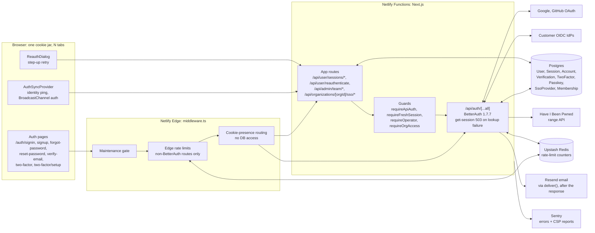

# Authentication

| Field         | Value                                                                          |
| ------------- | ------------------------------------------------------------------------------ |
| Status        | Live                                                                           |
| Audience      | All engineers, on-call                                                         |
| Last reviewed | 2026-10-10                                                                     |
| Sibling       | [`docs/authorization/`](../authorization/) for "what can this user do"         |
| Schema        | Frozen by [ADR 36](../enterprise/70-design-decisions/35-auth-schema-freeze.md) |

This folder answers "who is this user, and how do we know?". It is built on
[BetterAuth](https://better-auth.com) **1.7.7** with `@better-auth/sso` and
`@better-auth/passkey` **1.7.7**, all pinned exactly in `package.json`. The
configuration lives in [`lib/auth.ts`](../../lib/auth.ts); this folder
explains it.

## The design in one paragraph

Sessions are Postgres rows, read from the database on every request (the
cookie cache is off), so a revoke, ban or role change applies on the next
request, and a failed read is a 503, never a sign-out. Consumers sign up with
email and password and prove the address by typing a 6-digit code into the
same tab, or use Google or GitHub; they stay signed in for 30 days of sliding
activity. Staff and admins ("operators") sign in only with a password plus a
mandatory authenticator code, or a passkey; their sessions end 12 hours after
sign-in or after 2 idle hours. Money, credential and IAM changes need a proof
from the last 15 minutes (step-up re-authentication). Enterprise organizations
can add an OIDC identity provider per verified domain; platform staff approve
it, an org owner proves it by signing in before enforcement can be turned on,
and users who sign in through it join the organization automatically and pass
the onboarding gate. Every tab of a browser follows sign-out and account
switches. Rate limiting for `/api/auth/*` is BetterAuth's own limiter, stored
in Upstash. There is no captcha, no email or SMS second factor, no account
lockout on passwords, no break-glass account and no impersonation.

## System context (HLD)

## Pages in this folder

| Page                                                         | Read it when                                                                                                        |
| ------------------------------------------------------------ | ------------------------------------------------------------------------------------------------------------------- |
| [architecture.md](./architecture.md)                         | Before touching any auth code. Plugin chain, hooks, guards, lifetimes, every flow with its sequence, the data model |
| ↳ [passkeys](./architecture.md#54-passkey-sign-in-operators) | Operator passkey sign-in and registration rules                                                                     |
| ↳ [step-up](./architecture.md#55-step-up-re-authentication)  | Gating a sensitive action behind `REAUTH_REQUIRED`                                                                  |
| ↳ [multi-tab](./architecture.md#59-multi-tab-identity-sync)  | Sign-out broadcast, account switches, `X-Expected-User`                                                             |
| [staff-onboarding.md](./staff-onboarding.md)                 | Adding, suspending or recovering a staff/admin account                                                              |
| [sso.md](./sso.md)                                           | Enterprise OIDC: registration, approval, proof, enforcement, JIT, secret encryption                                 |
| [rate-limiting-and-abuse.md](./rate-limiting-and-abuse.md)   | Budgets, the Upstash store, breached-password check, enumeration safety, accepted risks                             |
| [errors.md](./errors.md)                                     | Adding or changing what a customer is told                                                                          |
| [failure-modes.md](./failure-modes.md)                       | Before on-call. What breaks when a dependency fails, and the runbooks                                               |
| [redirects-and-navigation.md](./redirects-and-navigation.md) | Changing auth-page redirects, sign-out navigation or dashboard entry points                                         |

Onboarding after sign-in (the wizard and `/onboarding/gate`) is in
[`docs/onboarding/`](../onboarding/).

## Rules that hold everywhere

1. **The session token never leaves the server in JSON.** `customSession`
   strips it, `hooks.after` (`lib/auth/strip-session-token.ts`) drops it from
   sign-in, sign-up, change-password, two-factor verify, passkey verify and
   email-code verify bodies,
   `/list-sessions` and the revoke endpoints are disabled over HTTP, and the
   device list reads through `SESSION_PUBLIC_SELECT`.
2. **Every operator power is behind 2FA.** Until the operator has an
   authenticator, the app's `getSession()` reads their session as signed out,
   `requireApiAuth` answers 428 `TWO_FACTOR_REQUIRED`, `requireOperator`
   redirects to enrolment, and the session lasts at most an hour.
3. **Sensitive writes need a fresh proof.** Credential, factor, payout, refund
   and IAM changes answer 403 `REAUTH_REQUIRED` unless the session was opened
   or re-authenticated in the last 15 minutes.
4. **Operator actions go through audited app routes.** The admin plugin's HTTP
   endpoints are all disabled; the plugin stays for its columns, the ban check
   and the server-side `createUser`.
5. **Only a confirmed 401 or 403 signs a user out.** A failed session lookup is
   a 503 with `Retry-After`, never "no session".
6. **The auth schema is additive-only after launch.** CI's "Auth schema guard"
   (`scripts/ci/check-auth-schema.ts`) fails the build when Prisma lacks a
   column BetterAuth writes.

## Related

- [ADR 35: session visibility, lifetime and revocation](../enterprise/70-design-decisions/34-user-session-visibility-and-revocation.md)
- [ADR 36: auth schema freeze](../enterprise/70-design-decisions/35-auth-schema-freeze.md)
- [Security headers and CSP](../enterprise/20-iam-and-security/04-security-headers.md)
- [Runbooks](../enterprise/50-operations/02-runbooks.md)

## Deprecated & Superseded Approaches

- **Verification links, the cookie cache and its force-fresh reads, consumer
  TOTP, and the `jobs/`/`scripts/` cleanup twins** were removed; details and
  what to delete are at the bottom of [architecture.md](./architecture.md).
- **The onboarding wizard's STAFF/ADMIN branches, `POST /api/user/staff` and
  `PATCH /api/form/onboarding/[id]`.** Operators are created only from the Team
  page ([staff-onboarding.md](./staff-onboarding.md)).
