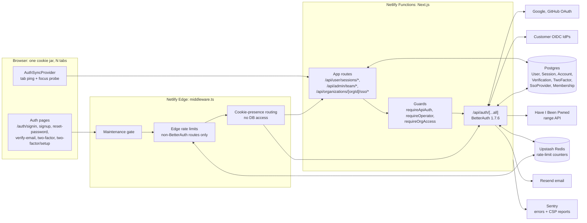

# Authentication

| Field         | Value                                                                          |
| ------------- | ------------------------------------------------------------------------------ |
| Status        | Live (launch design, PR #1878)                                                 |
| Audience      | All engineers, on-call                                                         |
| Last reviewed | 2026-10-01                                                                     |
| Sibling       | [`docs/authorization/`](../authorization/) for "what can this user do"         |
| Schema        | Frozen by [ADR 36](../enterprise/70-design-decisions/36-auth-schema-freeze.md) |

This folder answers "who is this user, and how do we know?". It is built on
[BetterAuth](https://better-auth.com) **1.7.6** with `@better-auth/sso`
**1.7.6**, both pinned exactly in `package.json`. The configuration lives in
[`lib/auth.ts`](../../lib/auth.ts); this folder explains it.

## The design in one paragraph

Sessions are Postgres rows, read from the database on every request (the
cookie cache is off), so a revoke, ban or role change applies on the next
request. Consumers sign in with email and password, Google or GitHub, and stay
signed in for 30 days of sliding activity. Staff and admins ("operators") sign
in only with a password plus a mandatory authenticator code, and their sessions
end 12 hours after sign-in however active they are. Enterprise organizations can
add an OIDC identity provider; platform staff approve it, and users who sign in
through it join the organization automatically. Rate limiting for
`/api/auth/*` is BetterAuth's own limiter, stored in Upstash. There is no
captcha, no email one-time code, no account lockout on passwords, no break-glass
account and no impersonation.

## System context (HLD)

## Pages in this folder

| Page                                                         | Read it when                                                                           |
| ------------------------------------------------------------ | -------------------------------------------------------------------------------------- |
| [architecture.md](./architecture.md)                         | Before touching any auth code. Plugin chain, hooks, guards, every flow, the data model |
| [staff-onboarding.md](./staff-onboarding.md)                 | Adding, suspending or recovering a staff/admin account                                 |
| [sso.md](./sso.md)                                           | Enterprise OIDC: registration, approval, enforcement, JIT, secret encryption           |
| [rate-limiting-and-abuse.md](./rate-limiting-and-abuse.md)   | Budgets, the Upstash store, breached-password check, what is deliberately absent       |
| [errors.md](./errors.md)                                     | Adding or changing what a customer is told                                             |
| [failure-modes.md](./failure-modes.md)                       | Before on-call. What breaks when a dependency fails, and the runbooks                  |
| [redirects-and-navigation.md](./redirects-and-navigation.md) | Changing auth-page redirects or dashboard entry points                                 |

## Rules that hold everywhere

1. **The session token never leaves the server in JSON.** `customSession`
   strips it, `/list-sessions` is disabled over HTTP, and the device list
   reads through `SESSION_PUBLIC_SELECT`.
2. **Every operator power is behind 2FA.** `requireApiAuth` answers 428
   `TWO_FACTOR_REQUIRED` and `requireOperator` redirects to enrolment until the
   operator has an authenticator.
3. **Operator actions go through audited app routes.** The admin plugin's HTTP
   endpoints are all disabled; the plugin stays for its columns, the ban check
   and the server-side `createUser`.
4. **Only a confirmed 401 or 403 signs a user out.** A failed session lookup is
   a 503 with `Retry-After`, never "no session".
5. **The auth schema is additive-only after launch.** CI's "Auth schema guard"
   (`scripts/ci/check-auth-schema.ts`) fails the build when Prisma lacks a
   column BetterAuth writes.

## Related

- [ADR 35: session visibility and revocation](../enterprise/70-design-decisions/35-user-session-visibility-and-revocation.md)
- [ADR 36: auth schema freeze](../enterprise/70-design-decisions/36-auth-schema-freeze.md)
- [Security headers and CSP](../enterprise/20-iam-and-security/05-security-headers.md)
- [Runbooks](../enterprise/50-operations/03-runbooks.md)
