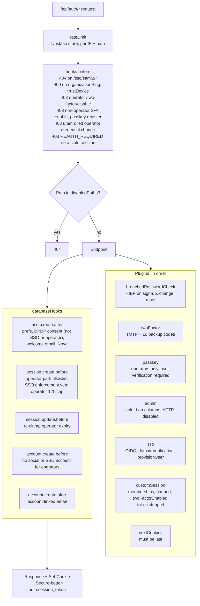
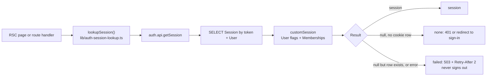
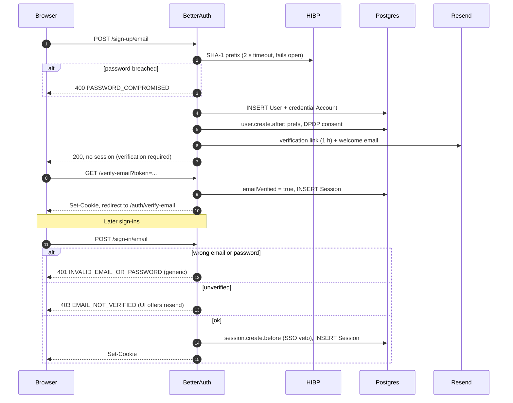
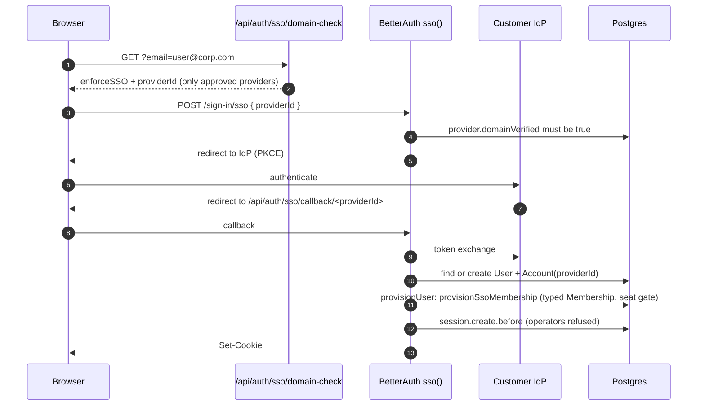
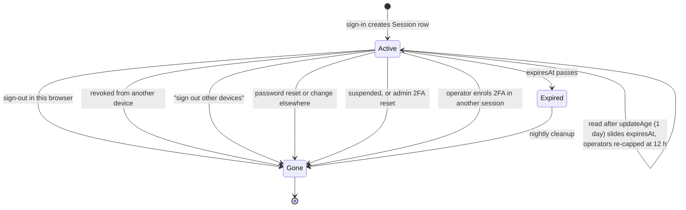
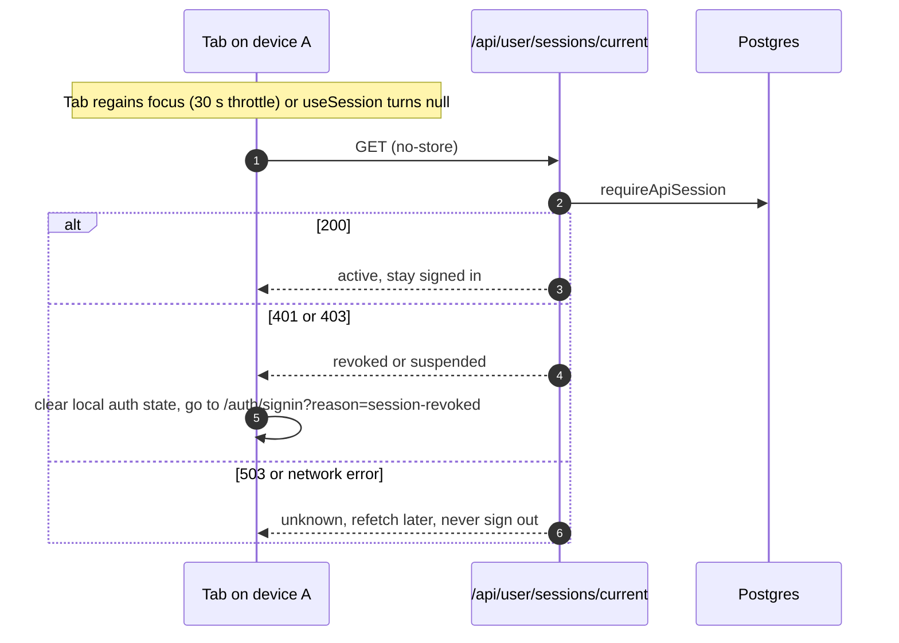
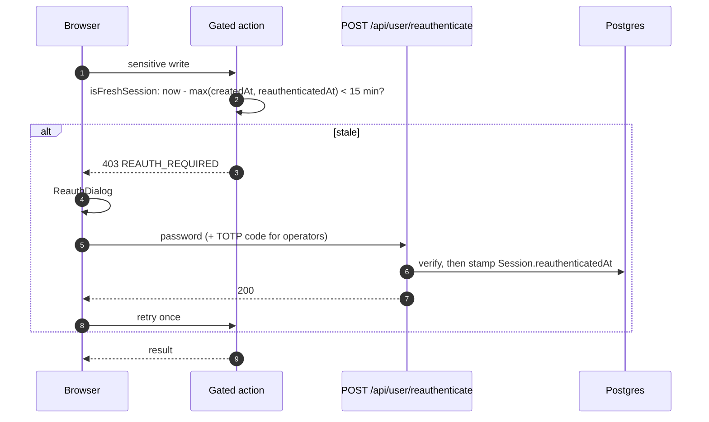
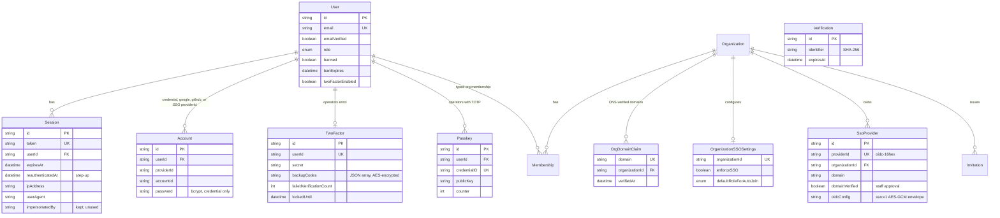

# Authentication architecture (LLD)

| Field         | Value                                                                                    |
| ------------- | ---------------------------------------------------------------------------------------- |
| Status        | Live                                                                                     |
| Audience      | Engineers changing auth code                                                             |
| Last reviewed | 2026-10-09                                                                               |
| Source        | `lib/auth.ts`, `lib/auth/*`, `lib/auth-helpers.ts`, `lib/auth-guard.ts`, `middleware.ts` |

## 1. Request path

`middleware.ts` runs at the edge and does three things, in order: the
maintenance gate, the edge rate limits (non-BetterAuth routes only, see
[rate-limiting-and-abuse.md](./rate-limiting-and-abuse.md)), and
cookie-presence routing. It cannot validate a session: `getSession` pulls in
Node-only modules, so a present cookie means "probably signed in" and nothing
more. Real validation happens in the Node runtime, in BetterAuth and in the
guards.

`/api/auth/*` is public at the edge and handled by
`app/api/auth/[...all]/route.ts` (BetterAuth). A page guard that finds a cookie
but no live session redirects through `/api/auth/clear-stale-session`, because
only a route handler can delete cookies.

## 2. Server composition (`lib/auth.ts`)



Key settings, all stated explicitly in `lib/auth.ts`:

| Setting           | Value                                                                                                                                                                                                                                                                                                                   |
| ----------------- | ----------------------------------------------------------------------------------------------------------------------------------------------------------------------------------------------------------------------------------------------------------------------------------------------------------------------- |
| Passwords         | bcrypt cost 12, 8 to 128 characters, email verification required before a credential sign-in                                                                                                                                                                                                                            |
| Reset link        | 30 minutes, single use; a reset deletes every session for the user                                                                                                                                                                                                                                                      |
| Verification link | 1 hour; signs the user in on click (`autoSignInAfterVerification`)                                                                                                                                                                                                                                                      |
| Token storage     | Reset and verification identifiers stored as SHA-256 (`verification.storeIdentifier: "hashed"`)                                                                                                                                                                                                                         |
| Social            | Google and GitHub. Account linking on, **no `trustedProviders`**; OAuth tokens encrypted at rest                                                                                                                                                                                                                        |
| Cookies           | `__Secure-` prefix, `httpOnly`, `SameSite=Lax` (the OAuth and SSO callbacks are top-level GETs)                                                                                                                                                                                                                         |
| Client IP         | `x-nf-client-connection-ip` first (set by Netlify, unforgeable); IPv6 keyed on the /64                                                                                                                                                                                                                                  |
| Session           | 30-day expiry, refreshed at most once a day (`updateAge`), `cookieCache` **off**                                                                                                                                                                                                                                        |
| `disabledPaths`   | `/list-sessions`, `/revoke-session(s)`, `/revoke-other-sessions`; `/get-access-token`, `/account-info`, `/refresh-token`, `/update-session`; the OTP 2FA pair and `/two-factor/get-totp-uri`; every `/admin/*` endpoint; `/sso/register`, provider CRUD, domain verification, SAML metadata, the shared `/sso/callback` |

`disabledPaths` blocks HTTP only. Server code can still call `auth.api.*`,
which is how staff onboarding calls `createUser`.

## 3. Session model

- A session is a `Session` row plus an opaque cookie holding its token.
- `cookieCache` is off, so every read loads the row and the user. A revoke, ban
  or 2FA change is visible on the next request. `customSession` runs on every
  read anyway, so the cache would only have saved one indexed lookup.
- Consumers: 30-day expiry, slid forward at most once a day.
- Operators (STAFF, ADMIN): `session.create.before` caps `expiresAt` at
  `createdAt + 12h` and `session.update.before` re-applies the cap on every
  refresh (`lib/auth/operator-session-policy.ts`).
- No cap on sessions per user. Expired rows are deleted nightly by
  `lib/auth/cleanup-auth-tokens.ts`, which `.github/workflows/cron-daily.yml`
  calls via `POST /api/cleanup/auth-tokens`.
- `customSession` returns the user with role, profile ids, a `banned` flag
  (honouring `banExpires`, from the row BetterAuth just read),
  `twoFactorEnabled` and `organizationMemberships` from the typed `Membership`
  table. It returns the session **without** its token.
- A session carries **no 2FA claim**. Every gate reads the user flag
  `twoFactorEnabled`, so the `verify-totp` call that enrols an operator ends
  every other session of that user; a session opened with the password alone
  never inherits the second factor.
- `Session.reauthenticatedAt` records the last step-up. A session is fresh for
  15 minutes from the later of `createdAt` and `reauthenticatedAt` (§5.7).

### Session read path



BetterAuth's `customSession` turns lookup errors into `200 null`, which looks
the same as "signed out". `lookupSession` tells them apart with one indexed read
of the `Session` row, so a database blip yields `SESSION_LOOKUP_FAILED` (503)
rather than a sign-out.

## 4. Guards

| Guard                                                                   | Where       | Refuses with                                                                                                   |
| ----------------------------------------------------------------------- | ----------- | -------------------------------------------------------------------------------------------------------------- |
| `requireApiAuth`                                                        | API routes  | 503 lookup failed, 401 no session, 403 suspended, **428 `TWO_FACTOR_REQUIRED`** for an operator without 2FA    |
| `requireApiSession`                                                     | API routes  | Same minus the 2FA check. Only for `/api/user/sessions/current`                                                |
| `requireAdminAuth`, `requirePrivilegedAuth`, `requireBackofficeSurface` | API routes  | `requireApiAuth`, then 403 by role or back-office surface                                                      |
| `requireOrgAccess`                                                      | API routes  | Org membership and `MemberRole` permission, see [authorization](../authorization/01-authorization-matrices.md) |
| `requireAuth`, `requireOnboarded`                                       | Pages       | Redirect to sign-in or onboarding                                                                              |
| `requireOperator`                                                       | Pages       | Redirect to `/auth/two-factor/setup` until 2FA is enrolled                                                     |
| `requireOperatorAwaitingTwoFactor`                                      | Setup page  | Redirect enrolled operators to `/dashboard`. The only exemption, keyed on the page, not on a request header    |
| `requireBackofficePage`                                                 | Back office | `requireOperator`, then the capability matrix                                                                  |

The 428 carries `X-Auth-Action: enroll-2fa` so the client knows the next step.

Routes that call the app's `getSession()` (`lib/auth-server.ts`) and check the
role inline fail closed: an operator session without 2FA comes back as `null`,
so they answer 401. Only `lookupSession`, under the guards above, opts in with
`allowUnenrolledOperator` so enrolment can still happen. The sign-in page sends
such an operator straight to `/auth/two-factor/setup`.

## 5. Flows

### 5.1 Consumer sign-up and email sign-in



In local development without `RESEND_API_KEY`, the verification link is
logged to the server console (`[verify-email] <email> -> <url>`).

### 5.2 Social sign-in (Google, GitHub)

1. `POST /sign-in/social` redirects to the provider; the callback is
   `/api/auth/callback/<provider>`.
2. A new email creates a user with no password; the DPDP consent and welcome
   email follow from `user.create.after`.
3. An existing email links only when the provider asserts `email_verified`
   **and** the local email is verified. There is no `trustedProviders`
   shortcut, so an unverified provider email cannot take over an account.
4. `account.create.before` refuses to link a social account to a STAFF or ADMIN
   user, and `session.create.before` refuses a social session for one. Both
   answer `STAFF_PASSWORD_SIGN_IN_ONLY`.
5. The SSO enforcement veto applies: a user whose verified domain belongs to an
   org with `enforceSSO` and an approved provider gets `SSO_REQUIRED`.

Adding a provider: add it to `socialProviders` in `lib/auth.ts` (with its env
vars), to `lib/auth-providers.ts` (the buttons and the reserved SSO ids) and to
`components/auth/auth-icons.tsx`. Only add providers that assert a verified
email, and never add `trustedProviders`.

### 5.3 Staff sign-in: password plus TOTP, or a passkey

```mermaid
sequenceDiagram
  autonumber
  participant B as Browser
  participant BA as BetterAuth
  participant DB as Postgres
  participant G as Guards

  B->>BA: POST /sign-in/email
  BA->>DB: verify bcrypt password
  alt 2FA enrolled
    BA-->>B: twoFactorRedirect + 10 min pending cookie
    B->>BA: POST /two-factor/verify-totp (or verify-backup-code)
    Note right of BA: trustDevice is refused (TRUST_DEVICE_DISABLED)
    BA->>DB: session.create.before: path allowed, expiresAt = createdAt + 12 h
    BA-->>B: Set-Cookie
  else not enrolled yet
    BA->>DB: session.create.before: path allowed, 12 h cap
    BA-->>B: Set-Cookie
    B->>G: any back-office page or operator API
    G-->>B: redirect to /auth/two-factor/setup, or 428 TWO_FACTOR_REQUIRED
    B->>BA: /two-factor/enable (needs password) then verify-totp
    BA->>DB: end every other session of the user
  end
  Note over B,BA: Or, once a passkey is registered
  B->>BA: POST /passkey/verify-authentication (user verification required)
  BA->>DB: owner must be an enrolled operator; 12 h cap
  BA-->>B: Set-Cookie, no TOTP prompt
```

- Allowed session-creating paths for an operator: `/sign-in/email`,
  `/two-factor/verify-totp`, `/two-factor/verify-backup-code`,
  `/passkey/verify-authentication` and `/change-password` (which re-issues an
  already-verified session). Anything else, including any future plugin path,
  is refused.
- Until enrolment, `/change-password`, `/change-email` and `/update-user`
  answer 403 `TWO_FACTOR_REQUIRED`, so the password alone cannot take the
  account.
- An operator cannot disable 2FA (`/two-factor/disable` answers 403
  `TWO_FACTOR_REQUIRED`). Recovery is a backup code or an ADMIN reset, see
  [staff-onboarding.md](./staff-onboarding.md).
- Two plugin lockouts bound code guessing, whatever the source IP: one
  challenge allows 5 wrong codes before its cookie is void
  (`TOO_MANY_ATTEMPTS_REQUEST_NEW_CODE`), and 10 consecutive wrong codes lock
  verification for 15 minutes (`ACCOUNT_TEMPORARILY_LOCKED`). There is no
  password lockout. Accepted risks (TOTP replay, lockout DoS) are in
  [rate-limiting-and-abuse.md §7](./rate-limiting-and-abuse.md#7-accepted-risks).
- Passkeys (operators who already enrolled TOTP only) and the security emails
  are in [staff-onboarding.md](./staff-onboarding.md).

### 5.4 Enterprise SSO (OIDC) with JIT membership



Registration, staff approval, enforcement and secret encryption are in
[sso.md](./sso.md).

### 5.5 Password reset and change

- `POST /request-password-reset` always answers the same way, sends a 30-minute
  link, and is limited to 5 an hour per IP.
- `POST /reset-password` checks the new password against HIBP, then deletes
  **every** session for the user (`revokeSessionsOnPasswordReset`).
- `POST /change-password` checks HIBP and uses `revokeOtherSessions: true`, so
  the current device stays signed in and every other device is signed out.

### 5.6 Session lifecycle and multi-device



| Term          | Meaning                                        | Behaviour                                                                                                                                                                                                     |
| ------------- | ---------------------------------------------- | ------------------------------------------------------------------------------------------------------------------------------------------------------------------------------------------------------------- |
| Multi-tab     | One browser, one cookie, **one** `Session` row | Each tab refetches on focus (BetterAuth's client) and `AuthSyncProvider` probes `/api/user/sessions/current` when it becomes visible, so a sign-out in one tab shows in another the next time it is looked at |
| Multi-device  | N browsers, N `Session` rows for one user      | Settings lists them and can end one or all others                                                                                                                                                             |
| Multi-account | Several users signed in to one browser         | Not supported (BetterAuth `multiSession` is not installed)                                                                                                                                                    |

Device management is three app routes, all behind `requireApiAuth`, a 60 per
15 minutes per-user limiter and a 120 per 15 minutes per-IP edge limiter:

| Route                                   | Does                                                                                          |
| --------------------------------------- | --------------------------------------------------------------------------------------------- |
| `GET /api/user/sessions`                | Up to 25 unexpired sessions: id, label from the user agent, IP, created, last active, current |
| `DELETE /api/user/sessions/[sessionId]` | Ends one session; ownership is in the `WHERE`, so a foreign id deletes nothing                |
| `POST /api/user/sessions/revoke-others` | Ends every session except the caller's                                                        |

- The list reads through `SESSION_PUBLIC_SELECT` (`lib/auth/session-select.ts`):
  no token, and the raw user agent never leaves the server. The label
  ("Chrome on macOS") is derived at read time (`lib/auth/device-label.ts`), and
  "last active" is `Session.updatedAt`, accurate to about a day. There are no
  device columns on `Session`.
- Every revoke, whether user, staff or moderation, goes through
  `lib/auth/session-revoke.ts`.

How another tab or device notices a revoke:



The probe is exempt from the edge limiter and uses `requireApiSession`, so an
operator who has not enrolled 2FA yet is not misread as signed out. Any server
request after a revoke also fails at once, because there is no cookie cache.

### 5.7 Step-up re-authentication



- **Proof.** Consumers and consultants give their password; social-only
  accounts (`NO_PASSWORD`, 409) are told to sign in again. Operators give the
  password plus a TOTP code, or sign in again with a passkey, which mints a
  session that is fresh by creation. The route is rate limited per user
  (5 per 15 minutes).
- **Gated.** BetterAuth `hooks.before` (`assertSensitiveAuthAction` in
  `lib/auth/step-up.ts`): `/two-factor/disable`,
  `/two-factor/generate-backup-codes`, `/change-password`, `/change-email`,
  `/passkey/generate-register-options`. App routes (`requireFreshSession`):
  self-deletion (`DELETE /api/user/[id]`), consultant payout account and
  instant payout writes, org payout account, routing and payout writes.
  Back office (`withOpsAction({ stepUp: true })`): team member create,
  suspend, reactivate, setup link and 2FA reset; refunds and credits; payout
  override; SSO provider approval and enforcement.
- **Client.** `fetchWithReauth` / `withReauth` (`lib/auth/reauth-client.ts`)
  open the re-auth dialog (`ReauthProvider` in `components/auth/ReauthDialog.tsx`) on
  `REAUTH_REQUIRED` and retry the original call once.

## 6. Data model



The shape is frozen by
[ADR 36](../enterprise/70-design-decisions/35-auth-schema-freeze.md): later
changes are additive only, and CI checks Prisma against what BetterAuth writes.

## 7. Where the code lives

| Concern                      | File                                                           |
| ---------------------------- | -------------------------------------------------------------- |
| BetterAuth config and hooks  | `lib/auth.ts`                                                  |
| Operator session rules       | `lib/auth/operator-session-policy.ts`                          |
| 2FA and passkey policy       | `lib/auth/two-factor-policy.ts`, `lib/auth/passkey-policy.ts`  |
| Step-up                      | `lib/auth/step-up.ts`, `app/api/user/reauthenticate/route.ts`  |
| Operator creation            | `lib/auth/operators.ts`, `scripts/bootstrap-admin.ts`          |
| Rate limiter store and rules | `lib/auth/rate-limit.ts`                                       |
| Breached-password check      | `lib/auth/password-policy.ts`                                  |
| Session lookup tri-state     | `lib/auth-session-lookup.ts`                                   |
| API and page guards          | `lib/auth-helpers.ts`, `lib/auth-guard.ts`                     |
| Device list and revoke       | `lib/auth/session-select.ts`, `lib/auth/session-revoke.ts`     |
| Revocation probe             | `providers/AuthSyncProvider.tsx`, `lib/auth-remembered.ts`     |
| SSO                          | `lib/sso/*`, `lib/prisma-sso-secret-extension.ts`              |
| Error codes and copy         | `lib/labels/auth-error-codes.ts`, `lib/labels/auth-errors*.ts` |
| Schema guard                 | `scripts/ci/check-auth-schema.ts`                              |

## Deprecated & Superseded Approaches

- **Consumer TOTP.** Any credential user could once call `/two-factor/enable`
  with no UI, recovery or reset; it now answers 403 for non-operators.
- **Open enrolment window.** An unenrolled operator could once change the
  password, email or profile, and enrolling left earlier password-only
  sessions alive. Both are now refused or revoked (§5.3).
