# Authentication architecture (LLD)

| Field         | Value                                                                                                                                                                          |
| ------------- | ------------------------------------------------------------------------------------------------------------------------------------------------------------------------------ |
| Status        | Live                                                                                                                                                                           |
| Audience      | Engineers changing auth code                                                                                                                                                   |
| Last reviewed | 2026-10-10                                                                                                                                                                     |
| Versions      | `better-auth`, `@better-auth/sso`, `@better-auth/passkey`: **1.7.7**, pinned exactly                                                                                           |
| Source        | `lib/auth.ts`, `lib/auth/*`, `lib/auth-server.ts`, `lib/auth-session-lookup.ts`, `lib/auth-helpers.ts`, `lib/auth-guard.ts`, `providers/AuthSyncProvider.tsx`, `middleware.ts` |

## 1. Request path

`middleware.ts` runs at the edge and does three things, in order: the
maintenance gate, the edge rate limits (non-BetterAuth routes only, see
[rate-limiting-and-abuse.md](./rate-limiting-and-abuse.md)), and
cookie-presence routing. It cannot validate a session: `getSession` pulls in
Node-only modules, so a present cookie means "probably signed in" and nothing
more. Real validation happens in the Node runtime, in BetterAuth and in the
guards.

`/api/auth/*` is public at the edge and handled by
`app/api/auth/[...all]/route.ts` (BetterAuth). That route adds two things to
BetterAuth's handler: `withRetryAfter` copies `X-Retry-After` to `Retry-After`,
and `GET /get-session` answers 503 instead of `200 null` when the lookup failed
(§3.3). A page guard that finds a cookie but no live session redirects through
`/api/auth/clear-stale-session`, because only a route handler can delete
cookies.

## 2. Server composition (`lib/auth.ts`)

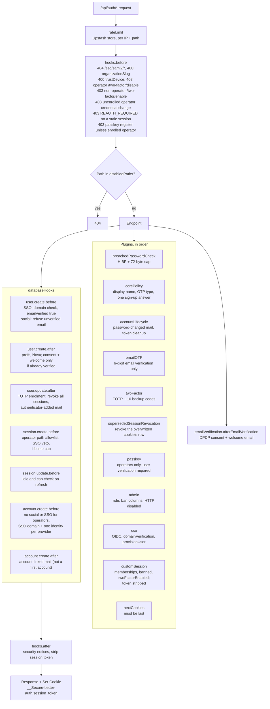

Key settings, all stated explicitly in `lib/auth.ts`:

| Setting           | Value                                                                                                                                                                                                                                                                                                                                                                                                               |
| ----------------- | ------------------------------------------------------------------------------------------------------------------------------------------------------------------------------------------------------------------------------------------------------------------------------------------------------------------------------------------------------------------------------------------------------------------- |
| Passwords         | bcrypt cost 12, at least 8 characters and at most 72 bytes (`lib/auth/password-rules.ts`), email verification required before a credential sign-in                                                                                                                                                                                                                                                                  |
| Reset link        | 30 minutes, single use; a reset deletes every session for the user                                                                                                                                                                                                                                                                                                                                                  |
| Verification code | 6 digits, 10 minutes, 5 wrong tries (`emailOTP`, `overrideDefaultEmailVerification`); verifying signs the user in (`autoSignInAfterVerification`)                                                                                                                                                                                                                                                                   |
| Token storage     | Reset identifiers and verification codes stored as SHA-256 (`verification.storeIdentifier: "hashed"`, `storeOTP: "hashed"`)                                                                                                                                                                                                                                                                                         |
| Auth mail         | Sent after the response through `advanced.backgroundTasks` → `scheduleAfter` (Netlify `waitUntil`), so timing does not reveal accounts                                                                                                                                                                                                                                                                              |
| Social            | Google and GitHub, each only when its client id and secret are set (`lib/auth/social-providers.ts`). Account linking on, **no `trustedProviders`**; OAuth tokens encrypted at rest                                                                                                                                                                                                                                  |
| Cookies           | `__Secure-` prefix, `httpOnly`, `SameSite=Lax` (the OAuth and SSO callbacks are top-level GETs)                                                                                                                                                                                                                                                                                                                     |
| Client IP         | `x-nf-client-connection-ip` first (set by Netlify, unforgeable); IPv6 keyed on the /64                                                                                                                                                                                                                                                                                                                              |
| Session           | 30-day expiry, refreshed at most once a day (`updateAge`), `cookieCache` **off**, extra field `reauthenticatedAt`; operator and SSO caps in §3.1                                                                                                                                                                                                                                                                    |
| `disabledPaths`   | `/list-sessions`, `/revoke-session(s)`, `/revoke-other-sessions`; `/get-access-token`, `/account-info`, `/refresh-token`, `/update-session`; the OTP 2FA pair and `/two-factor/get-totp-uri`; every `/admin/*` endpoint; `/verify-email`, `/send-verification-email` and every emailOTP path except send and verify; `/sso/register`, provider CRUD, domain verification, SAML metadata, the shared `/sso/callback` |

`disabledPaths` blocks HTTP only. Server code can still call `auth.api.*`,
which is how staff onboarding calls `createUser` and step-up calls
`verifyPassword` and `verifyTOTP`.

## 3. Session model

- A session is a `Session` row plus an opaque cookie holding its token.
- `cookieCache` is off, so every read loads the row and the user. A revoke, ban
  or 2FA change is visible on the next request. `customSession` runs on every
  read anyway, so the cache would only have saved one indexed lookup.
- `customSession` returns the user with role, profile ids, a `banned` flag
  (honouring `banExpires`, from the row BetterAuth just read),
  `twoFactorEnabled` and `organizationMemberships` from the typed `Membership`
  table. It returns the session **without** `token` or `impersonatedBy`.
- A session carries **no 2FA claim**. Every gate reads the user flag
  `twoFactorEnabled`, so the `verify-totp` call that enrols an operator ends
  every session of that user (`user.update.after`), and the plugin then mints
  the enrolling device's new one. A session opened with the password alone
  never inherits the second factor.
- `Session.reauthenticatedAt` records the last step-up. A session is fresh for
  15 minutes from the later of `createdAt` and `reauthenticatedAt` (§5.5).
- Signing in over a live cookie, by any method, revokes the overwritten row
  (`supersededSessionRevocation`, `lib/auth/supersede-session.ts`), so it does
  not linger as a ghost device.
- No cap on sessions per user. Expired rows are deleted daily by
  `lib/auth/cleanup-auth-tokens.ts`, the `auth-tokens` job in
  `lib/cron/cleanup-registry.ts`, which `.github/workflows/cron-daily.yml` calls
  via `POST /api/cleanup/auth-tokens`.

### 3.1 Lifetimes

`lib/auth/session-lifetime.ts` holds the policy; `session.create.before` and
`session.update.before` apply it.

| Class                                  | Lifetime                                            |
| -------------------------------------- | --------------------------------------------------- |
| Consumer, consultant, org member       | 30 days, sliding (`updateAge` 1 day)                |
| Enrolled operator (STAFF, ADMIN + 2FA) | 12 h absolute from the original authentication      |
| Any operator, idle                     | Ends after 2 h without a read                       |
| Unenrolled operator                    | 1 h absolute, long enough to enrol                  |
| SSO sign-in for an enforced domain     | 24 h absolute, so IdP deprovisioning lands in a day |

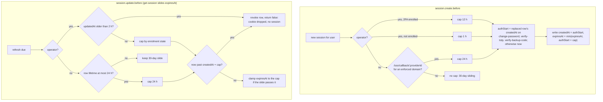

- **Original authentication.** A capped row's `createdAt` is the time the user
  last proved who they are, so neither a password change nor 2FA enrolment
  restarts the 12 h clock.
- **Capped rows refresh on every read.** Their expiry always sits inside
  BetterAuth's refresh window, so each read writes the row; that write makes
  `updatedAt` the operator's last activity, which the idle rule reads.
- **The SSO class is read from the row.** A non-operator row whose lifetime is
  at most 24 h stays capped on refresh, so the hook needs no query.

### 3.2 Session read path

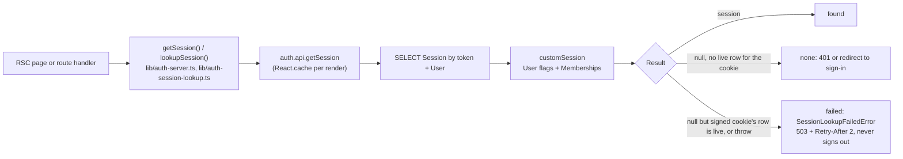

BetterAuth's `customSession` turns lookup errors into `200 null`, which looks
the same as "signed out". The app tells them apart with one indexed read of
the `Session` row (`classifyMissingSession` in `lib/auth/session-cookie.ts`,
cookie HMAC checked against the first `BETTER_AUTH_SECRETS` entry or
`BETTER_AUTH_SECRET`):

- `getSession({ allowUnenrolledOperator? })` returns the session or `null` and
  **throws** `SessionLookupFailedError` (`lib/auth/session-lookup-error.ts`), a
  503 `Refusal` with code `SESSION_LOOKUP_FAILED`, marked expected so it never
  pages. Without `allowUnenrolledOperator`, an operator without 2FA reads as
  `null`.
- `lookupSession()` returns `{ kind: "found" | "none" | "failed" }` for the
  guards, always allowing an unenrolled operator so the guards can answer the
  2FA redirect or 428 themselves.
- A route that lets the error reach `apiError()` also answers 503 with
  `Retry-After`.

### 3.3 `/get-session` on a failed lookup

`GET /api/auth/get-session` applies the same check: when the plugin answers
`200 null` but the cookie is validly signed and its row is live (or the row
read fails), the route answers 503 with `Retry-After: 2`. The BetterAuth client
keeps its last session on any non-401, so open tabs do not render signed out
during a database blip.

## 4. Guards

| Guard                                                                   | Where       | Refuses with                                                                                                                        |
| ----------------------------------------------------------------------- | ----------- | ----------------------------------------------------------------------------------------------------------------------------------- |
| `requireApiAuth({ expectUser? })`                                       | API routes  | 503 lookup failed, 401 no session, 403 suspended, **428 `TWO_FACTOR_REQUIRED`** for an operator without 2FA, 409 `IDENTITY_CHANGED` |
| `requireApiSession`                                                     | API routes  | Same minus the 2FA check. Only for `/api/user/sessions/current`                                                                     |
| `requireAdminAuth`, `requirePrivilegedAuth`, `requireBackofficeSurface` | API routes  | `requireApiAuth`, then 403 by role or back-office surface                                                                           |
| `requireOrgAccess(orgId, { expectUser? })`                              | API routes  | Org membership and `MemberRole` permission, see [authorization](../authorization/01-authorization-matrices.md)                      |
| `requireFreshSession`                                                   | API routes  | 403 `REAUTH_REQUIRED` when the session is older than 15 minutes since its last proof (§5.5)                                         |
| `requireAuth`, `requireOnboarded`                                       | Pages       | Redirect to sign-in, to `/form/onboarding`, or to `/onboarding/gate` for a user with an active org membership                       |
| `requireOperator`                                                       | Pages       | Redirect to `/auth/two-factor/setup` until 2FA is enrolled                                                                          |
| `requireOperatorAwaitingTwoFactor`                                      | Setup page  | Redirect enrolled operators to `/dashboard`. The only exemption, keyed on the page, not on a request header                         |
| `requireBackofficePage`                                                 | Back office | `requireOperator`, then the capability matrix                                                                                       |

The 428 carries `X-Auth-Action: enroll-2fa` so the client knows the next step.
`withOpsAction` doors in `lib/backoffice/ops-action-log.ts` take
`{ stepUp: true }` (step-up) and always check `X-Expected-User` (§5.9).

Routes that call the app's `getSession()` (`lib/auth-server.ts`) and check the
role inline fail closed: an operator session without 2FA comes back as `null`,
so they answer 401. The sign-in page sends such an operator straight to
`/auth/two-factor/setup`.

## 5. Flows

### 5.1 Consumer sign-up, email verification and email sign-in

Verification is a 6-digit code typed into the same tab that chose the
password, so whoever verifies holds both the inbox and the password.

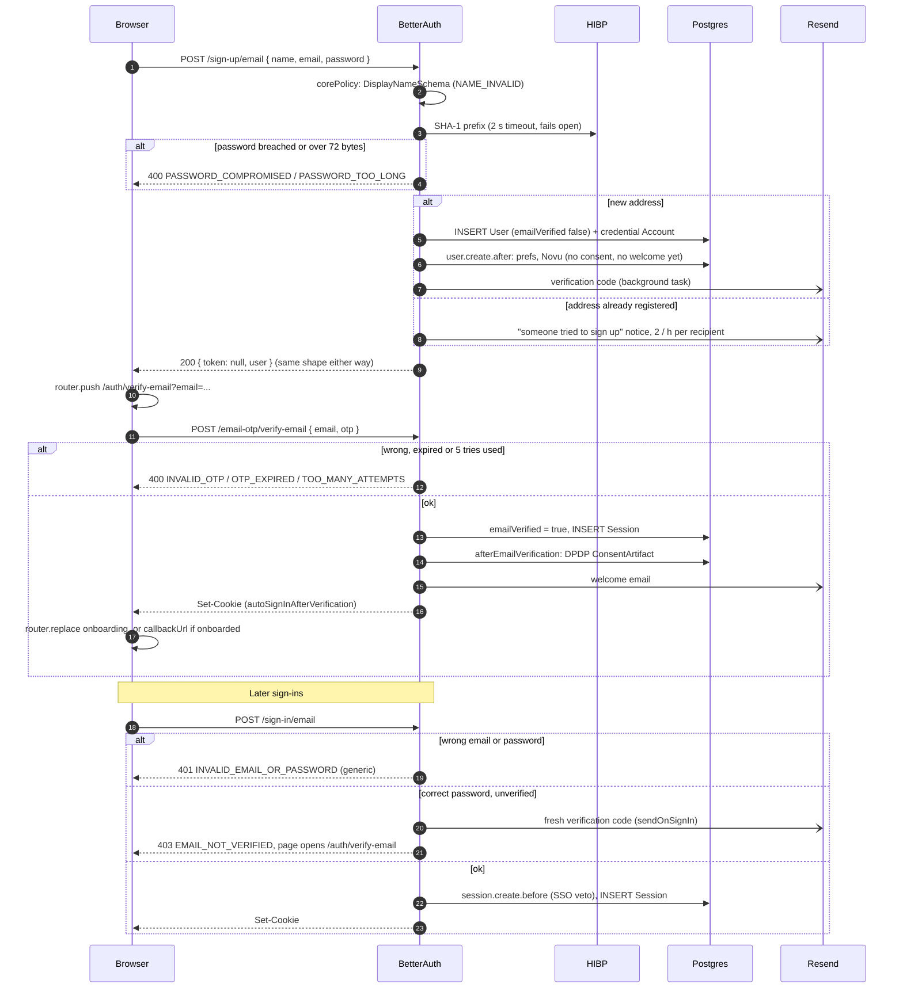

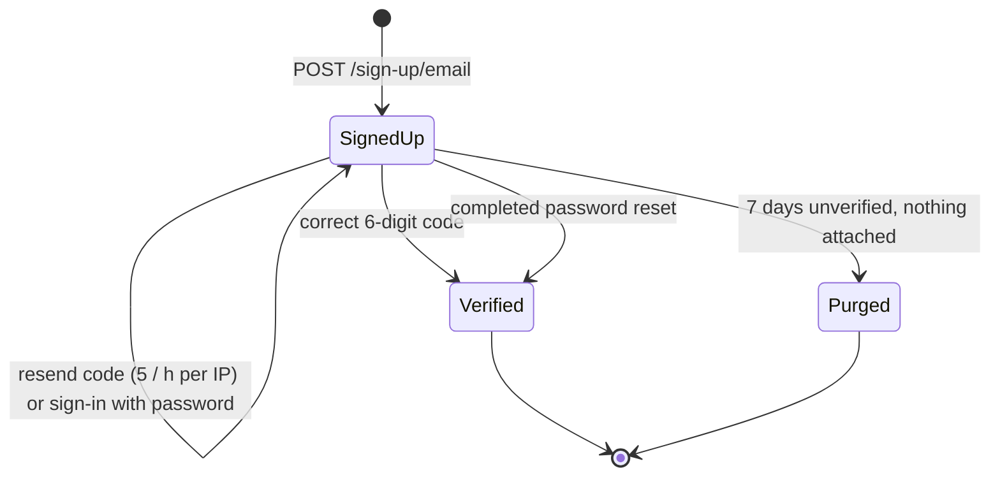

- **Lifecycle code** lives in `lib/auth/account-lifecycle.ts`:
  `provisionNewUser` (`user.create.after`), `welcomeVerifiedUser` (consent and
  welcome at the first proven address), `sendVerificationCode` (codes only for
  existing unverified accounts), `notifyExistingAccountSignUp`,
  `notifyAccountLinked`, `onPasswordChanged`, `onPasswordReset`.
- **Consent and welcome.** A credential sign-up gets its DPDP
  `ConsentArtifact` and welcome mail in `emailVerification.afterEmailVerification`,
  or on the first verification through a completed password reset. Social
  users arrive verified, so `user.create.after` does it at creation. SSO users
  get the welcome mail but no sign-up consent; the onboarding gate collects it.
  Operators get a setup mail and give consent in the back office.
- **Account-linked mail** is skipped for a brand-new user's first account; it
  fires only when a provider is added to an account that already had one.
- **Purge.** `purge-unverified-users` (registry job, daily from
  `.github/workflows/cron-daily.yml`) deletes never-verified, credential-only
  consumers older than 7 days with no profile, booking, payment, invoice,
  referral credit or membership (`lib/auth/purge-unverified-users.ts`).
- In local development the code is logged to the server console
  (`[verify-email] <email> -> <code>`).

### 5.2 Social sign-in (Google, GitHub)

1. `POST /sign-in/social` redirects to the provider; the callback is
   `/api/auth/callback/<provider>`.
2. A new email creates a verified user with no password; the DPDP consent and
   welcome email follow from `user.create.after`. `user.create.before` refuses
   a provider that reports the address unverified (`EMAIL_NOT_VERIFIED`).
3. An existing email links only when the provider asserts `email_verified`
   **and** the local email is verified. There is no `trustedProviders`
   shortcut, so an unverified provider email cannot take over an account. A
   social sign-in onto an existing unverified credential account is refused
   with `ACCOUNT_NOT_LINKED`, whose copy sends the user to password reset.
4. `account.create.before` refuses to link a social account to a STAFF or ADMIN
   user, and `session.create.before` refuses a social session for one. Both
   answer `STAFF_PASSWORD_SIGN_IN_ONLY`.
5. The SSO enforcement veto applies: a user whose email domain is enforced by
   an org (§5.6) gets `SSO_REQUIRED`.

Adding a provider: add it to `lib/auth/social-providers.ts` (with its env
vars), to `lib/auth-providers.ts` (the buttons and the reserved SSO ids) and to
`components/auth/auth-icons.tsx`. Only add providers that assert a verified
email, and never add `trustedProviders`.

### 5.3 Staff sign-in: password plus TOTP, or a passkey

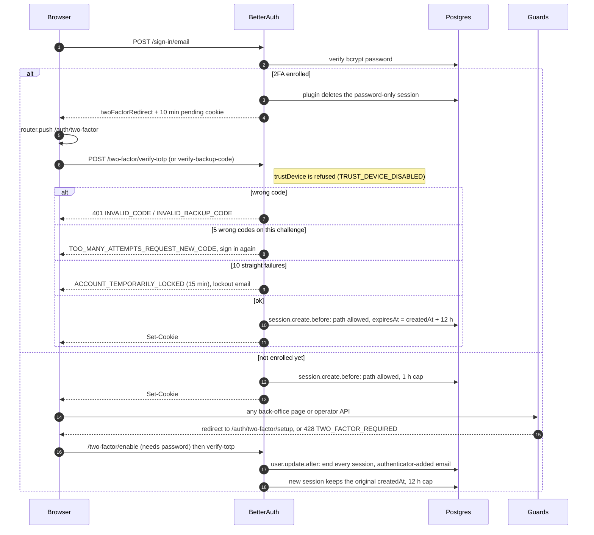

Challenge page (`/auth/two-factor`) codes:

| Code                                  | When                                                                               | Next step                                        |
| ------------------------------------- | ---------------------------------------------------------------------------------- | ------------------------------------------------ |
| `INVALID_CODE`, `INVALID_BACKUP_CODE` | Wrong TOTP or backup code                                                          | Try again                                        |
| `TOO_MANY_ATTEMPTS_REQUEST_NEW_CODE`  | 5 wrong codes on one challenge; the pending cookie is void                         | **Sign in again**                                |
| `INVALID_TWO_FACTOR_COOKIE`           | The 10-minute challenge expired, or another tab finished it                        | **Sign in again**, or go on if already signed in |
| `ACCOUNT_TEMPORARILY_LOCKED`          | 10 consecutive wrong codes; verification paused for 15 minutes, lockout email sent | Wait                                             |

- Allowed session-creating paths for an operator
  (`lib/auth/operator-session-policy.ts`): `/sign-in/email`,
  `/two-factor/verify-totp`, `/two-factor/verify-backup-code`,
  `/passkey/verify-authentication` and `/change-password` (which re-issues an
  already-verified session). Anything else, including any future plugin path,
  is refused with `STAFF_PASSWORD_SIGN_IN_ONLY`.
- Until enrolment, `/change-password`, `/change-email` and `/update-user`
  answer 403 `TWO_FACTOR_REQUIRED`, so the password alone cannot take the
  account.
- An operator cannot disable 2FA (`/two-factor/disable` answers 403
  `TWO_FACTOR_REQUIRED`), and nobody else can enable it
  (`TWO_FACTOR_OPERATORS_ONLY`). Recovery is a backup code or an ADMIN reset,
  see [staff-onboarding.md](./staff-onboarding.md).
- On load, the challenge page checks for a session and goes to the destination
  if another tab already finished the challenge.
- The plugin lockouts are the only lockouts; there is no password lockout.
  Accepted risks (TOTP replay, lockout DoS) are in
  [rate-limiting-and-abuse.md §7](./rate-limiting-and-abuse.md#7-accepted-risks).
- Security notices (`hooks.after` → `notifySecurityEvents`,
  `lib/auth/security-event-hook.ts`): passkey added, backup codes regenerated,
  backup code used (with the count left) and 2FA lockout. Enrolment and admin
  reset send theirs from `user.update.after` and the reset route.

### 5.4 Passkey sign-in (operators)

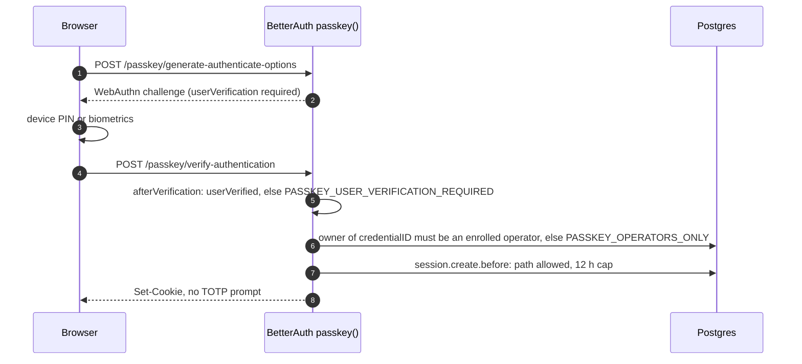

- Registration (`/passkey/generate-register-options`,
  `/passkey/verify-registration`) is allowed only for an operator who has
  enrolled TOTP, needs a fresh session (§5.5), and never mints a session
  (`createSession` is refused). Policy: `lib/auth/passkey-policy.ts`.
- The relying party is `BETTER_AUTH_URL`; resident keys are required.
- TOTP stays mandatory as the recovery factor. An ADMIN 2FA reset deletes the
  operator's passkeys.

### 5.5 Step-up re-authentication

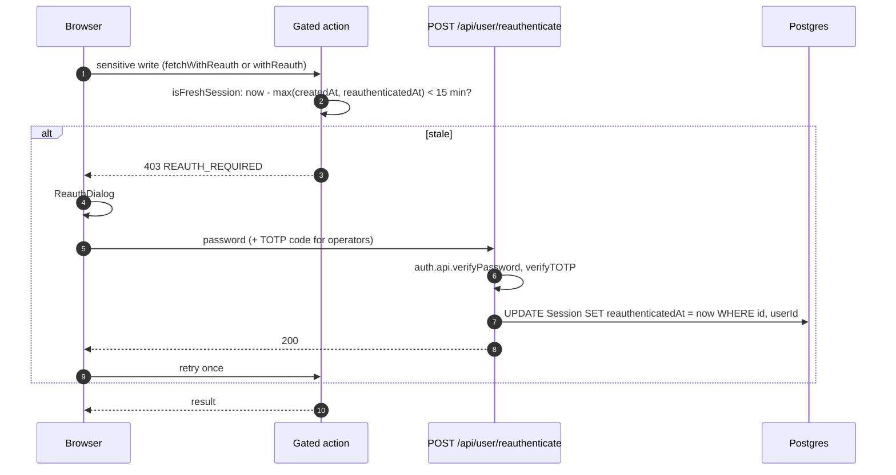

- **Proof.** Consumers and consultants give their password; social-only
  accounts (`NO_PASSWORD`, 409) are told to sign in again. Operators give the
  password plus a TOTP code (`TOTP_REQUIRED` without one), or sign in again
  with a passkey, which mints a session that is fresh by creation. Failures
  answer `INVALID_PASSWORD` or `INVALID_CODE`. The route is rate limited per
  user (5 per 15 minutes).
- **Gated.** BetterAuth `hooks.before` (`assertSensitiveAuthAction` in
  `lib/auth/step-up.ts`): `/two-factor/disable`,
  `/two-factor/generate-backup-codes`, `/change-password`, `/change-email`,
  `/passkey/generate-register-options`. App routes (`requireFreshSession`):
  self-deletion (`DELETE /api/user/[id]`), consultant payout account and
  instant payout writes, org payout account, expert payout routing and payout
  writes, back-office payout processing and refunds. Back office
  (`withOpsAction({ stepUp: true })`): team member create, suspend,
  reactivate, setup link and 2FA reset; refund issue and credits; payout
  override; SSO provider approval and enforcement.
- **Client.** `fetchWithReauth` / `withReauth` (`lib/auth/reauth-client.ts`)
  open the dialog (`ReauthProvider` in `components/auth/ReauthDialog.tsx`) on
  `REAUTH_REQUIRED` and retry the original call once. `fetchWithReauth` also
  sends `X-Expected-User`.

### 5.6 Enterprise SSO (OIDC) with JIT membership

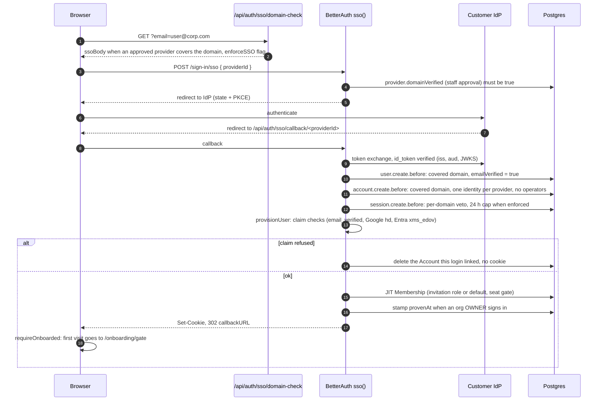

The enforced-domain rule, claim table, JIT and proof rules, approval queue,
secret encryption and session sweeps are in [sso.md](./sso.md).

### 5.7 Password reset and change

- `POST /request-password-reset` always answers the same way, sends a 30-minute
  link carrying `&email=` (for password-manager autofill), and is limited to 3
  an hour per IP.
- `POST /reset-password` checks the new password against HIBP and the 72-byte
  cap, then deletes **every** session for the user
  (`revokeSessionsOnPasswordReset`) and every outstanding token, verifies an
  unverified address, and sends `PASSWORD_CHANGED`.
- `POST /change-password` needs a fresh session (§5.5), checks HIBP and uses
  `revokeOtherSessions: true`, so the current device stays signed in (its new
  row keeps the original `createdAt`) and every other device is signed out; it
  also sends `PASSWORD_CHANGED`.

### 5.8 Session lifecycle and multi-device

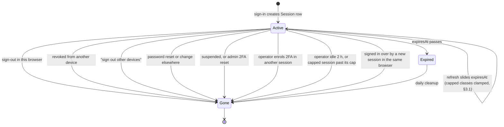

| Term          | Meaning                                        | Behaviour                                                                                            |
| ------------- | ---------------------------------------------- | ---------------------------------------------------------------------------------------------------- |
| Multi-tab     | One browser, one cookie, **one** `Session` row | `AuthSyncProvider` revalidates on focus, visibility and bfcache restore, and follows sign-out (§5.9) |
| Multi-device  | N browsers, N `Session` rows for one user      | Settings lists them and can end one or all others                                                    |
| Multi-account | Several users signed in to one browser         | Not supported (BetterAuth `multiSession` is not installed); a switch reloads every other tab         |

Device management is three app routes, all behind `requireApiAuth`, a 60 per
15 minutes per-user limiter and a 120 per 15 minutes per-IP edge limiter:

| Route                                   | Does                                                                                                            |
| --------------------------------------- | --------------------------------------------------------------------------------------------------------------- |
| `GET /api/user/sessions`                | Unexpired sessions, 25 per page (`?cursor=`): id, label from the user agent, IP, created, last active, current  |
| `DELETE /api/user/sessions/[sessionId]` | Ends one session; ownership is in the `WHERE`, so a foreign id deletes nothing and answers 200 `{ revoked: 0 }` |
| `POST /api/user/sessions/revoke-others` | Ends every session except the caller's                                                                          |

- The list reads through `SESSION_PUBLIC_SELECT` (`lib/auth/session-select.ts`):
  no token, and the raw user agent never leaves the server. The label
  ("Chrome on macOS") is derived at read time (`lib/auth/device-label.ts`), and
  "last active" is `Session.updatedAt`: about a day for consumers, per read for
  capped sessions. There are no device columns on `Session`.
- Every revoke, whether user, staff, moderation, lifetime or SSO sweep, goes
  through `lib/auth/session-revoke.ts`.

### 5.9 Multi-tab identity sync

`providers/AuthSyncProvider.tsx`, mounted once at the root, keeps each tab
honest; sign-out navigation lives in `lib/auth/sign-out.ts`.

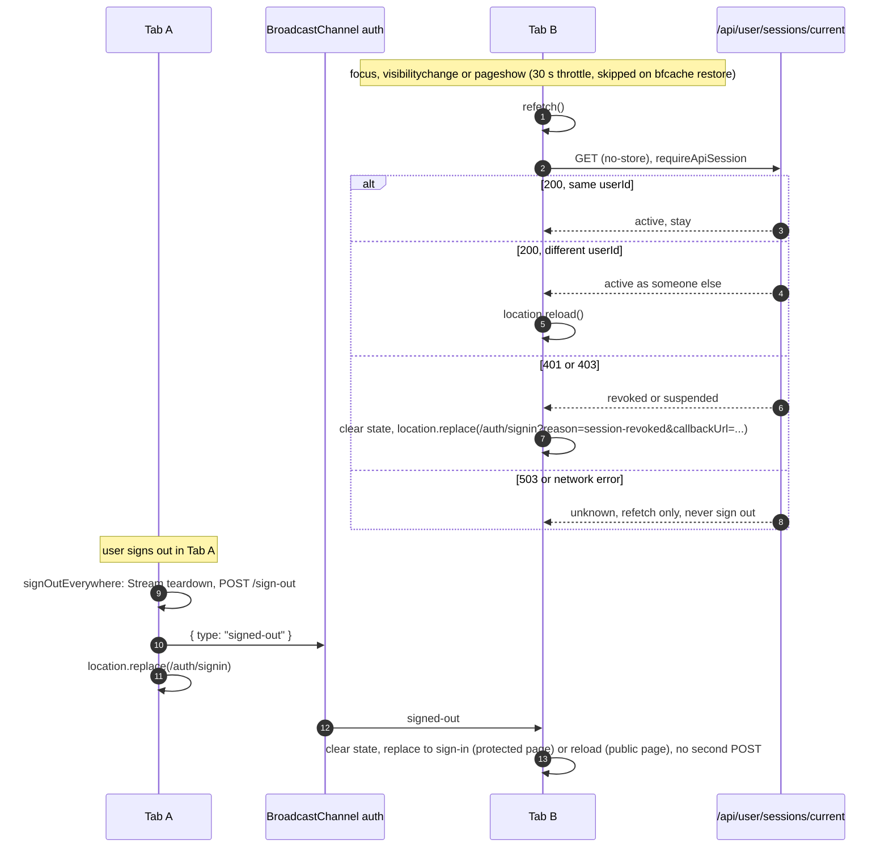

- **User switch.** The first user id a page load resolves is its identity. A
  different id from the session store or the ping hard-reloads the tab, so no
  stale RSC payload, cache or form acts as the new account.
- **`X-Expected-User`.** `AuthSyncProvider` hands that id to
  `lib/auth/identity-header.ts`; `fetchWithIdentity` sends it on money and IAM
  writes, and `requireApiAuth({ expectUser: true })`,
  `requireOrgAccess(orgId, { expectUser: true })` and every `withOpsAction`
  door answer 409 `IDENTITY_CHANGED` on a mismatch, after which the tab
  reloads. An absent header passes. Wired on checkout, instant payouts, org
  member and invitation writes, and every back-office ops door.
- **Cold load.** If the remembered flag (`lib/auth-remembered.ts`) is set but
  there is no session, a public page forgets it quietly; a protected page
  (`lib/navigation/protected-routes.ts`, shared with `middleware.ts`) asks the
  server first.
- The ping is exempt from the edge limiter and uses `requireApiSession`, so an
  operator who has not enrolled 2FA yet is not misread as signed out. Any
  server request after a revoke also fails at once, because there is no cookie
  cache.

## 6. Data model

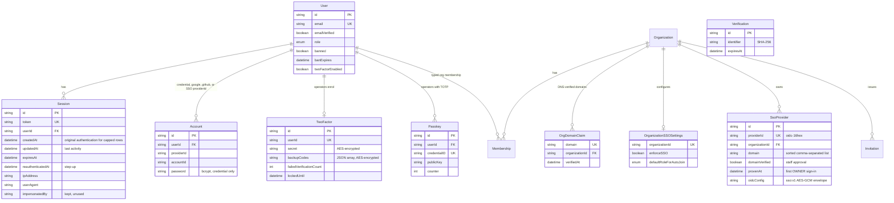

The shape is frozen by
[ADR 36](../enterprise/70-design-decisions/35-auth-schema-freeze.md): later
changes are additive only, and CI checks Prisma against what BetterAuth writes.

## 7. Where the code lives

| Concern                      | File                                                                                       |
| ---------------------------- | ------------------------------------------------------------------------------------------ |
| BetterAuth config and hooks  | `lib/auth.ts`                                                                              |
| Session lifetimes            | `lib/auth/session-lifetime.ts`, `lib/auth/supersede-session.ts`                            |
| Operator session rules       | `lib/auth/operator-session-policy.ts`                                                      |
| 2FA and passkey policy       | `lib/auth/two-factor-policy.ts`, `lib/auth/passkey-policy.ts`                              |
| Step-up                      | `lib/auth/step-up.ts`, `app/api/user/reauthenticate/route.ts`, `lib/auth/reauth-client.ts` |
| Security notices             | `lib/auth/security-event-hook.ts`, `lib/auth/security-email.ts`                            |
| Operator creation            | `lib/auth/operators.ts`, `scripts/bootstrap-admin.ts`                                      |
| Rate limiter store and rules | `lib/auth/rate-limit.ts`                                                                   |
| Breached-password check      | `lib/auth/password-policy.ts`, `lib/auth/password-rules.ts`                                |
| Sign-up policy, lifecycle    | `lib/auth/core-policy.ts`, `lib/auth/account-lifecycle.ts`                                 |
| Unverified purge             | `lib/auth/purge-unverified-users.ts`                                                       |
| Expired-row cleanup          | `lib/auth/cleanup-auth-tokens.ts`                                                          |
| Session lookup tri-state     | `lib/auth-server.ts`, `lib/auth-session-lookup.ts`, `lib/auth/session-cookie.ts`           |
| API and page guards          | `lib/auth-helpers.ts`, `lib/auth-guard.ts`                                                 |
| Device list and revoke       | `lib/auth/session-select.ts`, `lib/auth/session-revoke.ts`                                 |
| Multi-tab sync, sign-out     | `providers/AuthSyncProvider.tsx`, `lib/auth/sign-out.ts`, `lib/auth/identity-header.ts`    |
| SSO                          | `lib/sso/*`, `lib/prisma-sso-secret-extension.ts`                                          |
| Error codes and copy         | `lib/labels/auth-errors.ts`                                                                |
| Schema guard                 | `scripts/ci/check-auth-schema.ts`                                                          |

## Deprecated & Superseded Approaches

- **Link verification.** BetterAuth's 1-hour verification link,
  `GET /verify-email?token=`, `/send-verification-email` and sign-in on click
  were replaced by the 6-digit code: a link could be opened by a mail scanner
  or on another device. Delete any `?token=`/`?error=` handling on
  `/auth/verify-email` and any client `sendVerificationEmail` call (the server
  sender of that name now mails the code).
- **Cookie-cache code.** `getCachedSession()`, `getSession(true)` /
  `lookupSession(true)` force-fresh flags, the auth pages'
  `getSession({ query: { disableCookieCache: true } })` redirect dance and its
  eslint rule. The cache is off for good; delete any remaining copy.
- **Pre-verification welcome and consent** in `user.create.after` for
  credential sign-ups, which welcomed addresses nobody had proven.
- **Consumer TOTP.** Any credential user could call `/two-factor/enable` with
  no UI, recovery or reset; it now answers 403 for non-operators.
- **Open enrolment window and a flat 12 h operator cap.** An unenrolled
  operator could change credentials, enrolment left password-only sessions
  alive, and a password change restarted the 12 h clock; replaced by §3.1 and
  §5.3.
- **`jobs/` and `scripts/` twins of `cleanup-auth-tokens`** and its own
  workflow; the registry job is the only implementation.
