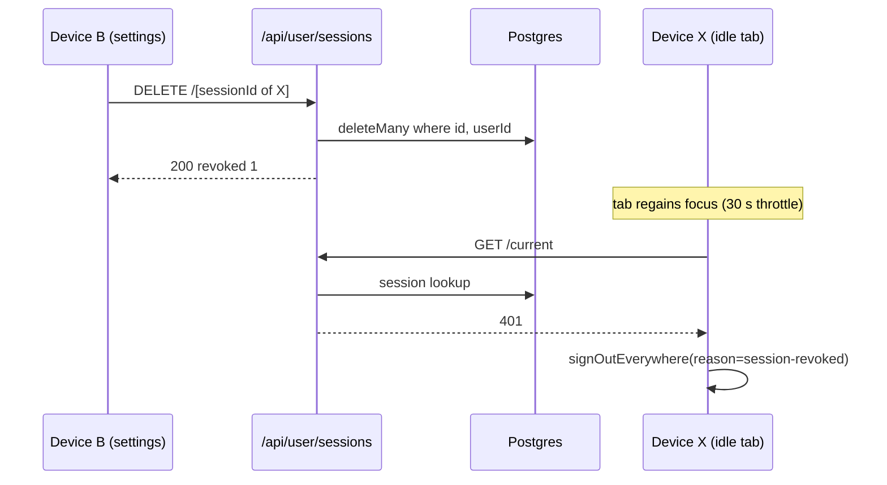

# Sessions and Devices

| Field         | Value                                                                                                                                                                                                                                                                                      |
| ------------- | ------------------------------------------------------------------------------------------------------------------------------------------------------------------------------------------------------------------------------------------------------------------------------------------ |
| Status        | Stable                                                                                                                                                                                                                                                                                     |
| Audience      | All engineers                                                                                                                                                                                                                                                                              |
| Last reviewed | 2026-09-30                                                                                                                                                                                                                                                                                 |
| Source files  | `lib/auth.ts`, `lib/auth/session-select.ts`, `lib/auth/session-revoke.ts`, `lib/auth/device-label.ts`, `app/api/user/sessions/`, `app/api/admin/users/[userId]/sessions/`, `components/dashboard/account/SignInSecuritySection.tsx`, `providers/AuthSyncProvider.tsx`, `lib/auth-broadcast.ts` |

## 1. Model

A signed-in user has one `sessions` row per browser (phone, laptop,
tablet). Every tab in one browser profile shares one cookie, so they
share **one** session. Sessions last 30 days, sliding: BetterAuth bumps
`expiresAt`/`updatedAt` at most once per day (`updateAge`). There is no
per-user session cap; expired rows are swept nightly by
`jobs/cleanup/cleanup-auth-tokens.ts`.

The cookie cache is **off** (`session.cookieCache.enabled: false`), so
every server session read hits the database. A deleted row, a ban or a
role change applies on the very next server request.

The BetterAuth list/revoke endpoints are unusable from the browser: in
1.6.5 _and_ 1.7.6 `listSessions()` returns the raw session **token** per
device and `revokeSession` accepts only the token. `disabledPaths`
blocks `/list-sessions`, `/admin/list-user-sessions`,
`/admin/revoke-user-session(s)` over HTTP (server `auth.api.*` calls are
unaffected), `customSession` strips `session.token` from the
`/get-session` payload, and every list and revoke goes through our own
routes. Policy: [ADR 35](../../enterprise/70-design-decisions/35-user-session-visibility-and-revocation.md).

## 2. Building blocks

- **Visibility boundary** — `lib/auth/session-select.ts`:
  `SESSION_PUBLIC_SELECT` (id, timestamps, `ipAddress`, `userAgent`,
  `impersonatedBy`) and `toPublicSession()`, which emits a label derived
  from `userAgent` at read time (`deriveDeviceLabel`), the IP,
  `lastSeenAt` (= `updatedAt`, day-granular; the UI says "Active in the
  last day" / "Last active N days ago"), and `isCurrent` /
  `isImpersonated`. `token` and the raw `userAgent` never cross.
  `__tests__/security/session-payload-allowlist.test.ts` pins both key sets.
- **Revocation choke point** — `lib/auth/session-revoke.ts`:
  `revokeSessionById` (`(id, userId)` in the `where` is the ownership
  proof), `revokeUserSessionsExcept`, `revokeAllUserSessions` (takes the
  ambient `tx`). All use `deleteMany`, so a double revoke is a 0-count
  success and unknown ids answer 200 `{ revoked: 0 }`, never 404. Direct
  Prisma, not `auth.api.revokeUserSessions`: the plugin endpoint checks
  the _calling_ admin's session and cannot join a transaction.
- **Liveness probe** — `GET /api/user/sessions/current` relays
  `requireApiAuth`: 200 active, 401 no session, 403 suspended, 503 lookup
  failed (`no-store`, exempt from `sessionMgmtLimiter`). It exists
  because `customSession` answers `/get-session` with `200 null` on a
  failed lookup too, which once signed every tab out during a DB blip.
- **Client classifier** — `AuthSyncProvider.classifyUnexpectedSignOut`
  asks the probe. Only 401/403 signs out
  (`signOutEverywhere("/auth/signin?reason=session-revoked")`); 503,
  other 5xx or a network error refetch and stay put; 200 does nothing
  (or refetches after a transient null). It runs when a tab's session
  unexpectedly resolves to null, and on `visibilitychange` to visible
  (throttled to one probe per 30 s).
- **Same-browser sync** — `lib/auth-broadcast.ts` posts a `login` /
  `logout` BroadcastChannel ping (localStorage fallback); peer tabs
  refetch. Since tabs share the session, that is all they need.

## 3. Scenarios

| Scenario                   | What happens                                                                                                                                                                                                                              | Latency elsewhere                                                              |
| -------------------------- | ----------------------------------------------------------------------------------------------------------------------------------------------------------------------------------------------------------------------------------------- | ------------------------------------------------------------------------------ |
| Sign out in tab A          | `signOut` deletes the row and pings `logout`. Peer tabs refetch, resolve null, probe → 401, land on sign-in. Other devices are unaffected (different sessions).                                                                            | Same browser: instant. Other devices: none (still signed in).                  |
| Revoke device X from B     | `DELETE /api/user/sessions/[id]` (or `revoke-others`) deletes X's row.                                                                                                                                                                     | X: next server request 401s; an idle open tab signs out on next focus.        |
| Revoke own current session | Route returns `currentSessionEnded`; the UI calls `signOutEverywhere`.                                                                                                                                                                     | Instant here; peer tabs via the `logout` ping.                                 |
| Password change            | `authClient.changePassword({ revokeOtherSessions: true })` — one request; BetterAuth deletes every other row. The current session survives.                                                                                                | Other devices: next request or next focus.                                     |
| Password reset (email)     | `revokeSessionsOnPasswordReset` deletes **every** row, including the resetting user's own on any device.                                                                                                                                  | Same as revoke.                                                                |
| Ban / suspend              | The moderation transaction calls `revokeAllUserSessions(tx, …)`. Belt and braces: `customSession` flags `banned` and `requireApiAuth` answers 403 for any surviving session.                                                              | Next request or next focus.                                                    |
| Staff revoke               | Staff see the list via `GET /api/admin/users/[userId]/sessions` (`users.read`, OPERATORS); admins end one (`sessionId`) or all via `POST .../revoke` (`users.moderate`, ADMIN_ONLY, `reason` + OpsActionLog).                              | Same as revoke.                                                                |
| Expiry                     | 30 days after the last daily bump the row is invalid; the next read returns no session. Nightly job deletes it.                                                                                                                           | Next request or next focus.                                                    |

"Next request" means any server-rendered page or API call: guards read
the database, so a revoked device cannot act, only keep showing a page
it already rendered until it navigates or regains focus.

## 4. Edge cases & foot-guns

1. **Never read a failed lookup as a revocation.** Server: 503 /
   `SESSION_LOOKUP_FAILED`. Client: probe 503/5xx/network. Only a
   confirmed 401/403 signs out. Never classify on `/get-session` — its
   `null` is ambiguous.
2. **Never call `authClient.listSessions()` / `revokeSession()` from the
   browser.** `/list-sessions` now 404s over HTTP (`disabledPaths`), and
   `revokeSession` needs a token page JavaScript never sees (httpOnly cookie, stripped from the payload). Do not
   remove `disabledPaths` entries or re-add `session.token` to the
   payload without re-reading §1.
3. **The reset option name lies.** BetterAuth 1.6.5 documents
   `revokeSessionsOnPasswordReset` as revoking "all _other_ sessions",
   but `api/routes/password.mjs:164` calls
   `internalAdapter.deleteSessions(userId)`, which deletes **every** row.
   That is what we want; re-check on the 1.7 upgrade (#1855). Unit tests
   cannot drive the reset flow, so the flag is pinned by types plus this
   paragraph.
4. **Re-enabling the cookie cache** reopens a stale window (up to
   `maxAge`) for revocation, bans and role changes. `getCachedSession()`
   and the `no-restricted-syntax` rule on bare `getSession()` keep
   sensitive reads on `getSession(true)` so that switch cannot silently
   make them stale.
5. **Latency is bounded by user activity, not a timer.** A tab left
   visible and untouched on a revoked device keeps its rendered page
   until the next navigation, API call or focus. That is accepted: it
   can read nothing new.

## 5. Operational notes

- Both device lists return at most 25 rows (newest first). Deferred until evidence: an
  `@@index([userId, createdAt])` for the per-user scan, and a shared
  fetch client for the three UI call sites.

## 6. Related docs

- [ADR 35](../../enterprise/70-design-decisions/35-user-session-visibility-and-revocation.md) — the policy, and alternatives rejected
- [03-sessions-and-hooks.md](./03-sessions-and-hooks.md) — lifecycle, hooks, cross-tab sync
- [04-rate-limiting.md](./04-rate-limiting.md) — `sessionMgmtLimiter`
- [ADR 10](../../enterprise/70-design-decisions/10-session-generation-clock.md) — generation clock; addendum on the admin plugin
