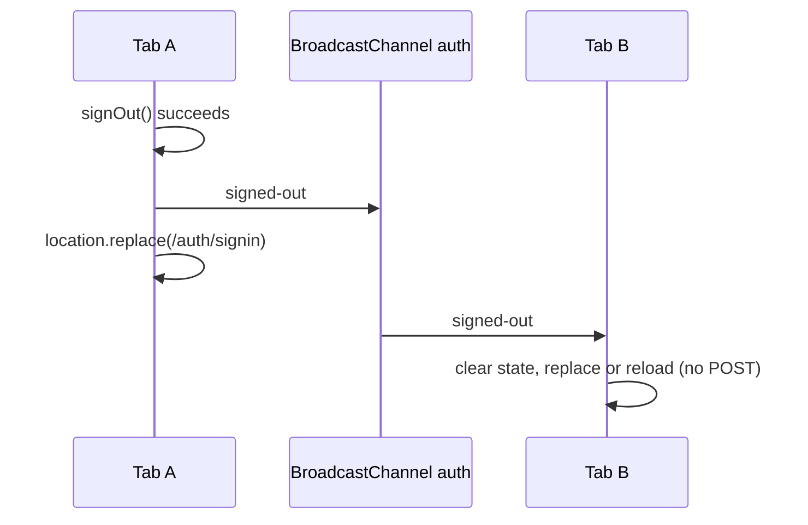

# 08 — Auth Redirects & Navigation (the anti-flicker contract)

> **Read this before touching any `redirect`/`router.push`/`useSession` code in
> `app/auth/**`, `app/dashboard/**`, or `lib/auth-guard.ts`.**
>
> PR #1242 removed a class of login flicker that had three stacked root causes.
> This document is the contract that keeps it fixed. Every rule here exists
> because breaking it re-introduces a user-visible bug that took four parallel
> audits to trace.

## The rules (violating any one regresses the flicker fix)

### Rule 1 — Auth-page redirects are `router.replace`, never `push`

`app/auth/signin`, `signup`, and `forgot-password` bounce already-authenticated
visitors to their destination with `router.replace(target)`.

**Why:** `push` leaves `/auth/*` in browser history. Back from the dashboard
then remounts the signin page, whose redirect effect fires again and bounces
forward — a ping-pong loop with visible flicker on every Back press.

### Rule 2 — Redirect navigation is idempotent (`navigatedRef`)

The redirect effects keep a `navigatedRef` keyed on the **target URL**. A
navigation to target T fires exactly once; repeat effect invocations
(React Strict-Mode double-invocation, duplicate session-store emissions,
dependency wobbles) compute the same T, see the ref match, and no-op.

**Why:** signin historically derived `callbackUrl` via _delayed state_
(`useState` populated by an effect). Render #1 ran the redirect with `null`
→ pushed `/dashboard`; render #2 ran again with the real callback → pushed
the real destination. Users visibly flashed through `/dashboard` en route to
wherever they were actually going.

If you need a new auth-page redirect: compute the target synchronously during
render where possible, and always guard with the same idempotency pattern.
See `useAuthenticatedRedirectTarget` in `app/auth/signin/page.tsx` for the
reference implementation (signup duplicates it inline).

### Rule 3 — Destination decisions re-read the session once

Client `useSession()` holds whatever it last fetched, which can trail the
server after a mutation in another tab. Server guards (`requireOnboarded`,
`requireNotOnboarded` in `lib/auth-guard.ts`) always read the database (the
cookie cache is off). Acting on a stale `onboardingCompleted` sends the client
one way while the guard counter-redirects the other way.

So the client helpers call `getSession()` once before committing a
destination:

| Fresh read result                     | Behavior                                                                                 |
| ------------------------------------- | ---------------------------------------------------------------------------------------- |
| Returns a user                        | Trust its `onboardingCompleted`; navigate                                                |
| Returns no user (**revoked session**) | **Do not navigate** into protected routes — stay put; the session store update drives UI |
| Error (network, 503)                  | Fall back to the cached value (best effort beats dead end)                               |

### Rule 4 — Callback URLs go through `safeSameOriginPath()`

`lib/navigation/safe-path.ts` is the only acceptable validator for
user-controlled redirect targets in auth flows.

A naive prefix check (`startsWith("/") && !startsWith("//")`) is **not**
safe: WHATWG URL parsing normalizes backslashes to forward slashes for
special schemes, so `/\attacker.example` re-tokenizes as scheme-relative and
resolves to an external origin while passing both prefix checks. Verified:
`new URL("/\\attacker.example", base)` → origin `https://attacker.example`.

This is a live CVE class — CVE-2026-42259 (Saltcorn), CVE-2026-55185
(Miniflux), CVE-2026-55590 (CakePHP), CVE-2026-53573 (GeoNetwork) are all
prefix-check bypasses of exactly this shape. The validator resolves against a
fixed internal probe base and rejects any cross-origin result, isomorphic
across server/client. Use it; don't hand-roll string checks.

### Rule 5 — Dashboard entry points redirect server-side

`app/dashboard/page.tsx` resolves the role/capability home and calls
`redirect()` from the server component. The former client stubs
(`/dashboard/admin/page.tsx`, consultee/consultant `[id]/page.tsx`) were
converted to server `redirect()`s in #1242.

**Why:** a client stub paints skeleton → hydrates → `router.replace` — a
three-frame flash per entry, stretched to seconds by Netlify cold starts
(#1124). A server `redirect()` collapses entry to one hop resolved during the
RSC render.

New dashboard entry points must do the same. Do not reintroduce
"render `<Skeleton/>` + `useEffect(() => router.replace(...))`" pages.

### Rule 6 — Every route segment keeps a `loading.tsx`

~110 segments have one; `app/dashboard/loading.tsx` was the last gap (added
in #1242). During a #1124 cold-boot stall even instant server redirects take
seconds — without a boundary the browser holds the previous screen or flashes
white instead of painting chrome. Skeletons inside shelled segments must be
content-only (see `CollapsibleSidebarSkeleton`'s docblock); never nest a
second viewport shell.

### Rule 7 — The middleware stays cookie-presence-only

`middleware.ts` checks `getSessionCookie()` existence and nothing more. It
deliberately does NOT validate sessions or redirect cookie-present users off
`/auth/*`: a stale cookie + DB-side validation at the edge is the classic
infinite-loop recipe (documented in the middleware header block). Real
validation lives server-side in guards/layouts. If you need role data in
middleware, the answer is "you don't" — extend a server guard instead.

### Rule 8 — Leaving a session uses `location.replace` and keeps the return path

All sign-out and revocation navigation lives in `lib/auth/sign-out.ts`:

- `signOutEverywhere(to)` tears down Stream, calls sign-out, posts **one**
  `BroadcastChannel("auth")` `{ type: "signed-out" }` message on success, then
  `location.replace(to)`. The signed-in page never stays in history, so Back
  cannot restore it; a bfcache restore (`pageshow` with `persisted`) makes
  `AuthSyncProvider` revalidate immediately.
- Receiving tabs only clear local state and either `location.replace` to
  sign-in (protected page) or reload (public page). They never POST
  `/sign-out` again.
- A confirmed revocation (identity ping 401/403) calls `leaveEndedSession`
  with `signInHref("session-revoked")`, which carries the current page as a
  `safeSameOriginPath` `callbackUrl`.
- A remembered-but-expired session on a public page is forgotten silently;
  only protected pages (`lib/navigation/protected-routes.ts`, shared with
  `middleware.ts`) ask the server and redirect.
- A different user id (session store or the `/api/user/sessions/current`
  ping) hard-reloads the tab.

## Related context

- [`architecture.md`](./architecture.md) — the session read path, why the
  cookie cache is off, and the request lifecycle through `middleware.ts`.
- [#1241](https://github.com/Practitionist/familiarise_web/issues/1241) —
  SSO enforcement lifecycle: the read-time `ssoEnforcementFailed` flag was
  removed in #1242 because nothing consumed it; if you want read-time SSO
  enforcement back, implement it WITH its consumer per that spec.
- Known accepted trade-off: every dashboard navigation pays one database
  session read (~4 Prisma ops), deduped per render by `React.cache` in
  `lib/auth-server.ts`. That is what makes a revoke apply on the next request.

## Regression checklist for auth/dashboard PRs

1. Grep for `router.push(` under `app/auth/**` — should be zero.
2. Any new redirect effect has a navigated-idempotency ref.
3. Any user-supplied URL in a redirect goes through `safeSameOriginPath`.
4. New route segment? Add `loading.tsx`.
5. `bash scripts/verify-sso-invariants.sh` passes (8 checks).
6. Manual: sign in → land on role home with NO intermediate screen flash;
   press Back from dashboard → does NOT bounce forward through `/auth/*`.

## Deprecated & Superseded Approaches

- `getSession(true)` / `disableCookieCache` "force-fresh" reads and
  `getCachedSession()`: the cookie cache is off for good, so the flag and its
  eslint rule were deleted.
- `window.location.href` sign-out (left the authed page in history) and the
  cascade where every open tab POSTed `/sign-out` again after BetterAuth's
  storage ping.
- Forcing `/auth/signin?reason=session-revoked` on public pages for a
  returning visitor whose session had expired.
