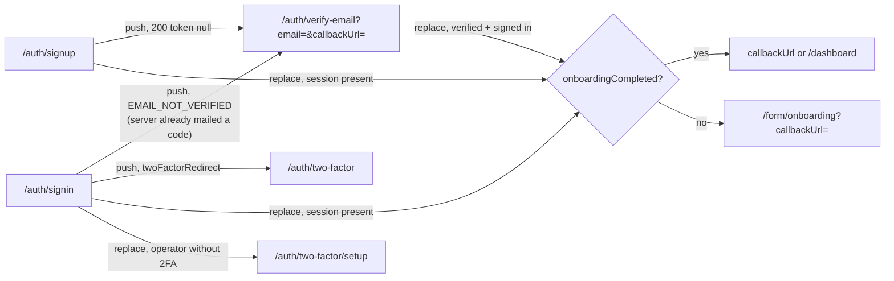

# Auth redirects and navigation

> Read this before touching any `redirect`, `router.push`, `router.replace` or
> `useSession` code in `app/auth/**`, `app/dashboard/**` or `lib/auth-guard.ts`.
> Each rule prevents a user-visible flicker or redirect loop.

## Flow map

## The rules

### Rule 1: leaving `/auth/*` is `router.replace`; stepping within it is `push`

An already-authenticated visitor on sign-in, sign-up, forgot-password or the
verify page is sent on with `router.replace(target)`, and so is the verify page
after a successful code. `push` there would leave `/auth/*` in history, and Back
from the dashboard would remount the page, whose redirect fires again and
bounces forward.

A forward step inside the signed-out flow keeps history so Back returns to the
form: sign-up → `/auth/verify-email?email=…` after a `{ token: null }` answer,
sign-in → `/auth/verify-email?email=…` on `EMAIL_NOT_VERIFIED`, and sign-in →
`/auth/two-factor` on `twoFactorRedirect`. The verify page never sends a code on
load: sign-up and sign-in have already sent one, so it only starts the 60-second
resend cooldown.

The reset-password page also uses `replace`, so the single-use token URL leaves
history.

### Rule 2: decide the destination from `useSession` data, once

`cookieCache` is off (`lib/auth.ts`), so `useSession()` data is read from the
database and is as fresh as what the server guards (`requireOnboarded`,
`requireNotOnboarded` in `lib/auth-guard.ts`) will see. Each auth page has one
effect keyed on the session user that computes the target synchronously and
calls `router.replace` once:

| Session user                              | Target                           |
| ----------------------------------------- | -------------------------------- |
| Operator without 2FA (sign-in only)       | `/auth/two-factor/setup`         |
| `onboardingCompleted`                     | `callbackUrl` or `/dashboard`    |
| Not onboarded                             | `/form/onboarding?callbackUrl=…` |
| On the verify page, `emailVerified` false | Stay and show the code form      |

Compute `callbackUrl` during render (never in delayed state): a target that
changes between two renders fires two navigations and flashes the first one.

### Rule 3: callback URLs go through `safeSameOriginPath()`

`lib/navigation/safe-path.ts` is the only acceptable validator for
user-controlled redirect targets in auth flows, including the `callbackUrl`
threaded through the verify page and the social `errorCallbackURL`.

A naive prefix check (`startsWith("/") && !startsWith("//")`) is **not** safe:
WHATWG URL parsing normalises backslashes in special schemes, so
`/\attacker.example` re-tokenises as scheme-relative and resolves to an external
origin while passing both checks. The validator resolves against a fixed
internal probe origin and rejects any cross-origin result, isomorphically on
server and client.

### Rule 4: refused OAuth callbacks return to the page that started them

`SocialLoginButtons` passes `errorCallbackURL` (the sign-in or sign-up URL with
its `callbackUrl`), so a refused Google or GitHub callback lands back on that
page as `?error=<code>`. Both pages render any code through
`humanizeAuthError` ([errors.md](./errors.md)); an unknown code gets the generic
copy. Only providers with configured credentials render, from the
`SocialProvidersContext` supplied by `app/auth/layout.tsx`.

### Rule 5: dashboard entry points redirect server-side

`app/dashboard/page.tsx` resolves the role or capability home and calls
`redirect()` from the server component, as do the admin and consultee/consultant
`[id]` entry pages. A client stub paints a skeleton, hydrates, then replaces: a
three-frame flash, stretched to seconds by cold starts. Do not reintroduce
"render `<Skeleton/>` + `useEffect(() => router.replace(...))`" pages.

### Rule 6: every route segment keeps a `loading.tsx`

During a cold-boot stall even an instant server redirect takes seconds; without
a boundary the browser holds the previous screen or flashes white. Skeletons
inside shelled segments are content-only (see `CollapsibleSidebarSkeleton`);
never nest a second viewport shell.

### Rule 7: the middleware stays cookie-presence-only

`middleware.ts` checks `getSessionCookie()` existence and nothing more. It does
not validate sessions or redirect cookie-present users off `/auth/*`: a stale
cookie plus edge validation is the classic infinite-loop recipe. Real
validation lives in server guards and layouts.

## Related context

- [`architecture.md`](./architecture.md): the sign-up → verify sequence, the
  session read path and why the cookie cache is off.
- Every dashboard tab switch pays one force-fresh server `getSession` (about
  four Prisma ops), deduped per request by `React.cache`. This is
  revocation-safety insurance; read `lib/auth-server.ts` before changing it.

## Regression checklist for auth and dashboard changes

1. `router.push(` under `app/auth/**` only for the forward steps in Rule 1.
2. One redirect effect per page, keyed on the session user, target computed in
   render.
3. Any user-supplied URL in a redirect goes through `safeSameOriginPath`.
4. New route segment? Add `loading.tsx`.
5. `bash scripts/verify-sso-invariants.sh` passes.
6. Manual: sign up → verify page in the same tab → enter the code → onboarding
   with no intermediate flash; press Back from the dashboard → no bounce
   forward through `/auth/*`.

## Deprecated & Superseded Approaches

- **Force-fresh client re-read.** The auth pages used to call
  `getSession({ query: { disableCookieCache: true } })` before every redirect
  and guard it with a `navigatedRef` keyed on the target
  (`useAuthenticatedRedirectTarget`). With the cookie cache off that read
  returned what `useSession` already held; delete any remaining copy.
- **Link-verification landing.** `/auth/verify-email` used to receive
  BetterAuth's post-click redirect (already signed in, or `?error=` for a bad
  link). It is now the code entry page; delete any `?token=` or link-error
  branch.
- **"Check your email" panel on sign-up.** Replaced by the same-tab hand-off to
  the verify page.
