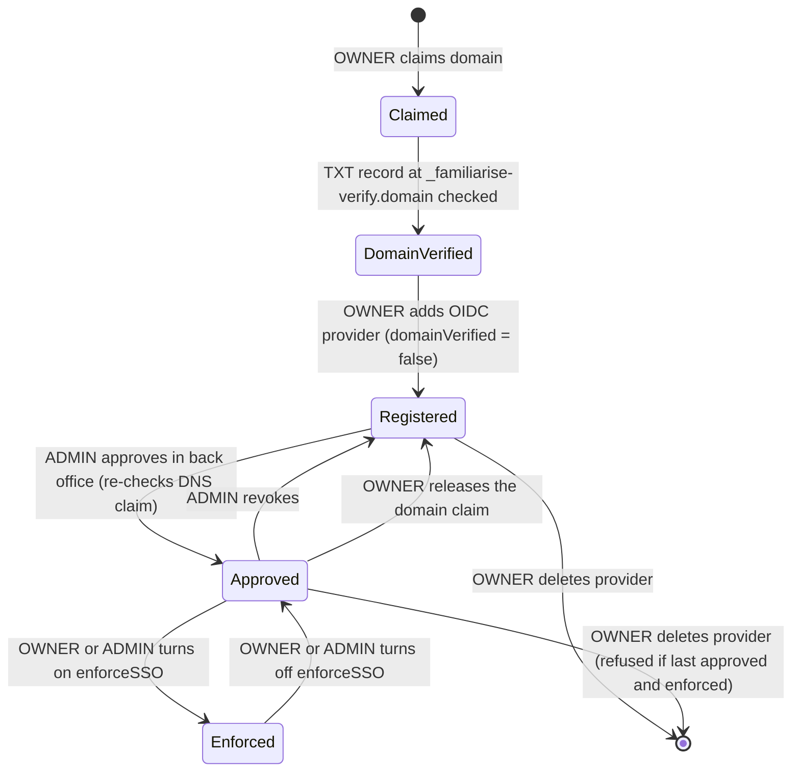

# Enterprise SSO (OIDC)

| Field         | Value                                                                                                                                                                                 |
| ------------- | ------------------------------------------------------------------------------------------------------------------------------------------------------------------------------------- |
| Status        | Live                                                                                                                                                                                  |
| Audience      | Engineers, ADMINs, enterprise support                                                                                                                                                 |
| Last reviewed | 2026-10-01                                                                                                                                                                            |
| Source        | `lib/sso/*`, `lib/prisma-sso-secret-extension.ts`, `app/api/organizations/[orgId]/sso/**`, `app/api/admin/organizations/[orgId]/sso-providers/**`, `scripts/rotate-sso-secret-key.ts` |

An organization can route its users' sign-in through its own identity provider
over **OIDC**. That covers Google Workspace, Microsoft Entra ID and Okta. SAML
and SCIM are not supported.

Three facts carry the security of the design:

1. **A provider only works after platform staff approve it.** The sso() plugin
   runs with `domainVerification.enabled`, so sign-in and the callback refuse
   any provider whose `domainVerified` is false, and the only writer that sets
   it true is the ADMIN approval route.
2. **The domain must be the organization's, proven by DNS.** A provider can
   only be created, and only be approved, for a domain the org has verified
   with a TXT record (`OrgDomainClaim.verifiedAt`).
3. **BetterAuth's own provider endpoints are off.** `/sso/register`, provider
   list/get/update/delete, the plugin's domain-verification endpoints and the
   shared `/sso/callback` are in `disabledPaths` (the per-provider
   `/sso/callback/:providerId` stays); `/sso/saml2/*` answers 404 from
   `hooks.before`. `providersLimit: 0` is the backstop.

## 1. Lifecycle



| Step                 | Route                                                                       | Who                                     | Notes                                                                                                                                                                                        |
| -------------------- | --------------------------------------------------------------------------- | --------------------------------------- | -------------------------------------------------------------------------------------------------------------------------------------------------------------------------------------------- |
| Claim, verify domain | `POST /api/organizations/[orgId]/domain-claims`, `.../[domain]/verify`      | Org OWNER                               | `OrgDomainClaim.domain` is unique: one domain, one org                                                                                                                                       |
| Register provider    | `POST /api/organizations/[orgId]/sso/providers`                             | Org OWNER (`identity.manage`)           | Needs a verified claim (422 otherwise). Server-generated `providerId` (`oidc-<16 hex>`). OIDC discovery runs now, with an SSRF guard                                                         |
| View provider        | `GET /api/organizations/[orgId]/sso/providers[/providerId]`                 | OWNER, MAINTAINER (`identity.read`)     | Client secret redacted for every role. Includes the callback URL                                                                                                                             |
| Approve or revoke    | `POST /api/admin/organizations/[orgId]/sso-providers/[providerId]/approval` | Platform ADMIN (`organizations.manage`) | `{ approve, reason }`, `OpsActionLog` row. Approval re-checks the DNS claim; revoking the last approved provider while enforced is refused (409). Buttons on the back-office org detail page |
| Enforce              | `PATCH /api/organizations/[orgId]/sso` `{ enforceSSO: true }`               | Org OWNER                               | Needs a verified domain **and** at least one approved provider (409)                                                                                                                         |
| Enforce (staff)      | `POST /api/admin/organizations/[orgId]/sso-enforcement`                     | Platform ADMIN (`organizations.manage`) | `{ enforce, reason }`, `OpsActionLog` row. On needs an approved provider (409). Off is the recovery path when the org's IdP breaks                                                           |
| Release domain       | `DELETE /api/organizations/[orgId]/domain-claims/[domain]`                  | Org OWNER                               | Sets `domainVerified = false` on that domain's providers in the same transaction. Refused if it would remove the last approved provider while enforced                                       |
| Delete provider      | `DELETE /api/organizations/[orgId]/sso/providers/[providerId]`              | Org OWNER                               | Refused for the last approved provider while enforced. No PATCH: a config change is delete and recreate                                                                                      |

The IdP is configured with one redirect URI per provider:

```text
${NEXT_PUBLIC_APP_URL}/api/auth/sso/callback/<providerId>
```

`lib/sso/derive-urls.ts` builds it; re-check it against the installed
`@better-auth/sso` on every bump.

## 2. Sign-in and JIT membership

See [architecture.md §5.4](./architecture.md#54-enterprise-sso-oidc-with-jit-membership)
for the sequence.

1. The sign-in page calls `GET /api/auth/sso/domain-check?email=` when the
   email field loses focus. It answers `{ enforceSSO: true, organizationName,
ssoBody }` only when the domain's org enforces SSO and has an approved
   provider; otherwise `{ enforceSSO: false }`. It is limited to 120 an hour
   per IP, because in a loop it would list our enterprise customers.
2. The page calls `authClient.signIn.sso({ providerId, ... })` (through
   `lib/sso/signin-with-toast.ts`), which generates the PKCE pair.
3. On the callback BetterAuth finds or creates the user and an `Account` with
   `providerId = SsoProvider.providerId`. `account.create.before` and
   `session.create.before` refuse STAFF and ADMIN users. `user.create.before`
   and `account.create.before` refuse, with `SSO_EMAIL_DOMAIN_MISMATCH`, an
   email whose domain is not the approved provider's own
   (`lib/sso/account-domain.ts`), so an IdP cannot claim an outside address
   such as a gmail.com one before its owner signs up.
4. The plugin's `provisionUser` hook (`lib/sso/plugin-options.ts`) calls
   `provisionSsoMembership` (`lib/sso/jit-membership.ts`) on **every** login.
   It writes the typed `Membership` for the provider's organization with
   `OrganizationSSOSettings.defaultRoleForAutoJoin`, after the org-status and
   seat-cap gates, inside a transaction, and does nothing if a membership
   already exists. A join refused for lack of a seat succeeds on a later login
   once a seat frees up.
5. A JIT-created user has no DPDP consent rows (`user.create.after` skips
   `/sso/*` paths); the first visit to the org shows the consent step.

The BetterAuth organization plugin and its `Member` table are not installed,
and the plugin's own `organizationProvisioning` is disabled.

## 3. Enforcement

`session.create.before` calls `shouldRejectSession`
(`lib/sso/enforce-session.ts`) on every session creation: password, social,
SSO, verification and password change. When all of these hold:

- the user's email domain has a verified `OrgDomainClaim`,
- the owning org is `ACTIVE` and has `enforceSSO = true`, and
- the org has at least one approved provider,

the session is minted only by `/sso/callback/:providerId` for one of that
org's approved providers. Every other path is refused with `SSO_REQUIRED`,
whatever accounts the user has linked. The sign-in page shows the copy with a
button that runs the domain check and starts SSO; a refused Google sign-in
returns to the page with `?error=SSO_REQUIRED` for the same button.

If the enforcing org has no approved provider, enforcement fails open so
nobody is locked out with nowhere to go. Both the org settings route and the
staff door refuse to turn enforcement on in that state, and revoking or
deleting the last approved provider is refused while it is on.

**Recovery when the IdP breaks.** The org's users cannot sign in at all, and
an OWNER on that domain cannot reach the settings page either. An ADMIN turns
enforcement off with **Stop enforcing SSO** on the back-office org page; the
users can then sign in with a password (or **Forgot password**) or Google.

## 4. Client secret encryption

The whole `oidcConfig` JSON, client secret included, is stored as an AES-256-GCM
envelope (`lib/sso/secret-crypto.ts`):

```text
sso:v1:<kid>:<iv>:<tag>:<ciphertext>
```

- The key is `AUTH_CONFIG_ENCRYPTION_KEY`, 64 hex characters
  (`openssl rand -hex 32`), separate from every other key. Creating a provider
  without a usable key fails with `SSO_ENCRYPTION_KEY_MISSING`.
- `kid` is the first 8 hex characters of SHA-256 of the key. It names the key
  without revealing it, so a row under a key the deployment lacks reads as
  `key_unavailable` (our fault) rather than `auth_failed` (a tampered row).
- Every reader, the sso() plugin included, gets plaintext through a Prisma
  result extension (`lib/prisma-sso-secret-extension.ts`); the plugin has no
  decrypt hook of its own. There is no plaintext fallback.
- The secret is write-only: no route returns it to any role.

**Rotation** (runbook: [SSO secret key rotation](../enterprise/50-operations/02-runbooks.md#sso-secret-key-rotation)):

1. Set the new key as `AUTH_CONFIG_ENCRYPTION_KEY` and the old one as
   `AUTH_CONFIG_ENCRYPTION_KEY_PREVIOUS`; redeploy. Both keys now decrypt.
2. Run `npx tsx -r dotenv/config scripts/rotate-sso-secret-key.ts` against
   the environment. It re-encrypts every provider under the new key.
3. When it reports `Re-encrypted N of N` and exits 0, remove
   `AUTH_CONFIG_ENCRYPTION_KEY_PREVIOUS` and redeploy.

## 5. Failure answers

| Symptom                          | Code                         | Cause and fix                                                                                   |
| -------------------------------- | ---------------------------- | ----------------------------------------------------------------------------------------------- |
| "Your organization requires SSO" | `SSO_REQUIRED`               | Working as designed; the user must use the org's IdP                                            |
| Provider settings cannot be read | `SSO_PROVIDER_MISCONFIGURED` | `key_unavailable`: restore the key. Anything else: the OWNER deletes and recreates the provider |
| IdP did not answer               | `SSO_PROVIDER_UNREACHABLE`   | The customer's IdP is down or slow; retry                                                       |
| Registration fails at discovery  | `OIDC_DISCOVERY_FAILED`      | Wrong issuer or discovery URL, or the IdP blocks us; the response names the reason              |
| Provider never signs anyone in   | none                         | Not approved yet. Approve it from the back-office org page                                      |

## 6. Tests

`__tests__/sso/` covers the OIDC round trip through the real plugin config
(`oidc-round-trip.test.ts`), the approval door, domain truth, enforcement, JIT,
provider schemas, secret crypto and redaction. `scripts/verify-sso-invariants.sh`
holds static checks (PKCE client call, `SsoProvider.userId` never set).

## 7. Open items

| #   | Item                                                                                                                                    |
| --- | --------------------------------------------------------------------------------------------------------------------------------------- |
| 1   | The sign-in page starts SSO only for enforced domains. An org with an approved provider but `enforceSSO = false` has no SSO button yet. |
| 2   | SAML. The `samlConfig` column is kept nullable so adding it later is additive.                                                          |
| 3   | SCIM deprovisioning. Today a user removed at the IdP keeps their session until it expires or an org admin removes the membership.       |
