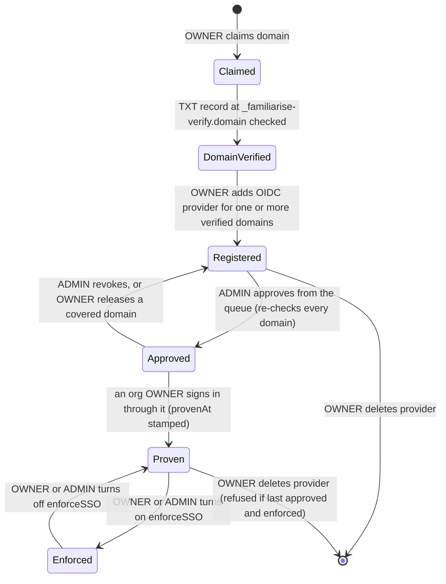
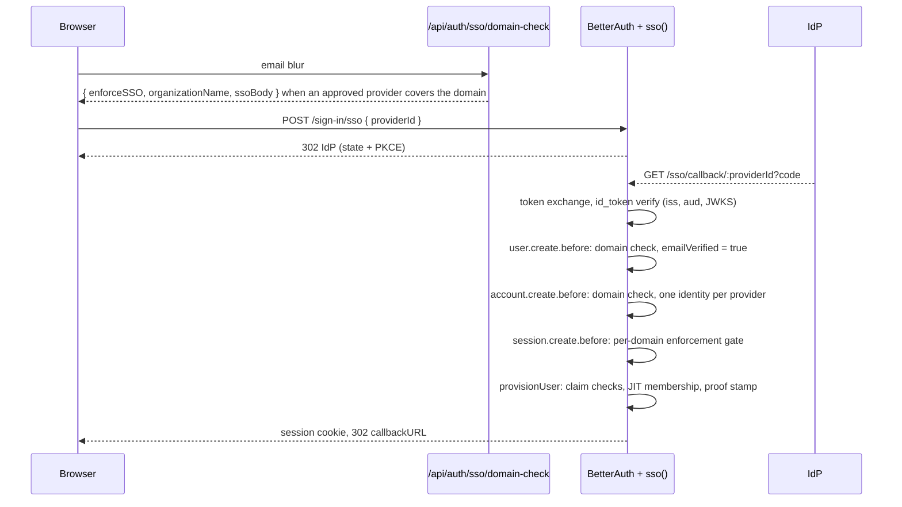

# Enterprise SSO (OIDC)

| Field         | Value                                                                                                                                                                                 |
| ------------- | ------------------------------------------------------------------------------------------------------------------------------------------------------------------------------------- |
| Status        | Live                                                                                                                                                                                  |
| Audience      | Engineers, ADMINs, enterprise support                                                                                                                                                 |
| Last reviewed | 2026-10-09                                                                                                                                                                            |
| Versions      | `better-auth` 1.7.7, `@better-auth/sso` 1.7.7                                                                                                                                         |
| Source        | `lib/sso/*`, `lib/prisma-sso-secret-extension.ts`, `app/api/organizations/[orgId]/sso/**`, `app/api/admin/organizations/[orgId]/sso-providers/**`, `scripts/rotate-sso-secret-key.ts` |

An organization can route its users' sign-in through its own identity provider
over **OIDC**. That covers Google Workspace, Microsoft Entra ID and Okta. SAML
and SCIM are not supported.

Five facts carry the security of the design:

1. **A provider only works after platform staff approve it.** The sso() plugin
   runs with `domainVerification.enabled`, so sign-in and the callback refuse
   any provider whose `domainVerified` is false. The ADMIN approval route is
   the only writer that sets it true.
2. **Every domain a provider covers is the org's, proven by DNS.** A provider
   covers one or more of the org's verified domains (`OrgDomainClaim.verifiedAt`).
   This is checked at create, at PATCH, at approval, and again on every account
   link.
3. **The IdP must vouch for the email.** `provisionUser` runs on every login
   and reads the verified id_token. `email_verified` must be true. Google must
   send an `hd` that is a covered domain. Entra must send `xms_edov` true.
4. **Enforcement is per domain and needs proof.** A domain is enforced only when
   its org enforces SSO and an approved provider covers that domain, and only
   once an org OWNER has signed in through that provider.
5. **BetterAuth's own provider endpoints are off.** `disabledPaths` covers
   `/sso/register`, the provider list/get/update/delete endpoints, the plugin's
   domain-verification endpoints and the shared `/sso/callback`. The
   per-provider `/sso/callback/:providerId` stays. `/sso/saml2/*` answers 404
   from `hooks.before`, and `providersLimit: 0` is the backstop.

## 1. Lifecycle



| Step                 | Route                                                                       | Who                                     | Notes                                                                                                                                                                                                          |
| -------------------- | --------------------------------------------------------------------------- | --------------------------------------- | -------------------------------------------------------------------------------------------------------------------------------------------------------------------------------------------------------------- |
| Claim, verify domain | `POST /api/organizations/[orgId]/domain-claims`, `.../[domain]/verify`      | Org OWNER                               | A verified domain belongs to one org. Verifying a domain that an enforcing org already covers signs out that domain's users, except the caller                                                                 |
| Register provider    | `POST /api/organizations/[orgId]/sso/providers`                             | Org OWNER (`identity.manage`)           | Body `{ domains[], issuer, providerType: "oidc", oidcConfig: { clientId, clientSecret, discoveryEndpoint } }`. Each domain must be a verified claim and uncovered by another provider (422/409). Emails ADMINs |
| View provider        | `GET /api/organizations/[orgId]/sso[/providers[/providerId]]`               | OWNER, MAINTAINER (`identity.read`)     | The list never decrypts the config. The secret is redacted for every role. The callback URL is built from `BETTER_AUTH_URL`                                                                                    |
| Update provider      | `PATCH /api/organizations/[orgId]/sso/providers/[providerId]`               | Org OWNER                               | `{ clientSecret?, domains? }`. Rotates the secret in place: same `providerId`, re-encrypted, audited (`SSO_PROVIDER_UPDATED`), no re-approval. CAS on `updatedAt` (409)                                        |
| Approve or revoke    | `POST /api/admin/organizations/[orgId]/sso-providers/[providerId]/approval` | Platform ADMIN (`organizations.manage`) | `{ approve, reason }`, `OpsActionLog` row. Approval needs a verified claim for every covered domain. Emails the org's OWNERs after commit                                                                      |
| Enforce              | `PATCH /api/organizations/[orgId]/sso` `{ enforceSSO: true }`               | Org OWNER                               | Needs an approved provider (409) that is proven (409 `SSO_NOT_PROVEN`). Signs out everyone on the enforced domains, members or not, except the caller                                                          |
| Enforce (staff)      | `POST /api/admin/organizations/[orgId]/sso-enforcement`                     | Platform ADMIN (`organizations.manage`) | Same preconditions. Off is the recovery path when the org's IdP breaks                                                                                                                                         |
| Release domain       | `DELETE /api/organizations/[orgId]/domain-claims/[domain]`                  | Org OWNER                               | Unapproves every provider that covers the domain, in the same transaction. Refused if that would remove the last approved provider while enforced                                                              |
| Delete provider      | `DELETE /api/organizations/[orgId]/sso/providers/[providerId]`              | Org OWNER                               | Refused for the last approved provider while enforced. Issuer or client id changes mean delete and recreate                                                                                                    |

The **Pending SSO approvals** queue is shown at the top of the back-office
Organizations page (`readPendingSsoApprovals` in `lib/backoffice/org-detail.ts`).
Each row links to the org detail page, which has the Approve and Revoke
buttons.

The IdP is configured with one redirect URI per provider:

```text
${BETTER_AUTH_URL}/api/auth/sso/callback/<providerId>
```

`lib/sso/derive-urls.ts` builds it on the server from the same base URL the
plugin uses. Re-check the path against the installed `@better-auth/sso` on
every version bump.

PKCE is always on and the scopes are fixed to `openid email profile`. The
create body has no field for either.

### Provider domains

`SsoProvider.domain` stores a sorted, comma-separated list
(`lib/sso/domains.ts`), which is the shape the plugin itself parses for
multi-domain providers. One Entra tenant with several UPN suffixes is one
provider. The DB keeps `@@unique([organizationId, domain])`.
`lib/sso/provider-coverage.ts` also keeps the lists disjoint within an org.

## 2. Sign-in, claim checks and JIT membership



1. **Discovery.** `GET /api/auth/sso/domain-check?email=` returns `ssoBody`
   whenever an approved provider covers the domain, enforced or not.
   `enforceSSO` says whether the password form is hidden. When it is false, the
   sign-in page shows a "Sign in with <org> SSO" button next to the password
   form. The middleware limits the endpoint to 1000 an hour per IP.
2. **Domain checks** (`lib/sso/account-domain.ts`). `user.create.before` and
   `account.create.before` refuse an email with `SSO_EMAIL_DOMAIN_MISMATCH`
   when its domain is not covered by the approved provider, or when the org no
   longer holds a verified claim for it. `account.create.before` also refuses a
   second `Account` with the same `providerId` for one user
   (`SSO_ACCOUNT_ALREADY_LINKED`).
3. **Verified users.** `user.create.before` on `/sso/*` returns
   `emailVerified: true`. The approved provider and the covered domain are the
   trust basis. This lets BetterAuth link the account on a later login.
4. **Claim checks** (`lib/sso/idp-claims.ts`). These run in `provisionUser` on
   every login, against the plugin-verified id_token:

   | Issuer                                                 | Requirement                                                               | Refusal                      |
   | ------------------------------------------------------ | ------------------------------------------------------------------------- | ---------------------------- |
   | any                                                    | an id_token is present and readable                                       | `SSO_ID_TOKEN_MISSING`       |
   | `login.microsoftonline.com`, `sts.windows.net` (Entra) | `xms_edov` is true, or `email_verified` is true when `xms_edov` is absent | `SSO_EMAIL_NOT_VERIFIED`     |
   | `accounts.google.com`                                  | `email_verified` is true and `hd` is one of the provider's domains        | `SSO_HOSTED_DOMAIN_MISMATCH` |
   | every other issuer                                     | `email_verified` is true                                                  | `SSO_EMAIL_NOT_VERIFIED`     |

   Entra tenants must add the `xms_edov` optional claim to the ID token in the
   app registration. A refusal deletes the `Account` the login just linked, so
   a refused identity cannot block the real one. The session row written
   before `provisionUser` gets no cookie.

5. **JIT** (`lib/sso/jit-membership.ts`). This runs after the claim checks.
   It writes the typed `Membership`, after the org-status and seat-cap gates,
   in a Serializable transaction. A PENDING, unexpired `Invitation` for the
   email and org supplies the role, and is CAS-marked ACCEPTED in the same
   transaction. Otherwise the role is `defaultRoleForAutoJoin` (LEARNER). Any
   existing membership row, REMOVED and SUSPENDED included, is left alone.
6. **Proof** (`lib/sso/provider-proof.ts`). When the signed-in user is an
   ACTIVE OWNER of the provider's org, the provider gets `provenAt` and
   `provenByUserId`. This is a CAS on `provenAt IS NULL`, so it happens once.
7. A JIT-created user has no DPDP consent rows (`user.create.after` skips
   `/sso/*` paths). The onboarding gate collects consent.

The BetterAuth organization plugin and its `Member` table are not installed,
and the plugin's own `organizationProvisioning` is disabled.

## 3. Enforcement and deprovisioning

`session.create.before` calls `assertSsoSessionAllowed`
(`lib/sso/enforce-session.ts`) on every session creation: password, social,
SSO, verification and password change. A user's email domain is **enforced**
when all of these hold:

- it has a verified `OrgDomainClaim`,
- the owning org is `ACTIVE` and has `enforceSSO = true`, and
- an approved provider covers that domain, and at least one covering provider
  is proven.

For an enforced domain, the session is minted only by
`/sso/callback/:providerId` of a provider that covers it. Every other path is
refused with `SSO_REQUIRED`, whatever accounts the user has linked. The refusal
writes an `SSO_SIGN_IN_REFUSED` row to `OrgAuditLog`
(`lib/sso/refusal-audit.ts`). So does `SSO_EMAIL_DOMAIN_MISMATCH`. The log keeps
at most one row per email, code and hour.

Every other domain fails open. This includes a second verified domain that no
provider covers, so a multi-domain org cannot lock out the users of a domain it
has not wired up.

**Session sweeps** (`lib/sso/session-sweeps.ts`, through
`lib/auth/session-revoke.ts`). All of these run in the caller's transaction:

| Trigger                                                        | Sessions ended                                                                    |
| -------------------------------------------------------------- | --------------------------------------------------------------------------------- |
| Enforce-on (org route or staff door)                           | Every user whose email is on an enforced domain, member or not, except the caller |
| Domain verified, or domain added to a provider, while enforced | Every user on that domain, except the caller                                      |
| Member removed by an admin, or suspended                       | That user's sessions, when their email is on one of the org's verified domains    |

Self-leave does not end the leaver's sessions. Removing an outside identity,
such as a gmail.com expert, does not sign them out of their personal use.

**Recovery when the IdP breaks.** The org's users cannot sign in, and an OWNER
on that domain cannot reach the settings page either. An ADMIN turns
enforcement off with **Stop enforcing SSO** on the back-office org page. Users
can then sign in with a password (or **Forgot password**) or Google.

## 4. Client secret encryption

The whole `oidcConfig` JSON, client secret included, is stored as an AES-256-GCM
envelope (`lib/sso/secret-crypto.ts`):

```text
sso:v1:<kid>:<iv>:<tag>:<ciphertext>
```

- The key is `AUTH_CONFIG_ENCRYPTION_KEY`: 64 hex characters
  (`openssl rand -hex 32`), separate from every other key. Creating a provider
  or rotating a secret without a usable key fails with
  `SSO_ENCRYPTION_KEY_MISSING`.
- `kid` is the first 8 hex characters of the key's SHA-256. It names the key
  without revealing it.
- Every reader, the sso() plugin included, gets plaintext through a Prisma
  result extension (`lib/prisma-sso-secret-extension.ts`). There is no
  plaintext fallback. The settings list does not select the column.
- The secret is write-only: no route returns it to any role.

**IdP client secret rotation.** The OWNER clicks the key icon on the provider
row, which calls PATCH `{ clientSecret }`.

**Encryption key rotation** (runbook: [SSO secret key rotation](../enterprise/50-operations/02-runbooks.md#sso-secret-key-rotation)):

1. Set the new key as `AUTH_CONFIG_ENCRYPTION_KEY` and the old one as
   `AUTH_CONFIG_ENCRYPTION_KEY_PREVIOUS`, then redeploy.
2. Run `npx tsx -r dotenv/config scripts/rotate-sso-secret-key.ts`.
3. When it reports `Re-encrypted N of N`, remove the previous key and redeploy.

## 5. Notifications and rate limits

| Event                     | Recipients              | Sender                                                       |
| ------------------------- | ----------------------- | ------------------------------------------------------------ |
| Provider registered       | Every platform ADMIN    | `sendSsoProviderSubmittedEmail` (`lib/email/senders/sso.ts`) |
| Provider approved/revoked | The org's ACTIVE OWNERs | `sendSsoProviderDecisionEmail`                               |

Both senders go through `deliver()`, so the pre-launch guard applies.

The limits are per IP, sized for an office behind one NAT address:
`/sign-in/sso` 300 per 15 minutes and `/sso/callback/*` 1000 per 15 minutes
(state and PKCE are single-use), in `lib/auth/rate-limit.ts`. Domain-check is
1000 per hour, in `lib/rate-limit.ts`.

## 6. Failure answers

| Symptom                          | Code                         | Cause and fix                                                                                   |
| -------------------------------- | ---------------------------- | ----------------------------------------------------------------------------------------------- |
| "Your organization requires SSO" | `SSO_REQUIRED`               | Working as designed; the user must use the org's IdP. The org audit log has a row               |
| Personal Google account refused  | `SSO_HOSTED_DOMAIN_MISMATCH` | Use the Workspace account                                                                       |
| Entra user refused               | `SSO_EMAIL_NOT_VERIFIED`     | Add the `xms_edov` optional claim to the app registration's ID token                            |
| Enforce-on answers 409           | `SSO_NOT_PROVEN`             | An org OWNER signs in once through the approved provider                                        |
| Provider settings cannot be read | `SSO_PROVIDER_MISCONFIGURED` | `key_unavailable`: restore the key. Anything else: the OWNER deletes and recreates the provider |
| Registration fails at discovery  | `OIDC_DISCOVERY_FAILED`      | Wrong issuer or discovery URL, or the IdP blocks us; the response names the reason              |
| Provider never signs anyone in   | none                         | Not approved yet. It is in the back-office Pending SSO approvals queue                          |

## 7. Tests and open items

`__tests__/sso/` covers the OIDC round trip through the real plugin config,
including an `email_verified=false` refusal (`oidc-round-trip.test.ts`). It also
covers the claim checks (`idp-claims.test.ts`), per-domain and multi-domain
enforcement (`enforce-session.test.ts`), prove-before-enforce, proof stamping
and secret rotation (`provider-lifecycle.test.ts`), and session sweeps,
including non-member revocation and membership deprovisioning
(`session-sweeps.test.ts`). The remaining files cover JIT with invitation roles,
the approval and enforcement doors, domain-check, schemas, crypto and redaction.

| #   | Item                                                                                                                    |
| --- | ----------------------------------------------------------------------------------------------------------------------- |
| 1   | SAML: use the plugin's native SAML when a signed deal needs it. The `samlConfig` column stays nullable                  |
| 2   | SCIM and an IdP liveness sweep. Today deprovisioning is membership removal or suspension, plus the session lifetime cap |
| 3   | OIDC `nonce` (plugin), periodic DNS re-verification of claims, and an AAD-bound `sso:v2` envelope                       |
| 4   | A provider proven after enforcement is already on starts enforcing its domains without sweeping their existing sessions |

## Deprecated & Superseded Approaches

- **Org-wide enforcement.** This enforced every verified domain whenever any approved provider existed, which locked out the users of an uncovered second domain. Per-domain coverage replaced it.
- **One provider per domain.** This was compared with `provider.domain` by exact match. It was replaced by the comma-separated domain list.
- **Delete-and-recreate to change a secret.** This changed the `providerId` and so needed re-approval. It was replaced by PATCH.
- **Ignoring the IdP's `email_verified`** (`trustEmailVerified` unset) and creating SSO users unverified. This was replaced by the claim checks and `emailVerified: true` on create.
- **SAML, SCIM, break-glass and the BetterAuth organization plugin.** All were removed earlier. If you find any of their code, delete it.
- **`lib/sso/signin-with-toast.ts` and `scripts/verify-sso-invariants.sh`.** Neither file exists. Delete any remaining references.
