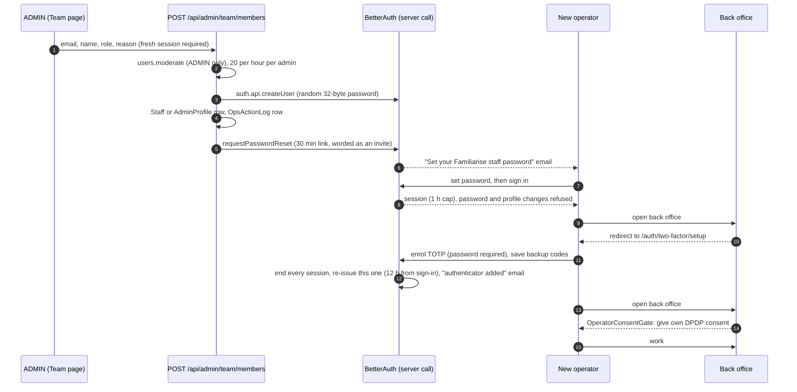

# Staff onboarding, sign-in and recovery

| Field         | Value                                                                                                                                                                                                                                                   |
| ------------- | ------------------------------------------------------------------------------------------------------------------------------------------------------------------------------------------------------------------------------------------------------- |
| Status        | Live                                                                                                                                                                                                                                                    |
| Audience      | Engineers, ADMINs, on-call                                                                                                                                                                                                                              |
| Last reviewed | 2026-10-10                                                                                                                                                                                                                                              |
| Source        | `lib/auth/operators.ts`, `lib/auth/operator-session-policy.ts`, `lib/auth/two-factor-policy.ts`, `lib/auth/passkey-policy.ts`, `lib/auth/step-up.ts`, `app/api/admin/team/members/**`, `scripts/bootstrap-admin.ts`, `lib/auth.ts`, `lib/auth-guard.ts` |

An **operator** is a user with role `STAFF` or `ADMIN`. Operators can read
customer data and move money, so they get a stricter regime than consumers:

| Rule                 | Operators                                                           | Consumers                                   |
| -------------------- | ------------------------------------------------------------------- | ------------------------------------------- |
| Sign-in methods      | Email + password + authenticator code, or a registered passkey      | Password, Google, GitHub, SSO               |
| Second factor        | Mandatory TOTP and 10 single-use backup codes; optional passkeys    | None                                        |
| Sensitive actions    | Re-authenticate within 15 minutes: password + TOTP code, or passkey | Re-authenticate within 15 minutes: password |
| Session lifetime     | 12 h from sign-in, ended by 2 idle hours; 1 h until 2FA is enrolled | 30 days, sliding                            |
| Linked social or SSO | Refused                                                             | Allowed (verified emails only)              |
| Created by           | An ADMIN on the Team page, or the bootstrap script                  | Self sign-up                                |

## 1. Onboarding



1. **Add.** An ADMIN opens the Team page and uses **Add staff** (email, name,
   role, and an audit reason of at least five characters).
   `POST /api/admin/team/members` is gated on `users.moderate` (ADMIN only),
   needs a fresh session (§4), is limited to 20 an hour per admin
   (`platform.staff-create`), and is written to `OpsActionLog`. An address that
   already has an account answers 409.
2. **Create.** `createOperator()` (`lib/auth/operators.ts`) calls
   `auth.api.createUser` server-side with no headers. The account gets a random
   password nobody sees, `emailVerified` and `onboardingCompleted`, and a
   linked `StaffProfile` or `AdminProfile`. It is the only way an operator is
   created.
3. **Invite.** The route sends BetterAuth's password-reset link. While the
   operator has no second factor, the email is worded as an invitation. The link
   is single-use and lasts 30 minutes. If it lapses, the ADMIN uses **Resend
   setup link** on the row (`POST /api/admin/team/members/{id}/setup-link`, same
   budget), or the operator uses **Forgot password**.
4. **Enrol.** On first sign-in every back-office page redirects to
   `/auth/two-factor/setup`, every operator API answers 428
   `TWO_FACTOR_REQUIRED`, and routes that read `getSession()` directly treat
   the operator as signed out (401). Until enrolment, `/change-password`,
   `/change-email` and `/update-user` answer 403 `TWO_FACTOR_REQUIRED`, so a
   password alone cannot lock the real person out. Enrolment needs the password
   (`allowPasswordless` is off), shows a QR code and the secret, verifies one
   code, then shows the backup codes once.
5. **Seal.** The `verify-totp` call that flips `twoFactorEnabled` ends every
   session of the operator (`user.update.after` with `isTwoFactorEnrolment` in
   `lib/auth/two-factor-policy.ts`) and the plugin issues the enrolling device a
   new one, so a session opened with the password alone never inherits the
   second factor. The operator gets an "authenticator
   added" email.
6. **Consent.** Nobody consents on an operator's behalf: `user.create.after`
   skips the signup consent rows and the consumer welcome email for
   `/admin/create-user`. The back-office layout shows `OperatorConsentGate`
   until the operator has given their own consent (`POST /api/user/consent`).

### Backup codes

Ten codes in a confusable-free lowercase alphabet (no `0/o`, `1/l/i`). The
`TwoFactor.backupCodes` column holds them as a JSON array, AES-encrypted with
`BETTER_AUTH_SECRET`, like the TOTP secret. They are **not hashed**: the
twoFactor plugin's storage hook can only encrypt and decrypt. Each code works
once. Regenerating them needs a fresh session and sends a "backup codes
regenerated" email; using one sends a "backup code used" email with the number
left.

### The first admin

```bash
npx tsx -r dotenv/config scripts/bootstrap-admin.ts \
  --email you@example.com --name "Your Name" [--print-link]
```

The script uses the same `createOperator()` path and refuses once any ADMIN
exists. `--print-link` prints the set-password link instead of emailing it, for
local development; it is refused when `NODE_ENV=production`. There is no
public setup page.

Email domain is never an authorization key: staff use a mix of personal and
company addresses, so there is no domain allowlist and no SSO for operators.

## 2. Sign-in

See [architecture.md §5.3](./architecture.md#53-staff-sign-in-password-plus-totp-or-a-passkey)
for the sequence. The rules:

- `session.create.before` allows an operator session only on
  `/sign-in/email`, `/two-factor/verify-totp`,
  `/two-factor/verify-backup-code`, `/passkey/verify-authentication` and
  `/change-password`. Anything else (Google, GitHub, SSO, email verification,
  any future plugin) is refused with `STAFF_PASSWORD_SIGN_IN_ONLY`.
- `account.create.before` refuses to link a social or SSO account to an
  operator, so there is no second way in to keep refusing.
- Trusted devices are refused (`TRUST_DEVICE_DISABLED`): every password
  sign-in asks for a code.
- Two lockouts bound code guessing. One challenge allows 5 wrong codes, then
  the pending cookie is void (`TOO_MANY_ATTEMPTS_REQUEST_NEW_CODE`) and the
  operator signs in again. Ten consecutive wrong codes across challenges lock
  2FA verification for 15 minutes (`ACCOUNT_TEMPORARILY_LOCKED`) and send a
  lockout email. The per-IP limit on `/two-factor/verify-*` is 5 a minute.
- The challenge page (`/auth/two-factor`) explains an exhausted or expired
  challenge and offers **Sign in again**. If another tab has already finished
  the challenge, it goes straight to the destination.
- The session ends 12 hours after sign-in, or after 2 hours without a
  request, whichever comes first (`lib/auth/session-lifetime.ts`). A password
  change or 2FA enrolment does not restart the 12 hours.

## 3. Passkeys

Passkeys (`@better-auth/passkey`) are an extra, phishing-resistant way for an
operator to sign in. TOTP and backup codes stay mandatory as the recovery
factor.

- **Who.** Only an operator who has already enrolled TOTP may register one
  (`assertOperatorMayRegisterPasskey`, `PASSKEY_OPERATORS_ONLY`). Registration
  needs a fresh session and never mints a session itself.
- **Where.** Back-office **Settings** → `TwoFactorSettings` lists, adds,
  renames and deletes passkeys. Adding one sends a "passkey added" email.
- **Sign-in.** **Sign in with a passkey** on `/auth/signin`. User verification
  (device PIN or biometrics) is required on every ceremony
  (`PASSKEY_USER_VERIFICATION_REQUIRED`), and the sign-in is refused if the
  owner is no longer an enrolled operator. It satisfies the operator 2FA gate
  with no TOTP prompt.
- **Reset.** An admin 2FA reset deletes every passkey of the operator.

## 4. Step-up (re-authentication)

A session is **fresh** for 15 minutes from the later of `Session.createdAt` and
`Session.reauthenticatedAt` (`isFreshSession` in `lib/auth/step-up.ts`). A
gated action on a stale session answers 403 `REAUTH_REQUIRED`;
`<ReauthDialog>` (via `fetchWithReauth` / `withReauth` in
`lib/auth/reauth-client.ts`) asks the operator to confirm, then retries the
original call once.

`POST /api/user/reauthenticate` stamps `reauthenticatedAt` on the current
session. An operator gives the password **and** a TOTP code. An operator with
a passkey may instead sign in again with it: the new session is fresh by
creation. Consumers and consultants give their password; accounts with no
password (`NO_PASSWORD`, 409) are told to sign in again. The route is rate
limited per user (5 per 15 minutes).

Gated for operators:

| Surface                           | Actions                                                                                                        |
| --------------------------------- | -------------------------------------------------------------------------------------------------------------- |
| BetterAuth (`hooks.before`)       | `/two-factor/generate-backup-codes`, `/change-password`, `/change-email`, `/passkey/generate-register-options` |
| `withOpsAction({ stepUp: true })` | Team: add, suspend, reactivate, resend setup link, reset 2FA                                                   |
| `withOpsAction({ stepUp: true })` | Refunds and credits, payout override, SSO provider approval and enforcement                                    |
| `requireFreshSession`             | Back-office payout processing and refund routes                                                                |

The same window guards consumer and consultant account deletion and payout
writes; see [architecture.md §5.5](./architecture.md#55-step-up-re-authentication).

## 5. Team page actions

All are ADMIN-only (`users.moderate`), take a reason, need a fresh session,
and write an `OpsActionLog` row. Any operator can view the roster
(`team.read`).

| Action            | Shown when                  | Route                                             | Effect                                                                                                                                                                                             |
| ----------------- | --------------------------- | ------------------------------------------------- | -------------------------------------------------------------------------------------------------------------------------------------------------------------------------------------------------- |
| Add staff         | Always                      | `POST /api/admin/team/members`                    | §1                                                                                                                                                                                                 |
| Resend setup link | Not enrolled, not suspended | `POST /api/admin/team/members/{id}/setup-link`    | New 30-minute set-password link                                                                                                                                                                    |
| Suspend           | Not yourself, not suspended | `PATCH /api/admin/team/members/{id}` `suspend`    | `banned` + `banExpires` (1 to 365 days, required) and **every session deleted**, in one transaction. Refuses the last active ADMIN                                                                 |
| Reactivate        | Suspended                   | `PATCH /api/admin/team/members/{id}` `reactivate` | Clears the ban                                                                                                                                                                                     |
| Reset 2FA         | Enrolled, not yourself      | `DELETE /api/admin/team/members/{id}/two-factor`  | In one transaction: deletes the TwoFactor row and passkeys, clears `twoFactorEnabled`, replaces the password with random bytes, deletes every session. Then emails a setup link and a reset notice |

Reset refuses the caller's own account (403 `SELF_RESET_FORBIDDEN`), so an
ADMIN cannot use it to drop their own second factor.

Runbooks: [staff off-boarding](../enterprise/50-operations/02-runbooks.md#staff-off-boarding)
and [lost authenticator](../enterprise/50-operations/02-runbooks.md#lost-authenticator-admin-2fa-reset).

## 6. Recovery

| Situation                             | What happens                                                                                                                             |
| ------------------------------------- | ---------------------------------------------------------------------------------------------------------------------------------------- |
| Forgot password                       | **Forgot password** on the sign-in page. The reset deletes every session; the authenticator and passkeys are unchanged                   |
| Lost authenticator, has a passkey     | Sign in with the passkey, then use a backup code or ask an ADMIN to reset; the TOTP secret cannot be re-shown                            |
| Lost authenticator, has a backup code | "Use a backup code" on `/auth/two-factor`. Each code works once; back-office **Settings** generates a fresh set                          |
| Lost authenticator and backup codes   | Another ADMIN confirms identity out of band, then **Reset 2FA**. The operator sets a new password from the emailed link and enrols again |
| The only ADMIN is locked out          | No in-app path. An engineer with database access clears the `TwoFactor` row, passkeys and `twoFactorEnabled` for that user               |

Because a reset rotates the password and sends the setup link to the
operator's mailbox, re-enrolment needs the mailbox, not the old password, which
may be what was compromised.

## 7. What is switched off

- **Admin plugin HTTP endpoints.** All `/admin/*` endpoints are in
  `disabledPaths`. `__tests__/security/admin-plugin-fenced.test.ts` reads the
  list from the installed plugin, so a new endpoint fails the test.
- **`/two-factor/get-totp-uri`.** Disabled: session plus password would hand a
  session thief the TOTP secret. Enrolment shows the URI from `/two-factor/enable`.
- **Impersonation.** Off. Support reads a customer's data through the back
  office. `Session.impersonatedBy` stays in the schema, unused.
- **Staff permissions inside BetterAuth.** `staffAc` grants only
  `user: list, get`; no `session` or `set-role` permissions.
- **Self-service 2FA removal** for operators (`/two-factor/disable` answers 403).
- **2FA for everyone else.** `/two-factor/enable` answers 403
  `TWO_FACTOR_OPERATORS_ONLY` for consumers and consultants.

## 8. Open items

| #   | Item                                                                                                                                             |
| --- | ------------------------------------------------------------------------------------------------------------------------------------------------ |
| 1   | Suspension is time-boxed (365 days at most) and lifts itself at the next sign-in after `banExpires`. There is no permanent off-boarding action.  |
| 2   | Recovering the last ADMIN needs database access.                                                                                                 |
| 3   | TOTP codes can be replayed within their ~90 s window; accepted, see [rate-limiting-and-abuse.md](./rate-limiting-and-abuse.md#7-accepted-risks). |

## 7. Two-factor is mandatory, and what that means for seeds and QA

Two-factor authentication is a deliberate, standing requirement for every `STAFF` and `ADMIN` account. There is no "skip for now" and no grace period, and customers and experts never meet a 2FA wall. The reasoning is blast radius: one operator session can read every customer's contact details and support transcripts and can issue refunds, hold earnings, remove reviews and ban accounts, while a customer session exposes only that customer's own data. Passwords alone are the usual route into support tooling, and a second factor defeats both phishing and credential stuffing. This is the platform's policy choice rather than a statutory mandate; it is evidence of "reasonable security safeguards" and is not named by the DPDP Rules or CERT-In's directions.

The rules the code enforces:

- The `/two-factor/disable` endpoint answers 403 `TWO_FACTOR_REQUIRED` for an operator (`hooks.before` in `lib/auth.ts`). An operator cannot turn their own second factor off, so a stuck active session cannot "disable 2FA" and that is correct behaviour, not a defect.
- Recovery is a backup code, or another ADMIN's **Reset 2FA** from the Team page, which deletes the `TwoFactor` row and passkeys, clears `twoFactorEnabled`, replaces the password with random bytes and ends every session in one transaction, then emails a set-password link.
- An un-enrolled operator is sent to `/auth/two-factor/setup` by `requireOperator`, and every back-office API behind the operator precondition answers 428 `TWO_FACTOR_REQUIRED` with `X-Auth-Action: enroll-2fa`; routes that read `getSession()` directly answer 401.

Two gaps remain open under issue #2033 and are stated here so nobody assumes they are closed:

| Gap                          | Today                                                                                                                                                                  | Intended                                                                                                                                                                       |
| ---------------------------- | ---------------------------------------------------------------------------------------------------------------------------------------------------------------------- | ------------------------------------------------------------------------------------------------------------------------------------------------------------------------------ |
| Seed operators               | The seed creates staff and admin accounts (only with `SEED_WITH_STAFF=true`) with no second factor, so every back-office API answers 428 until someone enrols by hand. | Seeded operators are pre-enrolled with a per-account TOTP secret derived from `BETTER_AUTH_SECRET` and the user id, never one published constant, plus a small code generator. |
| The setup page is a dead end | `/auth/two-factor/setup` renders only a heading and the enrolment form, with no sign-out, no back link and no explanation of why the requirement exists.               | A sign-out button, a link back to the public site, a short explanation, and a "saved my backup codes" confirmation before continuing.                                          |

Until those land, a QA run that needs a back-office session enrols one staff and one admin account by hand, then reverts the enrolment by SQL afterwards, because the self-service disable is refused by design. The prompt suite's shared setup describes that recipe.

## Deprecated & Superseded Approaches

- **`POST /api/user/staff`** created a STAFF account with an admin-chosen
  password and no audit row. It is deleted; **Add staff** on the Team page is
  the only door.
- **Password-only reset.** A 2FA reset used to leave the old password valid, so
  whoever held it enrolled next. Resets now rotate the password and email a
  setup link.
- **STAFF/ADMIN branches of the onboarding wizard.** Operators never onboard
  through `/form/onboarding`; `createOperator()` marks them onboarded.
- **Dropped from the original 2FA plan:** trusted devices, email or SMS OTP,
  hashed backup codes, and mandatory 2FA for org owners or payout consultants.
- **Self-service 2FA removal for operators**: refused by design; the only removals are the ADMIN reset and a database-level recovery of the last admin.
- **Trusted devices for operators**: refused (`TRUST_DEVICE_DISABLED`), because a stolen password would otherwise skip the authenticator for 30 days.
- **A published constant TOTP secret for seed operators**: rejected for #2033, since a known password on a shared database plus a known secret would cancel the second factor.
