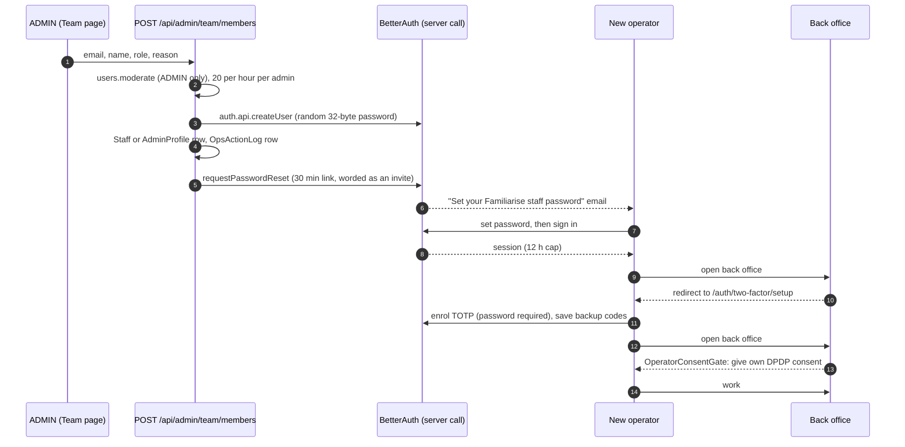

# Staff onboarding, sign-in and recovery

| Field         | Value                                                                                                                                                             |
| ------------- | ----------------------------------------------------------------------------------------------------------------------------------------------------------------- |
| Status        | Live                                                                                                                                                              |
| Audience      | Engineers, ADMINs, on-call                                                                                                                                        |
| Last reviewed | 2026-10-01                                                                                                                                                        |
| Source        | `lib/auth/operators.ts`, `lib/auth/operator-session-policy.ts`, `app/api/admin/team/members/**`, `scripts/bootstrap-admin.ts`, `lib/auth.ts`, `lib/auth-guard.ts` |

An **operator** is a user with role `STAFF` or `ADMIN`. Operators can read
customer data and move money, so they get a stricter regime than consumers:

| Rule                 | Operators                                           | Consumers                      |
| -------------------- | --------------------------------------------------- | ------------------------------ |
| Sign-in methods      | Email + password + authenticator code, nothing else | Password, Google, GitHub, SSO  |
| Second factor        | Mandatory TOTP, 10 single-use backup codes          | None                           |
| Session lifetime     | 12 hours from sign-in, however active               | 30 days, sliding               |
| Linked social or SSO | Refused                                             | Allowed (verified emails only) |
| Created by           | An ADMIN on the Team page, or the bootstrap script  | Self sign-up                   |

## 1. Onboarding



1. **Add.** An ADMIN opens the Team page and uses **Add staff** (email, name,
   role, and an audit reason of at least five characters).
   `POST /api/admin/team/members` is gated on `users.moderate` (ADMIN only),
   limited to 20 an hour per admin (`platform.staff-create`), and written to
   `OpsActionLog`. An address that already has an account answers 409.
2. **Create.** `createOperator()` (`lib/auth/operators.ts`) calls
   `auth.api.createUser` server-side with no headers. The account gets a random
   password nobody sees, `emailVerified` and `onboardingCompleted`, and a
   linked `StaffProfile` or `AdminProfile`. It is the only way an operator is
   created.
3. **Invite.** The route sends BetterAuth's password-reset link. While the
   operator has no second factor, the email is worded as an invitation. The link
   is single-use and lasts 30 minutes. If it lapses, the ADMIN uses **Resend
   setup link** on the row (`POST /api/admin/team/members/{id}/setup-link`, same
   budget), or the operator uses **Forgot password**.
4. **Enrol.** On first sign-in every back-office page redirects to
   `/auth/two-factor/setup`, every operator API answers 428
   `TWO_FACTOR_REQUIRED`, and routes that read `getSession()` directly treat
   the operator as signed out (401). Enrolment needs the password (`allowPasswordless` is
   off), shows a QR code and the secret, verifies one code, then shows the
   backup codes once.
5. **Consent.** Nobody consents on an operator's behalf: `user.create.after`
   skips the signup consent rows and the consumer welcome email for
   `/admin/create-user`. The back-office layout shows `OperatorConsentGate`
   until the operator has given their own consent (`POST /api/user/consent`).

### The first admin

```bash
npx tsx -r dotenv/config scripts/bootstrap-admin.ts \
  --email you@example.com --name "Your Name" [--print-link]
```

The script uses the same `createOperator()` path and refuses once any ADMIN
exists. `--print-link` prints the set-password link instead of emailing it, for
local development; it is refused when `NODE_ENV=production`. There is no
public setup page.

Email domain is never an authorization key: staff use a mix of personal and
company addresses, so there is no domain allowlist and no SSO for operators.

## 2. Sign-in

See [architecture.md §5.3](./architecture.md#53-staff-sign-in-password-plus-totp)
for the sequence. The rules:

- `session.create.before` allows an operator session only on
  `/sign-in/email`, `/two-factor/verify-totp`,
  `/two-factor/verify-backup-code` and `/change-password`. Anything else
  (Google, GitHub, SSO, email verification, any future plugin) is refused with
  `STAFF_PASSWORD_SIGN_IN_ONLY`, because the twoFactor plugin only challenges
  the password sign-in.
- `account.create.before` refuses to link a social or SSO account to an
  operator, so there is no second way in to keep refusing.
- Trusted devices are refused (`TRUST_DEVICE_DISABLED`): every sign-in asks
  for a code.
- Ten consecutive wrong codes lock 2FA verification for 15 minutes (twoFactor
  plugin default). The per-IP limit on `/two-factor/verify-*` is 5 a minute.
- The session ends 12 hours after sign-in.

## 3. Team page actions

All are ADMIN-only (`users.moderate`), take a reason, and write an
`OpsActionLog` row. Any operator can view the roster (`team.read`).

| Action            | Shown when                  | Route                                             | Effect                                                                                                                             |
| ----------------- | --------------------------- | ------------------------------------------------- | ---------------------------------------------------------------------------------------------------------------------------------- |
| Add staff         | Always                      | `POST /api/admin/team/members`                    | §1                                                                                                                                 |
| Resend setup link | Not enrolled, not suspended | `POST /api/admin/team/members/{id}/setup-link`    | New 30-minute set-password link                                                                                                    |
| Suspend           | Not yourself, not suspended | `PATCH /api/admin/team/members/{id}` `suspend`    | `banned` + `banExpires` (1 to 365 days, required) and **every session deleted**, in one transaction. Refuses the last active ADMIN |
| Reactivate        | Suspended                   | `PATCH /api/admin/team/members/{id}` `reactivate` | Clears the ban                                                                                                                     |
| Reset 2FA         | Enrolled                    | `DELETE /api/admin/team/members/{id}/two-factor`  | Deletes the TwoFactor row, clears `twoFactorEnabled`, deletes every session, in one transaction                                    |

Runbooks: [staff off-boarding](../enterprise/50-operations/02-runbooks.md#staff-off-boarding)
and [lost authenticator](../enterprise/50-operations/02-runbooks.md#lost-authenticator-admin-2fa-reset).

## 4. Recovery

| Situation                             | What happens                                                                                                         |
| ------------------------------------- | -------------------------------------------------------------------------------------------------------------------- |
| Forgot password                       | **Forgot password** on the sign-in page. The reset deletes every session; the authenticator is unchanged             |
| Lost authenticator, has a backup code | "Use a backup code" on `/auth/two-factor`. Each code works once; back-office **Settings** generates a fresh set      |
| Lost authenticator and backup codes   | An ADMIN confirms identity out of band, then **Reset 2FA**. The next sign-in is password-only and lands on enrolment |
| The only ADMIN is locked out          | No in-app path. An engineer with database access clears the `TwoFactor` row and `twoFactorEnabled` for that user     |

Whoever holds the password when 2FA is reset enrols the new authenticator,
which is why the reset is ADMIN-only, audited, and must follow an identity
check.

## 5. What is switched off

- **Admin plugin HTTP endpoints.** All `/admin/*` endpoints are in
  `disabledPaths`. `__tests__/security/admin-plugin-fenced.test.ts` reads the
  list from the installed plugin, so a new endpoint fails the test.
- **Impersonation.** Off. Support reads a customer's data through the back
  office. `Session.impersonatedBy` stays in the schema, unused.
- **Staff permissions inside BetterAuth.** `staffAc` grants only
  `user: list, get`; no `session` or `set-role` permissions.
- **Self-service 2FA removal** for operators.

## 6. Open items

| #   | Item                                                                                                                                            |
| --- | ----------------------------------------------------------------------------------------------------------------------------------------------- |
| 1   | Suspension is time-boxed (365 days at most) and lifts itself at the next sign-in after `banExpires`. There is no permanent off-boarding action. |
| 2   | Recovering the last ADMIN needs database access.                                                                                                |
| 3   | No passkeys yet. A new table only, so it is additive under ADR 36.                                                                              |
