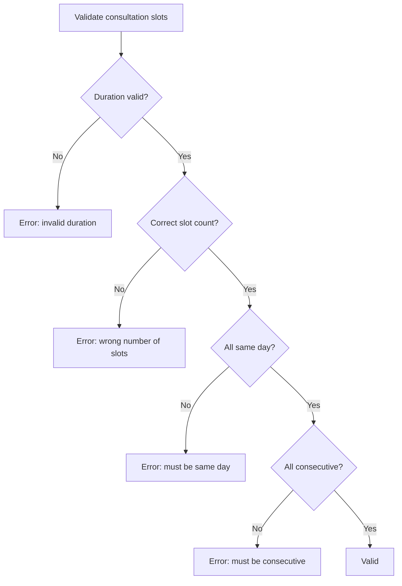
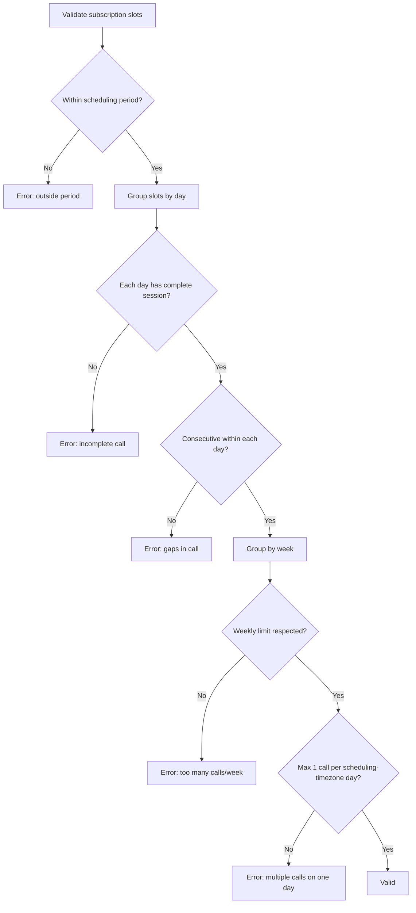
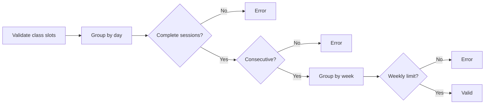
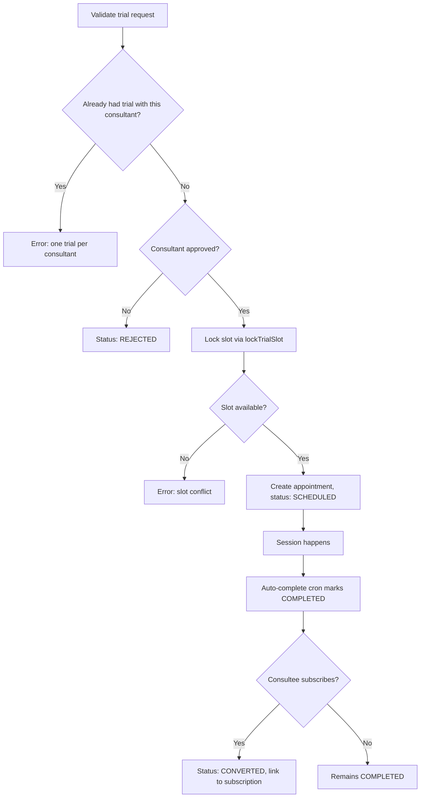
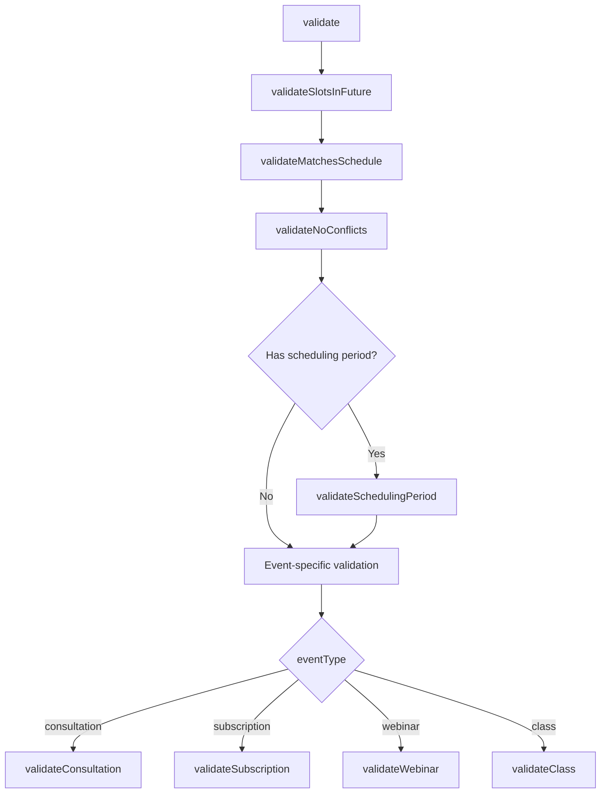

# Event Types & Validation

## Event Type Comparison

| Aspect                   | Consultation              | Subscription                                             | Webinar                   | Class                                                       | Trial                            |
| ------------------------ | ------------------------- | -------------------------------------------------------- | ------------------------- | ----------------------------------------------------------- | -------------------------------- |
| **Relationship**         | 1:1                       | 1:1                                                      | 1:many                    | 1:many                                                      | 1:1                              |
| **Frequency**            | One-time                  | Recurring                                                | One-time                  | Recurring                                                   | One-time (free)                  |
| **Duration field**       | `durationInHours` (total) | `sessionDurationInHours` (per call) + `durationInMonths` | `durationInHours` (total) | `sessionDurationInHours` (per session) + `durationInMonths` | Fixed 0.5h (1 slot)              |
| **Slot grouping**        | Consecutive + same day    | 1 call/day max, consecutive within day                   | Consecutive               | Max 2-3 sessions/day, consecutive within session            | Single slot                      |
| **Scheduling period**    | None                      | Required [startDate, endDate]                            | None                      | Required [startDate, endDate]                               | None                             |
| **Appointments created** | 1                         | 1 per call (many)                                        | 1                         | 1 per session (many)                                        | 1                                |
| **Weekly limit**         | N/A                       | `callsPerWeek` (0-7)                                     | N/A                       | `meetingsPerWeek`                                           | N/A                              |
| **Status field**         | `status`           | `status`                                          | `status`                  | `status`                                                    | `status` (TrialSessionStatus)    |
| **Allocation modes**     | auto, manual, requested   | auto, manual, requested                                  | auto, manual              | auto, manual                                                | Consultant-scheduled             |
| **Min duration**         | 0.5h                      | 0.5h per session                                         | 0.5h                      | 0.5h per session                                            | 0.5h (fixed)                     |
| **Payment**              | Required                  | Required                                                 | Required                  | Required                                                    | Free                             |
| **Uniqueness**           | Multiple allowed          | Multiple allowed                                         | Multiple allowed          | Multiple allowed                                            | One per consultant per consultee |

---

## Consultation

Single one-time session between consultant and consultee.

**Config**: `durationInHours` (0.5-4 hours)
**Slots**: `slotsPerSession = Math.ceil(durationInHours / 0.5)`
**Rules**: All slots must be consecutive and on the same day. Exactly one Appointment is created.



**Booking flows**:

- **Direct checkout**: Consultee selects slot, pays. Appointment created with `isTentative: true`, confirmed on payment webhook.
- **Request-based**: Consultee submits preferred slots. Consultant approves/rejects via "Use Requested Slots" mode.

---

## Subscription

Recurring sessions over a period of months. Most complex event type.

**Config**: `sessionDurationInHours` (per call) + `durationInMonths` + `callsPerWeek` (0-7) + `schedulingPeriodStartsAt/EndsAt`
**Total calls**: `countWeeks(startDate, endDate) * callsPerWeek`
**Total slots**: `totalCalls * Math.ceil(sessionDurationInHours / 0.5)`

**Rules**:

- All slots within scheduling period [startDate, endDate]
- Max 1 call per **scheduling-timezone** day (consecutive slots within that call). The same-day check buckets by `SlotCalculationService.dayKey()` in the event's `schedulingTimezone` (default Asia/Kolkata) on both the client and the server (ADR B9), so the verdict is identical everywhere; the old browser-local `toDateString()` bucketing disagreed with the server's for slots near day boundaries.
- Weekly limit: `callsPerWeek` calls per Sunday-Saturday **scheduling-timezone** week (`SlotCalculationService.weekKey()`)
- Weekly distribution validation counts **calls** (complete session groups), not raw slots

**Important**: Total weeks uses `SlotCalculationService.countWeeks()`, not `durationInMonths * 4`. A 6-month subscription has ~26 weeks, not 24.



**Delegates to**: `SubscriptionValidationService` for full validation.

---

## Webinar

Single one-time event with multiple attendees.

**Config**: `durationInHours` (0.5-4 hours)
**Slots**: `slotsPerSession = Math.ceil(durationInHours / 0.5)`
**Rules**: Consecutive slots required. Exactly one Appointment created. Consultant-scheduled (no request-based flow).

**Enrollment**: Consultees enroll via checkout. If event is full, they join a waitlist.

---

## Class

Recurring sessions with multiple attendees over months.

**Config**: `sessionDurationInHours` (per session) + `durationInMonths` + `meetingsPerWeek`
**Total sessions**: `countWeeks(startDate, endDate) * meetingsPerWeek`
**Rules**: Complete sessions per day (slot count % slotsPerSession == 0), consecutive within day, weekly session limit, scheduling period.



Consultant-scheduled. Consultees enroll via checkout or join waitlist.

---

## Trial

Free one-time session that lets a consultee try a subscription plan before committing.

**Config**: Fixed 0.5h (1 slot), no payment
**Slots**: 1 slot per trial
**Rules**: One trial per consultant per consultee (`@@unique([consulteeProfileId, consultantProfileId])`). Uses `lockTrialSlot()` for concurrency protection.

**Status lifecycle**: `PENDING` -> `SCHEDULED` -> `COMPLETED` -> `CONVERTED` (with `CANCELLED` and `REJECTED` branches)



**Data model**: `TrialSession` links to `ConsulteeProfile`, `ConsultantProfile`, `SubscriptionPlan`, and optionally to `Appointment` (when scheduled) and `Subscription` (when converted via `convertedToSubscriptionId`).

For full details see [09-trial-sessions.md](./09-trial-sessions.md).

---

## Validation Layers

### Layer 1: Zod Schemas

**File**: `schemas/slotAllocation/validationSchemas.ts`

Input format validation at the API boundary. Runs before any business logic.

**Schemas**:

```typescript
// Allocation request (PATCH /allocate)
allocationRequestSchema = z
  .object({
    isAuto: z.boolean(), // Required
    useRequestedSlots: z.boolean().optional(),
    slots: z.array(z.string().datetime()).optional(),
  })
  .refine((data) => {
    if (data.isAuto) return true; // Auto: no slots needed
    if (data.useRequestedSlots) return true; // Requested: no slots needed
    return data.slots && data.slots.length > 0; // Manual: slots required
  });

// Validation request (POST /validate)
validationRequestSchema = z.object({
  slots: z.array(z.string().datetime()).min(1),
});

// Event ID (URL parameter)
eventIdSchema = z
  .string()
  .min(1)
  .refine((id) => {
    return (
      /^[0-9a-f]{8}-[0-9a-f]{4}-[0-9a-f]{4}-[0-9a-f]{4}-[0-9a-f]{12}$/i.test(
        id,
      ) || // UUID
      /^[a-z][a-z0-9]{23,24}$/.test(id)
    ); // CUID (v1: 25 chars, v2: 24 chars)
  });
```

**Error handling**: `formatZodError()` converts Zod errors to `"field: message; field2: message2"` format. `safeParse()` wrapper returns `{success, data}` or `{success: false, error}`.

### Layer 2: Business Rules (SlotValidationService)

**File**: `utils/slotAllocation/SlotValidationService.ts`

Server-side enforcement of all business rules. Runs inside the allocation transaction.



**Conflict detection** uses range overlap, not exact match:

```
slotStart < existingSlotEnd AND existingSlotStart < slotEnd
```

This catches partial overlaps that exact-match would miss.

**Schedule matching** (weekly availability):

- Uses `startDay`/`endDay` DayOfWeek enum as the source of truth for day-of-week
- Compares `startTimeUtc`/`endTimeUtc` Int fields (minutes since midnight UTC, 0-1439)
- Handles overnight (cross-midnight) slots where `endTimeUtc <= startTimeUtc`
- Slot must start >= availability start AND end <= availability end

### Layer 3: Database Constraints

Prisma enforces:

- Foreign key relationships (appointment -> event, slot -> appointment)
- NOT NULL constraints on required fields
- Enum constraints (`AppointmentsType`, `AppointmentStatus`, `DayOfWeek`)
- All appointment creation runs inside a Prisma transaction with 60-second timeout

---

## Availability Types

Consultants configure one of two schedule types:

### Weekly

Recurring weekly patterns stored in `SlotOfAvailabilityWeekly`:

- `startDay`: DayOfWeek enum (SUNDAY, MONDAY, ..., SATURDAY) -- **source of truth** for which day
- `startTimeUtc`: Int (minutes since midnight UTC, 0-1439)
- `endTimeUtc`: Int (minutes since midnight UTC, 0-1439)

### Custom

Specific date/time ranges stored in `SlotOfAvailabilityCustom`:

- `startsAt`: Exact DateTime
- `endsAt`: Exact DateTime
- Validated using overlap detection: `proposedStart < availEnd AND availStart < proposedEnd`

The `scheduleType` field on `ConsultantProfile` determines which availability set is used.
