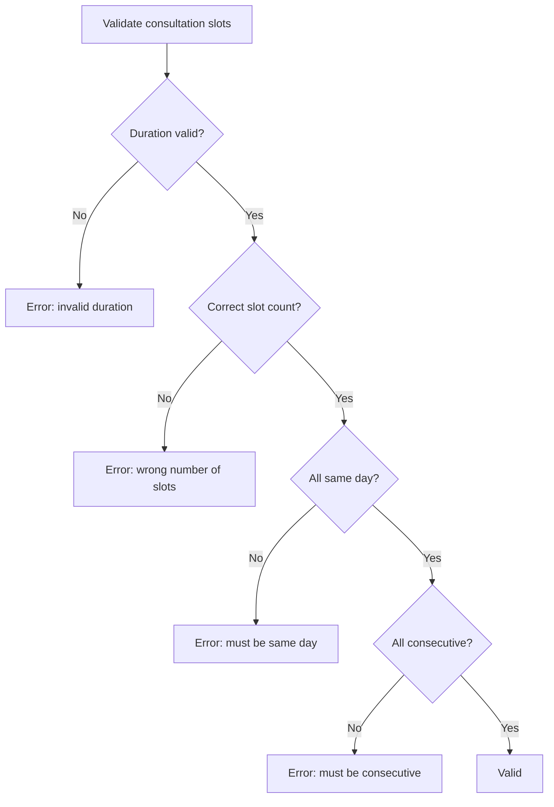
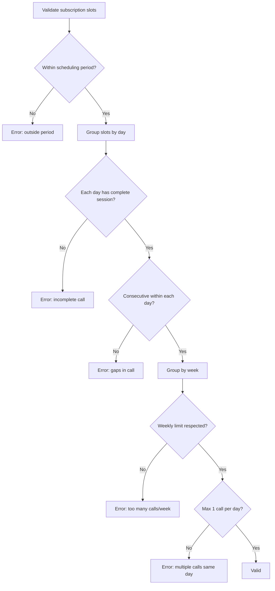
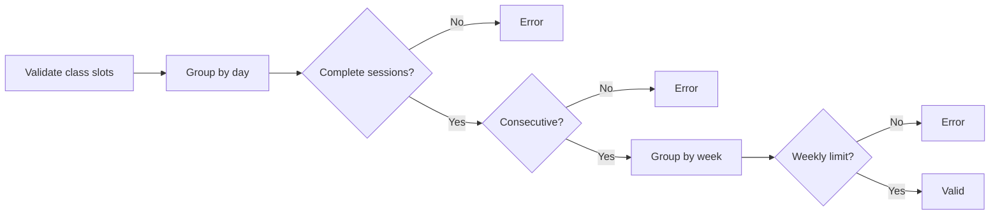
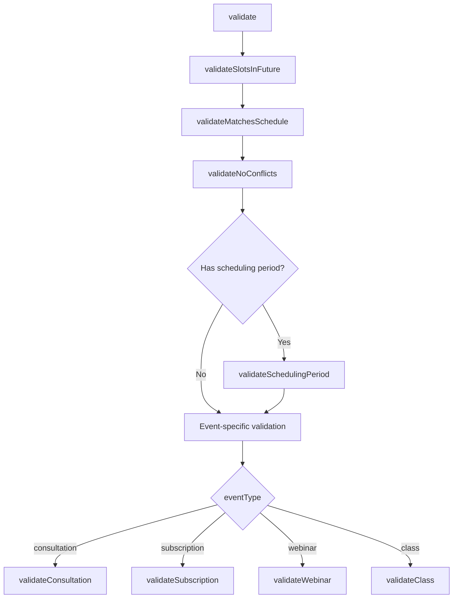

# Event Types & Validation

## Event Type Comparison

| Aspect | Consultation | Subscription | Webinar | Class |
|--------|-------------|-------------|---------|-------|
| **Relationship** | 1:1 | 1:1 | 1:many | 1:many |
| **Frequency** | One-time | Recurring | One-time | Recurring |
| **Duration field** | `durationInHours` (total) | `sessionDurationInHours` (per call) + `durationInMonths` | `durationInHours` (total) | `sessionDurationInHours` (per session) + `durationInMonths` |
| **Slot grouping** | Consecutive + same day | 1 call/day max, consecutive within day | Consecutive | Max 2-3 sessions/day, consecutive within session |
| **Scheduling period** | None | Required [startDate, endDate] | None | Required [startDate, endDate] |
| **Appointments created** | 1 | 1 per call (many) | 1 | 1 per session (many) |
| **Weekly limit** | N/A | `callsPerWeek` (0-7) | N/A | `meetingsPerWeek` |
| **Status field** | `requestStatus` | `requestStatus` | `status` | `status` |
| **Allocation modes** | auto, manual, requested | auto, manual, requested | auto, manual | auto, manual |
| **Min duration** | 0.5h | 0.5h per session | 0.5h | 0.5h per session |

---

## Consultation

Single one-time session between consultant and consultee.

**Config**: `durationInHours` (0.5-4 hours)
**Slots**: `slotsPerSession = Math.ceil(durationInHours / 0.5)`
**Rules**: All slots must be consecutive and on the same day. Exactly one Appointment is created.



**Booking flows**:
- **Direct checkout**: Consultee selects slot, pays. Appointment created with `isTentative: true`, confirmed on payment webhook.
- **Request-based**: Consultee submits preferred slots. Consultant approves/rejects via "Use Requested Slots" mode.

---

## Subscription

Recurring sessions over a period of months. Most complex event type.

**Config**: `sessionDurationInHours` (per call) + `durationInMonths` + `callsPerWeek` (0-7) + `schedulingPeriodStartsAt/EndsAt`
**Total calls**: `countWeeks(startDate, endDate) * callsPerWeek`
**Total slots**: `totalCalls * Math.ceil(sessionDurationInHours / 0.5)`

**Rules**:
- All slots within scheduling period [startDate, endDate]
- Max 1 call per day (consecutive slots within that call)
- Weekly limit: `callsPerWeek` calls per Sunday-Saturday week
- Weekly distribution validation counts **calls** (complete session groups), not raw slots

**Important**: Total weeks uses `SlotCalculationService.countWeeks()`, not `durationInMonths * 4`. A 6-month subscription has ~26 weeks, not 24.



**Delegates to**: `SubscriptionValidationService` for full validation.

---

## Webinar

Single one-time event with multiple attendees.

**Config**: `durationInHours` (0.5-4 hours)
**Slots**: `slotsPerSession = Math.ceil(durationInHours / 0.5)`
**Rules**: Consecutive slots required. Exactly one Appointment created. Consultant-scheduled (no request-based flow).

**Enrollment**: Consultees enroll via checkout. If event is full, they join a waitlist.

---

## Class

Recurring sessions with multiple attendees over months.

**Config**: `sessionDurationInHours` (per session) + `durationInMonths` + `meetingsPerWeek`
**Total sessions**: `countWeeks(startDate, endDate) * meetingsPerWeek`
**Rules**: Complete sessions per day (slot count % slotsPerSession == 0), consecutive within day, weekly session limit, scheduling period.



Consultant-scheduled. Consultees enroll via checkout or join waitlist.

---

## Validation Layers

### Layer 1: Zod Schemas

**File**: `schemas/slotAllocation/validationSchemas.ts`

Input format validation at the API boundary. Runs before any business logic.

**Schemas**:

```typescript
// Allocation request (PATCH /allocate)
allocationRequestSchema = z.object({
  isAuto: z.boolean(),                    // Required
  useRequestedSlots: z.boolean().optional(),
  slots: z.array(z.string().datetime()).optional(),
}).refine(data => {
  if (data.isAuto) return true;           // Auto: no slots needed
  if (data.useRequestedSlots) return true; // Requested: no slots needed
  return data.slots && data.slots.length > 0; // Manual: slots required
});

// Validation request (POST /validate)
validationRequestSchema = z.object({
  slots: z.array(z.string().datetime()).min(1),
});

// Event ID (URL parameter)
eventIdSchema = z.string().min(1).refine(id => {
  return /^[0-9a-f]{8}-[0-9a-f]{4}-[0-9a-f]{4}-[0-9a-f]{4}-[0-9a-f]{12}$/i.test(id)  // UUID
      || /^c[a-z0-9]{24}$/i.test(id);  // CUID
});
```

**Error handling**: `formatZodError()` converts Zod errors to `"field: message; field2: message2"` format. `safeParse()` wrapper returns `{success, data}` or `{success: false, error}`.

### Layer 2: Business Rules (SlotValidationService)

**File**: `utils/slotAllocation/SlotValidationService.ts`

Server-side enforcement of all business rules. Runs inside the allocation transaction.



**Conflict detection** uses range overlap, not exact match:
```
slotStart < existingSlotEnd AND existingSlotStart < slotEnd
```
This catches partial overlaps that exact-match would miss.

**Schedule matching** (weekly availability):
- Uses `dayOfWeekForStartsAt` enum as the source of truth for day-of-week
- Compares time-of-day only (hours:minutes), not full DateTime
- Slot must start >= availability start AND end <= availability end

### Layer 3: Database Constraints

Prisma enforces:
- Foreign key relationships (appointment -> event, slot -> appointment)
- NOT NULL constraints on required fields
- Enum constraints (`AppointmentsType`, `RequestStatus`, `DayOfWeek`)
- All appointment creation runs inside a Prisma transaction with 60-second timeout

---

## Availability Types

Consultants configure one of two schedule types:

### Weekly

Recurring weekly patterns stored in `SlotOfAvailabilityWeekly`:
- `dayOfWeekForStartsAt`: DayOfWeek enum (SUNDAY, MONDAY, ..., SATURDAY) -- **source of truth** for which day
- `availabilityStartsAt`: DateTime with time-of-day (date portion may be a reference date)
- `availabilityEndsAt`: DateTime with end time

The `dayOfWeekForStartsAt` enum must be used instead of `getUTCDay()` on the DateTime, because the stored DateTime may use arbitrary reference dates (e.g., Jan 6-12, 2025 seed data or 1970 epoch from client).

### Custom

Specific date/time ranges stored in `SlotOfAvailabilityCustom`:
- `availabilityStartsAt`: Exact DateTime
- `availabilityEndsAt`: Exact DateTime
- Validated using overlap detection: `proposedStart < availEnd AND availStart < proposedEnd`

The `scheduleType` field on `ConsultantProfile` determines which availability set is used.
