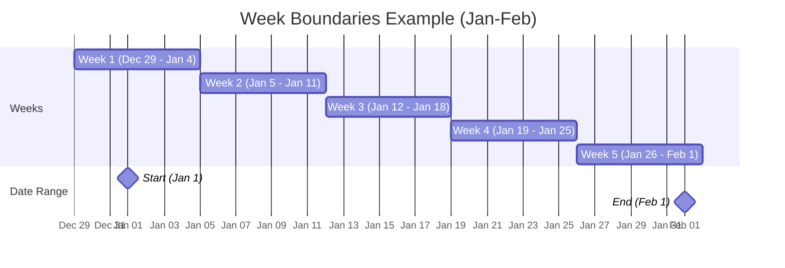
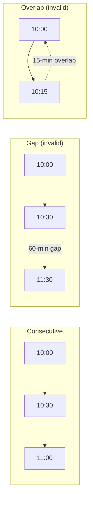
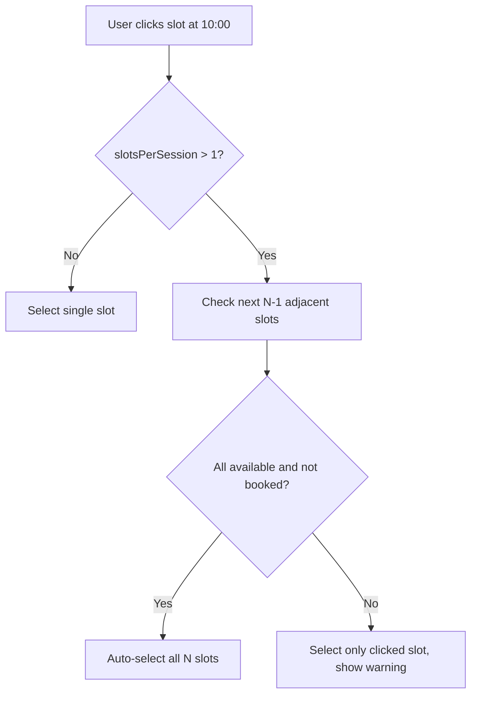

# Slot Math & Calculations

All slot math lives in `utils/slotAllocation/SlotCalculationService.ts`.

## Fundamentals

Every time slot in the system is a **30-minute atomic unit**.

- `SLOT_DURATION_MS = 30 * 60 * 1000` (1,800,000 ms)
- 48 intervals per day (24h / 0.5h)
- `slotsPerSession = Math.ceil(sessionDurationInHours / 0.5)`

| Duration  | Slots |
| --------- | ----- |
| 0.5 hours | 1     |
| 1 hour    | 2     |
| 1.5 hours | 3     |
| 2 hours   | 4     |
| 2.5 hours | 5     |
| 3 hours   | 6     |
| 4 hours   | 8     |

## Week Boundaries (Sunday-Saturday)

All week-based calculations use **Sunday as the first day** of the week.

### `startOfWeekSunday(date)`

Returns the Sunday at 00:00:00 of the week containing the given date.

```
Input: Wednesday Jan 15, 2025
       day = 3 (Wednesday)
       diff = 3 (days since Sunday)
Output: Sunday Jan 12, 2025 00:00:00
```

### `countWeeks(startDate, endDate)`

Counts distinct Sunday-start weeks overlapping the date range [start, end].

**Algorithm**:

1. Normalize both dates to midnight
2. Find the Sunday of start week and end week
3. Count Sundays from start to end inclusive

```
Example: Jan 1 (Wed) to Feb 1 (Sat)
  Start Sunday: Dec 29
  End Sunday:   Jan 26
  Weeks: Dec 29, Jan 5, Jan 12, Jan 19, Jan 26 = 5 weeks
```



### Why not `durationInMonths * 4`?

The hardcoded `* 4` approximation is wrong for anything beyond short durations:

| Duration  | `* 4` result | `countWeeks()` result | Error |
| --------- | ------------ | --------------------- | ----- |
| 1 month   | 4 weeks      | 4-5 weeks             | 0-1   |
| 3 months  | 12 weeks     | 13-14 weeks           | 1-2   |
| 6 months  | 24 weeks     | 26-27 weeks           | 2-3   |
| 12 months | 48 weeks     | 52-53 weeks           | 4-5   |

Always use `SlotCalculationService.countWeeks()`.

## Total Slots Required

**`calculateRequiredSlots(eventType, config)`**:

| Event Type   | Formula                                                                       | Example                                             |
| ------------ | ----------------------------------------------------------------------------- | --------------------------------------------------- |
| Consultation | `Math.ceil(durationInHours / 0.5)`                                            | 1.5h = 3 slots                                      |
| Webinar      | `Math.ceil(durationInHours / 0.5)`                                            | 2h = 4 slots                                        |
| Subscription | `countWeeks(start, end) * callsPerWeek * Math.ceil(sessionDuration / 0.5)`    | 5 weeks, 2/week, 1h sessions = 5 _ 2 _ 2 = 20 slots |
| Class        | `countWeeks(start, end) * meetingsPerWeek * Math.ceil(sessionDuration / 0.5)` | Same formula                                        |

## Consecutive Slot Validation

**`validateConsecutiveSlots(slots)`** in `SlotValidationService`:

1. Sort slots by time
2. For each adjacent pair: check `|current.time - (prev.time + 30min)| <= 1 second`

The **1-second tolerance** accounts for floating-point precision and timezone round-trip artifacts.



## Grouping Functions

### `dayKey(date, timeZone?)` and `weekKey(date, timeZone?)`

These two helpers are the canonical bucketing keys for every daily and weekly limit (ADR B9). Both return `YYYY-MM-DD` calendar dates evaluated in the event's scheduling timezone — `dayKey` the date containing the instant, `weekKey` the date of the Sunday that starts its week. The timezone defaults to `SlotCalculationService.DEFAULT_SCHEDULING_TIMEZONE` (Asia/Kolkata) and is overridden by the event's `schedulingTimezone` column. The client's interactive guards, the auto-allocation algorithm, and the server validators all bucket with these keys, so their verdicts cannot diverge by machine timezone. `startOfWeekSundayInTz(date, timeZone?)` returns the same week boundary as a UTC instant for code that needs Date ranges (the weekly-info generator).

### `groupSlotsByDay(slots, timeZone?)`

Groups slots by `dayKey(startTime, timeZone)`. Returns `Map<string, TimeSlot[]>`.

Used by: daily call limits (subscription), session count (class), completed-calls counting.

### `groupSlotsByWeek(slots, timeZone?)`

Groups slots by `weekKey(startTime, timeZone)`. Returns `Map<string, TimeSlot[]>`.

Used by: weekly distribution validation, weekly limit checks.

## Progress Calculation

**`calculateProgress(selectedSlots, eventType, config)`**:

For one-time events (consultation, webinar):

- `scheduled = selectedSlots.length >= slotsPerCall ? 1 : 0`
- `required = 1`

For recurring events (subscription, class):

- `scheduled = countCompletedCalls(selectedSlots, slotsPerCall)`
- `required = countWeeks(start, end) * callsPerWeek`

**`countCompletedCalls`** groups slots by day, sorts within each day, and counts complete consecutive groups of `slotsPerCall` slots. It counts **calls** (complete session groups), not individual slots.

Example: 2 slots/call, day has slots at [10:00, 10:30, 14:00, 14:30]

- Group 1: 10:00 + 10:30 = 1 complete call
- Group 2: 14:00 + 14:30 = 1 complete call
- Result: 2 completed calls

## Auto-Expansion (Consecutive Slot Selection)

When a user selects the first slot of a multi-slot session, the frontend auto-selects the remaining consecutive slots.



This feature applies to all event types where `slotsPerSession > 1`. Implementation is in `useSlotAllocation.ts` within the `toggleSlot()` function.

## Duration Validation

**`validateDuration(duration, fieldName)`** is a safety gate called before any division or loop:

- Must be defined (not undefined/null)
- Must be a number
- Must be positive (`> 0`)
- Must be finite
- Must be >= 0.5 hours (30 minutes)
- Warns if > 24 hours (unusual but not blocked)

This prevents division-by-zero, infinite loops, and negative slot counts in `calculateRequiredSlots` and `getSlotsPerCall`.
