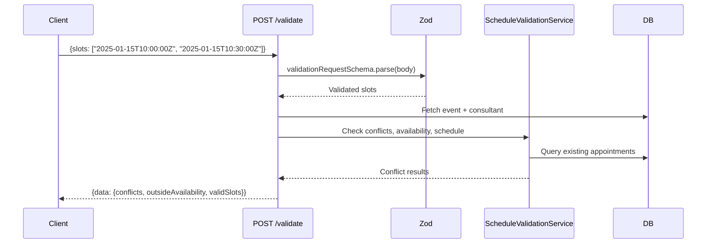
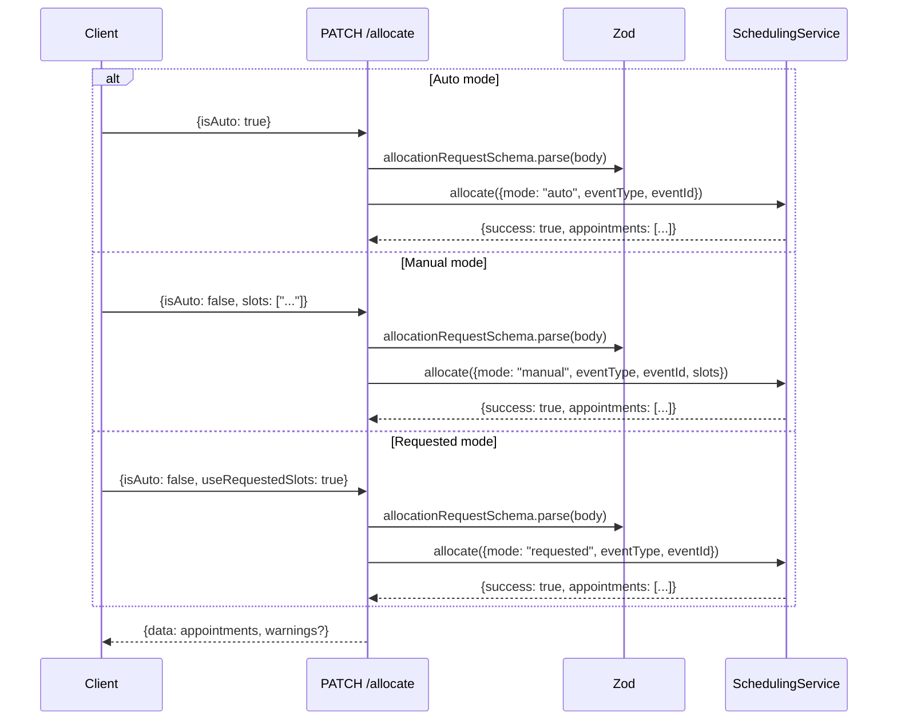

# API Reference

## Endpoints Overview

| Event Type   | Validate (POST)                           | Allocate (PATCH)                          |
| ------------ | ----------------------------------------- | ----------------------------------------- |
| Consultation | `/api/bookings/consultations/{id}/validate` | `/api/bookings/consultations/{id}/allocate` |
| Subscription | `/api/bookings/subscriptions/{id}/validate` | `/api/bookings/subscriptions/{id}/allocate` |
| Webinar      | `/api/bookings/webinars/{id}/validate`      | `/api/bookings/webinars/{id}/allocate`      |
| Class        | `/api/bookings/classes/{id}/validate`       | `/api/bookings/classes/{id}/allocate`       |

All endpoints require session-based authentication. The `{id}` parameter accepts UUID or CUID format.

---

## Slot Endpoint Authentication

All `/api/scheduling/` endpoints are covered by `AUTHENTICATED_API_PREFIXES` in middleware, meaning they require a valid session cookie. Two sub-paths are exempted as public:

| Path                                    | Auth Required | Notes                                                              |
| --------------------------------------- | ------------- | ------------------------------------------------------------------ |
| `/api/scheduling/availability/`              | No            | Public -- consultees can view consultant availability without auth |
| `/api/scheduling/availability-with-allocation/` | No         | Public -- includes allocation data for calendar display            |
| `/api/scheduling/appointments` (GET)         | Yes           | Non-privileged users are filtered to their own profile only        |
| `/api/scheduling/appointments` (POST)        | Yes           | Admin/staff only                                                   |
| `/api/scheduling/appointments/[id]` (GET)    | Yes           | Requires participant check (consultant or consultee on the appointment) |

**Removed (booking-journey audit B3 / #1193)**: the `[id]` route's `PATCH` (blind delete-all + slot recreate with no conflict validation and no `consultantProfileId`, so recreated confirmed slots sat OUTSIDE the `occurrence_no_confirmed_overlap` guard), `PUT`, and `DELETE` (hard-delete bypassing the soft-cancel doctrine) handlers. No in-repo caller used them; slot mutations go through `SchedulingService` (allocate/reschedule/manage-timings), which carries locks, revalidation, and the GiST backstop.

### Status Filters

The `/api/scheduling/appointments` GET endpoint supports status filtering. The accepted status values depend on the event type:

| Event Type                   | Status Enum    | Valid Values                                       |
| ---------------------------- | -------------- | -------------------------------------------------- |
| Consultation / Subscription  | `AppointmentStatus` | PENDING, APPROVED, APPROVED_PENDING_PAYMENT, etc. |
| Webinar / Class              | Event status   | SCHEDULED, IN_PROGRESS, COMPLETED, CANCELLED       |

---

## Validate Endpoints

**Method**: `POST /api/bookings/{type}/{id}/validate`

Pre-flight check before allocation. Returns which slots have conflicts, which are outside availability, and which are valid.



### Request

```json
{
  "slots": ["2025-01-15T10:00:00Z", "2025-01-15T10:30:00Z"]
}
```

Slots must be ISO 8601 datetime strings. Array must have at least 1 element.

### Response (200)

```json
{
  "data": {
    "conflicts": [
      {
        "slot": "2025-01-15T10:00:00Z",
        "existingAppointment": {
          "type": "CONSULTATION",
          "with": "John Doe",
          "time": "10:00 AM - 10:30 AM"
        }
      }
    ],
    "outsideAvailability": [{ "slot": "2025-01-15T14:00:00Z" }],
    "validSlots": ["2025-01-15T10:30:00Z"]
  }
}
```

### Subscription/Class Extensions

Subscription and class validate endpoints return additional fields:

```json
{
  "data": {
    "conflicts": [],
    "outsideAvailability": [],
    "validSlots": ["..."],
    "weeklyDistribution": {
      "2025-01-12": 2,
      "2025-01-19": 1
    },
    "totalScheduled": 3,
    "totalRequired": 10
  }
}
```

---

## Allocate Endpoints

**Method**: `PATCH /api/bookings/{type}/{id}/allocate`

Creates or replaces appointments for an event. Three allocation modes:



### Auto Mode Request

```json
{ "isAuto": true }
```

System finds the first available slots automatically. For consultations/webinars: first consecutive block. For subscriptions/classes: distributed across weeks.

### Manual Mode Request

```json
{
  "isAuto": false,
  "slots": ["2025-01-15T10:00:00Z", "2025-01-15T10:30:00Z"]
}
```

Slot count must be an exact multiple of `slotsPerSession`. Duplicates are rejected.

### Requested Mode Request

```json
{
  "isAuto": false,
  "useRequestedSlots": true
}
```

Approves pre-created appointments from a consultee's request. Verifies appointments exist and clears `isTentative` flags.

### Response (200)

```json
{
  "data": [
    {
      "id": "appointment-id",
      "appointmentType": "CONSULTATION",
      "appointmentOccurrences": [
        {
          "id": "slot-id",
          "startsAt": "2025-01-15T10:00:00.000Z",
          "endsAt": "2025-01-15T10:30:00.000Z",
          "isTentative": false
        }
      ]
    }
  ],
  "warnings": []
}
```

---

## Lifecycle Endpoints (#1846)

The endpoints in this section end, restore or remove a booking or an offering, and they were added or changed by #1846. The writers among them take the booking's appointment lock or the offering's checkout lock before their transaction, and they answer a held lock with the structured 423 `APPOINTMENT_BUSY` or 409 `EVENT_CHECKOUT_BUSY` and an unreachable Redis with a 503, never with a 500.

### Abandon an unpaid booking

**Method**: `POST /api/bookings/[bookingId]/abandon`

This is the one door a buyer uses to walk away from a booking they have not paid for (#1527 decision 11). The `bookingId` is the Appointment id. A consultation, subscription or trial ends `CANCELLED`, and a webinar or class seat hold releases only the caller's own `HELD` seat. The caller's `PENDING` payment expires by compare-and-swap, its referral credits and organisation engagement are given back, and the gateway order is cancelled after the transaction commits. The dispatch lives in `lib/booking/abandon.ts`, and [06-booking-lifecycle.md](./06-booking-lifecycle.md) describes each arm.

A successful call answers 200 with the body below.

```json
{ "abandoned": true, "kind": "consultation", "paymentsExpired": 1, "slotsReleased": 2 }
```

The refusals carry a `code` next to the `error` text, as the following table shows.

| Status | Code              | Meaning                                                                                                                                  |
| ------ | ----------------- | ---------------------------------------------------------------------------------------------------------------------------------------- |
| 404    | `NOT_FOUND`       | No booking with this id exists, or it is not the caller's; the two answers are the same so the door reveals nothing about other people's bookings. |
| 409    | `NOT_ABANDONABLE` | The booking has already moved on (confirmed, cancelled or expired).                                                                      |
| 409    | `ALREADY_PAID`    | A payment on the booking has been captured, including one that committed while the door was running, so the buyer must use Cancel, which quotes the refund. |

### Withdraw a reschedule proposal

**Method**: `POST /api/appointments/[appointmentId]/reschedule/withdraw`

The initiator of an open proposal may take it back, and the withdrawal restores the released slots and the request's origin status through `lib/booking/reschedule-restore.ts`. If the original time was booked while the proposal was open, the restore meets the overlap constraint (SQLSTATE 23P01), the transaction rolls back, and the route answers 409 with the code `ORIGINAL_TIME_TAKEN`. The proposal then stays open, and agreeing a new time is the way forward. A proposal the other party answered first answers 409 `PROPOSAL_NOT_OPEN`, and a caller with no open proposal of their own on the booking gets 404.

### Delete an offering

**Methods**: `DELETE /api/plans/consultations/[consultationPlanId]`, `DELETE /api/plans/subscriptions/[subscriptionPlanId]`, `DELETE /api/bookings/webinars/[webinarId]` and `DELETE /api/bookings/classes/[classId]`

Each route deletes an offering only while nothing has ever touched it (#1527 decision 6). The route checks ownership before it takes any lock, so a stranger cannot hold buyers' checkout busy; a plan route answers 403 for someone else's plan, and a webinar or class route answers 404 for someone else's instance. It then runs one Serializable transaction under the offering's `event-checkout:` lock through `deleteUntouchedOffering` in `lib/booking/offering-delete.ts`, with the no-history guard from `lib/offerings/delete-guard.ts` inside the `deleteMany` WHERE. That lock is the key checkout takes for a subscription plan, webinar or class; consultation checkout locks its slot atoms instead, so for a consultation plan the Serializable transaction and the in-WHERE guard carry the race on their own. The guard counts a payment of any status and any consultee seat ever held, and a subscription plan also counts its trials. A delete that matches zero rows answers 409 with the code `OFFERING_IN_USE`, and the offering should be archived instead.

The Offerings card and the server share this one rule. The guard fragments live in `lib/offerings/delete-guard.ts`, the DELETE routes put them inside their `deleteMany` WHERE, and the card's `canDelete` (`lib/data/offering-stats.ts`) runs the same fragments as a query. Any history therefore means Archive instead of Delete, whether it is a booking, a payment of any status (a `PENDING` or `FAILED` payment cascades with its appointment as surely as a captured one), a consultee seat ever held (a released seat still records that someone held it), or, for a subscription plan, a trial. A webinar or class plan is deletable from the card only while none of its instances has history, and an unsold upcoming instance is deletable. A consultation plan has no checkout lock key, because checkout locks its slot atoms instead, so for that kind the Serializable transaction and the in-WHERE guard carry the race on their own.

The two `DELETE /api/bookings/{webinars,classes}/crud-with-plan/[id]` routes were removed in #1846, because they had no callers and no guard. The `crud-with-plan` collection routes keep their `POST` and `PATCH` handlers.

### Preview a trial cancellation

**Method**: `GET /api/trials/[trialId]/cancel/preview`

This route returns what cancelling the trial right now would pay back, and it never writes. It uses the same ownership scope as trial DELETE, so it answers 404 wherever the cancel would. The response is `{ "paid": false }` when there is nothing to refund, and otherwise it is `{ "paid": true, ... }` with the quote in the appointment cancel preview's shape (`paymentId`, `refundPct`, `estimatedRefundPaise`, `refundablePaise`, `currency`, `fundingRail`, `hoursUntilNextSession` and `prorated`) plus `grossPaise`, the amount paid, for the dialog's breakdown line. The response is sent with `Cache-Control: no-store`.

### Cancel a trial

**Method**: `DELETE /api/trials/[trialId]`

The optional JSON body carries `confirmedRefundPaise`, which is the `estimatedRefundPaise` the caller saw in the preview. The route re-quotes the refund under the appointment lock, cancels the trial and tombstones its session in one transaction, and then refunds exactly the confirmed quote. A free or unpaid trial needs no body. The refusals specific to a paid trial are listed in the following table, and both carry the current `quote` so the dialog can show it and ask again.

| Status | Code                   | Meaning                                                              |
| ------ | ---------------------- | -------------------------------------------------------------------- |
| 409    | `REFUND_QUOTE_REQUIRED` | The trial is paid and the body carried no valid `confirmedRefundPaise`. |
| 409    | `REFUND_QUOTE_CHANGED`  | The confirmed amount no longer matches the refund quoted under the lock. |

The compare-and-swap narrows to the status the caller read, so a trial accepted or paid since that read answers 409 `ILLEGAL_TRANSITION` instead of being cancelled on a stale view.

`PATCH /api/trials/[trialId]` with `status: "CANCELLED"` no longer cancels a paid trial. It answers 409 `REFUND_QUOTE_REQUIRED` with the quote and points the caller at the cancel dialog, and its compare-and-swap carries `paymentId: null`, so a capture that commits first also turns the cancel into a 409.

---

## Error Codes

| Status | Cause                   | Example                                                                   |
| ------ | ----------------------- | ------------------------------------------------------------------------- |
| 400    | Zod validation failure  | `"slots: Each slot must be a valid ISO 8601 datetime string"`             |
| 400    | Business rule violation | `"Consultation requires exactly 2 slots (1 hour) but 3 provided"`         |
| 400    | Duplicate slots         | `"Duplicate slots detected: 3 slots provided but only 2 are unique"`      |
| 404    | Event not found         | `"consultation not found"`                                                |
| 409    | Slot conflict           | `"Slot already booked: 1/15/2025 (conflicts with consultation for John)"` |
| 500    | Transaction failure     | `"Allocation failed"`                                                     |

### Zod Error Format

Zod errors are formatted as semicolon-separated field:message pairs:

```
"slots: Each slot must be a valid ISO 8601 datetime; isAuto: Required field"
```

---

## Zod Schema Reference

**File**: `schemas/slotAllocation/validationSchemas.ts`

### allocationRequestSchema

| Field               | Type     | Required    | Description                                                                         |
| ------------------- | -------- | ----------- | ----------------------------------------------------------------------------------- |
| `isAuto`            | boolean  | Yes         | `true` for auto allocation, `false` for manual/requested                            |
| `useRequestedSlots` | boolean  | No          | `true` to approve pre-created consultee appointments                                |
| `slots`             | string[] | Conditional | ISO 8601 datetimes. Required if `isAuto: false` and `useRequestedSlots` is not true |

### validationRequestSchema

| Field   | Type     | Required    | Description                           |
| ------- | -------- | ----------- | ------------------------------------- |
| `slots` | string[] | Yes (min 1) | ISO 8601 datetime strings to validate |

### eventIdSchema

Validates URL path parameter `{id}`. Accepts UUID (`xxxxxxxx-xxxx-xxxx-xxxx-xxxxxxxxxxxx`) or CUID (`cxxxxxxxxxxxxxxxxxxxxxxxxx`).

---

## Type Definitions

**File**: `utils/scheduling-engine/types.ts`

| Type                       | Description                                                                                        |
| -------------------------- | -------------------------------------------------------------------------------------------------- |
| `EventType`                | `"consultation" \| "subscription" \| "webinar" \| "class"`                                         |
| `AllocationMode`           | `"auto" \| "manual" \| "requested"`                                                                |
| `AllocationRequest`        | `{eventType, eventId, mode, slots?}`                                                               |
| `AllocationConstraints`    | `{schedulingPeriod, slotsRequired, sessionDuration, sessionsPerWeek, ...}`                            |
| `ValidationResult`         | `{isValid, errors: string[], warnings: string[]}`                                                  |
| `SlotConflictResult`       | `{conflicts[], outsideAvailability[], validSlots[]}`                                               |
| `AllocationResult`         | `{success, appointments?, error?, warnings?}`                                                      |
| `TimeSlot`                 | `{startTime, endTime, isAvailable, isBooked}`                                                      |
| `ProgressInfo`             | `{scheduled, required, remaining, sessionDuration, displayText}`                                   |
| `ConsultantAllocationData` | `{userId, scheduleType, slotsOfAvailabilityWeekly[], slotsOfAvailabilityCustom[]}`                 |
| `EventConfig`              | `{durationInMonths?, durationInHours?, sessionDurationInHours?, sessionsPerWeek?, schedulingPeriod?}` |
