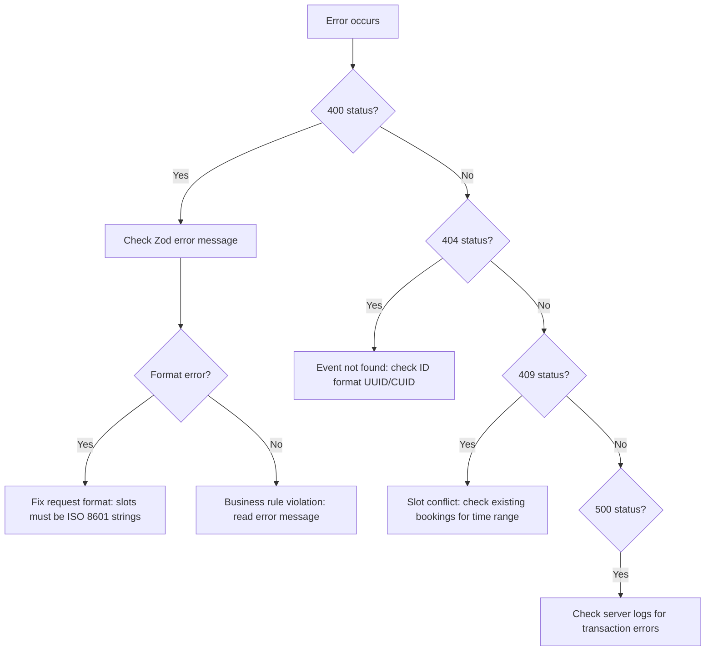

# Troubleshooting & Changelog

## Quick Error Lookup

| Error Pattern                            | Category           | Cause                                             | Fix                                                          |
| ---------------------------------------- | ------------------ | ------------------------------------------------- | ------------------------------------------------------------ |
| `"Slots must be consecutive"`            | Validation         | Gap between selected slots                        | Ensure 30-min intervals with no gaps                         |
| `"Weekly limit exceeded"`                | Subscription       | More calls than `callsPerWeek` in a week          | Remove excess calls; check Sunday-Saturday boundaries        |
| `"Outside scheduling period"`            | Subscription/Class | Slot before startDate or after endDate            | Select within [startDate, endDate]                           |
| `"Slots in the past"`                    | Universal          | Slot < now + 5 seconds                            | Select future slots; 5-second buffer for processing          |
| `"Does not match consultant's schedule"` | Universal          | Slot not within any availability window           | Check weekly/custom availability; ensure correct day-of-week |
| `"No available slots found"`             | Auto allocation    | Consultant has no open slots in the search window | Add availability; check for conflicts                        |
| `"Slot already booked"`                  | Conflict           | Range overlap with existing appointment           | Choose a different time; check for PENDING bookings          |
| `"Invalid slot count"`                   | Manual allocation  | Count not a multiple of slotsPerSession           | Must be exact multiple (e.g., 2, 4, 6 for 1h sessions)       |
| `"Duplicate slots detected"`             | Manual allocation  | Same slot provided twice                          | Remove duplicates from request                               |
| `"Cannot approve requested slots"`       | Requested mode     | No appointments exist for the event               | Consultee needs to resubmit request                          |

## Common Issues

### Validation Errors

**"Slots must be consecutive"**
Slots are sorted by time and checked pairwise: each gap must be exactly 30 minutes (with 1-second tolerance). Common causes:

- Missing a slot in the middle of a block
- Timezone conversion creating small offsets
- Frontend sending slots from different days

**"Does not match consultant's schedule"**
For **weekly** schedules: the validator compares the slot's day-of-week and time-of-day against the availability windows. It uses the `startDay`/`endDay` DayOfWeek enum and `startTimeUtc`/`endTimeUtc` Int fields (minutes since midnight UTC, 0-1439).

For **custom** schedules: the validator checks overlap between the proposed 30-min slot and each custom availability range.

### Allocation Failures

**"No N consecutive slots available"**
Auto allocation searched 8 weeks of weekly occurrences (or all custom slots) and couldn't find a consecutive block. Either:

- Consultant doesn't have enough consecutive availability
- All matching slots are already booked
- Scheduling period is too restrictive

**Transaction timeouts**
All allocations run in 60-second Prisma transactions. Large allocations (200+ slots for long subscriptions) may approach this limit. The timeout is generous but not infinite.

### Data Issues

**Calendar showing stale data**
`useCalendarData` fetches in parallel and caches results. Call the refetch functions to force refresh. The server-calculated `bookingStatus` is the source of truth.

**Progress showing wrong count**
`calculateProgress` counts **completed calls** (consecutive groups of `slotsPerSession` slots), not raw slot count. Ensure selected slots form complete sessions.

## Debugging Strategy



**Layer-by-layer approach**:

1. **Layer 1 (Zod)**: Is the request format valid? Check `allocationRequestSchema` or `validationRequestSchema`.
2. **Layer 2 (Business rules)**: Does the request meet business constraints? Check `SlotValidationService` universal + event-specific validators.
3. **Layer 3 (Database)**: Are there constraint violations? Check Prisma transaction logs.

---

## Changelog: March 2026

Security, auth, and booking fix sprint. 12 PRs merged.

| Fix                                          | Severity   | Description                                                                                                                                                                                                                                           | Files / PRs                                                   |
| -------------------------------------------- | ---------- | ----------------------------------------------------------------------------------------------------------------------------------------------------------------------------------------------------------------------------------------------------- | ------------------------------------------------------------- |
| Slot endpoint auth                           | Critical   | `/api/slots/` added to `AUTHENTICATED_API_PREFIXES`. All slot endpoints now require session cookie. `/api/slots/availability/` and `/api/slots/availability-with-allocation/` exempted as public.                                                      | `middleware.ts`                                               |
| Appointment endpoint auth                    | Critical   | `GET /api/slots/appointments` requires own-profile filter for non-privileged users. `POST` is admin/staff only. `GET/PATCH` on `[appointmentId]` require participant check. `PUT/DELETE` are admin/staff only. `PATCH` uses consultant-only check.     | `app/api/slots/appointments/`                                 |
| Trials stats auth                            | High       | `/api/trials/stats` removed from `PUBLIC_API_PREFIXES`. Now requires auth + ownership check.                                                                                                                                                          | `middleware.ts`, `app/api/trials/stats/`                      |
| Slot conflict filter                         | High       | Checkout conflict check now uses `buildOccupiedAppointmentFilter()`. Cancelled/rejected/expired appointment slots no longer block new bookings.                                                                                                        | `lib/payments/operations/checkout.ts`                         |
| Waitlist checkout validation                 | High       | `fromWaitlist` validated inside `revalidateInsideLock()`: ownership, NOTIFIED status, not expired.                                                                                                                                                     | `lib/payments/operations/checkout.ts`                         |
| Status filters in appointments API           | Medium     | Status filters now work correctly with proper enum per type: `RequestStatus` for consultation/subscription, event status for webinar/class.                                                                                                            | `app/api/slots/appointments/`                                 |
| Planner participant counts                   | Medium     | Participant counts exclude consultant host and deduplicate across multi-slot webinars.                                                                                                                                                                 | Planner components                                            |
| Consultee dashboard events                   | Medium     | Dashboard events API now includes webinars/classes where user has WAITING/NOTIFIED/BOOKED waitlist entry, not just slot presence.                                                                                                                       | Dashboard API routes                                          |
| Verification document upload limit           | Medium     | Server-side limit of 10 documents per verification. Ownership validated before connecting document IDs.                                                                                                                                                | Verification API routes                                       |
| Document bucket private                      | High       | Documents bucket switched to private (`public: false`). All URLs now use `createSignedUrl()` with `supabaseAdmin`. Download proxy requires service role key.                                                                                           | Document storage utils, Supabase config                       |
| Trial cancellation cleanup                   | Medium     | `PATCH CANCELLED` now cleans up appointment/slots (matching DELETE). `DELETE` now sends cancellation notifications (matching PATCH). Both wrapped in transactions.                                                                                      | `app/api/trials/[trialId]/route.ts`                           |
| Trial CONVERTED handler                      | Medium     | CONVERTED handler requires `subscriptionId` in body, validates same plan/consultee, links via `convertedToSubscriptionId`, calls `logTrialConverted()`.                                                                                                | `app/api/trials/[trialId]/route.ts`                           |
| Collaborator Stream cleanup                  | Medium     | Removed collaborators are now removed from Stream event channels AND plan-level collab channels (`collab-webinar-{planId}`). Notification and Stream removal have independent try/catch.                                                                | `lib/collaborators/service.ts`                                |

---

## Changelog: January-February 2025

| Fix                            | Severity   | Description                                                                                                                                                                                                                                                              | Files                                                               |
| ------------------------------ | ---------- | ------------------------------------------------------------------------------------------------------------------------------------------------------------------------------------------------------------------------------------------------------------------------ | ------------------------------------------------------------------- |
| validateWeeklyDistribution     | Medium     | Was counting raw **slots** and comparing to `callsPerWeek` (which counts **calls**). For 1h sessions (2 slots/call) with 2 calls/week: 4 slots > 2 = false warning. Now divides by `slotsPerSession` before comparing.                                                   | `useSlotAllocation.ts`                                              |
| callsPerWeek === 1 guard       | Medium     | Secondary weekly limit check in `toggleSlot` was guarded by `callsPerWeek === 1`, making it dead code for multi-call subscriptions. Removed guard and generalized to all callsPerWeek values.                                                                            | `useSlotAllocation.ts`                                              |
| weeklyConfirmedCalls counting  | Medium     | Used `Map.size` (count of weeks-with-calls) instead of summing actual call counts across weeks. Changed to `.reduce()` sum.                                                                                                                                              | `useSlotAllocation.ts`                                              |
| Hardcoded \* 4 weeks-per-month | Low-Medium | `totalSessions = callsPerWeek * durationInMonths * 4` in subscription plan API. Replaced with `SlotCalculationService.countWeeks()`.                                                                                                                                     | `api/plans/subscriptions/route.ts`, `[subscriptionPlanId]/route.ts` |
| getUTCDay() on epoch dates     | Medium     | `validateMatchesSchedule` used `availStart.getUTCDay()` which fails for 1970 epoch reference dates. Now uses `startDay` DayOfWeek enum (source of truth). Time stored as `startTimeUtc`/`endTimeUtc` Int (minutes since midnight UTC). Corrupt slots logged and skipped. | `SlotValidationService.ts`                                          |
| Auto-expansion feature         | Feature    | When selecting first slot of a multi-slot session, auto-selects consecutive adjacent slots.                                                                                                                                                                              | `useSlotAllocation.ts`                                              |
| Calendar display fixes         | Low        | Cancelled/rejected appointments were still showing as booked. Fixed status filtering.                                                                                                                                                                                    | `useCalendarData.ts`                                                |
| Session calculation accuracy   | Low        | Improved `totalSessions` and `totalHours` accuracy in subscription plan metadata.                                                                                                                                                                                        | Subscription plan API routes                                        |

## Changelog: December 2024

Major refactor: migrated from custom `InputValidator` to Zod schemas (~75% code reduction).

| #   | Fix                                                                 | Severity |
| --- | ------------------------------------------------------------------- | -------- |
| 1   | Double-booking via exact-match instead of range overlap             | Critical |
| 2   | Auto-allocation ignoring booked slots (missing lookup set)          | Critical |
| 3   | Slots outside scheduling period accepted                            | High     |
| 4   | Missing duration validation (division by zero)                      | High     |
| 5   | Only checking APPROVED consultations for conflicts (missed PENDING) | High     |
| 6   | Expired payment appointments blocking new bookings                  | Medium   |
| 7   | Reschedule changing total slot count                                | Medium   |
| 8   | Date range validation not enforced server-side                      | Medium   |
| 9   | Non-consecutive slots accepted for consultations                    | Medium   |
| 10  | Duplicate slot submission accepted                                  | Low      |

---

## Testing Checklist

After any booking algorithm change, verify:

### Per Event Type

- [ ] **Consultation**: Consecutive slots, same day, correct count for duration
- [ ] **Subscription**: Weekly distribution, total calls, scheduling period, 1 call/day max
- [ ] **Webinar**: Consecutive slots, single appointment created
- [ ] **Class**: Session distribution, weekly limits, complete sessions per day

### Cross-Type

- [ ] Conflict detection across all event types (subscription slot blocks consultation, etc.)
- [ ] Auto allocation finds slots correctly
- [ ] Manual allocation rejects invalid inputs
- [ ] Requested allocation verifies existing appointments

### Edge Cases

- [ ] Minimum duration (0.5h = 1 slot)
- [ ] Maximum duration (4h = 8 slots)
- [ ] callsPerWeek = 1 (single call subscriptions)
- [ ] callsPerWeek = 7 (daily subscriptions)
- [ ] Odd callsPerWeek values (3, 5, 7)
- [ ] Month boundaries (slots crossing month change)
- [ ] Scheduling period boundaries (first/last day)
- [ ] Past slots rejected
- [ ] Concurrent booking attempts (conflict detection)

### Run Tests

```bash
npm run test
```

All tests should pass. Current count: 538 tests.
