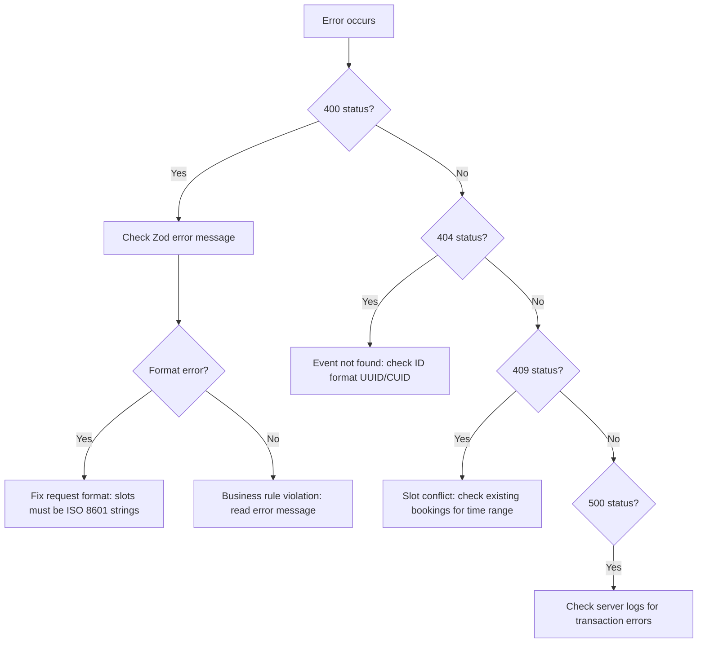

# Troubleshooting & Changelog

## Quick Error Lookup

| Error Pattern                            | Category           | Cause                                             | Fix                                                          |
| ---------------------------------------- | ------------------ | ------------------------------------------------- | ------------------------------------------------------------ |
| `"Slots must be consecutive"`            | Validation         | Gap between selected slots                        | Ensure 30-min intervals with no gaps                         |
| `"Weekly limit exceeded"`                | Subscription       | More calls than `sessionsPerWeek` in a week       | Remove excess calls; check Sunday-Saturday boundaries        |
| `"Outside scheduling period"`            | Subscription/Class | Slot before startDate or after endDate            | Select within [startDate, endDate]                           |
| `"Slots in the past"`                    | Universal          | Slot < now + 5 seconds                            | Select future slots; 5-second buffer for processing          |
| `"Does not match consultant's schedule"` | Universal          | Slot not within any availability window           | Check weekly/custom availability; ensure correct day-of-week |
| `"No available slots found"`             | Auto allocation    | Consultant has no open slots in the search window | Add availability; check for conflicts                        |
| `"Slot already booked"`                  | Conflict           | Range overlap with existing appointment           | Choose a different time; check for PENDING bookings          |
| `"Invalid slot count"`                   | Manual allocation  | Count not a multiple of slotsPerSession           | Must be exact multiple (e.g., 2, 4, 6 for 1h sessions)       |
| `"Duplicate slots detected"`             | Manual allocation  | Same slot provided twice                          | Remove duplicates from request                               |
| `"Cannot approve requested slots"`       | Requested mode     | No appointments exist for the event               | Consultee needs to resubmit request                          |

## Common Issues

### Validation Errors

**"Slots must be consecutive"**
Slots are sorted by time and checked pairwise: each gap must be exactly 30 minutes (with 1-second tolerance). Common causes:

- Missing a slot in the middle of a block
- Timezone conversion creating small offsets
- Frontend sending slots from different days

**"Does not match consultant's schedule"**
For **weekly** schedules: the validator compares the slot's day-of-week and time-of-day against the availability windows. It uses the `startDay`/`endDay` DayOfWeek enum and `startTimeUtc`/`endTimeUtc` Int fields (minutes since midnight UTC, 0-1439).

For **custom** schedules: the validator checks overlap between the proposed 30-min slot and each custom availability range.

### Allocation Failures

**"No N consecutive slots available"**
Auto allocation searched 8 weeks of weekly occurrences (or all custom slots) and couldn't find a consecutive block. Either:

- Consultant doesn't have enough consecutive availability
- All matching slots are already booked
- Scheduling period is too restrictive

**Transaction timeouts**
All allocations run in 60-second Prisma transactions. Large allocations (200+ slots for long subscriptions) may approach this limit. The timeout is generous but not infinite.

### Data Issues

**Calendar showing stale data**
`useCalendarData` fetches in parallel and caches results. Call the refetch functions to force refresh. The server-calculated `bookingStatus` is the source of truth.

**Progress showing wrong count**
`calculateProgress` counts **completed calls** (consecutive groups of `slotsPerSession` slots), not raw slot count. Ensure selected slots form complete sessions.

**Historical: the calendar accepted a selection the server then rejected near midnight IST**
Before July 2026 the client bucketed daily and weekly limits by the browser's local day while the server bucketed by its own (UTC in production), so for slots between 00:00 and 05:30 IST the two sides disagreed — the calendar would allow a selection that the allocate endpoint rejected with a `WEEKLY_LIMIT` or `DAILY_LIMIT` error (or, in the other direction, block a selection the server would have accepted). Both sides now bucket with `SlotCalculationService.dayKey()`/`weekKey()` in the event's scheduling timezone (ADR B9). If this symptom reappears, look for a new call site that buckets with `toDateString()`, date-fns `startOfWeek`, or local `getDay()` instead of the shared helpers.

**"Already allocated" toast when clicking Allocate**
The Allocate Slots dialog sends `initialAllocation: true`, so the server returns 409 when the request already has confirmed slots — typically because the same request was allocated from another tab or by another teammate moments earlier (ADR B10). The dialog closes and the request list refreshes; this is the intended outcome, not an error to investigate. Reschedule flows do not send the flag and are unaffected.

## Debugging Strategy



**Layer-by-layer approach**:

1. **Layer 1 (Zod)**: Is the request format valid? Check `allocationRequestSchema` or `validationRequestSchema`.
2. **Layer 2 (Business rules)**: Does the request meet business constraints? Check `SlotValidationService` universal + event-specific validators.
3. **Layer 3 (Database)**: Are there constraint violations? Check Prisma transaction logs.

---

## Changelog: 2026-08-14 — documentation refresh

Docs-only pass shipped as the final PR of the #1169 booking + maintenance productionization train, closing the long-standing booking-docs drift item #1013. No code changed in this entry.

| Change                         | Area                                       | Description                                                                                                                                                                                                                                                                                                                                                                                                                                                                                                                                                        |
| ------------------------------ | ------------------------------------------ | ------------------------------------------------------------------------------------------------------------------------------------------------------------------------------------------------------------------------------------------------------------------------------------------------------------------------------------------------------------------------------------------------------------------------------------------------------------------------------------------------------------------------------------------------------------------ |
| Collaborators de-drift         | `docs/collaborators/`                      | All seven files rewritten against the merged `Collaborator` model (#784): typed permission booleans replacing the JSON override (#768), basis-point shares (#772 B5), pool-based split with floors (#778 §C-2), and the co-host availability guard (AE-2), which is enforced on webinar plans only.                                                                                                                                                                                                                                                                |
| Org-funded checkout documented | `docs/booking/17-org-funded-checkout.md`   | New page covering the sponsored rail end to end — resolution chain, gateway skip, wallet/engagement debits, inline settlement, internal refunds — previously documented nowhere in this folder.                                                                                                                                                                                                                                                                                                                                                                    |
| Funding-seam citations         | `docs/payments/05-b2c-b2b-funding-seam.md` | Stale file:line references re-verified and corrected.                                                                                                                                                                                                                                                                                                                                                                                                                                                                                                              |
| Prompts corpus                 | `prompts/`                                 | New index README; enterprise shared-setup corrected (deleted three-ledger models replaced by the double-entry journal, seed cohort reconciled with the verification guide); two new booking case files (007 reschedule-response loop for #1162, 008 maintenance-freeze correctness for #1163).                                                                                                                                                                                                                                                                     |
| Booking doctrine skill         | `.claude/skills/booking-doctrine/`         | The subsystem's invariants (CAS transitions, nothing-is-deleted, refund front doors, lock namespaces, sidecars, org scoping, testing recipes) captured for future agents.                                                                                                                                                                                                                                                                                                                                                                                          |
| Cancellation flow rewritten    | `docs/booking/08-cancellation-flow.md`     | The chapter still taught delete-on-cancel, no authentication and no refunds — the three claims #1013 was raised against. Walkthrough, diagrams, record tables and error contract now match the route: soft-cancel under a CAS guard, participant/privileged/org-admin authorization (#1166), and the automatic policy refund. The #1006 manual-review escalation for partly-consumed subscriptions is gone, replaced by the linear per-session proration that closed it; the only surviving `MANUAL_REVIEW` path is the credit-funded partial-window case (#1161). |
| Lock namespaces corrected      | `.claude/skills/booking-doctrine/SKILL.md` | Rule 4 still listed `trial-slot-booking:` as a live namespace. #1170 retired it: trials take the shared `slot-booking:` atom keys, one key per 30-minute atom of the booked interval.                                                                                                                                                                                                                                                                                                                                                                              |

---

## Changelog: July 2026

Booking-calendar correctness sweep (branch `fix/booking-algorithm-calendar`, tracking the Request Calendar work under #997).

| Fix                                           | Severity | Description                                                                                                                                                                                                                                                                                                                                                                                           | Files / PRs                                                                                                                                                                         |
| --------------------------------------------- | -------- | ----------------------------------------------------------------------------------------------------------------------------------------------------------------------------------------------------------------------------------------------------------------------------------------------------------------------------------------------------------------------------------------------------- | ----------------------------------------------------------------------------------------------------------------------------------------------------------------------------------- |
| Scheduling-timezone limit bucketing (ADR B9)  | Critical | All daily/weekly limit bucketing unified on `SlotCalculationService.dayKey()`/`weekKey()` in the event's `schedulingTimezone` (default Asia/Kolkata) across the client guards, the client auto-allocator, and the server validators. Removes the client/server verdict divergence near day boundaries AND makes "one session per day" match the day Indian customers see. Display stays viewer-local. | `useSlotAllocation.ts`, `slotSelectionValidation.ts`, `UnifiedCalendar.tsx`, `allocationAlgorithms.ts`, `calendarUtils.ts`, `SlotValidationService.ts`, `subscriptionValidation.ts` |
| `initialAllocation` multi-tab guard (ADR B10) | Critical | Fresh dialog allocations 409 instead of silently replacing an allocation that landed from another tab; checked under the locks and re-checked in-transaction for all three modes.                                                                                                                                                                                                                     | `SlotAllocationService.ts`, allocate routes, `validationSchemas.ts`                                                                                                                 |
| Client Idempotency-Key wiring                 | High     | Every client allocate path now sends an `Idempotency-Key` (reused when the identical payload is retried), activating the existing #837 replay path; previously no client sent the header. 409s surface a dedicated "already allocated" toast, close the dialog, and refresh the list; window focus also refetches.                                                                                    | `allocationService.ts`, `useSlotAllocation.ts`, `RequestSlotAllocationTab.tsx`                                                                                                      |
| Requested-path parity                         | High     | The requested-slots path (formerly `preAllocate`, renamed `allocateRequestedSlots`) now honors the plan's `totalSessions` and subtracts `pastConfirmedSlotCount`, matching manual/auto; it previously rejected valid in-progress reschedules.                                                                                                                                                         | `allocationAlgorithms.ts`, `useSlotAllocation.ts`                                                                                                                                   |
| 4-weeks/month fallback removed                | Medium   | A subscription with neither `totalSessions` nor a scheduling period now renders a disabled "plan configuration incomplete" row (with a Sentry event) instead of guessing `sessionsPerWeek × 4 × months`, which the server rejected anyway.                                                                                                                                                            | `RequestSlotAllocationTab.tsx`                                                                                                                                                      |
| Toast queue                                   | Medium   | The allocation hook queues toasts instead of holding one pending slot, so same-tick messages no longer overwrite each other; all wording now comes from one `allocationMessages` catalog shared by the week view, month view, and requests table.                                                                                                                                                     | `useSlotAllocation.ts`, `allocationMessages.ts`                                                                                                                                     |
| Dead code removed                             | Low      | Unused `_validateSessionDistribution`/`_validateDailyCalls`/`_validateTotalCalls`, the duplicated local-week `groupSlotsByWeek`, and the four copy-pasted per-type allocate fetch methods were deleted; selection validators extracted to `slotSelectionValidation.ts` (unit-tested, and the seed for #997 Phase 3).                                                                                  | Shared calendar utils                                                                                                                                                               |

---

## Changelog: August 2026

Booking algorithm Pre-MVP wave (`fix/booking-algorithm`, tracker #1072).

| Fix                                                   | Severity | Description                                                                                                                                                                                                                                                                                                                                                                                                                                                                                        | Files / Issues                                                                                    |
| ----------------------------------------------------- | -------- | -------------------------------------------------------------------------------------------------------------------------------------------------------------------------------------------------------------------------------------------------------------------------------------------------------------------------------------------------------------------------------------------------------------------------------------------------------------------------------------------------- | ------------------------------------------------------------------------------------------------- |
| Allocation audit wave (PR #1191)                      | Critical | Class session duration unified on the plan field (the avg-of-contents derivation disagreed with /validate and slot creation); auto-allocate honors the validator's per-day caps (class 2/day — dense classes no longer unallocatable); payment-guarded appointment deletes (`deleteMany where payment: { none }`, closing a Payment-cascade race); occupancy reads bounded to live intervals; `deletedAt` excluded from every occupancy path.                                                      | `SlotAllocationService.ts`, `sessionCaps.ts` — PR #1191                                           |
| Journey hardening wave (PR 2a)                        | Critical | See the entries marked **B1–B9** below — from the full booking-journey + flash-sale audit.                                                                                                                                                                                                                                                                                                                                                                                                         |
| Flash-sale checkout behavior (PR 2b)                  | High     | Webinar/class checkout runs an optimistic capacity pre-check BEFORE the event mutex (sold-out buyers fail fast with `EVENT_SOLD_OUT`, no mutex queueing); checkout lock waiters are bounded to ~7s (`CHECKOUT_WAIT_RETRY_CONFIG`) so losers get structured `EVENT_CHECKOUT_BUSY` / `CONSULTEE_BOOKING_BUSY` 409s with `retryAfter` instead of raw 504s; all four client submit paths auto-retry a BUSY 409 exactly once (idempotency-key dedupe-safe). Serializable recount remains authoritative. | `checkout.ts`, `appointmentlock.ts`, checkout route, 4 submit paths                               |
| Notifications + expiry money closure (PR 2c)          | Critical | Allocation-time APPOINTMENT_BOOKED to both parties from EVERY caller path (routes/auto-confirm/accept-proposal) — completing B9's deferral; reschedule ACCEPTED now notifies initiator + other party (MOVED arm); the expiry sweep refunds SUCCEEDED payments of expired engagements via `refundBookingPayment` and drains the immortal APPROVED-unallocated cohort (EXPIRED allowed-from widened to APPROVED).                                                                                    | `SlotAllocationService.ts`, `reschedule-respond.ts`, `expire-stale-requests.ts`, `transitions.ts` |
| Docs: state machines + DST posture (PR 2d)            | Medium   | New generated reference [18-state-machines.md](./18-state-machines.md) projecting every transition map (incl. PR 2c's APPROVED→EXPIRED widening) plus the CAS-bypass inventory of raw-status writers with their guard shapes; new [19-dst-and-timezone-posture.md](./19-dst-and-timezone-posture.md) documents the #872 frozen-offset stub, its silent travel hazard, and the four rules for touching availability time math.                                                                      | `docs/booking/18`, `docs/booking/19`, `README`                                                    |
| Allocation resilience — cause-specific errors (PR 2e) | High     | The four allocate routes now forward the structured `errorCode` to the client; `allocationFailedWithCode()` maps NO_AVAILABILITY / PERIOD_ENDED / SLOT_SHORTAGE to cause-specific toast titles; a scheduling period in the past returns PERIOD_ENDED with an actionable message instead of the opaque "0 of N"; stale-reschedule 409s render as "Request changed" instead of mislabeled "Already allocated".                                                                                       | allocate routes ×4, SlotAllocationService.ts, allocationMessages.ts, useSlotAllocation.ts         |

### Booking-journey audit fixes (PR 2a)

| Fix                                       | Severity | Description                                                                                                                                                                                                                                                                                                                                                                                                                       | Files / Issues                                                                             |
| ----------------------------------------- | -------- | --------------------------------------------------------------------------------------------------------------------------------------------------------------------------------------------------------------------------------------------------------------------------------------------------------------------------------------------------------------------------------------------------------------------------------- | ------------------------------------------------------------------------------------------ |
| B1 — RFA hold hygiene                     | P0       | Request-for-approval caps each user at **3 ACTIVE pending requests** (a PENDING request pins a tentative slot; the old 10/hour limiter let a bot farm pin a consultant's whole calendar for up to 30 days). The stale-request sweep now expires PENDING consultations after **48h** (was 30d), runs **hourly** (was daily), and releases their tentative slots in the same pass.                                                  | `request-for-approval/route.ts`, `lib/booking/request-caps.ts`, `expire-stale-requests.ts` |
| B2 — capture-after-cancel on events       | P1       | Webinar/class capture confirmation is CAS-guarded (`EVENT_ALLOWED_FROM.SCHEDULED`). A capture landing on a CANCELLED/DRAFT event no longer resurrects it to SCHEDULED nor re-confirms its slots — it returns `capturedAfterTerminal` and Phase 2 auto-refunds, exactly like consultations since #855. Benign replays (already SCHEDULED/IN_PROGRESS/COMPLETED) still confirm idempotently.                                        | `lib/payments/webhooks/handlers.ts`                                                        |
| B3 — legacy slot-mutation API removed     | P1       | `PATCH/PUT/DELETE /api/slots/appointments/[id]` deleted: PATCH was a blind delete-all+recreate with no locks/validation whose recreated confirmed slots carried no `consultantProfileId` (outside the GiST guard); DELETE hard-deleted appointments against the soft-cancel doctrine (#1193). No in-repo caller existed.                                                                                                          | `app/api/slots/appointments/[appointmentId]/route.ts`                                      |
| B7 — dead-slot projections                | P1       | Consultant Home Today/Upcoming/action-items filter dead + tentative rows (a released reschedule slot no longer renders as "Today's Appointment"); org appointment list selects `deletedAt` + `meetingSession` so Join state sees tombstones and host-ended calls; dashboard seed filters non-SCHEDULED rows.                                                                                                                      | `appointmentHelpers.ts`, `list-appointments.ts`, `consultant-dashboard.ts`                 |
| B8a/b — lock order + webhook GiST         | P2       | RFA takes the consultee lock BEFORE the slot atoms (checkout's order — the reverse was an ABBA deadlock waiting to happen, and the missing arm let a user double-book themselves across consultants). A LEGACY-shape capture that trips `slot_no_confirmed_overlap` inside the webhook create is now modelled: SUCCEEDED stamped outside the rolled-back tx, then auto-refund — instead of looping the sweeper on captured money. | `request-for-approval/route.ts`, `handlers.ts`                                             |
| B9 — guest redirect + honest notification | P2       | Guest "Request approval" redirects to sign-in with `callbackUrl` (matching the Buy path) instead of a toast dead-end; APPOINTMENT_BOOKED notification is skipped when no slot exists yet (subscription placeholder rendered a blank date placeholder) — allocation-time notification lands in PR 2c.                                                                                                                              | `ConsultationPricingToggle.tsx`, `handlers.ts`                                             |

| Trial slots enter the exclusion constraint | Critical | Trial slot create stamps `consultantProfileId`, bringing trials inside `slot_no_confirmed_overlap`; availability validation moved inside the scheduling transaction and now also checks the consultee's calendar. | `app/api/trials/[trialId]/route.ts` — #1169 PR 1, #1093 §1 |
| One lock namespace, interval-granular | Critical | Checkout, request-for-approval and trials all lock the same `slot-booking:` keys, one per 30-minute atom of the interval, so overlapping bookings with different starts collide; the private trial namespace is retired. Booking locks fail closed on an unreachable Redis. | `utils/appointmentlock.ts`, `checkout.ts`, ADR B11 — #1169 PR 1 |
| Held-session slots survive re-allocation | High | `deleteExistingAppointments` never deletes a slot whose `MeetingSession` exists (the delete cascaded to `Recording`); appointments with held sessions are preserved like payment-bearing ones. | `SlotAllocationService.ts` — #1169 PR 1 |
| Capacity include-trap throws | High | `getWebinarCapacity` / `getClassCapacity` throw when slots were loaded without the `user` relation instead of silently counting a sold-out event as empty. | `lib/events/capacity.ts` — #676 CN-4 |
| Deterministic org-payment pick | Medium | The subscription org-cap debit selects the EARLIEST org-tagged payment instead of an unordered `.find()`, so retry chains debit the right `ProgramAssignment` cycle. | `SlotAllocationService.ts` — #1169 PR 1 |
| Dead admin slot-create endpoint removed | Medium | `POST /api/slots/appointments` wrote a non-existent `type` column (every call 500'd) and bypassed all validation and locking; the handler is deleted, GET stays. | `app/api/slots/appointments/route.ts` — #1169 PR 1 |
| Contiguous N×30min planner runs | Critical | Webinar/class **create** writes allocator-parity atoms via `buildContiguousSlotAtoms`. Webinar **PATCH** rewrites the live run via `replaceContiguousSlotRun` (reconcile in place — no `deleteMany`, so Stream `MeetingSession`/`Recording` survive). Class PATCH does not rewrite slot times on duration edits. | `lib/appointments/contiguous-slot-run.ts`, webinar/class `crud-with-plan` — #1071 |
| Reconcile avoids exclusion self-collision | Critical | Before shifting confirmed atoms, `replaceContiguousSlotRun` `updateMany`s live rows to `isTentative: true` so `slot_no_confirmed_overlap` cannot 23P01 a run against itself mid-statement. | `contiguous-slot-run.ts` — PR #1091 |
| Live-slot reads ignore dead/tombstoned rows | Critical | Planner webinar PATCH filters `CANCELLED`/`RESCHEDULED`/`deletedAt`; `isDeadSlot` also treats `deletedAt` as dead (affects run math / join / reschedule affordances). | `slots.ts`, webinar `crud-with-plan` — #1071 |
| Reschedule stale-tab precondition | Critical | Allocate accepts `expectedTentativeSlotCount`; mismatch → 409. Auto/manual re-assert inside the write txn (not only the pre-txn read), matching requested-slots — covers races `guardInitialAllocationInTx` skips on reschedule. | `SlotAllocationService`, allocate routes, SlotPicker — #1012 |
| Consultee kind-gates + self-leave | High | Hide impossible Reschedule/Cancel; trial cancel via trial API; group Leave Event via participant DELETE self. Webinar leave closes once the first live atom has started; class leave closes once the **last** live session has started. Self-leave refunds use attendee notice tiers (`initiatedBy: "attendee"`, next future slot for `hoursUntilStart`). | `consultee-affordances.ts`, adapter, participant routes, `event-refunds.ts` — #1005 |
| #997 Phase 3 weekly-limit parity | Medium | `useSlotAllocation` weekly guard now includes server `weeklyConfirmedCallCounts` (Phase 2 grid already shipped). Residual: per-cell rule-flag payload still optional follow-up. | `useSlotAllocation.ts`, `UnifiedCalendar.tsx` — Part of #997 |
| ClassPlan 30-min duration refine | Medium | `sessionDurationInHours` must be a multiple of 0.5 on create / when the field changes. Class PATCH grandfathers an unchanged legacy duration so unrelated edits (title/price) still succeed. | `schemas/plans.ts`, class `crud-with-plan` PATCH |
| Novu inbox popover sizing | Low | Fixed notification popover height/scroll (unrelated to booking integrity; shipped on the same branch). | `NotificationInbox.tsx` |

The rest of the month went to the #1169 booking and maintenance productionization train. Its first wave carried its own documentation; the rows below cover the late PRs, which shipped without it. PR #1177 stacks on PR #1174 and merges after it.

| Fix                                                         | Severity | Description                                                                                                                                                                                                                                                                                                                                                                                                                                                                                                                                                                                                                                                                                                                                                                                                                                                                                                                                                                                                                                                                                                                                                                                           | Files / Issues                                                                                                                                                 |
| ----------------------------------------------------------- | -------- | ----------------------------------------------------------------------------------------------------------------------------------------------------------------------------------------------------------------------------------------------------------------------------------------------------------------------------------------------------------------------------------------------------------------------------------------------------------------------------------------------------------------------------------------------------------------------------------------------------------------------------------------------------------------------------------------------------------------------------------------------------------------------------------------------------------------------------------------------------------------------------------------------------------------------------------------------------------------------------------------------------------------------------------------------------------------------------------------------------------------------------------------------------------------------------------------------------- | -------------------------------------------------------------------------------------------------------------------------------------------------------------- |
| Reschedule proposals can finally be answered                | Critical | `POST /api/appointments/[appointmentId]/reschedule/respond` closes a loop that #1064 never actually shipped, since `ACCEPTED` and `DECLINED` existed only as enum members. Accept re-validates the proposed times through the full allocator in manual mode under the consultant-wide lock — the same machinery auto-confirm trusts, so nothing is written unless validation commits — and then finalizes the request to `ACCEPTED` by compare-and-set. Decline is a guarded transition to `DECLINED` that deliberately leaves the released slots in the consultant's allocate queue, because the initiator still wants to move; withdraw remains the initiator-only exit that restores the booking. Authorization is the counterparty alone, with the withdraw route's anti-oracle 404 discipline. The consultee event reads now carry the live proposal and its proposed times, so a consultant-initiated reschedule stops rendering as an indefinite "Awaiting schedule confirmation".                                                                                                                                                                                                             | `app/api/appointments/[appointmentId]/reschedule/respond/route.ts`, `lib/booking/reschedule-respond.ts`, `lib/data/consultee-events-read.ts` — #1163, PR #1174 |
| Org admins act on the payer side                            | High     | An `OWNER` or `MAINTAINER` of the organization funding an appointment may now cancel and reschedule it, resolved through `lib/booking/org-actor.ts`. Their cancellations tier exactly as the buyer's own would, so an org admin never trips the consultant-initiated 100% arm, and their reschedule proposals carry the consultee role, which leaves the existing auto-confirm consent semantics unchanged.                                                                                                                                                                                                                                                                                                                                                                                                                                                                                                                                                                                                                                                                                                                                                                                           | `lib/booking/org-actor.ts`, cancel and reschedule routes — #1166, PR #1174                                                                                     |
| Linear per-session proration                                | Critical | A partially consumed subscription's refundable base is now the undelivered share, `floor(gross × sessionsRemaining / totalSessions)`, tiered by the frozen policy snapshot and clamped to the refundable amount. It replaces a ₹0 refund plus a `MANUAL_REVIEW` escalation that killed every remaining session while returning nothing. A fully undelivered subscription reduces to the previous whole-price behaviour.                                                                                                                                                                                                                                                                                                                                                                                                                                                                                                                                                                                                                                                                                                                                                                               | cancel route, `lib/booking/cancellation-scope.ts` — Closes #1006, PR #1174                                                                                     |
| Credit-funded cancels reach the restoration rail            | Critical | The cancel route now detects `free_` payment intents and restores the credit in full inside a 100% window, recording a durable `FREE_CREDIT_PARTIAL_RESTORATION_UNDEFINED` escalation in partial windows because partial credit restoration has no product rule yet. That branch was dead on arrival until `fc9defcf`: `resolveBookingRefundContext` filtered funding payments to `amount > 0`, so a fully credit-funded zero-amount payment never became `paidPayment` and the branch could never fire. The floor is gone, and zero-amount rows now pass through the tier math harmlessly because the credit branch runs first.                                                                                                                                                                                                                                                                                                                                                                                                                                                                                                                                                                      | `lib/booking/cancellation-scope.ts`, cancel route — #1161, PR #1174                                                                                            |
| Cancel audit actor, and channel removal on seat refund      | Medium   | The cancel activity log gained its missing third arm, so a platform or organization actor is recorded as `system` rather than being mislabelled as the consultee, matching the notification payload beside it. Removed webinar and class attendees now lose their Stream event-channel access at refund time through `removeUserFromEventChannel`, instead of keeping it until the nightly expiry job runs, and `notifyAppointmentBooked` carries the session `dateTime`.                                                                                                                                                                                                                                                                                                                                                                                                                                                                                                                                                                                                                                                                                                                             | `lib/activity/log-activity.ts`, webinar and class participant routes, `lib/payments/webhooks/handlers.ts` — #1085, PR #1174                                    |
| The consultee can answer a proposal                         | Critical | `RescheduleProposalCard` mounts on the shared appointment detail page and renders the open request: who proposed it, the current round's times in the viewer's locale, the reason, and the expiry. The counterparty gets Accept and a confirmed Decline whose dialog states plainly that the released times stay with the consultant to re-place, because declining is not cancelling; the initiator gets Withdraw. A `COUNTERED` request shows only the current round's offer. List rows gain a "Review reschedule request" item that navigates to the appointment actually carrying the proposal, which for a subscription is not necessarily the row's anchor child.                                                                                                                                                                                                                                                                                                                                                                                                                                                                                                                               | `components/appointments/detail/RescheduleProposalCard.tsx`, `lib/appointments/consultee-affordances.ts` — Closes #1163, PR #1177                              |
| The consultant inbox routes through respond-accept          | High     | "Use Requested Times" is no longer suppressed when an open `PENDING_REVIEW` consultee proposal names concrete times. The dialog then previews the proposed times and confirms through respond-accept rather than the allocate `PATCH`, which would have confirmed the times while leaving the request dangling open. Consultant-countered and preference-only proposals stay suppressed, and decline gained a confirmation dialog plus the subscription arm it was missing.                                                                                                                                                                                                                                                                                                                                                                                                                                                                                                                                                                                                                                                                                                                           | `RequestSlotAllocationTab.tsx`, `RequestedSlotsDialog.tsx` — PR #1177                                                                                          |
| Cache invalidation was a silent no-op on the org route      | High     | `useEventActions` now takes the adapter's resolved `consulteeId` instead of trusting `useParams`, which returns nothing on the organization detail route because that route has no `[consulteeId]` segment — so every invalidation there quietly did nothing. Cancel and reschedule success also always invalidate the `appointment-detail` key now, rather than only on some paths.                                                                                                                                                                                                                                                                                                                                                                                                                                                                                                                                                                                                                                                                                                                                                                                                                  | `components/appointments/consultee/useEventActions.ts` — PR #1177                                                                                              |
| Trial picker guard, and a misplaced include                 | Low      | The consultee reschedule page refuses `TRIAL` subjects with a plain message instead of drawing a picker whose submit could only 403. Separately, the `rescheduleRequests` include came off the webinar arm of the consultee events read, where proposals cannot exist, so it was a per-row subquery that could never match; the subscription branch gained the include it had been missing, and the `proposedSlots` selects gained `round` for parity with the detail read.                                                                                                                                                                                                                                                                                                                                                                                                                                                                                                                                                                                                                                                                                                                           | consultee reschedule page, `lib/data/consultee-events-read.ts` — PR #1177                                                                                      |
| The availability grid stops being permanently stale         | Critical | The heatmap fetched once per navigation and then never again, so a slot booked by anyone else stayed green until allocation rejected it. It now polls date-dependent availability every 60 seconds, pauses while the tab is hidden, and refetches immediately on a return that is at least 5 seconds stale — that staleness floor is what stops `focus` and `visibilitychange` firing duplicate fetches on the same return. Polls are serialized so the next tick is armed only when the current fetch settles, a poll landing after a navigation is dropped by the existing request-id guard, and a background poll fails silently so a flaky connection cannot toast once a minute. The three decisions are pure functions in `availabilityPolling.ts`, unit-tested without a DOM.                                                                                                                                                                                                                                                                                                                                                                                                                  | `hooks/scheduling/useCalendarData.ts`, `lib/scheduling/availabilityPolling.ts` — Closes #1164, PR #1178                                                        |
| Availability caches, and the one caller that must bypass it | High     | `/api/slots/availability-with-allocation/[consultantId]` now answers `private, max-age=30, stale-while-revalidate=60`. It is `private` rather than the sibling route's `public, s-maxage` because the same URL answers differently per session, and bounded staleness is safe because allocation re-validates server-side regardless. The post-allocation refetch asks for `cache: "no-store"`, without which the consultant refetches straight into the pre-allocation body and does not see the slots they just booked.                                                                                                                                                                                                                                                                                                                                                                                                                                                                                                                                                                                                                                                                             | availability-with-allocation route, `lib/scheduling/allocationService.ts` — #1164, PR #1178                                                                    |
| The client auto-allocator is deleted                        | Medium   | Product code has picked slots server-side since #997 Phase 1, but the client engine it replaced — strategies, time and day scoring, weekly distribution, same-day spacing — survived as a test oracle and read as a usable second allocator sitting next to the real one. It is gone: 589 lines out of `allocationAlgorithms.ts` and the 437 lines of tests that could only have exercised it, inside a PR that removes 1,055 lines against 659 added. What remains is what the application actually calls, the manual and requested pre-validation that runs before submission, and coverage moves to the server allocator's own suites.                                                                                                                                                                                                                                                                                                                                                                                                                                                                                                                                                             | `lib/scheduling/allocationAlgorithms.ts`, `allocationAlgorithms.test.ts`, `mode-parity.test.ts` — #997, #1132, PR #1178                                        |
| Cap rejections name the day they counted                    | Medium   | Day and week caps bucket in the event's scheduling timezone (ADR B9) rather than the viewer's, so for a consultant in another zone "choose a different day" named a day they could not identify. Rejections now name the scheduling bucket and translate its span onto the viewer's clock, and the bounds are computed by snapping through `SlotCalculationService` rather than adding 24 hours or 7 days, so a DST day reads correctly as 23 or 25 hours. The note is empty when the two zones agree. This is the #1076 mitigation, not the full grid redraw — drawing the grid itself in the scheduling timezone remains #1168.                                                                                                                                                                                                                                                                                                                                                                                                                                                                                                                                                                     | `lib/scheduling/allocationMessages.ts`, `SlotCalculationService.ts`, `UnifiedCalendar.tsx` — Closes #1076, PR #1178                                            |
| Real slot conflicts stop reading as "already allocated"     | High     | Every 409 from allocation was relabelled "this request was already allocated in another tab" and tore the dialog down. That is the wrong reading of a slot conflict: `Slot taken during allocation: [CONFLICT] Slot already booked` means the slot went to someone else, while the request itself is still allocatable at a different time. Those messages now render as themselves and the dialog stays open so the consultant can pick again.                                                                                                                                                                                                                                                                                                                                                                                                                                                                                                                                                                                                                                                                                                                                                       | `lib/scheduling/allocationMessages.ts`, `hooks/scheduling/useSlotAllocation.ts` — #1132, PR #1178                                                              |
| Every paid or destructive action shows its price first      | High     | Four surfaces charged or destroyed without ever quoting a number. The trial booking modal and its CTA now render `trialPriceInPaise`, which was a real column the client type simply never declared, formatted with `formatCurrencyAmount` rather than the viewer's FX-converting `formatPrice`, which would relabel a plan already denominated in another currency. A new read-only `GET /api/appointments/[appointmentId]/cancel/preview` computes what cancelling right now would return by reusing the POST route's own pieces — the refund context, the policy percentage, the linear proration base and the same clamp — with authorization mirroring the POST route exactly, and `CancelConfirmationDialog` renders the concrete number, falling back to the old policy sentence on any error. Removing an attendee gained a confirmation dialog and a success toast carrying the actual refund outcome from the response, which the previous code explicitly discarded. The webinar re-entry page reads `getWebinarCapacity` instead of printing the plan's `maxParticipants` while counting nobody, shows real remaining seats, and disables both pay buttons when the instance is sold out. | `cancel/preview/route.ts`, `TrialBookingModal.tsx`, `CancelConfirmationDialog.tsx`, participants page, webinar checkout page — PR #1180                        |
| Razorpay stops dead-ending                                  | Critical | Closing the gateway sheet fires neither `handler` nor `payment.failed`, so the button sat on "Processing…" forever with no way back; `modal.ondismiss` now resets it and says the payment was not completed and can be retried. The blanket `finally` that cleared processing state also un-disabled the button while the sheet was still open, so that state is now owned by the sheet's own exits. Success routes to `/checkout/checkout-success` rather than `/dashboard`, matching Stripe: the poll surface drives the confirmation pipeline synchronously and says so, instead of leaving the buyer on a dashboard that has not caught up yet. `Payment.paymentIntent` holds the Razorpay order id, which is what the verify route keys on, so that is what gets handed over.                                                                                                                                                                                                                                                                                                                                                                                                                    | `app/checkout/components/RazorpayCheckout.tsx` — PR #1180                                                                                                      |
| Reschedule subjects clamp to the plan                       | Medium   | `buildRescheduleSubject` omitted `allowedStart`, `allowedEnd`, `schedulingTimezone`, `sessionsPerWeek` and `totalSessions`, so the subscription and class reschedule grids were unclamped and the consultee's choice was rejected at submit instead of being unselectable with a stated reason. Both shapes are now populated the way the allocate subject does it.                                                                                                                                                                                                                                                                                                                                                                                                                                                                                                                                                                                                                                                                                                                                                                                                                                   | `lib/scheduling/slot-picker-subject.ts` — PR #1180                                                                                                             |
| Price parity pinned, and one divergence recorded            | Medium   | `checkout-price-parity.test.ts` runs 35 assertions across ten fixtures — base, percentage, capped-percentage, fixed and over-value fixed discounts, credit-applied and international — checking page math against the server derivation to within one paise, the two rounding differently by construction. The server's derivation lives inside `createCheckoutSession`'s transaction and is not exported, so the suite imports every pure primitive that derivation uses, the real `determineTax` and the real `MIN_CREDIT_REDEMPTION_PAISE` included, and transcribes only the sequencing, once. It also records a live divergence rather than papering over it: the ₹500 credit-redemption floor is enforced only on the server, so on an order below it the pages show a credit the charge will not honour. That is asserted as a named failing-behaviour test, so the eventual fix turns it red instead of passing silently.                                                                                                                                                                                                                                                                     | `__tests__/payments/checkout-price-parity.test.ts` — Closes #1167, PR #1180                                                                                    |
| Checkout display riders                                     | Low      | The trial checkout page rendered both its session time and its payment deadline with `toLocaleString("en-IN")` and no `timeZone` inside a server component, which resolves against the server's zone — UTC on Netlify; both now render viewer-local through a small client component, and the page, previously orphaned, is linked from the pending-payments widget and the appointment sheet's "Pay now". The "slot starting soon" destructive toast re-fired every 60 seconds for as long as the tab stayed open and now fires once per threshold crossing. `PendingPaymentsWidget` renders a widget-shaped skeleton instead of `null` while loading, and formats non-INR rows in their own currency rather than passing them through an INR-paise converter a second time.                                                                                                                                                                                                                                                                                                                                                                                                                         | trial checkout page, `ViewerLocalTime.tsx`, `PendingPaymentsWidget.tsx`, consultation checkout page — PR #1180                                                 |
| Every scheduled job is locked                               | High     | The fleet audit walked all 61 scheduled workflows and found exactly one running with no mutual exclusion of any kind. `cleanup-empty-folders` is now wrapped in `withCronLock` fail-open — the work is storage-only and harmless to repeat, so the lock exists purely to stop a schedule overlapping a manual dispatch — and its error path throws rather than calling `process.exit`, because a hard exit inside the lock skips `releaseLock` and strands the key until its TTL expires. A `CronLockHeldError` is treated as a clean skip rather than a pageable failure. The hand walk that established the other 60 is now `cron-lock-registry.test.ts`, which re-derives the whole fleet from source on every CI run and fails in both directions, so the exemption list cannot rot into a list nobody rechecked.                                                                                                                                                                                                                                                                                                                                                                                 | `scripts/utils/cleanup-empty-folders.ts`, `__tests__/maintenance/cron-lock-registry.test.ts` — #866, #697, PR #1179                                            |
| A job trail, and a fleet that can notice its own death      | Medium   | Every locked run writes a `SystemJobExecution` row, opened `RUNNING` inside the lock so a held-lock skip leaves no row at all, and closed `COMPLETED` or `FAILED` with a duration and a stack truncated to 8,000 characters. Every step of that bookkeeping is individually guarded, the dynamic Prisma import included, so a workflow with no generated client or no `DATABASE_URL` degrades to no trail rather than to a crash. Separately, every locked run refreshes `cron:heartbeat:last` in Redis and `GET /api/health` exposes its age under a new `cron` field, stale past six hours, so an external monitor with no GitHub dependency can detect schedules being disabled repository-wide — the one failure the heartbeat job cannot report, because it stops along with everything it watches.                                                                                                                                                                                                                                                                                                                                                                                              | `lib/cron/with-cron-lock.ts`, `app/api/health/route.ts` — #697, #866, PR #1179                                                                                 |
| Two janitors bounded                                        | Medium   | `cleanup-tentative-slots` gained a 5,000-row oldest-first per-run cap with a capped-run warning, following the `expire-event-channels` precedent, because its unbounded `findMany` with a five-level include exhausts the function before it can page. `reconcile-slot-availability` bounds its scan to a 60-day window, since overlaps surface within the scheduling horizon and later runs cover later windows. The PR's earlier descope of row-bounding still stands, but it reasoned about `process-data-exports` and `reconcile-document-storage`, whose full-set semantics a `take:` would quietly break — different jobs from these two.                                                                                                                                                                                                                                                                                                                                                                                                                                                                                                                                                       | `scripts/appointments/cleanup-tentative-slots.ts`, `scripts/appointments/reconcile-slot-availability.ts` — commit `fa302aad`, PR #1179                         |
| Finding: 12 of the 61 jobs ignore maintenance mode          | Critical | The maintenance reference claimed 28 jobs and asserted that every one of them called `abortIfMaintenance()`. Both claims were wrong, and the second was wrong in the direction that gets a database corrupted: it told an operator an OFFLINE window was safe for a migration while twelve jobs ran straight through it. The regenerated reference lists those twelve explicitly. None is on the financial list, so what is missing is the OFFLINE protection rather than the DEGRADED one, and they are documented rather than fixed — adding the guard changes when a job runs, and twelve of those decisions do not belong in a PR whose subject is locking.                                                                                                                                                                                                                                                                                                                                                                                                                                                                                                                                       | `docs/maintenance/04-cron-jobs-reference.md` — PR #1179                                                                                                        |

---

## Changelog: March 2026

Security, auth, and booking fix sprint. 12 PRs merged.

| Fix                                          | Severity | Description                                                                                                                                                                                                                                        | Files / PRs                              |
| -------------------------------------------- | -------- | -------------------------------------------------------------------------------------------------------------------------------------------------------------------------------------------------------------------------------------------------- | ---------------------------------------- |
| Slot endpoint auth                           | Critical | `/api/slots/` added to `AUTHENTICATED_API_PREFIXES`. All slot endpoints now require session cookie. `/api/slots/availability/` and `/api/slots/availability-with-allocation/` exempted as public.                                                  | `middleware.ts`                          |
| Appointment endpoint auth                    | Critical | `GET /api/slots/appointments` requires own-profile filter for non-privileged users. `POST` is admin/staff only. `GET/PATCH` on `[appointmentId]` require participant check. `PUT/DELETE` are admin/staff only. `PATCH` uses consultant-only check. | `app/api/slots/appointments/`            |
| Trials stats auth                            | High     | `/api/trials/stats` removed from `PUBLIC_API_PREFIXES`. Now requires auth + ownership check.                                                                                                                                                       | `middleware.ts`, `app/api/trials/stats/` |
| Slot conflict filter                         | High     | Checkout conflict check now uses `buildOccupiedAppointmentFilter()`. Cancelled/rejected/expired appointment slots no longer block new bookings.                                                                                                    | `lib/payments/operations/checkout.ts`    |
| Waitlist checkout validation (since removed) | High     | `fromWaitlist` validated inside `revalidateInsideLock()`. Superseded: the event waitlist was retired.                                                                                                                                              | `lib/payments/operations/checkout.ts`    |
| Status filters in appointments API           | Medium   | Status filters now work correctly with proper enum per type: `AppointmentStatus` for consultation/subscription, event status for webinar/class.                                                                                                    | `app/api/slots/appointments/`            |
| Planner participant counts                   | Medium   | Participant counts exclude the consultant host. For webinars spanning multiple 30-min slots, the same attendee is counted once (not per-slot) via unique user set.                                                                                 | Planner components                       |
| Consultee dashboard events (since revised)   | Medium   | Dashboard events API included waitlisted webinars/classes. Superseded: membership is slot presence only.                                                                                                                                           | Dashboard API routes                     |
| Verification document upload limit           | Medium   | Server-side limit of 10 documents per verification. Ownership validated before connecting document IDs.                                                                                                                                            | Verification API routes                  |
| Document bucket private                      | High     | Documents bucket switched to private (`public: false`). All URLs now use `createSignedUrl()` with `supabaseAdmin`. Download proxy requires service role key.                                                                                       | Document storage utils, Supabase config  |
| Trial cancellation cleanup                   | Medium   | `PATCH CANCELLED` now cleans up appointment/slots (matching DELETE). `DELETE` now sends cancellation notifications (matching PATCH). Both wrapped in transactions.                                                                                 | `app/api/trials/[trialId]/route.ts`      |
| Trial CONVERTED handler                      | Medium   | CONVERTED handler requires `subscriptionId` in body, validates same plan/consultee, links via `convertedToSubscriptionId`, calls `logTrialConverted()`.                                                                                            | `app/api/trials/[trialId]/route.ts`      |
| Collaborator Stream cleanup                  | Medium   | Removed collaborators are now removed from Stream event channels AND plan-level collab channels (`collab-webinar-{planId}`). Notification and Stream removal have independent try/catch.                                                           | `lib/collaborators/service.ts`           |

---

## Changelog: January-February 2025

| Fix                            | Severity   | Description                                                                                                                                                                                                                                                              | Files                                                               |
| ------------------------------ | ---------- | ------------------------------------------------------------------------------------------------------------------------------------------------------------------------------------------------------------------------------------------------------------------------ | ------------------------------------------------------------------- |
| validateWeeklyDistribution     | Medium     | Was counting raw **slots** and comparing to `sessionsPerWeek` (which counts **calls**). For 1h sessions (2 slots/call) with 2 calls/week: 4 slots > 2 = false warning. Now divides by `slotsPerSession` before comparing.                                                | `useSlotAllocation.ts`                                              |
| sessionsPerWeek === 1 guard    | Medium     | Secondary weekly limit check in `toggleSlot` was guarded by `sessionsPerWeek === 1`, making it dead code for multi-call subscriptions. Removed guard and generalized to all sessionsPerWeek values.                                                                      | `useSlotAllocation.ts`                                              |
| weeklyConfirmedCalls counting  | Medium     | Used `Map.size` (count of weeks-with-calls) instead of summing actual call counts across weeks. Changed to `.reduce()` sum.                                                                                                                                              | `useSlotAllocation.ts`                                              |
| Hardcoded \* 4 weeks-per-month | Low-Medium | `totalSessions = sessionsPerWeek * durationInMonths * 4` in subscription plan API. Replaced with `SlotCalculationService.countWeeks()`.                                                                                                                                  | `api/plans/subscriptions/route.ts`, `[subscriptionPlanId]/route.ts` |
| getUTCDay() on epoch dates     | Medium     | `validateMatchesSchedule` used `availStart.getUTCDay()` which fails for 1970 epoch reference dates. Now uses `startDay` DayOfWeek enum (source of truth). Time stored as `startTimeUtc`/`endTimeUtc` Int (minutes since midnight UTC). Corrupt slots logged and skipped. | `SlotValidationService.ts`                                          |
| Auto-expansion feature         | Feature    | When selecting first slot of a multi-slot session, auto-selects consecutive adjacent slots.                                                                                                                                                                              | `useSlotAllocation.ts`                                              |
| Calendar display fixes         | Low        | Cancelled/rejected appointments were still showing as booked. Fixed status filtering.                                                                                                                                                                                    | `useCalendarData.ts`                                                |
| Session calculation accuracy   | Low        | Improved `totalSessions` and `totalHours` accuracy in subscription plan metadata.                                                                                                                                                                                        | Subscription plan API routes                                        |

## Changelog: December 2024

Major refactor: migrated from custom `InputValidator` to Zod schemas (~75% code reduction).

| #   | Fix                                                                 | Severity |
| --- | ------------------------------------------------------------------- | -------- |
| 1   | Double-booking via exact-match instead of range overlap             | Critical |
| 2   | Auto-allocation ignoring booked slots (missing lookup set)          | Critical |
| 3   | Slots outside scheduling period accepted                            | High     |
| 4   | Missing duration validation (division by zero)                      | High     |
| 5   | Only checking APPROVED consultations for conflicts (missed PENDING) | High     |
| 6   | Expired payment appointments blocking new bookings                  | Medium   |
| 7   | Reschedule changing total slot count                                | Medium   |
| 8   | Date range validation not enforced server-side                      | Medium   |
| 9   | Non-consecutive slots accepted for consultations                    | Medium   |
| 10  | Duplicate slot submission accepted                                  | Low      |

---

## Testing Checklist

After any booking algorithm change, verify:

### Per Event Type

- [ ] **Consultation**: Consecutive slots, same day, correct count for duration
- [ ] **Subscription**: Weekly distribution, total calls, scheduling period, 1 call/day max
- [ ] **Webinar**: Consecutive slots, single appointment created
- [ ] **Class**: Session distribution, weekly limits, complete sessions per day

### Cross-Type

- [ ] Conflict detection across all event types (subscription slot blocks consultation, etc.)
- [ ] Auto allocation finds slots correctly
- [ ] Manual allocation rejects invalid inputs
- [ ] Requested allocation verifies existing appointments

### Edge Cases

- [ ] Minimum duration (0.5h = 1 slot)
- [ ] Maximum duration (4h = 8 slots)
- [ ] sessionsPerWeek = 1 (single call subscriptions)
- [ ] sessionsPerWeek = 7 (daily subscriptions)
- [ ] Odd sessionsPerWeek values (3, 5, 7)
- [ ] Month boundaries (slots crossing month change)
- [ ] Scheduling period boundaries (first/last day)
- [ ] Past slots rejected
- [ ] Concurrent booking attempts (conflict detection)

### Run Tests

```bash
npm run test
```

All tests should pass. Current count: 538 tests.
