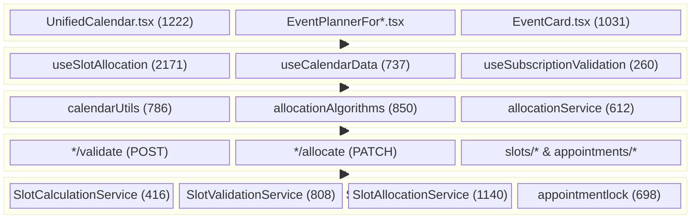
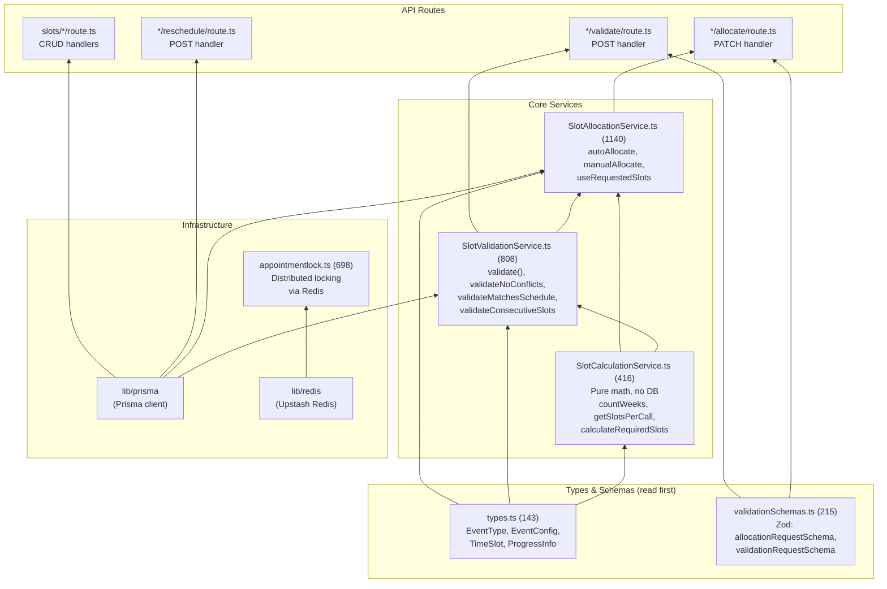
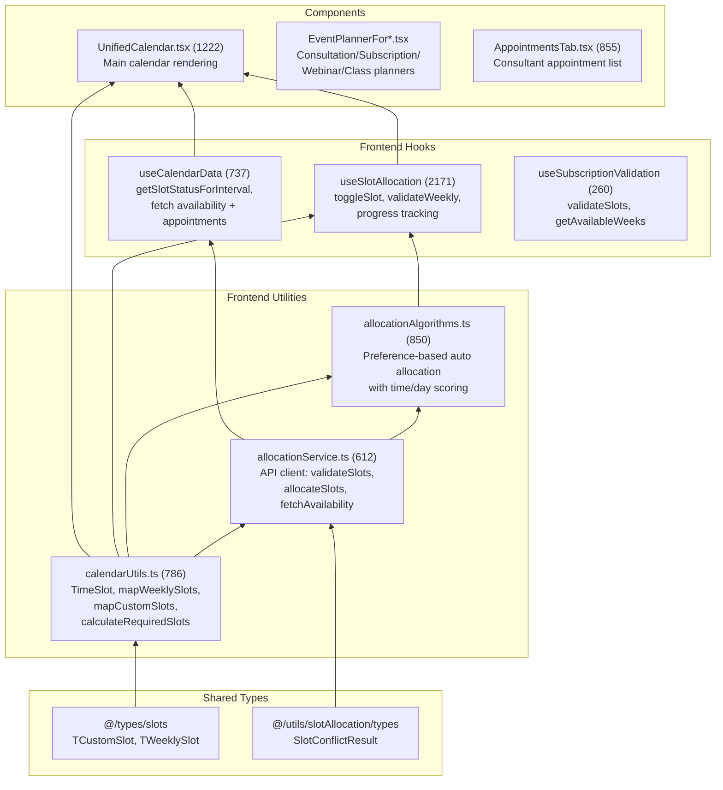
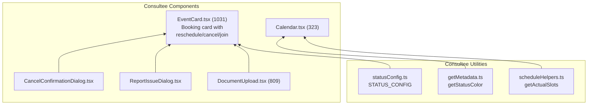
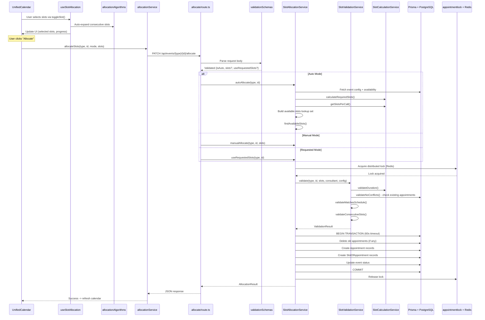
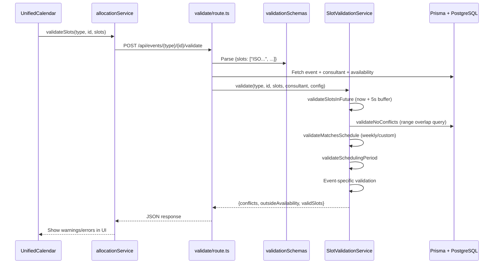
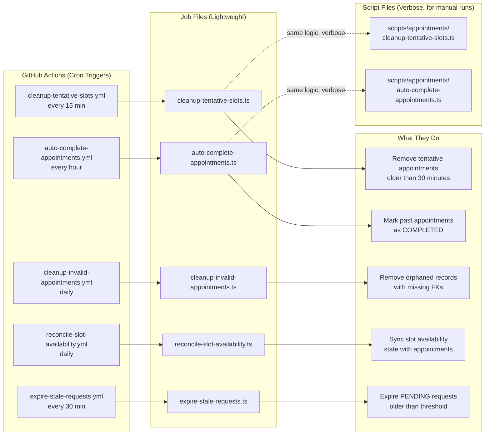
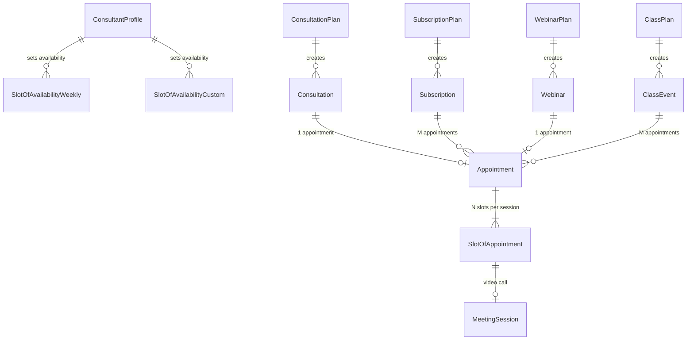

# Dependency Graphs

Visual maps of how files in the booking system relate to each other.

---

## 1. System Layer Architecture

How the 5 layers stack. Each layer only calls the layer directly below it.



---

## 2. Backend Dependency Graph

Which backend file imports which. Read bottom-up (leaf nodes first).



**Reading order**: `types.ts` -> `SlotCalculationService` -> `SlotValidationService` -> `SlotAllocationService` -> API routes

---

## 3. Frontend Dependency Graph

Which frontend file imports which. Read bottom-up.



**Reading order**: `types/slots` -> `calendarUtils` -> `allocationService` -> `allocationAlgorithms` -> `useCalendarData` -> `useSlotAllocation` -> `UnifiedCalendar`

---

## 4. Consultee Side (Separate Dependency Chain)

The consultee dashboard has its own simpler chain.



---

## 5. Request Flow: Slot Allocation (The Main Path)

What happens when the consultant clicks "Allocate Slots":



---

## 6. Request Flow: Slot Validation (Pre-flight Check)

What happens when the frontend validates slots before allocation:



---

## 7. Maintenance & Cleanup Flow

How cron jobs keep the system healthy:



---

## 8. Data Model Relationships (Simplified)



---

## 9. File Dependency Summary Table

Quick reference: what imports what.

### Backend

| File | Imports From |
|------|-------------|
| `types.ts` | _(leaf node - no local deps)_ |
| `validationSchemas.ts` | _(leaf node - only zod)_ |
| `SlotCalculationService.ts` | `types.ts` |
| `SlotValidationService.ts` | `types.ts`, `SlotCalculationService`, `lib/prisma` |
| `SlotAllocationService.ts` | `types.ts`, `SlotCalculationService`, `SlotValidationService`, `lib/prisma` |
| `appointmentlock.ts` | `lib/redis`, `errors/SlotLockError` |
| `*/allocate/route.ts` | `SlotAllocationService`, `types`, `validationSchemas` |
| `*/validate/route.ts` | `SlotValidationService`, `types`, `validationSchemas`, `lib/prisma` |
| `*/reschedule/route.ts` | `lib/prisma`, `lib/auth-server` |

### Frontend

| File | Imports From |
|------|-------------|
| `calendarUtils.ts` | `@/types/slots` |
| `allocationService.ts` | `calendarUtils`, `@/utils/slotAllocation/types` |
| `allocationAlgorithms.ts` | `calendarUtils`, `allocationService` |
| `useCalendarData.ts` | `allocationService` |
| `useSlotAllocation.ts` | `calendarUtils`, `allocationAlgorithms` |
| `useSubscriptionValidation.ts` | _(independent - no local deps)_ |
| `UnifiedCalendar.tsx` | `calendarUtils`, `useCalendarData`, `useSlotAllocation` |
| `EventPlannerFor*.tsx` | `types/event`, `services/planner`, form components |
| `EventCard.tsx` (consultee) | `DocumentUpload`, `ReportIssueDialog`, `CancelConfirmationDialog`, `statusConfig` |

---

## How to Read This

**If you want to understand the backend algorithm:**
```
types.ts -> SlotCalculationService -> SlotValidationService -> SlotAllocationService
   (4 files, read left to right, ~2500 LOC total)
```

**If you want to understand the frontend:**
```
calendarUtils -> allocationService -> allocationAlgorithms -> useCalendarData + useSlotAllocation -> UnifiedCalendar
   (6 files, read left to right, ~5400 LOC total)
```

**If you want to trace a full request:**
```
UnifiedCalendar -> useSlotAllocation -> allocationService -> API route -> SlotAllocationService -> SlotValidationService -> SlotCalculationService -> Prisma -> PostgreSQL
   (follow Diagram 5 above)
```
