# Cancellation Flow

This document is the definitive reference for how appointment cancellation works in the Familiarise booking system. It is written for developers who are new to the codebase and need to understand not just _what_ the code does, but _why_ it is structured the way it is. Every design decision documented here was made to solve a specific production problem, and this guide will walk you through each one.

**Source file**: `app/api/appointments/[appointmentId]/cancel/route.ts`

**Endpoint**: `POST /api/appointments/{appointmentId}/cancel`

---

## Table of Contents

1. [High-Level Overview](#high-level-overview)
2. [Who Can Cancel](#who-can-cancel)
3. [Request and Response Contract](#request-and-response-contract)
4. [The Pre-Transaction Pattern](#the-pre-transaction-pattern)
5. [Step-by-Step Walkthrough: A Concrete Example](#step-by-step-walkthrough-a-concrete-example)
6. [Cancellation by Event Type](#cancellation-by-event-type)
7. [What Happens to Each Record](#what-happens-to-each-record)
8. [The Transaction: Atomic Database Operations](#the-transaction-atomic-database-operations)
9. [Post-Cancellation Cascade](#post-cancellation-cascade)
10. [Error Handling](#error-handling)
11. [Cancellation vs Reschedule Comparison](#cancellation-vs-reschedule-comparison)
12. [Related Documents](#related-documents)

---

## High-Level Overview

Cancellation is one of the most architecturally nuanced flows in the booking system. On the surface it seems simple -- "delete the appointment" -- but in practice it must coordinate across four concerns: database integrity, notification delivery, payment/refund tracking, and audit trail preservation. The cancellation endpoint is designed around three strict principles:

1. **The cancellation itself must never fail because of a side effect.** If a notification or a refund fails, the user still gets a successful cancellation. This is the "fire-and-forget" philosophy, and it is why the refund runs after the cancellation transaction has already committed.
2. **Nothing is deleted.** The appointment, its slots and its payment records are all preserved; the cancellation is a status change plus audit fields. `Payment.appointment` cascades on delete, so destroying an appointment would destroy the money trail with it.
3. **Refunds are automatic and policy-driven.** The cancellation flow computes a refund from the tiers frozen onto the booking at checkout and drives it through the payment operations, without an admin in the loop.

> **A note on this chapter's age.** Sections below still describe an earlier design in which cancellation deleted the appointment, required no authentication and never touched money. All three of those statements are false against the current route, and the passages that repeat them are corrected in place where they are load-bearing. A full rewrite of the walkthrough — including its line-number references, which no longer match the route — is tracked in #1013.

Here is the complete decision tree for the cancellation endpoint, from the moment a request arrives to the final response:

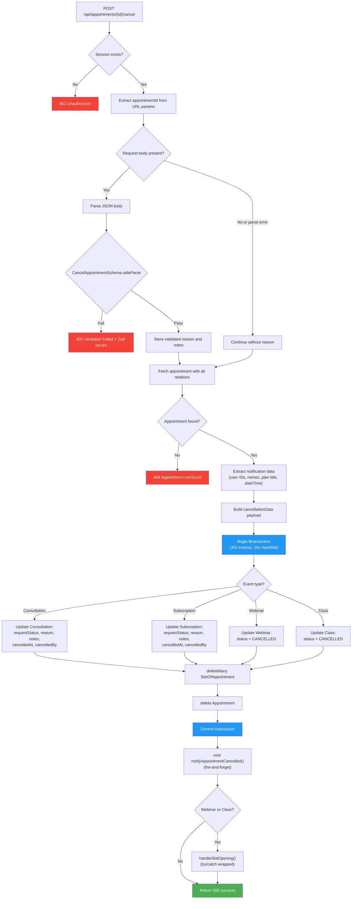

---

## Who Can Cancel

Cancellation is authorized at the API layer, not merely hidden in the UI. Here is what the route checks:

| Check                                      | Performed? | Details                                                                                  |
| ------------------------------------------ | ---------- | ---------------------------------------------------------------------------------------- |
| Is the user authenticated?                 | Yes        | `getSession()` must return a valid session, or the route answers 401                     |
| Is the user a participant?                 | Yes        | The consultant on the plan or the consultee who requested it, or the route answers 403   |
| Is the user privileged?                    | Yes        | `isPrivileged(session.user.role)` bypasses the participant check for admin and staff     |
| Who may cancel a group event?              | Organiser  | Only the consultant who owns the webinar or class plan; attendees cannot cancel the event |
| Is the booking in a cancellable state?     | Yes        | The allowed-from set rides the `UPDATE`'s `WHERE`, so a lost race answers 409             |
| Is a payment dispute open?                 | Yes        | An open dispute answers 409, because a refund now could pay the customer twice            |

**What this means in practice**: only the two parties to a booking, or an admin, can cancel it. A group event can only be cancelled by its organiser, since cancelling it ends the session for everyone enrolled.

**Why the state check lives in the `WHERE` clause**: a cancellation racing the capture webhook, or a double-submitted cancel button, must resolve to exactly one winner. Re-reading the status in application code and then writing leaves a window between the two; putting the allowed-from set into the update's `WHERE` closes it, because the loser matches zero rows and is told the booking can no longer be cancelled. This is the same compare-and-set doctrine the rest of the booking lifecycle uses.

**Implications for developers**:

- Never assume the cancelling user is the consultee. Compare `session.user.id` against the consultant's user ID if you need to branch on role; the refund tier does exactly this, because a consultant-initiated cancellation refunds in full.
- The `cancelledBy` field on the event record stores the raw user ID, and the notification system compares it against the consultant's user ID to label the canceller.

---

## Request and Response Contract

### Request Body (Optional)

The request body is entirely optional. If omitted, empty, or unparseable as JSON, the cancellation proceeds without a reason. This design means a simple `POST` with no body is a valid cancellation request.

**Schema**: `CancelAppointmentSchema` (defined in `schemas/appointments.ts`)

```typescript
// schemas/appointments.ts
export const CancelAppointmentSchema = z.object({
  reason: CancellationReasonEnum.optional(),
  notes: z.string().optional(),
});
```

| Field    | Type                        | Required | Description                                 |
| -------- | --------------------------- | -------- | ------------------------------------------- |
| `reason` | `CancellationReason` (enum) | No       | Categorized reason for cancellation         |
| `notes`  | `string`                    | No       | Free-text notes explaining the cancellation |

### CancellationReason Enum

The enum values are organized by who initiates the cancellation. This categorization is used in analytics and notification templates.

Defined in `schemas/enums.ts`:

| Category             | Value                    | Typical Use Case                                 |
| -------------------- | ------------------------ | ------------------------------------------------ |
| User-initiated       | `SCHEDULE_CONFLICT`      | The consultee has a conflicting commitment       |
| User-initiated       | `FOUND_ALTERNATIVE`      | The consultee found another consultant           |
| User-initiated       | `FINANCIAL_REASONS`      | The consultee can no longer afford the session   |
| User-initiated       | `PERSONAL_EMERGENCY`     | Unforeseen personal circumstances                |
| User-initiated       | `NO_LONGER_NEEDED`       | The consultee's problem was resolved             |
| Consultant-initiated | `CONSULTANT_UNAVAILABLE` | The consultant cannot make the scheduled time    |
| Consultant-initiated | `CONSULTANT_EMERGENCY`   | The consultant has an emergency                  |
| System-initiated     | `PAYMENT_FAILED`         | An automated cancellation due to payment failure |
| System-initiated     | `EXPIRED`                | An automated cancellation due to expiration      |
| Other                | `OTHER`                  | None of the above; use `notes` for details       |

### Body Parsing Logic

The body parsing has a subtle but important behavior. Here is how it works line by line:

```
1. Read request body as text
2. If text is empty  --> continue without reason (no error)
3. If text is present --> try JSON.parse
4.   If JSON parse fails --> continue without reason (caught by outer try/catch)
5.   If JSON parse succeeds --> run CancelAppointmentSchema.safeParse
6.     If Zod validation fails --> return 400 with Zod issues
7.     If Zod validation passes --> use validated data
```

The key insight: **only a valid JSON body that fails Zod validation returns an error**. An empty body, a non-JSON body, or a body that fails JSON.parse will all silently proceed without a reason. This is intentional -- it makes the endpoint maximally forgiving for clients that do not need to provide a reason.

### Success Response (200)

```json
{
  "success": true,
  "cancellationReason": "SCHEDULE_CONFLICT",
  "cancelledAt": "2025-06-15T10:30:00.000Z",
  "webinarId": null,
  "classId": null
}
```

| Field                | Type                  | Description                                       |
| -------------------- | --------------------- | ------------------------------------------------- |
| `success`            | `boolean`             | Always `true` on 200                              |
| `cancellationReason` | `string \| undefined` | The reason if one was provided                    |
| `cancelledAt`        | `string` (ISO 8601)   | Timestamp of when the cancellation was processed  |
| `webinarId`          | `string \| null`      | The webinar ID if this was a webinar cancellation |
| `classId`            | `string \| null`      | The class ID if this was a class cancellation     |

The `webinarId` and `classId` fields are populated only for webinar and class cancellations. They are included in the client response so the frontend can trigger any UI updates related to the specific event.

### Error Responses

| Status | Cause                                     | Response Body                                                 | When It Happens                                       |
| ------ | ----------------------------------------- | ------------------------------------------------------------- | ----------------------------------------------------- |
| 401    | No session / expired session              | `{ "error": "Unauthorized" }`                                 | `getSession()` returns null or no user                |
| 400    | Zod validation fails on a valid JSON body | `{ "error": "Validation failed", "details": [<ZodIssue[]>] }` | Body is valid JSON but fails schema validation        |
| 404    | Appointment not found in database         | `{ "error": "Appointment not found" }`                        | ID does not match any appointment, or already deleted |
| 500    | Transaction failure or unexpected error   | `{ "error": "Failed to cancel appointment" }`                 | Database error, connection timeout, or other          |

---

## The Pre-Transaction Pattern

This is the single most important architectural pattern in the cancellation flow. If you understand this, you understand why the code is structured the way it is.

### The Problem

The cancellation endpoint needs to do three things that are in tension with each other:

1. **Fetch the appointment with deep relations** (consultation -> plan -> consultant profile -> user, and similarly for consultee). This is a heavy join across 5-6 tables.
2. **Delete the appointment and its slots atomically** within a database transaction.
3. **Send notifications** with data from the deleted records (user names, plan titles, scheduled time).

The naive approach would be to do all of this inside a single transaction:

```
BEGIN TRANSACTION
  1. Fetch appointment with all relations  <-- Heavy join
  2. Update event status
  3. Delete slots
  4. Delete appointment
  5. Send notification using fetched data
COMMIT
```

This approach fails in production because Prisma's interactive transactions have a default 5-second timeout. Even with the timeout increased to 30 seconds, putting a heavy multi-table join inside a transaction alongside write operations risks hitting the timeout under database contention. The transaction holds locks for the entire duration, increasing the chance of deadlocks with concurrent operations.

### The Solution: Three-Phase Architecture

The cancellation endpoint splits the work into three distinct phases:

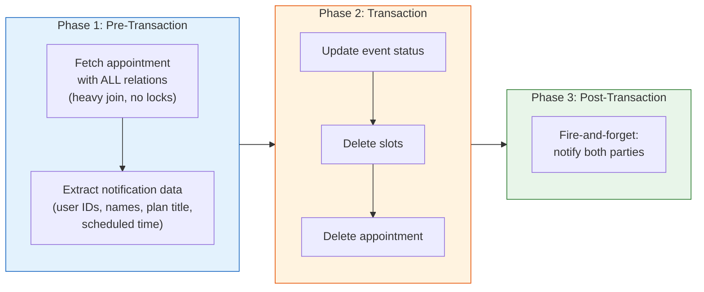

**Phase 1 (Pre-Transaction)**: Run the heavy query with all nested includes _outside_ the transaction. This query does not hold any locks. Extract all the data needed for notifications into local variables, because these records will be deleted in Phase 2.

**Phase 2 (Transaction)**: The transaction contains only fast write operations -- three simple queries (update, deleteMany, delete) on indexed primary keys. No joins, no nested includes. This keeps the transaction fast and reduces lock contention.

**Phase 3 (Post-Transaction)**: Notifications happen after the transaction has committed, using the data extracted in Phase 1. They are fault-tolerant: notifications use `void` (fire-and-forget).

### What Would Happen Without This Pattern

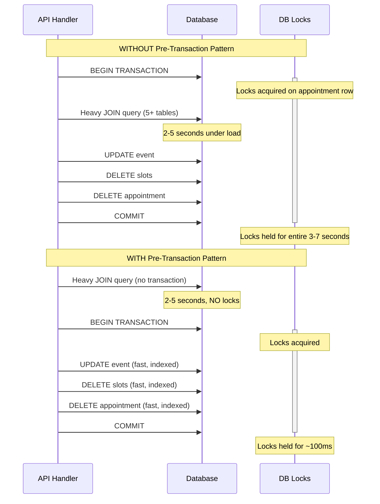

The difference is dramatic: locks are held for 3-7 seconds in the naive approach versus roughly 100 milliseconds with the pre-transaction pattern. Under concurrent load, this is the difference between a responsive system and cascading timeouts.

---

## Step-by-Step Walkthrough: A Concrete Example

Let us trace through a complete cancellation to see exactly what happens at each step. Consider this scenario:

> **Alice** (consultee) cancels her 2-hour consultation with **Bob** (consultant), which was scheduled for next Tuesday at 10:00 AM IST. The consultation uses Bob's "Career Strategy Session" plan. Alice cancels because of a schedule conflict.

### Database State Before Cancellation

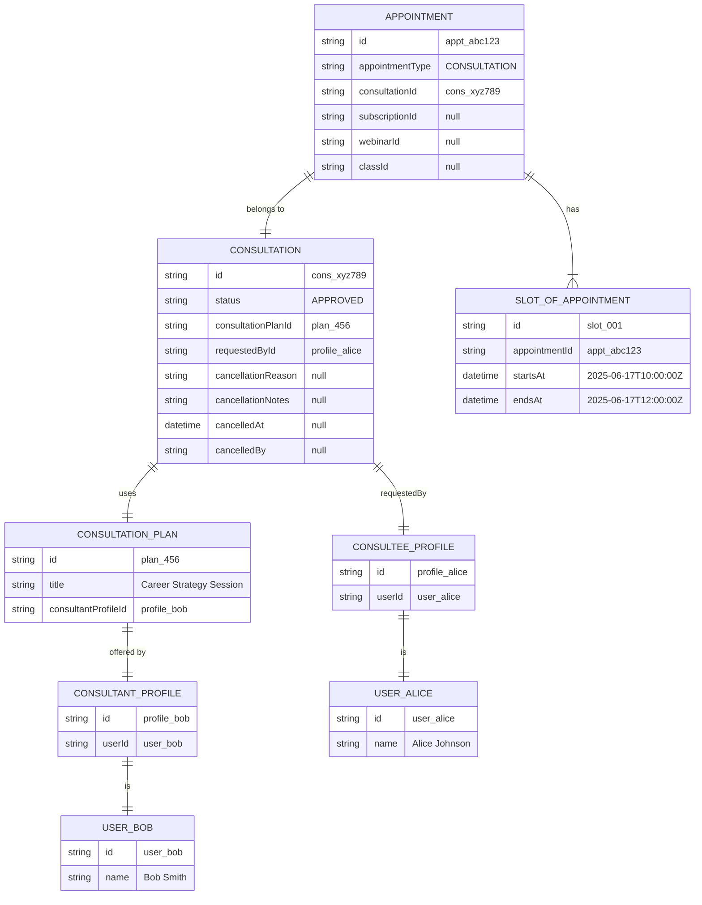

### Step 1: Authentication (Lines 14-17)

Alice's browser sends:

```http
POST /api/appointments/appt_abc123/cancel
Content-Type: application/json
Cookie: session=...

{"reason": "SCHEDULE_CONFLICT", "notes": "Have a work meeting that day"}
```

The server calls `getSession()`, which validates Alice's session cookie and returns:

```json
{ "user": { "id": "user_alice", "name": "Alice Johnson" } }
```

Session is valid. Proceed.

### Step 2: Body Parsing and Validation (Lines 21-38)

1. `request.text()` returns `'{"reason": "SCHEDULE_CONFLICT", "notes": "Have a work meeting that day"}'`
2. `JSON.parse()` succeeds, producing a plain object.
3. `CancelAppointmentSchema.safeParse()` validates:
   - `reason`: `"SCHEDULE_CONFLICT"` -- valid enum value
   - `notes`: `"Have a work meeting that day"` -- valid string
4. `validatedData` is set to `{ reason: "SCHEDULE_CONFLICT", notes: "Have a work meeting that day" }`

### Step 3: Pre-Transaction Fetch (Lines 40-76)

The heavy query runs outside any transaction:

```sql
-- Conceptual SQL (Prisma generates this)
SELECT appointment.*,
       consultation.*,
       consultation_plan.*,
       consultant_profile.*,
       consultant_user.id, consultant_user.name,
       consultee_profile.*,
       consultee_user.id, consultee_user.name,
       slots.*
FROM "Appointment" appointment
LEFT JOIN "Consultation" consultation ON ...
LEFT JOIN "ConsultationPlan" consultation_plan ON ...
LEFT JOIN "ConsultantProfile" consultant_profile ON ...
LEFT JOIN "User" consultant_user ON ...
LEFT JOIN "ConsulteeProfile" consultee_profile ON ...
LEFT JOIN "User" consultee_user ON ...
LEFT JOIN "SlotOfAppointment" slots ON ... LIMIT 1
WHERE appointment.id = 'appt_abc123'
```

This query joins across 7 tables. It returns the full appointment tree.

### Step 4: Pre-Transaction Data Extraction (Lines 85-115)

Before the appointment is deleted, we extract everything needed for notifications:

| Variable           | Extracted Value              | Source Path                                                             |
| ------------------ | ---------------------------- | ----------------------------------------------------------------------- |
| `consultantUserId` | `"user_bob"`                 | `appointment.consultation.consultationPlan.consultantProfile.user.id`   |
| `consulteeUserId`  | `"user_alice"`               | `appointment.consultation.requestedBy.user.id`                          |
| `consultantName`   | `"Bob Smith"`                | `appointment.consultation.consultationPlan.consultantProfile.user.name` |
| `consulteeName`    | `"Alice Johnson"`            | `appointment.consultation.requestedBy.user.name`                        |
| `planTitle`        | `"Career Strategy Session"`  | `appointment.consultation.consultationPlan.title`                       |
| `appointmentType`  | `"CONSULTATION"`             | `appointment.appointmentType`                                           |
| `dateTime`         | `"2025-06-17T10:00:00.000Z"` | `appointment.slotsOfAppointment[0].startsAt`                            |

**Why this matters**: After Step 5, the appointment record and its slots no longer exist. If we tried to read these values after the transaction, we would get `null` for everything.

### Step 5: Build Cancellation Payload (Lines 118-124)

```typescript
const cancellationData = {
  status: "CANCELLED",
  cancellationReason: "SCHEDULE_CONFLICT", // from validatedData
  cancellationNotes: "Have a work meeting that day", // from validatedData
  cancelledAt: new Date(), // 2025-06-15T10:30:00.000Z
  cancelledBy: "user_alice", // from session
};
```

### Step 6: Transaction (Lines 126-174)

Three operations execute atomically within a 30-second timeout:

**Operation 1** -- Update the consultation record:

```sql
UPDATE "Consultation"
SET "status" = 'CANCELLED',
    "cancellationReason" = 'SCHEDULE_CONFLICT',
    "cancellationNotes" = 'Have a work meeting that day',
    "cancelledAt" = '2025-06-15T10:30:00.000Z',
    "cancelledBy" = 'user_alice'
WHERE id = 'cons_xyz789'
```

**Operation 2** -- Delete all slot records for this appointment:

```sql
DELETE FROM "SlotOfAppointment"
WHERE "appointmentId" = 'appt_abc123'
```

**Operation 3** -- Delete the appointment record:

```sql
DELETE FROM "Appointment"
WHERE id = 'appt_abc123'
```

If any of these three operations fails, the entire transaction rolls back. The consultation stays `APPROVED`, the slots remain, and the appointment is untouched.

### Step 7: Fire-and-Forget Notification (Lines 176-207)

After the transaction commits, the notification fires using the data extracted in Step 4:

```typescript
void notifyAppointmentCancelled(
  ["user_bob", "user_alice"], // Both parties receive notification
  {
    appointmentType: "CONSULTATION",
    consultantName: "Bob Smith",
    consulteeName: "Alice Johnson",
    planTitle: "Career Strategy Session",
    dateTime: "2025-06-17T10:00:00.000Z",
    dashboardUrl: "/dashboard",
    reason: "SCHEDULE_CONFLICT",
    cancelledBy: "consultee", // Because user_alice !== user_bob (consultant)
  },
);
```

The `void` keyword is critical here. It means "call this function but do not await it." The API response is sent to Alice immediately without waiting for Novu to deliver the notification. If Novu is down or slow, Alice still gets her 200 OK.

### Step 9: Response

Alice receives:

```json
{
  "success": true,
  "cancellationReason": "SCHEDULE_CONFLICT",
  "cancelledAt": "2025-06-15T10:30:00.000Z",
  "webinarId": null,
  "classId": null
}
```

### Database State After Cancellation

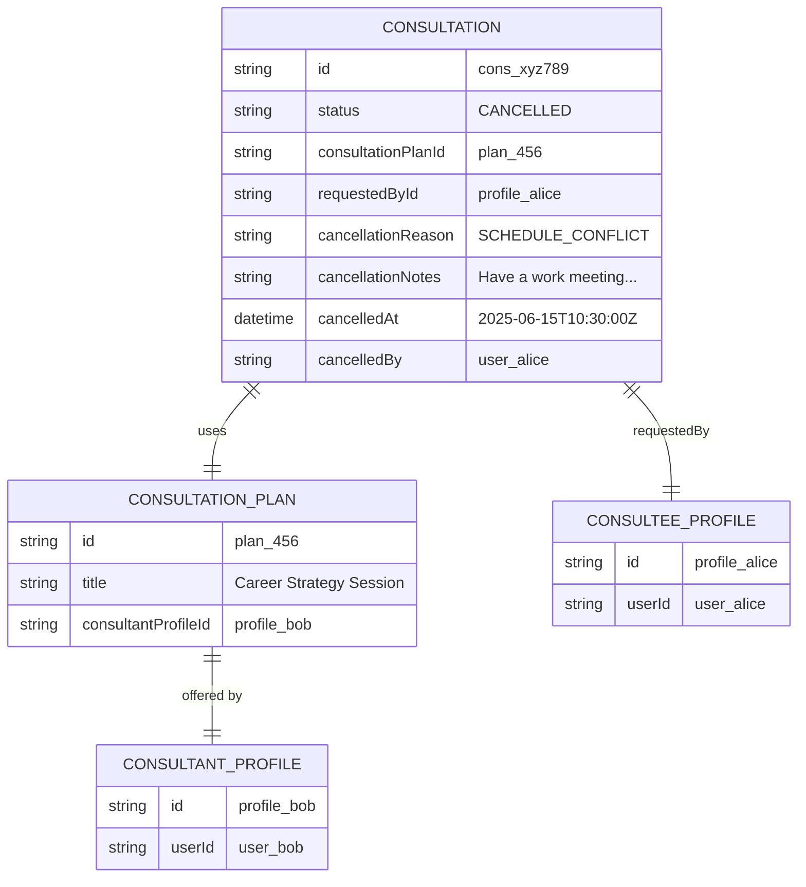

Notice what is gone:

- The `Appointment` record -- **deleted**
- The `SlotOfAppointment` record -- **deleted**

Notice what remains:

- The `Consultation` record -- **preserved** with `CANCELLED` status and full audit trail
- The `ConsultationPlan`, profiles, and users -- **untouched**
- Any `Payment` records -- preserved, with a `Refund` row and a balanced ledger reversal added when a refund was due

---

## Cancellation by Event Type

The system supports four event types, and they do not all behave the same way during cancellation. The differences are significant and worth understanding.

### Branching Logic Flowchart

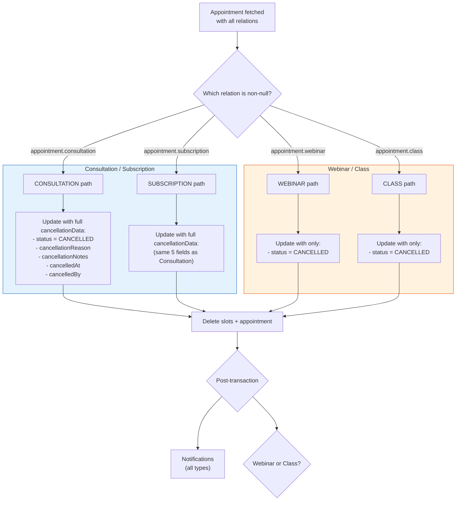

### Comparison Table: All Four Event Types

| Aspect                           | Consultation    | Subscription    | Webinar   | Class    |
| -------------------------------- | --------------- | --------------- | --------- | -------- |
| **Model updated**                | `Consultation`  | `Subscription`  | `Webinar` | `Class`  |
| **Status field**                 | `status` | `status` | `status`  | `status` |
| **Audit fields stored**          | Yes (5 fields)  | Yes (5 fields)  | No        | No       |
| **Cancellation reason on model** | Yes             | Yes             | No        | No       |
| **Cancelled-by tracking**        | Yes             | Yes             | No        | No       |
| **Notification sent**            | Yes             | Yes             | Yes       | Yes      |
| **Slots deleted**                | Yes             | Yes             | Yes       | Yes      |
| **Appointment deleted**          | Yes             | Yes             | Yes       | Yes      |

### Consultation Cancellation (Detailed)

Consultations are one-to-one sessions between a consultant and a consultee. They have the richest cancellation data because they involve a direct relationship between two parties where accountability matters.

**What gets written to the database**:

```typescript
await tx.consultation.update({
  where: { id: appointment.consultation.id },
  data: {
    status: "CANCELLED",
    cancellationReason: validatedData.reason || null, // e.g. "SCHEDULE_CONFLICT"
    cancellationNotes: validatedData.notes || null, // e.g. "Have a work meeting"
    cancelledAt: new Date(), // Precise timestamp
    cancelledBy: session.user.id, // Who initiated
  },
});
```

**Why audit fields exist**: Consultations often involve payment disputes. When a consultee asks for a refund, the admin needs to know who cancelled, when they cancelled, and why. This audit trail is essential for the refund decision process.

### Subscription Cancellation (Detailed)

Subscriptions are recurring consultation sessions (e.g., "4 sessions per month with Bob"). They behave identically to consultations for cancellation purposes.

**What gets written to the database**: Exactly the same five fields as a consultation. The `Subscription` model has the same audit columns.

**Design note**: The fact that consultation and subscription cancellations are identical in structure is intentional. Both represent a committed agreement between two parties, so both require the same level of accountability and audit trail.

### Webinar Cancellation (Detailed)

Webinars are one-to-many events (one consultant, many attendees). Their cancellation is simpler because the business model is different.

**What gets written to the database**:

```typescript
await tx.webinar.update({
  where: { id: appointment.webinar.id },
  data: { status: "CANCELLED" },
});
```

**Why no audit fields**: Webinars are typically cancelled by the consultant (the host). Since webinars are group events, the system does not track individual cancellation reasons on the event model. The `status` change is sufficient for the event lifecycle. If audit data is needed, it can be reconstructed from the API logs and the `cancelledBy` information in the notification payload.


### Class Cancellation (Detailed)

Classes are multi-session group events (e.g., "6-week Python bootcamp"). They behave identically to webinars for cancellation purposes.

**What gets written to the database**: Only `status: "CANCELLED"`, same as webinar.


### State Transition Diagram

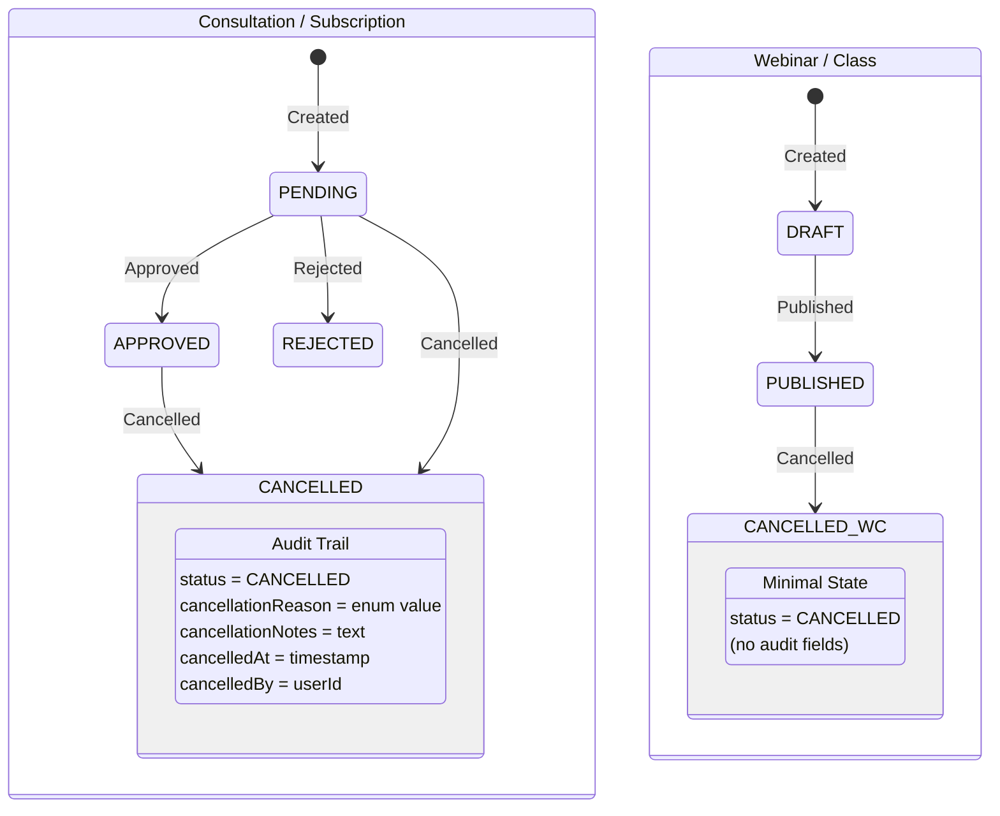

---

## What Happens to Each Record

This section provides a comprehensive before-and-after view of every database record affected by a cancellation.

### Data Cascade Diagram

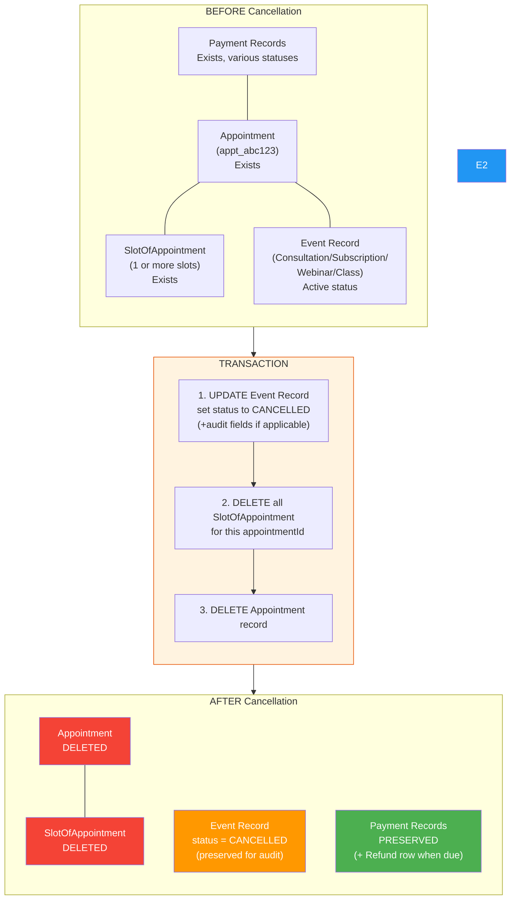

### Record-by-Record Breakdown

| Record                         | Before                            | After                                        | Why                                                                  |
| ------------------------------ | --------------------------------- | -------------------------------------------- | -------------------------------------------------------------------- |
| `Appointment`                  | Exists with type and foreign keys | **Deleted**                                  | The appointment no longer represents a scheduled event               |
| `SlotOfAppointment` (all)      | Exist with start/end times        | **Deleted**                                  | Time slots are meaningless without the appointment                   |
| `Consultation` (if applicable) | `status = "APPROVED"`      | `status = "CANCELLED"` + audit fields | Preserved for refund decisions and analytics                         |
| `Subscription` (if applicable) | `status = "APPROVED"`      | `status = "CANCELLED"` + audit fields | Same reasoning as consultation                                       |
| `Webinar` (if applicable)      | `status = "PUBLISHED"`            | `status = "CANCELLED"`                       | Preserved but with minimal state change                              |
| `Class` (if applicable)        | `status = "PUBLISHED"`            | `status = "CANCELLED"`                       | Same reasoning as webinar                                            |
| `Payment` / `PaymentOrder`     | Various statuses                  | Preserved; a `Refund` row is added when due  | The policy frozen at checkout decides the amount, not an admin       |
| `Earning` / `PayoutItem`       | May exist if payment was captured | Refunded share incremented by the cascade    | Earnings reversal rides the same transaction as the refund           |

### Why the Event Record is Preserved

A common question from new developers: "If we delete the appointment, why not delete the consultation/webinar too?"

The event record (consultation, subscription, webinar, or class) is intentionally preserved for several reasons:

1. **Refund processing**: An admin reviewing a refund request needs to see the cancelled event, when it was cancelled, by whom, and why. If the record were deleted, this information would be lost.
2. **Analytics**: Business intelligence queries count cancellation rates, reasons, and patterns. Deleted records cannot be counted.
3. **Dispute resolution**: If a consultee disputes a charge, the cancelled event record is evidence of what happened.
4. **Consultant dashboards**: Consultants may want to see their cancellation history.

The appointment record, on the other hand, is deleted because it represents a "scheduled event in time." Once cancelled, there is nothing scheduled, so the appointment has no ongoing purpose. The event record represents the "agreement to have a session," which retains value even after cancellation.

---

## The Transaction: Atomic Database Operations

### Transaction Configuration

```typescript
const result = await prisma.$transaction(
  async (tx) => {
    /* ... */
  },
  {
    maxWait: 10000, // 10 seconds: max time waiting for a DB connection from the pool
    timeout: 30000, // 30 seconds: max duration of the transaction itself
  },
);
```

| Parameter | Value     | Default  | Why It Is Changed                                                                                                                       |
| --------- | --------- | -------- | --------------------------------------------------------------------------------------------------------------------------------------- |
| `maxWait` | 10,000 ms | 2,000 ms | Under high load, the connection pool can be saturated. 10 seconds gives more time to acquire a connection before failing.               |
| `timeout` | 30,000 ms | 5,000 ms | Although the transaction only runs fast indexed writes, the increased timeout provides safety margin under extreme database contention. |

### Operation Order Within the Transaction

The three operations inside the transaction execute in a specific order that matters:

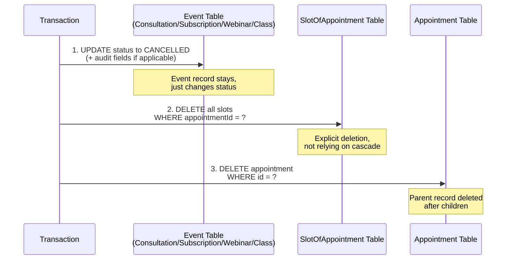

**Why slots are deleted before the appointment**: The `SlotOfAppointment` table has a foreign key to `Appointment`. If we deleted the appointment first and relied on Prisma's cascade configuration to clean up slots, we would be depending on cascade behavior that may vary across database providers and Prisma versions. By explicitly deleting slots first, we ensure deterministic ordering: children are removed before the parent, regardless of cascade configuration.

**Why the event is updated before anything is deleted**: The event record (consultation, subscription, etc.) has its own ID independent of the appointment. It does not need to be deleted, only updated. Updating it first ensures that even if the subsequent deletes fail (causing a rollback), the intended status change is part of the same atomic unit.

### Atomicity Guarantee

If any of the three operations fails:

- The event record reverts to its previous status
- The slot records are restored
- The appointment record is restored

The user receives a 500 error, and the system state is as if the cancellation never happened.

---

## Post-Cancellation Cascade

After the transaction commits successfully, two post-transaction effects may fire. Both are designed to be fault-tolerant: neither can cause the cancellation to "fail" from the user's perspective, because the transaction has already committed.

### Notification Delivery

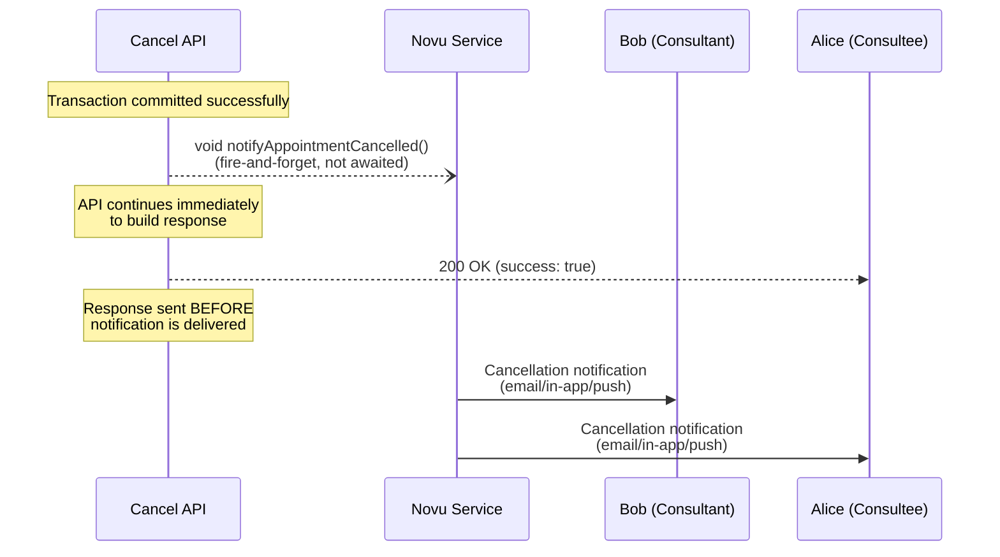

**Mechanism**: Novu (`lib/novu.ts` -> `notifyAppointmentCancelled`)

**Who receives notifications**: Both the consultant and the consultee. The user IDs are collected into an array and filtered to remove any `undefined` values (which can happen if relations are broken or missing):

```typescript
const userIds = [
  notificationMeta.consultantUserId,
  notificationMeta.consulteeUserId,
].filter((id): id is string => !!id);
```

For webinars and classes where consultant/consultee relationships are not directly stored on the event model, the `userIds` array may be empty, in which case no notification is sent.

**Notification payload**:

| Field             | Value                                                         | Source                                                       |
| ----------------- | ------------------------------------------------------------- | ------------------------------------------------------------ |
| `appointmentType` | `"CONSULTATION"`, `"SUBSCRIPTION"`, `"WEBINAR"`, or `"CLASS"` | `appointment.appointmentType`                                |
| `consultantName`  | e.g., `"Bob Smith"` or `"Consultant"` (fallback)              | Extracted in Phase 1, with fallback                          |
| `consulteeName`   | e.g., `"Alice Johnson"` or `"Consultee"` (fallback)           | Extracted in Phase 1, with fallback                          |
| `planTitle`       | e.g., `"Career Strategy Session"` or `"N/A"` (fallback)       | From consultation/subscription plan                          |
| `dateTime`        | ISO 8601 string or `undefined`                                | `slotsOfAppointment[0].startsAt`                             |
| `dashboardUrl`    | `"/dashboard"`                                                | Hardcoded                                                    |
| `reason`          | e.g., `"SCHEDULE_CONFLICT"` or `undefined`                    | From validated body                                          |
| `cancelledBy`     | `"consultant"` or `"consultee"`                               | Derived by comparing `session.user.id` to `consultantUserId` |

**Why fire-and-forget**: The notification is a courtesy, not a critical operation. If Novu is down for 5 minutes, the cancellation should still succeed. The user can always check their dashboard. Making the notification blocking would mean a Novu outage causes cancellation failures, which would be unacceptable.

### Refund and Earnings

**Refunds are automatic.** The judgement that used to be left to an admin is now encoded in the cancellation policy that was frozen onto the booking when the buyer paid, so an org or the platform editing its terms later never changes a buyer's deal retroactively.

When a paid consultation or subscription is cancelled, the route resolves three facts about the **whole booking** rather than the single appointment it was handed, because a subscription is one slot-less placeholder that carries the money plus one appointment per allocated session. It finds the payment funding the booking, the policy snapshot frozen on the row the buyer paid for, and the start time of the earliest session that has not yet been delivered. It then applies the tier for that many hours of notice, and refunds that percentage of the amount paid. A cancellation the consultant initiates always settles at the policy's consultant-initiated percentage — one hundred per cent under the platform defaults — because the buyer did nothing wrong.

Cancelling a whole class or webinar refunds every attendee in full instead, since the attendees did not choose to leave. Removing a single attendee from a live event refunds that attendee's seat on the same reasoning.

The refund runs after the cancellation transaction commits, and a failure to refund never rolls the cancellation back. Failures are reported to Sentry and returned to the caller on the `refund` field of the response, so a stuck refund is visible rather than silent.

Two cases deliberately do not refund automatically. A subscription that has already delivered sessions has no agreed proration rule, so the response carries `requiresManualReview` and the case is escalated rather than guessed at; this is tracked in #1006. A booking with no live session at all — an unallocated subscription — scores no notice hours and therefore no refund under the current tiers, which is also an open policy question.

**What the cascade reverses**: the refund is not just a gateway call. `applyRefundCascade` reverses the funding legs at their source, returns program engagements to the organisation's cap, increments the consultant's and the organisation's refunded share, claws back an already-completed payout, mints a GST credit note for any invoiced portion, reverses the withheld TDS, restores referral credits, and posts a balanced double-entry reversal. Org-funded bookings carry a synthetic payment intent that no gateway can resolve, so they reverse purely in-ledger through the reversal engine instead of calling out.

**Cross-reference**: [Cancellation Payment Flow](../payments/cancellations-rescheduling/01-cancellation-payment-flow.md)

---

## Error Handling

The cancellation endpoint has five distinct failure points, each handled differently. Understanding these is essential for debugging production issues.

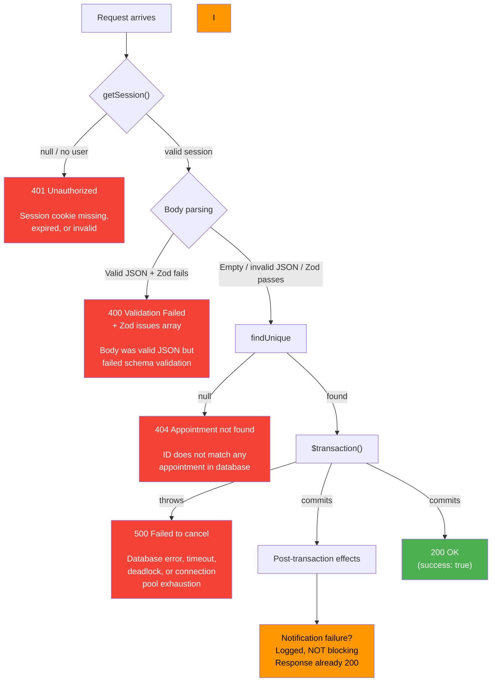

### Error Details

#### 401 Unauthorized

**When**: `getSession()` returns `null` or a session without a `user` property.

**Common causes**: Expired session cookie, missing auth header, server-side session store is down.

**Response**:

```json
{ "error": "Unauthorized" }
```

**Developer notes**: This is the very first check. No database queries run before this, so a 401 has minimal server impact.

#### 400 Validation Failed

**When**: The request body is valid JSON that fails `CancelAppointmentSchema.safeParse()`.

**Common causes**: Invalid enum value for `reason` (e.g., `"BORED"`), wrong field types.

**Response**:

```json
{
  "error": "Validation failed",
  "details": [
    {
      "code": "invalid_enum_value",
      "message": "Invalid enum value. Expected 'SCHEDULE_CONFLICT' | 'FOUND_ALTERNATIVE' | ...",
      "path": ["reason"]
    }
  ]
}
```

**Important subtlety**: An empty body or a non-JSON body does NOT trigger a 400. Only a valid JSON body that fails Zod validation returns 400. This is because the body is optional, and the try/catch around `JSON.parse()` silently catches parse failures.

#### 404 Appointment Not Found

**When**: `prisma.appointment.findUnique()` returns `null`.

**Common causes**: The appointment ID is wrong, the appointment was already cancelled (and thus already deleted), or there is a typo in the URL.

**Response**:

```json
{ "error": "Appointment not found" }
```

**Developer notes**: This also catches the case where a user tries to cancel the same appointment twice. Since the first cancellation deletes the appointment record, the second attempt gets a 404.

#### 500 Failed to Cancel Appointment

**When**: The `$transaction()` throws an error, or any other unexpected error occurs.

**Common causes**: Database connection timeout, deadlock with another concurrent operation, Prisma client error.

**Response**:

```json
{ "error": "Failed to cancel appointment" }
```

**Developer notes**: When this happens, the transaction has rolled back. The appointment and all its data are still intact. The user can safely retry.

#### Post-Transaction Failures (Non-Blocking)

**Notification failure**: If `notifyAppointmentCancelled` throws, the error is silently swallowed because of the `void` prefix. The function runs as an unhandled promise, but since it uses Novu's client (which has its own error handling), unhandled rejections are rare. The cancellation response has already been sent.

## Cancellation vs Reschedule Comparison

Developers frequently ask: "What is the difference between cancelling and rescheduling?" The two flows share some code but differ in fundamental ways.

### Side-by-Side Comparison

| Aspect                           | Cancellation                     | Reschedule                               |
| -------------------------------- | -------------------------------- | ---------------------------------------- |
| **Intent**                       | End the booking entirely         | Move the booking to a different time     |
| **Appointment record**           | Preserved (money rows hang off it) | Preserved (slots are swapped)          |
| **Event record**                 | Status set to `CANCELLED`        | Status unchanged (remains `APPROVED`)    |
| **Slot records**                 | Marked `CANCELLED`               | Old slots deleted, new slots created     |
| **Payment**                      | Preserved; refunded per policy   | Untouched (no additional charge)         |
| **Refund triggered**             | Yes, automatically per policy    | No                                       |
| **Notifications**                | "Your appointment was cancelled" | "Your appointment was rescheduled"       |
| **Audit fields written**         | Yes (consultation/subscription)  | Different fields (rescheduled timestamp) |
| **Can happen after event start** | Not checked (no guard)           | Typically blocked by validation          |
| **Reversible**                   | No (must rebook from scratch)    | Yes (can reschedule again)               |

### Decision Guide: When to Cancel vs Reschedule

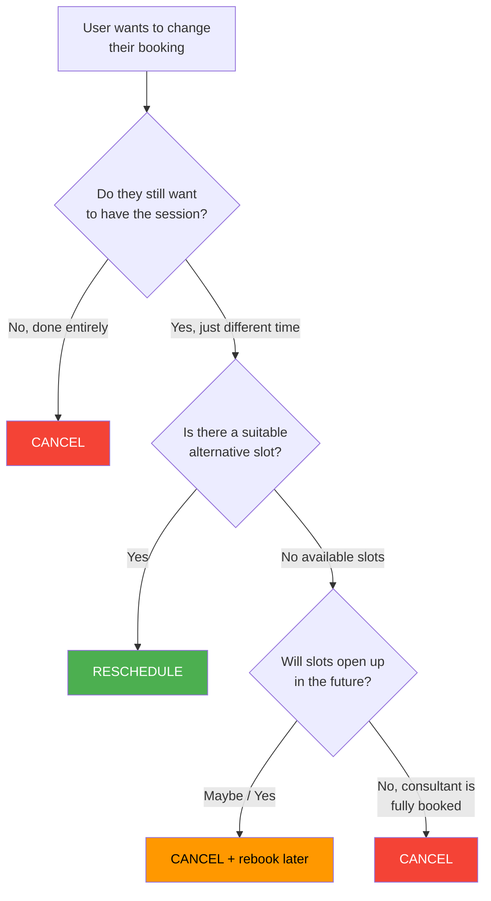

### What Happens to Slots in Each Case

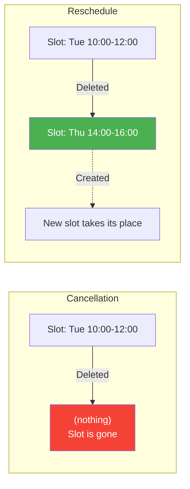

---

## End-to-End Sequence Diagram

This diagram shows every actor and every interaction in a complete cancellation flow, including the post-transaction effects.

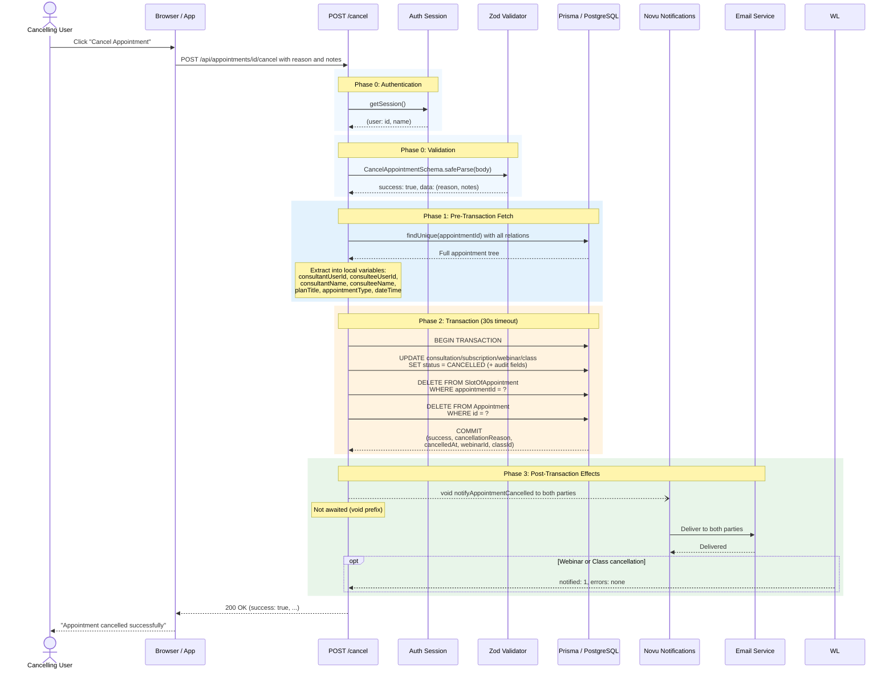

---

## Additional Technical Notes

### Structured Logging

## Related Documents

- [Architecture](./01-architecture.md) -- Booking system overview and data model
- [Event Types and Validation](./02-event-types-and-validation.md) -- Differences between event models
- [API Reference](./04-api-reference.md) -- All booking endpoints including validate and allocate
- [Reschedule Implementation Plan](./06-reschedule-implementation-plan.md) -- How rescheduling works (contrast with this doc)
- [Cancellation Payment Flow](../payments/cancellations-rescheduling/01-cancellation-payment-flow.md) -- Refund processing and earnings reversal
- [Rescheduling Payment Flow](../payments/cancellations-rescheduling/02-rescheduling-payment-flow.md) -- How payment is handled during reschedule
