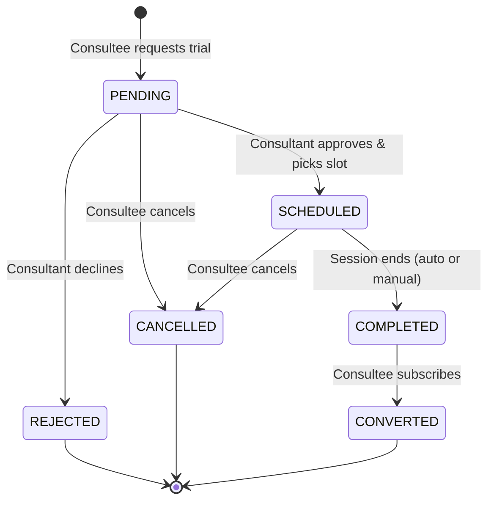
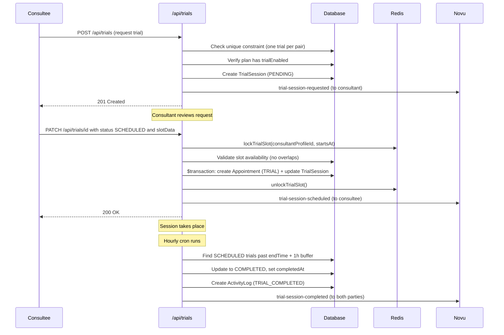

# Trial Sessions

## Overview

A trial session is a one-time session that lets a consultee try a consultant's subscription plan before committing to a paid subscription. Trials are tied to a `SubscriptionPlan` that has `trialEnabled: true`, and each consultee-consultant pair is limited to exactly one trial (enforced by a unique constraint).

Key characteristics:

- Priced per plan via `trialPriceInPaise` (₹100 default; the consultant can set it to ₹0 for a genuinely free trial)
- Duration configured per plan via `trialDurationMinutes` (default 30 min)
- Consultant must approve and schedule the session
- Successful trials can convert into a full subscription

**Source files:**

- Model: `prisma/schema.prisma` (TrialSession, TrialSessionStatus)
- API: `app/api/trials/route.ts`, `app/api/trials/[trialId]/route.ts`, `app/api/trials/check-eligibility/route.ts`
- Locking: `utils/appointmentlock.ts` (lockTrialSlot, unlockTrialSlot)
- Auto-completion: `scripts/appointments/auto-complete-appointments.ts`
- Notifications: `lib/novu/workflows.ts`

---

## Data Model

### TrialSession

| Field                       | Type                 | Default   | Description                                      |
| --------------------------- | -------------------- | --------- | ------------------------------------------------ |
| `id`                        | `String` (cuid)      | auto      | Primary key                                      |
| `status`                    | `TrialSessionStatus` | `PENDING` | Current lifecycle status                         |
| `notes`                     | `String?` (Text)     | null      | Consultee's questions or goals for the trial     |
| `consulteeProfileId`        | `String`             | required  | FK to ConsulteeProfile                           |
| `consultantProfileId`       | `String`             | required  | FK to ConsultantProfile                          |
| `subscriptionPlanId`        | `String`             | required  | FK to SubscriptionPlan (must have trial enabled) |
| `appointmentId`             | `String?` (unique)   | null      | FK to Appointment (set when SCHEDULED)           |
| `convertedToSubscriptionId` | `String?` (unique)   | null      | FK to Subscription (set when CONVERTED)          |
| `requestedAt`               | `DateTime`           | `now()`   | When the trial was requested                     |
| `completedAt`               | `DateTime?`          | null      | When the session was completed                   |
| `createdAt`                 | `DateTime`           | `now()`   | Record creation timestamp                        |
| `updatedAt`                 | `DateTime`           | auto      | Last update timestamp                            |

### Constraints

| Constraint                                            | Type   | Purpose                                   |
| ----------------------------------------------------- | ------ | ----------------------------------------- |
| `@@unique([consulteeProfileId, consultantProfileId])` | Unique | One trial per consultee-consultant pair   |
| `appointmentId @unique`                               | Unique | One-to-one relationship with Appointment  |
| `convertedToSubscriptionId @unique`                   | Unique | One-to-one relationship with Subscription |

### Indexes

| Index                 | Purpose                     |
| --------------------- | --------------------------- |
| `consultantProfileId` | Filter trials by consultant |
| `subscriptionPlanId`  | Filter trials by plan       |

### TrialSessionStatus Enum

| Value       | Description                           |
| ----------- | ------------------------------------- |
| `PENDING`   | Requested, awaiting consultant action |
| `SCHEDULED` | Time slot confirmed                   |
| `COMPLETED` | Trial session finished                |
| `CONVERTED` | Consultee subscribed after trial      |
| `CANCELLED` | Cancelled by consultee                |
| `REJECTED`  | Declined by consultant                |

---

## Status Lifecycle



Valid transitions (enforced in `app/api/trials/[trialId]/route.ts`):

| From        | Allowed targets                      |
| ----------- | ------------------------------------ |
| `PENDING`   | `SCHEDULED`, `CANCELLED`, `REJECTED` |
| `SCHEDULED` | `COMPLETED`, `CANCELLED`             |
| `COMPLETED` | `CONVERTED`                          |
| `CONVERTED` | (terminal)                           |
| `CANCELLED` | (terminal)                           |
| `REJECTED`  | (terminal)                           |

### Cancellation Behavior (PATCH CANCELLED and DELETE)

Both `PATCH` (with `status: CANCELLED`) and `DELETE` now exhibit identical cleanup behavior:

- **Appointment/slot cleanup**: If the trial has a linked appointment, the associated `SlotOfAppointment` records and the `Appointment` record are deleted inside a transaction.
- **Notifications**: Both paths send cancellation notifications to both parties via Novu (`trial-session-cancelled`).
- **Transaction wrapping**: All database operations (status update, appointment deletion, slot deletion) are wrapped in a Prisma `$transaction` to ensure atomicity.

Previously, PATCH CANCELLED did not clean up appointments/slots, and DELETE did not send cancellation notifications. Both paths now handle both concerns.

### Conversion Handler (PATCH CONVERTED)

The `CONVERTED` transition requires a `subscriptionId` in the request body. The handler validates:

1. The subscription exists and belongs to the same plan as the trial (`subscriptionPlanId` match).
2. The subscription belongs to the same consultee as the trial.
3. The trial is linked to the subscription via `convertedToSubscriptionId`.
4. An activity log entry is created via `logTrialConverted()`.

```json
{
  "status": "CONVERTED",
  "subscriptionId": "subscription-uuid-here"
}
```

---

## Booking Flow



### Step-by-step

1. **Request** -- Consultee calls `POST /api/trials` with `consulteeProfileId`, `consultantProfileId`, `subscriptionPlanId`, and optional `notes`. The API checks the unique constraint and verifies `trialEnabled` on the plan.
2. **Eligibility check** -- `GET /api/trials/check-eligibility` can be called beforehand to verify the consultee has not already used their trial with this consultant.
3. **Approve & Schedule** -- Consultant calls `PATCH /api/trials/[trialId]` with `status: "SCHEDULED"` and `slotData: { startsAt, endsAt }`. The system acquires a distributed lock, validates slot availability, then creates an `Appointment` (type `TRIAL`) and a `SlotOfAppointment` inside a Prisma transaction.
4. **Session** -- Both parties join the meeting via Stream video call.
5. **Auto-complete** -- The hourly cron marks `SCHEDULED` trials as `COMPLETED` once all appointment slots have ended (with a 1-hour buffer).
6. **Conversion** -- If the consultee subscribes, the trial status transitions to `CONVERTED` and `convertedToSubscriptionId` is set.

---

## How Trial Differs from Consultation

| Aspect                | Trial                                                             | Consultation                                                  |
| --------------------- | ----------------------------------------------------------------- | ------------------------------------------------------------- |
| **Payment**           | Per plan's `trialPriceInPaise` (₹100 default, ₹0 allowed)         | Required (via checkout)                                       |
| **Duration**          | Fixed per plan (`trialDurationMinutes`, default 30 min)           | Variable (`durationInHours`, 0.5-4h)                          |
| **Lock type**         | `lockTrialSlot()` -- key: `trial-slot-booking:{profileId}:{time}` | `lockSlotBooking()` -- key: `slot-booking:{profileId}:{time}` |
| **Uniqueness**        | One per consultee-consultant pair                                 | Multiple allowed                                              |
| **Conversion**        | Leads to Subscription (`convertedToSubscriptionId`)               | Standalone                                                    |
| **Status field**      | `status` (TrialSessionStatus enum)                                | `status` (AppointmentStatus enum)                          |
| **Appointment type**  | `TRIAL`                                                           | `CONSULTATION`                                                |
| **Booking flow**      | Request -> consultant schedules                                   | Direct checkout or request-based                              |
| **Scheduling period** | None                                                              | None                                                          |
| **Slot count**        | Single slot (1)                                                   | `Math.ceil(durationInHours / 0.5)` slots                      |

---

## Concurrency Protection

Trial scheduling uses the same distributed locking infrastructure as consultations and subscriptions, via `lockTrialSlot()` in `utils/appointmentlock.ts`.

**Redis key pattern:** `trial-slot-booking:{consultantProfileId}:{startsAt}`

| Parameter           | Value                                    |
| ------------------- | ---------------------------------------- |
| Default TTL         | 60,000 ms (60 seconds)                   |
| Retry count         | 10                                       |
| Base retry delay    | 200 ms                                   |
| Retry jitter        | 200 ms (random)                          |
| Exponential backoff | Yes                                      |
| Drift factor        | 0.01                                     |
| Release mechanism   | Atomic Lua script (check value then DEL) |

The lock is acquired before slot validation and released in a `finally` block regardless of success or failure. On lock contention, the API returns HTTP 423 (Locked).

Slot validation inside the lock checks for overlaps across all appointment types (consultations, subscriptions, webinars, classes, and other trials).

---

## Auto-Completion

**File:** `scripts/appointments/auto-complete-appointments.ts`
**Schedule:** Hourly (via GitHub Actions cron job)
**Buffer:** 1 hour after session end time

The `completeTrials()` function:

1. Queries `TrialSession` records where `status = SCHEDULED` and all linked `SlotOfAppointment.endsAt < (now - 1 hour)`
2. Updates each to `status = COMPLETED` with `completedAt = now()`
3. Creates an `ActivityLog` entry with `activityType = TRIAL_COMPLETED` and `metadata: { autoCompleted: true }`

Additionally, the `GET /api/trials` endpoint performs an inline auto-complete check (without the buffer) to keep the UI current between cron runs.

---

## Conversion to Subscription

When a consultee decides to subscribe after a trial, the trial status transitions from `COMPLETED` to `CONVERTED`:

```
TrialSession.convertedToSubscriptionId --> Subscription.id
Subscription.convertedFromTrial --> TrialSession
```

This is a one-to-one relationship (both FKs carry `@unique`). The conversion is triggered by a `PATCH` to `/api/trials/[trialId]` with `status: "CONVERTED"` and a `subscriptionId` in the body. The handler:

1. Validates the `subscriptionId` is provided (returns 400 if missing).
2. Confirms the subscription belongs to the same plan and consultee as the trial.
3. Sets `convertedToSubscriptionId` on the trial record.
4. Calls `logTrialConverted()` to create an `ActivityLog` entry with `activityType = TRIAL_CONVERTED`.

The link enables:

- Tracking trial-to-subscription conversion rates
- Displaying conversion status on the consultant dashboard
- Activity log entries with `activityType = TRIAL_CONVERTED`

---

## Notifications

Trial events trigger Novu workflows defined in `lib/novu/workflows.ts`. All trial workflows use the `TrialSessionPayload` type.

| Workflow ID               | Trigger                     | Recipients   |
| ------------------------- | --------------------------- | ------------ |
| `trial-session-requested` | Consultee requests trial    | Consultant   |
| `trial-session-scheduled` | Consultant schedules trial  | Consultee    |
| `trial-session-completed` | Trial session ends          | Both parties |
| `trial-session-cancelled` | Trial cancelled or rejected | Both parties |

**Payload type** (`TrialSessionPayload`):

| Field            | Type      | Description                     |
| ---------------- | --------- | ------------------------------- |
| `consultantName` | `string`  | Consultant display name         |
| `consulteeName`  | `string`  | Consultee display name          |
| `planTitle`      | `string`  | Subscription plan title         |
| `dateTime`       | `string?` | Scheduled time (ISO format)     |
| `status`         | `string`  | Current trial status            |
| `dashboardUrl`   | `string`  | Link to relevant dashboard page |

Users can disable trial notifications via `NotificationPreference.trialNotifications`.

---

## API Reference

| Method   | Endpoint                        | Auth Required              | Purpose                                       |
| -------- | ------------------------------- | -------------------------- | --------------------------------------------- |
| `GET`    | `/api/trials`                   | Yes (session)              | List trials (paginated, filterable)            |
| `POST`   | `/api/trials`                   | Yes (session)              | Request a new trial session                    |
| `GET`    | `/api/trials/[trialId]`         | Yes (session)              | Get a specific trial session                   |
| `PATCH`  | `/api/trials/[trialId]`         | Yes (session)              | Update status (schedule, complete, convert)    |
| `DELETE` | `/api/trials/[trialId]`         | Yes (session)              | Cancel a PENDING or SCHEDULED trial            |
| `GET`    | `/api/trials/check-eligibility` | Yes (session)              | Check if consultee can request a trial         |
| `GET`    | `/api/trials/stats`             | Yes (session + ownership)  | Trial session statistics (own profile only)    |

**Note**: `/api/trials/stats` was previously in `PUBLIC_API_PREFIXES` (no auth required). It now requires authentication and enforces an ownership check -- users can only view stats for their own consultant profile.
