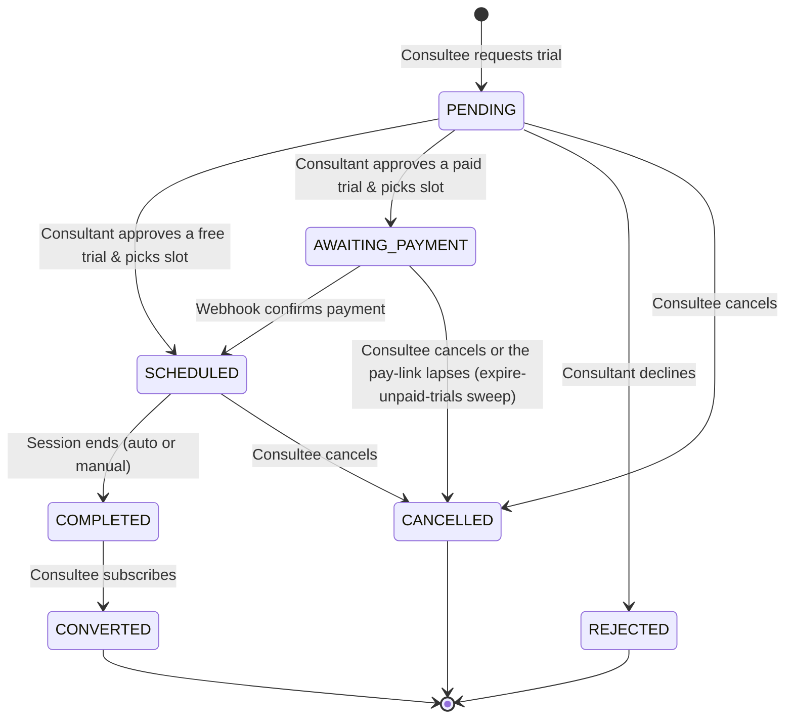
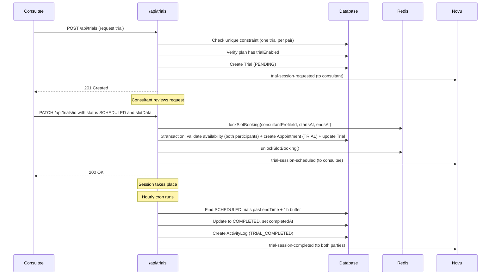

# Trial Sessions

## Overview

A trial session is a one-time session that lets a consultee try a consultant's subscription plan before committing to a paid subscription. Trials are tied to a `SubscriptionPlan` that has `trialEnabled: true`, and each consultee-consultant pair is limited to exactly one trial (enforced by a unique constraint).

Key characteristics:

- Priced per plan via `trialPriceInPaise`, which defaults to 0 (a free trial); the consultant can raise it, and a priced trial is paid for on the branded checkout page described under "Paying for a trial" below.
- A platform-wide minimum sits under every plan's trial price: admin or staff set `PlatformPricingConfig.minTrialPriceInPaise` via `PATCH /api/admin/trial-pricing`, and the plan create/update routes reject prices below it. The floor defaults to 0, which keeps free trials allowed.
- A priced trial is accepted into `AWAITING_PAYMENT` with its slot held: `Trial.pendingPaymentUrl` carries the checkout hand-off, `Trial.paymentId` links the settled `Payment`, and the capture webhook moves the trial to `SCHEDULED`. A hold that is never paid is released by the expire-unpaid-trials sweep, which since 2026-09-19 (#1591 J4-P0-03) also tombstones the held appointment (`softCancelTrialAppointment`) and notifies the consultee, not just the status column.
- The pay-link persist is a CAS, not a bare write (#1583 A-P0-06): a mint that matched zero rows on `Trial.updateMany({ where: { status: AWAITING_PAYMENT, pendingPaymentUrl: null } })` tombstones the freshly minted order rather than orphaning it, and reports `PAY_LINK_ORPHANED` (`lib/booking/pay-link-persist.ts`). A trial whose link was lost this way — still `AWAITING_PAYMENT`, `pendingPaymentUrl` null, `paymentDueAt` still in the future — is re-minted from the consultee's own read (`lib/trials/pay-link.ts`), under the same `lockApprovalPaymentMint` key and appointment lock the original mint used, reusing a live PENDING intent first rather than minting a second gateway order.
- Duration configured per plan via `trialDurationMinutes` (default 30 min)
- Consultant must approve and schedule the session
- Successful trials can convert into a full subscription

**Source files:**

- Model: `prisma/schema.prisma` (Trial, TrialStatus)
- API: `app/api/trials/route.ts`, `app/api/trials/[trialId]/route.ts`, `app/api/trials/check-eligibility/route.ts`
- Locking: `utils/appointmentlock.ts` (lockSlotBooking, unlockSlotBooking — the shared slot-interval lock)
- Auto-completion: `scripts/appointments/auto-complete-appointments.ts`
- Notifications: `lib/novu/workflows.ts`

---

## Data Model

### Trial

| Field                       | Type               | Default   | Description                                                                                                                                     |
| --------------------------- | ------------------ | --------- | ----------------------------------------------------------------------------------------------------------------------------------------------- |
| `id`                        | `String` (cuid)    | auto      | Primary key                                                                                                                                     |
| `status`                    | `TrialStatus`      | `PENDING` | Current lifecycle status                                                                                                                        |
| `notes`                     | `String?` (Text)   | null      | Consultee's questions or goals for the trial                                                                                                    |
| `consulteeProfileId`        | `String`           | required  | FK to ConsulteeProfile                                                                                                                          |
| `consultantProfileId`       | `String`           | required  | FK to ConsultantProfile                                                                                                                         |
| `subscriptionPlanId`        | `String`           | required  | FK to SubscriptionPlan (must have trial enabled)                                                                                                |
| `appointmentId`             | `String?` (unique) | null      | FK to Appointment (set on acceptance: `AWAITING_PAYMENT` for a paid trial, `SCHEDULED` for a free one; the held slot lives on this appointment) |
| `convertedToSubscriptionId` | `String?` (unique) | null      | FK to Subscription (set when CONVERTED)                                                                                                         |
| `requestedAt`               | `DateTime`         | `now()`   | When the trial was requested                                                                                                                    |
| `completedAt`               | `DateTime?`        | null      | When the session was completed                                                                                                                  |
| `createdAt`                 | `DateTime`         | `now()`   | Record creation timestamp                                                                                                                       |
| `updatedAt`                 | `DateTime`         | auto      | Last update timestamp                                                                                                                           |

### Constraints

| Constraint                                            | Type   | Purpose                                   |
| ----------------------------------------------------- | ------ | ----------------------------------------- |
| `@@unique([consulteeProfileId, consultantProfileId])` | Unique | One trial per consultee-consultant pair   |
| `appointmentId @unique`                               | Unique | One-to-one relationship with Appointment  |
| `convertedToSubscriptionId @unique`                   | Unique | One-to-one relationship with Subscription |

### Indexes

| Index                 | Purpose                     |
| --------------------- | --------------------------- |
| `consultantProfileId` | Filter trials by consultant |
| `subscriptionPlanId`  | Filter trials by plan       |

### TrialStatus Enum

| Value              | Description                                                       |
| ------------------ | ----------------------------------------------------------------- |
| `PENDING`          | Requested, awaiting consultant action; a paid trial is paid here  |
| `AWAITING_PAYMENT` | Legacy: accepted before payment under the pre-#1775 flow          |
| `SCHEDULED`        | Time slot confirmed                                               |
| `COMPLETED`        | Trial session finished                                            |
| `CONVERTED`        | Consultee subscribed after trial                                  |
| `CANCELLED`        | Cancelled by consultee, lapsed unpaid, or unanswered for 48 hours |
| `REJECTED`         | Declined by consultant                                            |

---

## Status Lifecycle



Valid transitions, as `TRIAL_ALLOWED_FROM` in `lib/booking/transitions.ts` encodes them and `transitionTrial` enforces them; `AWAITING_PAYMENT` is server-set only and is deliberately absent from the client-facing `TrialSessionStatusEnum`, so a request body can never assert it:

| From               | Allowed targets                                          |
| ------------------ | -------------------------------------------------------- |
| `PENDING`          | `AWAITING_PAYMENT`, `SCHEDULED`, `CANCELLED`, `REJECTED` |
| `AWAITING_PAYMENT` | `SCHEDULED`, `CANCELLED`                                 |
| `SCHEDULED`        | `COMPLETED`, `CANCELLED`                                 |
| `COMPLETED`        | `CONVERTED`                                              |
| `CONVERTED`        | (terminal)                                               |
| `CANCELLED`        | (terminal)                                               |
| `REJECTED`         | (terminal)                                               |

### Cancellation Behavior (PATCH CANCELLED and DELETE)

Both `PATCH` (with `status: CANCELLED`) and `DELETE` now exhibit identical cleanup behavior:

- **Appointment/slot cleanup**: If the trial has a linked appointment, `softCancelTrialAppointment` (`lib/trials/cancellation.ts`) soft-cancels it inside a transaction — the `AppointmentOccurrence` rows move to `CANCELLED` with `deletedAt` set, the `Appointment` itself gets `deletedAt`, and its participants move to `CANCELLED`. Doctrine rule 2 forbids deleting anything a `Payment` points at; a hard delete here used to cascade-destroy a paid trial's Payment row with no refund and nothing left to reconcile (#1009).
- **Notifications**: Both paths send cancellation notifications to both parties via Novu (`trial-session-cancelled`).
- **Transaction boundaries**: The trial's status transition commits in its own transaction first; `softCancelTrialAppointment` then opens a second transaction of its own for the appointment tombstone, the occurrence tombstone and the participant release, because a global-client read inside an open transaction deadlocks under `PG_POOL_MAX=1`. A failure between the two leaves a `CANCELLED` trial whose appointment still has `deletedAt: null`; the expire-unpaid-trials sweep repairs that shape on its next run (a bounded cohort of `CANCELLED` trials with a live appointment), so no manual reconciliation is needed.

Previously, PATCH CANCELLED did not clean up appointments/slots, and DELETE did not send cancellation notifications. Both paths now handle both concerns.

### Conversion Handler (PATCH CONVERTED)

The `CONVERTED` transition requires a `subscriptionId` in the request body. The handler validates:

1. The subscription exists and belongs to the same plan as the trial (`subscriptionPlanId` match).
2. The subscription belongs to the same consultee as the trial.
3. The trial is linked to the subscription via `convertedToSubscriptionId`.
4. An activity log entry is created via `logTrialConverted()`.

```json
{
  "status": "CONVERTED",
  "subscriptionId": "subscription-uuid-here"
}
```

---

## Booking Flow



### Step-by-step

1. **Request** -- Consultee calls `POST /api/trials` with `consulteeProfileId`, `consultantProfileId`, `subscriptionPlanId`, and optional `notes`. The API checks the unique constraint and verifies `trialEnabled` on the plan.
2. **Eligibility check** -- `GET /api/trials/check-eligibility` can be called beforehand to verify the consultee has not already used their trial with this consultant.
3. **Approve & Schedule** -- Consultant calls `PATCH /api/trials/[trialId]` with `status: "SCHEDULED"` and `slotData: { startsAt, endsAt }`. The system acquires a distributed lock, validates slot availability, then creates an `Appointment` (type `TRIAL`) and a `AppointmentOccurrence` inside a Prisma transaction. When the plan's trial price is above zero the server lands the trial in `AWAITING_PAYMENT` instead, with the same appointment holding the slot until the payment webhook confirms.
4. **Session** -- Both parties join the meeting via Stream video call.
5. **Auto-complete** -- The hourly cron marks `SCHEDULED` trials as `COMPLETED` once all appointment slots have ended (with a 1-hour buffer).
6. **Conversion** -- If the consultee subscribes, the trial status transitions to `CONVERTED` and `convertedToSubscriptionId` is set.

### Paying for a trial

Since #1775 a paid trial is charged when it is requested, not when it is accepted. The request creates a placeholder appointment and mints the order against it, the buyer pays on the branded checkout page, and the capture stamps the trial's `paymentId` while it stays `PENDING`. The consultant can accept only a paid trial (`409 TRIAL_UNPAID` otherwise), and the session is then created on the placeholder appointment. A decline, or 48 hours without an answer (`TRIAL_UNANSWERED`), refunds the payment in full and stages the `trial-refunded` bell for the learner. The "Pay to confirm" button on the checkout page lands on `/checkout/pay/[paymentId]`, which opens the existing Razorpay order.

A priced trial is paid for on our own checkout page at
`/checkout/plans/trial/[trialId]`, and every "Pay Now" affordance in the product
has to land there. The page exists because the gateway pay-link on
`Trial.pendingPaymentUrl` opens straight into Razorpay with none of the
context a buyer needs: the branded page names the amount, shows the held session
in the viewer's own timezone, states the deadline the hold expires at, and only
then hands off (#1167).

The one place that decision is made is `trialCheckoutHref` in
`lib/appointments/trial-checkout-href.ts`. It returns the branded href for a
trial row and `null` for everything else, and a caller that gets `null` falls
back to opening `vm.pendingPaymentUrl` in a new tab. The `Trial` id only
survives in the synthetic view-model id the mappers mint (`trial-<id>`), which
is why the helper parses that prefix rather than reading a field. Both Pay Now
buttons on the appointment detail page and the one in the appointment sheet call
it, because the branch previously lived inline in the sheet and a second entry
point added on the detail page shipped without it, quietly regressing paid
trials back to the raw gateway link (#1428, #1429).

If you add a new surface that offers to pay for a booking, call the helper
first; do not re-derive the branch, and do not link to `pendingPaymentUrl`
directly.

---

## How Trial Differs from Consultation

| Aspect                | Trial                                                                                              | Consultation                                            |
| --------------------- | -------------------------------------------------------------------------------------------------- | ------------------------------------------------------- |
| **Payment**           | Per plan's `trialPriceInPaise` (0 = free, the default; a priced trial pays via `AWAITING_PAYMENT`) | Required (via checkout)                                 |
| **Duration**          | Fixed per plan (`trialDurationMinutes`, default 30 min)                                            | Variable (`durationInHours`, 0.5-4h)                    |
| **Lock type**         | `lockSlotBooking()` -- shared `slot-booking:` atom keys                                            | `lockSlotBooking()` -- shared `slot-booking:` atom keys |
| **Uniqueness**        | One per consultee-consultant pair                                                                  | Multiple allowed                                        |
| **Conversion**        | Leads to Subscription (`convertedToSubscriptionId`)                                                | Standalone                                              |
| **Status field**      | `status` (TrialStatus enum)                                                                        | `status` (AppointmentStatus enum)                       |
| **Appointment type**  | `TRIAL`                                                                                            | `CONSULTATION`                                          |
| **Booking flow**      | Request -> consultant schedules                                                                    | Direct checkout or request-based                        |
| **Scheduling period** | None                                                                                               | None                                                    |
| **Slot count**        | Single slot (1)                                                                                    | `Math.ceil(durationInHours / 0.5)` slots                |

---

## Concurrency Protection

Trial scheduling takes the SAME lock as every other direct slot writer: `lockSlotBooking()` in `utils/appointmentlock.ts`, which acquires one key per 30-minute atom of the requested interval. Until #1169 PR 1 trials locked a private `trial-slot-booking:` namespace that no other path read, so a trial and a consultation checkout for the same consultant-minute never contended — and because the trial slot also carried no `consultantProfileId`, it fell outside the `slot_no_confirmed_overlap` exclusion constraint too (#1093 §1). Both halves are fixed: the slot is stamped with `consultantProfileId` at creation, and the availability check now runs inside the scheduling transaction and covers the consultee's calendar as well as the consultant's.

Because the consultee-calendar check is only a read, the route also takes `lockConsulteeBooking(consulteeUserId)` before the slot lock, following the same consultant → consultee → slot lock order that checkout uses. Without it, two trials for the same consultee with two different consultants would hold disjoint consultant-keyed atoms, pass the consultee check concurrently, and both commit — the exact cross-consultant double-book the consultant-keyed exclusion constraint cannot see.

**Redis key pattern:** `slot-booking:{consultantProfileId}:{atomStartISO}` (one key per 30-minute atom)

| Parameter           | Value                                    |
| ------------------- | ---------------------------------------- |
| Default TTL         | 60,000 ms (60 seconds)                   |
| Retry count         | 5 per atom (interval config)             |
| Base retry delay    | 200 ms                                   |
| Retry jitter        | 200 ms (random)                          |
| Exponential backoff | Yes                                      |
| Drift factor        | 0.01                                     |
| Release mechanism   | Atomic Lua script (check value then DEL) |

The locks are acquired before slot validation and released in a `finally` block regardless of success or failure. On lock contention, the API returns HTTP 423 (Locked); when Redis is unreachable, acquisition fails closed with HTTP 503 (`BookingLockUnavailableError`) instead of reading as contention.

Slot validation inside the lock checks for overlaps across all appointment types (consultations, subscriptions, webinars, classes, and other trials).

---

## Auto-Completion

**File:** `scripts/appointments/auto-complete-appointments.ts`
**Schedule:** Hourly (via GitHub Actions cron job)
**Buffer:** 1 hour after session end time

The `completeTrials()` function:

1. Queries `Trial` records where `status = SCHEDULED` and all linked `AppointmentOccurrence.endsAt < (now - 1 hour)`
2. Updates each to `status = COMPLETED` with `completedAt = now()`
3. Creates an `ActivityLog` entry with `activityType = TRIAL_COMPLETED` and `metadata: { autoCompleted: true }`

Additionally, the `GET /api/trials` endpoint performs an inline auto-complete check (without the buffer) to keep the UI current between cron runs.

---

## Conversion to Subscription

When a consultee decides to subscribe after a trial, the trial status transitions from `COMPLETED` to `CONVERTED`:

```
Trial.convertedToSubscriptionId --> Subscription.id
Subscription.convertedFromTrial --> Trial
```

This is a one-to-one relationship (both FKs carry `@unique`). The conversion is triggered by a `PATCH` to `/api/trials/[trialId]` with `status: "CONVERTED"` and a `subscriptionId` in the body. The handler:

1. Validates the `subscriptionId` is provided (returns 400 if missing).
2. Confirms the subscription belongs to the same plan and consultee as the trial.
3. Sets `convertedToSubscriptionId` on the trial record.
4. Calls `logTrialConverted()` to create an `ActivityLog` entry with `activityType = TRIAL_CONVERTED`.

The link enables:

- Tracking trial-to-subscription conversion rates
- Displaying conversion status on the consultant dashboard
- Activity log entries with `activityType = TRIAL_CONVERTED`

---

## Notifications

Trial events trigger Novu workflows defined in `lib/novu/workflows.ts`. All trial workflows use the `TrialPayload` type.

| Workflow ID               | Trigger                     | Recipients   |
| ------------------------- | --------------------------- | ------------ |
| `trial-session-requested` | Consultee requests trial    | Consultant   |
| `trial-session-scheduled` | Consultant schedules trial  | Consultee    |
| `trial-session-completed` | Trial session ends          | Both parties |
| `trial-session-cancelled` | Trial cancelled or rejected | Both parties |

**Payload type** (`TrialPayload`):

| Field            | Type      | Description                     |
| ---------------- | --------- | ------------------------------- |
| `consultantName` | `string`  | Consultant display name         |
| `consulteeName`  | `string`  | Consultee display name          |
| `planTitle`      | `string`  | Subscription plan title         |
| `dateTime`       | `string?` | Scheduled time (ISO format)     |
| `status`         | `string`  | Current trial status            |
| `dashboardUrl`   | `string`  | Link to relevant dashboard page |

Users can disable trial notifications via `NotificationPreference.trialNotifications`.

---

## API Reference

| Method   | Endpoint                        | Auth Required             | Purpose                                     |
| -------- | ------------------------------- | ------------------------- | ------------------------------------------- |
| `GET`    | `/api/trials`                   | Yes (session)             | List trials (paginated, filterable)         |
| `POST`   | `/api/trials`                   | Yes (session)             | Request a new trial session                 |
| `GET`    | `/api/trials/[trialId]`         | Yes (session)             | Get a specific trial session                |
| `PATCH`  | `/api/trials/[trialId]`         | Yes (session)             | Update status (schedule, complete, convert) |
| `DELETE` | `/api/trials/[trialId]`         | Yes (session)             | Cancel a PENDING or SCHEDULED trial         |
| `GET`    | `/api/trials/check-eligibility` | Yes (session)             | Check if consultee can request a trial      |
| `GET`    | `/api/trials/stats`             | Yes (session + ownership) | Trial session statistics (own profile only) |

**Note**: `/api/trials/stats` was previously in `PUBLIC_API_PREFIXES` (no auth required). It now requires authentication and enforces an ownership check -- users can only view stats for their own consultant profile.
