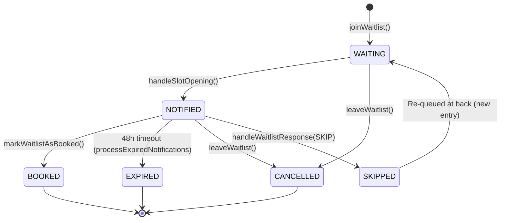
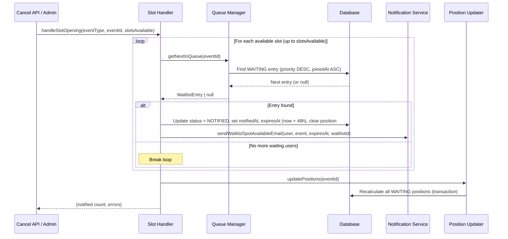

# Waitlist System

## Overview

The waitlist system manages queued access to multi-participant events (webinars and classes) that have reached their `maxParticipants` capacity. When an event is full, users join a priority-based queue and receive a 48-hour notification window when a spot opens up.

Key characteristics:
- Applies to webinars and classes only (not 1:1 consultations)
- Priority ordering: higher `priority` value goes first; ties broken by earliest `joinedAt`
- 48-hour response window on spot availability notifications
- Automatic expiration processing via cron job
- Integrates with checkout flow for payment completion

**Source files:**
- Slot handler: `lib/waitlist/slot-handler.ts` (joinWaitlist, leaveWaitlist, handleSlotOpening, handleWaitlistResponse, markWaitlistAsBooked, checkEventAvailability)
- Queue manager: `lib/waitlist/queue-manager.ts` (calculatePosition, getNextInQueue, updatePositions, processExpiredNotifications, getWaitlistStats, getUserWaitlistEntries)
- Notifications: `lib/waitlist/notifications.ts` (sendWaitlistSpotAvailableEmail)
- Model: `prisma/schema.prisma` (Waitlist, WaitlistStatus)

---

## Data Model

### Waitlist

| Field            | Type              | Default     | Description                                                  |
| ---------------- | ----------------- | ----------- | ------------------------------------------------------------ |
| `id`             | `String` (uuid)   | auto        | Primary key                                                  |
| `joinedAt`       | `DateTime`        | `now()`     | When user joined the queue (used for ordering)               |
| `position`       | `Int?`            | null        | Calculated queue position (1-indexed, null until calculated) |
| `status`         | `WaitlistStatus`  | `WAITING`   | Current lifecycle status                                     |
| `priority`       | `Int`             | `0`         | Priority weight; higher value = higher priority (VIP/premium) |
| `notifiedAt`     | `DateTime?`       | null        | When user was notified of an available spot                  |
| `expiresAt`      | `DateTime?`       | null        | Notification deadline (48h after `notifiedAt`)               |
| `reminderSentAt` | `DateTime?`       | null        | When the 12-hour reminder email was sent                     |
| `bookedAt`       | `DateTime?`       | null        | When user successfully completed booking                     |
| `respondedAt`    | `DateTime?`       | null        | When user responded to the notification                      |
| `preferences`    | `Json?`           | null        | User preferences (e.g., `{ preferredDates: [], maxPrice: 500 }`) |
| `userId`         | `String`          | required    | FK to User                                                   |
| `webinarId`      | `String?`         | null        | FK to Webinar (mutually exclusive with classId for a given entry) |
| `classId`        | `String?`         | null        | FK to Class (mutually exclusive with webinarId for a given entry) |
| `createdAt`      | `DateTime`        | `now()`     | Record creation timestamp                                    |
| `updatedAt`      | `DateTime`        | auto        | Last update timestamp                                        |

### Constraints

| Constraint                    | Type   | Purpose                                       |
| ----------------------------- | ------ | --------------------------------------------- |
| `@@unique([userId, webinarId])` | Unique | One active entry per user per webinar          |
| `@@unique([userId, classId])`   | Unique | One active entry per user per class            |

### Indexes

| Index                    | Purpose                                              |
| ------------------------ | ---------------------------------------------------- |
| `userId`                 | Look up all waitlist entries for a user               |
| `webinarId`              | Look up waitlist for a specific webinar               |
| `classId`                | Look up waitlist for a specific class                 |
| `status`                 | Filter by status across all events                   |
| `[status, webinarId]`    | Efficient queue queries per webinar                  |
| `[status, classId]`      | Efficient queue queries per class                    |
| `expiresAt`              | Cron job: find expired NOTIFIED entries              |
| `[priority, joinedAt]`   | Queue ordering: priority DESC, joinedAt ASC          |

### WaitlistStatus Enum

| Value       | Description                                     |
| ----------- | ----------------------------------------------- |
| `WAITING`   | In queue, waiting for spot                       |
| `NOTIFIED`  | Spot available, awaiting user response           |
| `BOOKED`    | Successfully booked the spot                     |
| `EXPIRED`   | Notification window expired (48h)                |
| `CANCELLED` | User left waitlist voluntarily                   |
| `SKIPPED`   | User declined spot, moved to back of queue       |

### Entity Relationships

```mermaid
erDiagram
    User ||--o{ Waitlist : "has many"
    Webinar ||--o{ Waitlist : "has many"
    Class ||--o{ Waitlist : "has many"
    Webinar }o--|| WebinarPlan : "belongs to"
    Class }o--|| ClassPlan : "belongs to"

    Waitlist {
        string id PK
        string userId FK
        string webinarId FK
        string classId FK
        WaitlistStatus status
        int priority
        int position
        datetime joinedAt
        datetime notifiedAt
        datetime expiresAt
        datetime reminderSentAt
        datetime bookedAt
        datetime respondedAt
        json preferences
    }

    User {
        string id PK
        string name
        string email
    }

    Webinar {
        string id PK
        string webinarPlanId FK
    }

    Class {
        string id PK
        string classPlanId FK
    }
```

---

## Status Lifecycle



| Status      | Meaning                                   | Trigger                                 |
| ----------- | ----------------------------------------- | --------------------------------------- |
| `WAITING`   | In queue, awaiting a spot                 | `joinWaitlist()`                        |
| `NOTIFIED`  | Spot available, 48-hour response window   | `handleSlotOpening()`                   |
| `BOOKED`    | Payment completed, booking confirmed      | `markWaitlistAsBooked()`                |
| `EXPIRED`   | Did not respond within 48 hours           | `processExpiredNotifications()` (cron)  |
| `CANCELLED` | User left the waitlist voluntarily        | `leaveWaitlist()`                       |
| `SKIPPED`   | Declined this spot, re-queued at back     | `handleWaitlistResponse(SKIP)`          |

---

## Queue Management

Source: `lib/waitlist/queue-manager.ts`

Queue ordering is determined by two fields: `priority` (descending) and `joinedAt` (ascending). A user with `priority: 10` will always be ahead of a user with `priority: 0`, regardless of join time. Among entries with equal priority, the earliest joiner goes first.

### Core Functions

| Function                       | Purpose                                                                                  |
| ------------------------------ | ---------------------------------------------------------------------------------------- |
| `calculatePosition`            | Count WAITING entries ahead of a given entry (priority DESC, joinedAt ASC). Returns 1-indexed position. |
| `getNextInQueue`               | Returns the highest-priority, earliest-joined WAITING entry for an event.                |
| `updatePositions`              | Recalculates and persists positions for all WAITING entries after a queue change. Uses a Prisma transaction. |
| `processExpiredNotifications`  | Finds all NOTIFIED entries past `expiresAt`, marks them EXPIRED, and updates positions for affected events. |
| `getWaitlistStats`             | Returns `totalWaiting`, `byWebinar`, `byClass` counts, and `averageWaitTimeDays` for a consultant's events. |
| `getUserWaitlistEntries`       | Returns a user's active (WAITING + NOTIFIED) entries with calculated positions, split into `webinars` and `classes`. |

### Position Calculation

```
position = COUNT(entries WHERE same event
                           AND status = WAITING
                           AND (priority > this.priority
                                OR (priority = this.priority AND joinedAt < this.joinedAt))
           ) + 1
```

Positions are recalculated whenever the queue changes: after a join, leave, skip, expiration, or slot notification.

---

## Slot Opening Flow

Source: `lib/waitlist/slot-handler.ts` -- `handleSlotOpening()`



### Triggers

The `handleSlotOpening` function is called when:

| Trigger               | Reason value          | Description                                    |
| --------------------- | --------------------- | ---------------------------------------------- |
| Booking cancellation  | `cancellation`        | A participant cancels their booking             |
| Capacity increase     | `capacity_increase`   | Consultant raises `maxParticipants`             |
| Participant removal   | `participant_removed` | Consultant removes a participant from the event |

---

## Response Handling

Source: `lib/waitlist/slot-handler.ts` -- `handleWaitlistResponse()`

When a user is notified of an available spot, they can respond in one of three ways. If they do not respond, the system handles expiration automatically.

### ACCEPT

1. Validate entry exists, belongs to user, and status is `NOTIFIED`
2. Check that the notification has not expired
3. Build checkout URL: `/checkout/plans/{eventType}/{planId}?eventId={eventId}&fromWaitlist={waitlistId}`
4. Return redirect URL to client
5. Actual booking happens through normal checkout/payment flow
6. After successful payment, checkout calls `markWaitlistAsBooked(waitlistId)` to set status to `BOOKED`

### DECLINE

1. Update status to `CANCELLED`, set `respondedAt`
2. Call `handleSlotOpening()` with `slotsAvailable: 1` to notify the next person in queue

### SKIP

1. Update original entry status to `SKIPPED`, set `respondedAt`
2. Create a **new** `Waitlist` entry with status `WAITING` for the same event (new `joinedAt` = now, placing them at the back of the queue)
3. Call `handleSlotOpening()` with `slotsAvailable: 1` to notify the next person
4. Call `updatePositions()` to recalculate queue positions

### No Response (Timeout)

1. `processExpiredNotifications()` (hourly cron) finds entries where `status = NOTIFIED` and `expiresAt < now`
2. Marks each as `EXPIRED`, sets `respondedAt`
3. Updates positions for all affected events
4. Slot handler is called separately to notify the next person in queue

---

## API Functions

Source: `lib/waitlist/slot-handler.ts`

| Function                  | Parameters                                                                  | Returns                                                        | Purpose                                                                                           |
| ------------------------- | --------------------------------------------------------------------------- | -------------------------------------------------------------- | ------------------------------------------------------------------------------------------------- |
| `joinWaitlist`            | `userId`, `webinarId?`, `classId?`, `preferences?`                          | `{ success, waitlistId?, position?, message }`                 | Validates user not already queued, checks event is full, creates entry, calculates position        |
| `leaveWaitlist`           | `waitlistId`, `userId`                                                      | `{ success, message }`                                         | Cancels entry; if status was NOTIFIED, notifies next person in queue. Updates positions.           |
| `checkEventAvailability`  | `webinarId?`, `classId?`                                                    | `{ available, currentParticipants, maxParticipants, waitlistCount }` | Returns current capacity status; counts unique participants for classes across all appointments    |
| `markWaitlistAsBooked`    | `waitlistId`                                                                | `void`                                                         | Sets status to BOOKED, records `bookedAt` and `respondedAt`                                       |
| `handleSlotOpening`       | `webinarId?`, `classId?`, `slotsAvailable?` (default 1), `reason?`          | `{ notified, errors[] }`                                       | Notifies up to N next users in queue; sets NOTIFIED status with 48h expiry                        |
| `handleWaitlistResponse`  | `waitlistId`, `userId`, `action` (`ACCEPT` / `DECLINE` / `SKIP`)            | `{ success, redirectUrl?, message }`                           | Processes user response; ACCEPT returns checkout URL, DECLINE/SKIP notify next in queue           |

### Validation Rules

- `joinWaitlist`: Rejects if user already has a WAITING or NOTIFIED entry for the same event. Rejects if event still has available spots.
- `leaveWaitlist`: Only allowed when status is WAITING or NOTIFIED. Validates user ownership.
- `handleWaitlistResponse`: Only allowed when status is NOTIFIED. Checks expiration before processing. Validates user ownership.

---

## Integration Points

### Cancel API --> Waitlist

When a booking is cancelled for a webinar or class, the cancellation flow calls `handleSlotOpening()` to notify the next queued user.

See: `docs/booking/08-cancellation-flow.md`

### Checkout --> Waitlist

The checkout flow accepts a `fromWaitlist` query parameter containing the waitlist entry ID. After successful payment, the checkout handler calls `markWaitlistAsBooked(waitlistId)` to finalize the waitlist entry.

Checkout URL format:
```
/checkout/plans/{eventType}/{planId}?eventId={eventId}&fromWaitlist={waitlistId}
```

See: `docs/booking/10-checkout-payment-integration.md`

### Cron Jobs

| Job                              | Schedule | Source                                        | Description                                                       |
| -------------------------------- | -------- | --------------------------------------------- | ----------------------------------------------------------------- |
| `process-waitlist-expirations`   | Hourly   | `lib/waitlist/queue-manager.ts` (`processExpiredNotifications`) | Finds NOTIFIED entries past `expiresAt`, marks EXPIRED, notifies next in queue |
| `send-waitlist-reminders`        | Hourly   | `lib/waitlist/notifications.ts`               | Sends 12-hour reminder emails for NOTIFIED entries approaching expiration      |

### Availability Check Flow

`checkEventAvailability()` is used by the booking UI to determine whether to show a "Join Waitlist" button or a normal "Book Now" button:

```
if (available) -> show "Book Now"
else           -> show "Join Waitlist" (with waitlistCount display)
```

For webinars, participant count is based on `slotsOfAppointment.length`. For classes, it counts unique users across all appointments to avoid double-counting participants enrolled in multiple sessions.
