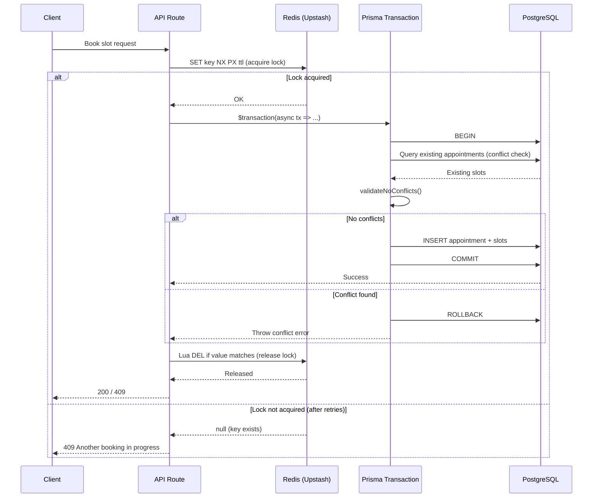
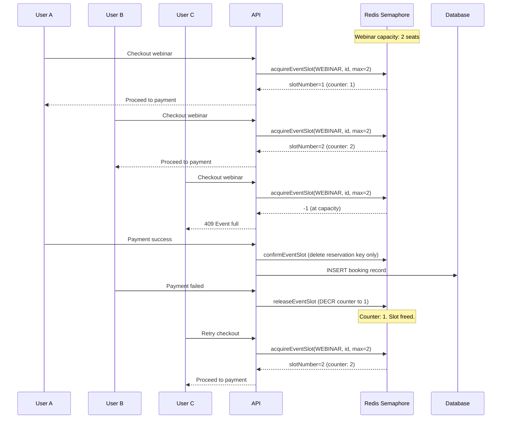

# Concurrency & Locking

## Overview

Booking operations use a four-layer concurrency protection model to prevent double-booking, race conditions, and data corruption:

| Layer | Mechanism                       | Scope         | Purpose                                               |
| ----- | ------------------------------- | ------------- | ----------------------------------------------------- |
| 1     | Redis distributed lock          | Cross-process | Serializes concurrent requests for the same resource  |
| 2     | Prisma interactive transaction  | Database      | Atomic multi-statement operations with isolation      |
| 3     | Conflict validation (inside tx) | Application   | Detects overlapping slots from already-committed data |
| 4     | `slot_no_confirmed_overlap` DB exclusion constraint | Database | btree_gist constraint rejects any INSERT/UPDATE that would create a confirmed (non-tentative) overlap for the same consultant; applied via `npm run db:constraints` (#440) |

All four layers are required. Redis locks alone cannot guarantee consistency because they can expire under slow operations. Database transactions alone cannot prevent two processes from simultaneously passing validation checks on the same data. Conflict validation inside the transaction catches application-level overlaps, and the `slot_no_confirmed_overlap` exclusion constraint is the final database-enforced backstop.

**Source**: `utils/appointmentlock.ts`

---

## Architecture



---

## Distributed Locking

Six lock functions cover all booking-related operations. Each wraps the core `acquireLockWithRetry()` function with a domain-specific key pattern and error message.

| Function                   | Key Pattern                                                     | Default TTL  | Purpose                                                               |
| -------------------------- | --------------------------------------------------------------- | ------------ | --------------------------------------------------------------------- |
| `lockConsultationApproval` | `consultation-approval:{consultationId}`                        | 60s          | Prevents concurrent approval of the same consultation                 |
| `lockSubscriptionApproval` | `subscription-approval:{subscriptionId}`                        | 60s          | Prevents concurrent approval of the same subscription                 |
| `lockSlotBooking`          | `slot-booking:{consultantProfileId}:{startsAt}`       | 60s          | Prevents double-booking a specific consultant time slot               |
| `lockTrialSlot`            | `trial-slot-booking:{consultantProfileId}:{startsAt}` | 60s          | Prevents double-booking during trial scheduling                       |
| `lockEventCheckout`        | `event-checkout:{appointmentType}:{eventOrPlanId}`              | 60s          | Serializes checkout for a specific event (webinar/class/subscription) |
| `lockAppointment`          | `appointment-lock:{appointmentId}`                              | 300s (5 min) | Legacy lock for appointment-level operations (cancel, reschedule)     |

All locks use Redis `SET key value NX PX ttl`:

- **NX** -- only set if key does not exist (mutual exclusion)
- **PX** -- expire in milliseconds (auto-cleanup on crash)

The lock value is a `crypto.randomUUID()`, used for safe release verification (see [Safe Release](#safe-release)).

`lockSlotBooking` and `lockTrialSlot` throw `SlotLockError` (see `utils/errors/SlotLockError.ts`) with structured fields (`consultantId`, `slotTime`, `retryAfterSeconds`) for type-safe error handling via `instanceof`.

> Cross-reference: `docs/upstash/redis/locking/` for Redis infrastructure and migration details.

---

## Retry Strategy

Lock acquisition retries up to 10 times with exponential backoff and jitter.

**Default configuration** (`DEFAULT_RETRY_CONFIG`):

| Parameter            | Value  | Description                        |
| -------------------- | ------ | ---------------------------------- |
| `retryCount`         | 10     | Maximum retry attempts             |
| `retryDelay`         | 200ms  | Base delay between retries         |
| `retryJitter`        | 200ms  | Random jitter added to each delay  |
| `exponentialBackoff` | `true` | Doubles base delay on each attempt |
| `driftFactor`        | 0.01   | Clock drift compensation (1%)      |

**Delay formula** (`calculateRetryDelay`):

```
delay = (retryDelay * 2^attempt) + random(0, retryJitter)
```

Example delays per attempt:

| Attempt | Base (ms) | + Jitter Range (ms) | Total Range (ms) |
| ------- | --------- | ------------------- | ---------------- |
| 0       | 200       | 0--200              | 200--400         |
| 1       | 400       | 0--200              | 400--600         |
| 2       | 800       | 0--200              | 800--1000        |
| 3       | 1600      | 0--200              | 1600--1800       |
| 4       | 3200      | 0--200              | 3200--3400       |

The effective TTL is reduced by the drift factor: `effectiveTTL = floor(ttl * (1 - driftFactor))`. For a 60-second lock, the effective TTL is 59,400ms. This accounts for clock skew between the application server and Redis.

---

## Safe Release

Lock release uses an atomic Lua script to prevent releasing another client's lock. This is critical because:

1. Client A acquires lock with value `uuid-A`
2. Lock TTL expires while Client A is still working
3. Client B acquires the same lock with value `uuid-B`
4. Client A finishes and tries to release -- without value checking, it would delete Client B's lock

**Lua script** (`releaseLock`):

```lua
if redis.call("get", KEYS[1]) == ARGV[1] then
  return redis.call("del", KEYS[1])
else
  return 0
end
```

- Returns `1` if the lock was successfully released (value matched).
- Returns `0` if the lock was already expired or owned by another client.
- The `GET` + `DEL` executes atomically within Redis (single-threaded Lua evaluation).

`releaseLock()` never throws. It catches all errors and logs them. This makes it safe to call from `finally` blocks without masking the original error.

---

## Lock Extension

For long-running operations, `extendLock()` implements a heartbeat pattern that extends the lock TTL without releasing and re-acquiring.

**Lua script** (`extendLock`):

```lua
if redis.call("get", KEYS[1]) == ARGV[1] then
  return redis.call("pexpire", KEYS[1], ARGV[2])
else
  return 0
end
```

- Checks ownership (value match) before extending.
- Uses `PEXPIRE` to set a new TTL in milliseconds.
- Default extension: 30,000ms (30 seconds).
- Returns `true` on success, `false` if ownership was lost.

**Usage pattern**: Call periodically during operations that may exceed the lock TTL. If `extendLock()` returns `false`, the operation should abort because another client may have acquired the lock.

---

## Event Slot Semaphore

Standard distributed locks serialize access to one client at a time. For multi-participant events (webinars and classes), a counting semaphore allows multiple concurrent checkouts up to the `maxParticipants` limit.

### Redis Keys

| Key                                                       | Type                 | TTL   | Purpose                                     |
| --------------------------------------------------------- | -------------------- | ----- | ------------------------------------------- |
| `event-counter:{eventType}:{eventId}`                     | Integer (counter)    | 5 min | Current number of active reservations       |
| `event-reservation:{eventType}:{eventId}:{reservationId}` | String (slot number) | 5 min | Individual reservation tracking for cleanup |

### Operations

**`acquireEventSlot`** -- Atomic increment with capacity check:

```lua
local current = redis.call("get", KEYS[1])
if current == false then
  current = 0
else
  current = tonumber(current)
end

if current >= tonumber(ARGV[1]) then
  return -1
end

local newCount = redis.call("incr", KEYS[1])
if newCount == 1 then
  redis.call("pexpire", KEYS[1], ARGV[2])
end

return newCount
```

- Returns `-1` if at capacity (event full).
- Returns the new slot number on success.
- Sets TTL only on the first reservation (counter creation).
- After acquiring, stores an individual reservation key for cleanup tracking.

**`releaseEventSlot`** -- Decrement on payment failure or cancellation:

```lua
local current = redis.call("get", KEYS[1])
if current and tonumber(current) > 0 then
  return redis.call("decr", KEYS[1])
end
return 0
```

- Only decrements if counter is above zero (prevents negative counts).
- Checks reservation key existence before decrementing (idempotent).
- Deletes the individual reservation key.

**`confirmEventSlot`** -- On successful payment:

- Deletes only the reservation tracking key.
- Does NOT decrement the counter (the slot is now permanently booked in the database).

**`getEventSlotCount`** -- Read current reservation count without modifying state.

### Concurrent Checkout Flow



### TTL and Cleanup

The 5-minute TTL (300,000ms) covers the payment completion window. If a user abandons checkout without explicit cancellation:

- The reservation key expires after 5 minutes.
- The counter key also expires, resetting to zero.
- Database-level participant counts remain the source of truth for availability queries outside the checkout window.

---

## Prisma Transaction Layer

All slot allocation and cancellation operations run inside Prisma interactive transactions. Transaction timeouts vary by operation complexity:

| Operation                               | Timeout | Max Wait | Source                                    |
| --------------------------------------- | ------- | -------- | ----------------------------------------- |
| Slot allocation (auto/manual/requested) | 120s    | Default  | `SlotAllocationService.ts`                |
| Appointment cancellation                | 30s     | 10s      | `appointments/[id]/cancel/route.ts`       |
| Payment transactions                    | 30s     | 5s       | `lib/payments/core/transactions.ts`       |
| Webinar CRUD                            | 10s     | 5s       | `events/webinars/crud-with-plan/route.ts` |

The transaction provides two guarantees:

1. **Atomicity** -- All database writes succeed or all roll back. No partial bookings.
2. **Isolation** -- Conflict validation inside the transaction reads committed data, preventing two concurrent transactions from both passing validation on the same slot.

The pattern in every booking route:

```
lock = await lockSlotBooking(...)    // Layer 1: Redis lock
try {
  await prisma.$transaction(tx => {  // Layer 2: Prisma transaction
    validate(tx, ...)                // Layer 3: Conflict check inside tx
    create(tx, ...)
  })
} finally {
  await unlockSlotBooking(lock)      // Always release
}
```

---

## Race Condition Scenarios

| Scenario                                             | Protection Mechanism         | Key/Strategy                                                                       |
| ---------------------------------------------------- | ---------------------------- | ---------------------------------------------------------------------------------- |
| Two users book the same consultant slot              | `lockSlotBooking`            | `slot-booking:{profileId}:{slotTime}` -- serializes access to the specific slot    |
| Two admins approve the same consultation             | `lockConsultationApproval`   | `consultation-approval:{id}` -- only one approval proceeds                         |
| Two admins approve the same subscription             | `lockSubscriptionApproval`   | `subscription-approval:{id}` -- only one approval proceeds                         |
| Multiple webinar checkouts at capacity               | Event slot semaphore         | `acquireEventSlot` atomic Lua INCR with max check                                  |
| Multiple class checkouts at capacity                 | Event slot semaphore         | Same semaphore pattern, different `eventType`                                      |
| Two users schedule the same trial slot               | `lockTrialSlot`              | `trial-slot-booking:{profileId}:{slotTime}`                                        |
| Concurrent cancel and reschedule on same appointment | `lockAppointment`            | `appointment-lock:{appointmentId}` -- 5 min TTL                                    |
| Lock expires during slow DB operation                | `extendLock` heartbeat       | Extends TTL without releasing; 120s transaction timeout aligned with extended lock |
| Client crashes while holding lock                    | Redis TTL auto-expiry        | Lock expires after TTL, no manual intervention needed                              |
| Lock released by wrong client                        | Safe release Lua script      | `GET` + `DEL` atomic with value verification                                       |
| Slot passes validation but conflicts at commit       | Prisma transaction isolation + `slot_no_confirmed_overlap` exclusion constraint (#440) | Transaction rollback on constraint violation; DB rejects any confirmed overlap for same consultant even if application validation was bypassed |
| Payment abandoned mid-checkout (events)              | Semaphore TTL expiry         | 5 min TTL auto-frees the reserved slot                                             |
| Cancelled/rejected slots blocking new bookings       | `buildOccupiedAppointmentFilter()` | Conflict check excludes appointments with terminal statuses (CANCELLED, REJECTED, EXPIRED) |
