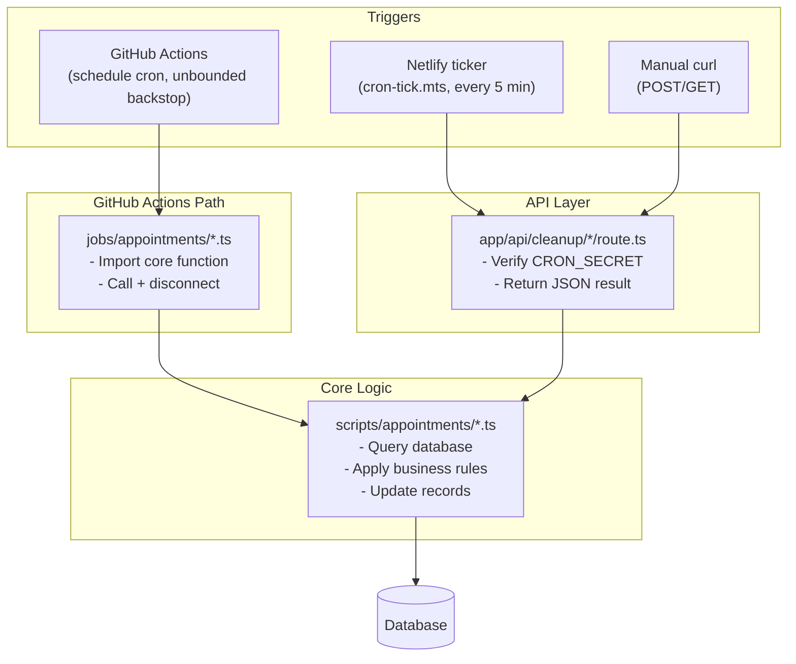

# Cron Jobs and Background Tasks

## Overview

The booking system relies on several cron jobs to maintain data integrity, expire stale records, and automatically transition appointment statuses. These background tasks handle situations that cannot be resolved synchronously during user interactions, such as:

- Completing appointments after sessions end
- Releasing slots held by abandoned booking flows
- Expiring unanswered requests
- Detecting and cleaning up duplicate or invalid records
- Reconciling slot availability after payment state changes

### Invocation Model

Each job follows a dual-invocation pattern:

1. **GitHub Actions** (unbounded backstop) -- Workflows in `.github/workflows/` run on a `schedule` trigger and execute the core script directly via `npx tsx`. ADR 22 measured GitHub Actions delivering a sub-hourly `cron:` schedule roughly once every hundred minutes rather than on its declared cadence, so Actions is the fleet's daily/weekly and unbounded fallback scheduler, not the primary invocation for a latency-sensitive job.
2. **API endpoints** (primary, for the latency-sensitive jobs) -- Thin wrapper routes in `app/api/cleanup/` are POSTed by the Netlify scheduled function `netlify/functions/cron-tick.mts` (ADR 27) every five minutes, or invoked manually via `curl`. See "The Netlify ticker" below for which jobs ride it and at what cadence.

Both paths call the same core function exported from `scripts/appointments/`. The API route adds HTTP authentication; the GitHub Actions workflow uses repository secrets for database access.

> **Cross-reference**: See `docs/guides/cron-setup.md` for how to run the Netlify ticker locally.

---

## Schedule Overview

| Job                          | Cron Expression   | Human-Readable        | Source Script                                               | API Route                                        |
| ---------------------------- | ----------------- | --------------------- | ----------------------------------------------------------- | ------------------------------------------------ |
| Auto-complete appointments   | `7 * * * *`       | Every hour, at :07    | `scripts/appointments/auto-complete-appointments.ts`        | `/api/cleanup/auto-complete-appointments`        |
| Cleanup tentative slots      | `38 */2 * * *`    | Every 2 hours, at :38 | `scripts/appointments/cleanup-tentative-occurrences.ts`     | `/api/cleanup/tentative-occurrences`             |
| Cleanup invalid appointments | `12 * * * *`      | Every hour, at :12    | `scripts/appointments/cleanup-invalid-appointments.ts`      | `/api/cleanup/invalid-appointments`              |
| Expire stale requests        | `10 * * * *`      | Every hour, at :10    | `scripts/appointments/expire-stale-requests.ts`             | `/api/cleanup/expire-stale-requests`             |
| Cleanup abandoned payments   | `6-59/15 * * * *` | Every 15 minutes      | `scripts/payments/cleanup-abandoned-payments.ts`            | `/api/cleanup/abandoned-payments`                |
| Reconcile slot availability  | `32 * * * *`      | Every hour, at :32    | `scripts/appointments/reconcile-occurrence-availability.ts` | `/api/cleanup/reconcile-occurrence-availability` |
| Detect consultant no-shows   | `57 * * * *`      | Every hour, at :57    | `scripts/appointments/detect-consultant-no-shows.ts`        | N/A (GitHub Actions only)                        |

---

## Scheduling policy

Every scheduled workflow is checked by `scripts/ci/check-workflow-hygiene.ts`
at build time. The guard used to forbid any two recurring jobs from sharing a
start-minute (minute-uniqueness); since the #932 pool stampede it instead
models what actually matters — concurrent load on the Supabase pool.

**Runtime annotations.** A workflow may declare its estimated DB-active
runtime anywhere in the file with a comment:

```yaml
- cron: "32 * * * *"
# cron-runtime-minutes: 8
```

The value covers the job's database-active window (the `tsx` step), not the
whole workflow — checkout, `npm ci`, and `prisma generate` never touch the
pool. Jobs without an annotation default to **2 minutes**, which is right for
the quick sweeps. The heaviest jobs are annotated:
`reconcile-occurrence-availability: 8`, `auto-complete-appointments: 6`,
`cleanup-tentative-occurrences: 5`, `cleanup-invalid-appointments: 5`.

**The budget.** For each start-minute shared by recurring jobs, the guard sums
the declared runtimes and fails when the total exceeds
`POOL_BUDGET_MINUTES = 10`. That constant is derived from the pool guidance in
`lib/prisma.ts`: pg.Pool opens up to 10 clients per function instance
(`PG_POOL_MAX` clamps it in serverless), while Supavisor's transaction pooler
fronts a small server-side pool — concurrent clients piling up is exactly what
turned #932 into 5–9.6s connects. Once-a-day overlaps stay tolerated: they
collide once and cost nothing. A single job declaring more than the whole
budget fails on its own declaration, since no staggering can fit it.

This beats minute-scarcity because uniqueness was only ever a proxy for pool
contention, and the clock was running out of free minutes as jobs were added.
Cost lets light jobs share a minute safely and forces the conversation onto
real numbers whenever a heavy one wants in.

---

## Per-Job Documentation

### a. Auto-Complete Appointments

| Field              | Value                                                 |
| ------------------ | ----------------------------------------------------- |
| **Schedule**       | `7 * * * *` -- every hour, at :07                     |
| **Source**         | `scripts/appointments/auto-complete-appointments.ts`  |
| **API**            | `app/api/cleanup/auto-complete-appointments/route.ts` |
| **GitHub Actions** | `.github/workflows/auto-complete-appointments.yml`    |
| **HTTP Methods**   | `GET`, `POST`                                         |

**Purpose**: Transitions appointments to `COMPLETED` status after their session time has passed. Enables downstream processes: feedback collection, payout processing, and reporting.

**Threshold**: 1 hour buffer after the last slot's `endsAt` timestamp (`COMPLETION_BUFFER_HOURS = 1`).

**Records affected**:

| Entity       | Source Statuses            | Target Status | Criteria                                                                             |
| ------------ | -------------------------- | ------------- | ------------------------------------------------------------------------------------ |
| Webinar      | `SCHEDULED`, `IN_PROGRESS` | `COMPLETED`   | All slots ended > 1h ago                                                             |
| Class        | `SCHEDULED`, `IN_PROGRESS` | `COMPLETED`   | All slots across all appointments ended > 1h ago                                     |
| Consultation | `APPROVED`, `SCHEDULED`    | `COMPLETED`   | All slots ended > 1h ago, unless the consultant never joined (see below)             |
| Subscription | `APPROVED`, `SCHEDULED`    | `COMPLETED`   | All slots across all appointments ended > 1h ago                                     |
| Trial        | `SCHEDULED`                | `COMPLETED`   | All slots ended > 1h ago; also sets `completedAt` and creates an `ActivityLog` entry |

**The consultant no-show handoff (#1504).** A consultation that the consultant never joined is not this job's to close. The only path that cancels such a booking and refunds the consultee in full is the no-show detector described in section g, and that detector only considers bookings that are still `APPROVED` or `SCHEDULED`. Because this job's buffer is one hour and the detector's grace window is two, this job used to reach every unattended consultation first and mark it `COMPLETED`, which removed it from the detector's candidate set permanently; the platform's promised refund could therefore never fire in production.

Both jobs now read the same predicate from `lib/booking/attendance.ts`, which classifies a booking from the `MeetingAttendance` rows as one of three shapes. When the consultant has a recorded join, this job completes the booking as it always did. When the consultee has a join and the consultant does not, this job defers: it skips the booking and leaves it live for the detector. When there is no session at all, or nobody joined, the booking is not a consultant-fault refund and this job completes it, because the detector's remedy in that case is a support ticket rather than a status change.

The deferral is bounded. The detector declines candidates it cannot decide — Stream's own call report contradicts our attendance rows, the session has no Stream call to ask about, or the run failed — and it leaves those bookings untouched. `NO_SHOW_HANDOFF_MINUTES` (the grace window plus two hours) is the point at which this job stops waiting and completes the booking anyway, so that the hourly detector has had at least one and normally two full runs in which the booking was visible to it. A booking that neither job would ever claim would sit live forever, which is a worse outcome than completing it.

**Safety**: Per-record `try/catch`. A failure on one record does not prevent processing of others. All errors are collected into a result array and returned. The activity log write for trial sessions has its own nested `try/catch` so a logging failure does not block the completion update.

**Trial sessions have no separate job.** A second endpoint, `/api/cleanup/auto-complete-trials`, used to complete trials on its own. It had no `jobs/` wrapper, no GitHub Actions workflow and no Netlify schedule, so nothing ever invoked it, and it completed a trial as soon as any one of its slot rows had ended, with no buffer. It was a redundant twin of the Trial row in the table above and was deleted in #1278. Trials are completed here, by the hourly job, which requires the full one-hour buffer and an `every` clause over the appointment's slots, so a multi-slot trial only closes once all of its slots have ended.

---

### b. Cleanup Tentative Slots

| Field              | Value                                                   |
| ------------------ | ------------------------------------------------------- |
| **Schedule**       | `38 */2 * * *` -- every 2 hours, at :38                 |
| **Source**         | `scripts/appointments/cleanup-tentative-occurrences.ts` |
| **API**            | `app/api/cleanup/tentative-occurrences/route.ts`        |
| **GitHub Actions** | `.github/workflows/cleanup-tentative-occurrences.yml`   |
| **HTTP Methods**   | `GET`, `POST`                                           |

**Purpose**: Releases slots marked `isTentative = true` that are associated with abandoned booking flows. These tentative slots block consultant availability; if not cleaned up, abandoned checkouts permanently reduce the consultant's bookable calendar.

**Threshold**: 24 hours since slot creation (`TENTATIVE_EXPIRATION_HOURS = 24`, cut from 7 days by #833).

**Criteria**: Slot has `isTentative = true`, `createdAt` older than 24 hours, AND the associated appointment has no payment with `paymentStatus = SUCCEEDED`. Users can also release their own holds immediately via `DELETE /api/checkout/pending/[paymentId]` (#849) instead of waiting for this cron.

**Action**: Deletes the stale `AppointmentOccurrence` records using `deleteMany`. This frees the time range for new bookings.

**Safety**: Single top-level `try/catch` around the entire operation. The query and delete use the same filter criteria, preventing TOCTOU race conditions. Logs user and payment information for each affected slot before deletion.

---

### c. Cleanup Stale Pending Consultations (retired)

This job was retired on 2026-09-19 (#1732, #1589 P-P1-01). It cancelled `APPROVED` / `APPROVED_PENDING_PAYMENT` consultations with no successful payment after seven days, while `expire-stale-requests` and the pay-link sweep in `cleanup-abandoned-payments` expire that same cohort, so one event had two sweeps and two terminal words. Doctrine rule 5 keeps one outcome, `EXPIRED`, and the two remaining sweeps share it.

---

### d. Cleanup Invalid Appointments

| Field              | Value                                                  |
| ------------------ | ------------------------------------------------------ |
| **Schedule**       | `12 * * * *` -- every hour, at :12                     |
| **Source**         | `scripts/appointments/cleanup-invalid-appointments.ts` |
| **API**            | `app/api/cleanup/invalid-appointments/route.ts`        |
| **GitHub Actions** | `.github/workflows/cleanup-invalid-appointments.yml`   |
| **HTTP Methods**   | `POST` only                                            |

**Purpose**: Detects and cancels duplicate or structurally invalid appointments across four categories.

**Detection categories**:

| Category                                | Detection Logic                                                                      | Keeps          |
| --------------------------------------- | ------------------------------------------------------------------------------------ | -------------- |
| Duplicate consultations (same-day)      | Same `requestedById` + `consultationPlanId` + same calendar day                      | Oldest record  |
| Duplicate consultations (double-submit) | Same user + plan, created within 5 seconds                                           | Oldest record  |
| Duplicate subscriptions (overlapping)   | Same `requestedById` + `subscriptionPlanId` + overlapping scheduling periods         | Oldest record  |
| Duplicate subscriptions (double-submit) | Same user + plan, created within 5 seconds                                           | Oldest record  |
| Invalid duration consultations          | Total slot duration does not match `consultationPlan.durationInHours` (1% tolerance) | N/A -- cancels |
| Invalid duration subscriptions          | Scheduling period months does not match `subscriptionPlan.durationInMonths`          | N/A -- cancels |

**Action**: Sets `status = CANCELLED` on affected records. Also deletes associated `AppointmentOccurrence` records to free availability. Records already in terminal states (`CANCELLED`, `REJECTED`, `EXPIRED`) are excluded from processing.

**Safety**: Each of the four sub-tasks has its own `try/catch`. The API route uses `crypto.timingSafeEqual` for authorization header comparison, preventing timing-based attacks. The `runAllCleanupTasks` function handles database disconnection in a `finally` block.

---

### e. Expire Stale Requests

| Field              | Value                                            |
| ------------------ | ------------------------------------------------ |
| **Schedule**       | `10 * * * *` -- every hour, at :10               |
| **Source**         | `scripts/appointments/expire-stale-requests.ts`  |
| **API**            | `app/api/cleanup/expire-stale-requests/route.ts` |
| **GitHub Actions** | `.github/workflows/expire-stale-requests.yml`    |
| **HTTP Methods**   | `GET`, `POST`                                    |

**Purpose**: Expires consultation and subscription requests that have been ignored or abandoned at the request stage. This covers three distinct scenarios:

| Scenario                           | Source Status              | Threshold                                                                   | Target Status |
| ---------------------------------- | -------------------------- | --------------------------------------------------------------------------- | ------------- |
| Consultant never responded         | `PENDING` (consultation)   | 48 hours since `requestedAt` (`PENDING_CONSULTATION_EXPIRATION_HOURS = 48`) | `EXPIRED`     |
| Consultant never responded         | `PENDING` (subscription)   | 30 days since `requestedAt` (`PENDING_EXPIRATION_DAYS = 30`)                | `EXPIRED`     |
| Approved but payment never started | `APPROVED_PENDING_PAYMENT` | 7 days since `updatedAt` (`PAYMENT_PENDING_EXPIRATION_DAYS = 7`)            | `EXPIRED`     |

**Action**:

- PENDING consultations: Bulk `updateMany` to `EXPIRED`, then immediately releases the tentative slots the expired requests pinned (`deleteMany` scoped to `isTentative: true` on their appointments). A PENDING consultation holds a real calendar slot, so the threshold is hours and the release happens in the same pass — booking-journey audit B1; previously a hold could sit for 30 days on a daily sweep that did not free slots.
- PENDING subscriptions: Bulk `updateMany` to `EXPIRED`. Subscriptions hold no slots at request time (lazy allocation), so they keep the 30-day window.
- **APPROVED-unallocated subscriptions (PR 2c money fix, audit gap #3)**: PAID bookings whose consultant never allocated any session were IMMORTAL before — `APPROVED` was not in `EXPIRED`'s allowed-from and no cohort covered them. The sweep now expires `APPROVED` rows with zero live confirmed slots after 30 days; `REQUEST_ALLOWED_FROM.EXPIRED` was widened to include `APPROVED` to make the transition legal.
- **Refunds (PR 2c money fix, audit gap #1)**: every expired consultation/subscription with SUCCEEDED payments is refunded via the booking front door (`refundBookingPayment`, full remaining balance). Failures are counted + logged, never thrown — one bad gateway call must not stall the cohort drain.
- APPROVED_PENDING_PAYMENT requests: Bulk `updateMany` to `EXPIRED` and clears `pendingPaymentUrl` to invalidate stale payment links.

**Safety**: Three separate operations (PENDING consultations, PENDING subscriptions, payment-pending requests), each with its own `try/catch`. Uses bulk `updateMany` rather than per-record updates for efficiency. Hourly cadence bounds worst-case hold lifetime at ~49h. Because two of those operations refund SUCCEEDED payments through `refundPaymentsForExpired`, this job is in `FINANCIAL_JOB_NAMES` and is held during DEGRADED maintenance as well as OFFLINE (#1506).

**Consultant nudges for unallocated paid subscriptions (#1703 D4, added 2026-09-19).** This same run also calls `nudgeUnscheduledSubscriptions`, which reads paid `APPROVED` subscriptions with zero live confirmed slots and sends the consultant one nudge at each of `SUBSCRIPTION_NUDGE_DAYS = [3, 7, 14]` days since the subscription's `updatedAt`, through the `new-booking-request` Novu bell family and its email twin. `nudgeStageFor` maps an age to the latest stage that age has crossed, so a run that missed day 3 (a run outage, a paused job) sends day 7 once rather than both; the once-guard is a `FailedEmail` row keyed by stage. This is deliberately additive to the existing 30-day auto-refund in this same job, not a replacement for it: the refund stays the buyer-protective backstop, and the nudge is what gives the consultant a chance to act before it fires. The job's response body carries `subscriptionNudgesSent` alongside its existing counts.

---

### f. Reconcile Slot Availability

| Field              | Value                                                        |
| ------------------ | ------------------------------------------------------------ |
| **Schedule**       | `32 * * * *` -- every hour, at :32                           |
| **Source**         | `scripts/appointments/reconcile-occurrence-availability.ts`  |
| **API**            | `app/api/cleanup/reconcile-occurrence-availability/route.ts` |
| **GitHub Actions** | `.github/workflows/reconcile-occurrence-availability.yml`    |
| **HTTP Methods**   | `GET`, `POST`                                                |

**Purpose**: Fixes slot availability inconsistencies and detects booking conflicts. Performs two operations:

**Operation 1 -- Clear stale tentative flags**: Finds slots where `isTentative = true` but the appointment has a `SUCCEEDED` payment. This happens when a payment webhook succeeds but the tentative flag was not cleared (race condition, system error). Updates `isTentative = false` via bulk `updateMany`.

**Operation 2 -- Detect double bookings**: Scans all confirmed (non-tentative) future slots with successful payments, groups them by consultant, and checks for time overlaps. Double bookings are reported but **not** auto-resolved -- they require manual intervention.

**Action**:

- Tentative flag mismatches: Automatically corrected.
- Double bookings: Logged and returned in the response. The API returns HTTP `207` when double bookings are detected (vs `200` for clean results).

**Ownership of the 207 response**: A `207` is a degraded-but-not-broken signal, not a page. The GitHub Actions workflow posts it to the ops Slack channel configured via `SLACK_OPS_WEBHOOK_URL`, and the on-call engineer owns the follow-up. That engineer is responsible for triaging the reported overlaps, manually resolving the affected bookings (the job never auto-resolves them), and confirming the next hourly run returns `200`. Treat a `207` that persists across more than one run as the trigger to escalate.

**Safety**: Two independent `try/catch` blocks. The double booking detection is read-only and does not modify data. The GitHub Actions workflow is configured to trigger a failure notification specifically for double booking scenarios, routed to the ops Slack channel (`SLACK_OPS_WEBHOOK_URL`) described above.

---

### g. Detect Consultant No-Shows

| Field              | Value                                                |
| ------------------ | ---------------------------------------------------- |
| **Schedule**       | `57 * * * *` -- every hour, at :57                   |
| **Source**         | `scripts/appointments/detect-consultant-no-shows.ts` |
| **API**            | N/A -- runs via GitHub Actions only                  |
| **GitHub Actions** | `.github/workflows/detect-consultant-no-shows.yml`   |
| **HTTP Methods**   | N/A                                                  |

**Purpose**: Closes the loop on the platform's promise of a full refund when the consultant fails to attend a paid session. The job scans confirmed `CONSULTATION` bookings whose session ended at least the grace window ago, uses the per-attendee `MeetingAttendance` records (stamped by the Stream session handlers) to identify the ones the consultant never joined, and for each such no-show it auto-refunds the consultee via `refundPayment`, marks the booking cancelled, and notifies both parties.

**Scope**: Consultations only. A consultation is a single-session, single-consultant exclusive booking where a full refund of the one payment is the correct remedy. Subscriptions are multi-session, so a per-session consultant no-show is a partial refund of one session out of many and needs its own design; it is not yet handled.

**Grace window**: A session must have ended at least 120 minutes ago (`NO_SHOW_GRACE_MINUTES = 120`) before a missing consultant is treated as a no-show, so a late join or a delayed Stream participant webhook cannot trigger a false-positive refund. The constant lives in `lib/booking/attendance.ts` alongside the attendance predicate, because the auto-completion job in section a has to honour the same window: it defers a booking in the no-show shape rather than completing it out from under this job (#1504).

**Safety**: The job runs under a fail-closed cron lock. Because it moves money, it refuses to run without a real Redis lock rather than risk a silent unlocked double-run, and `refundPayment`'s refundable-balance guard remains the correctness backstop. It is also in `FINANCIAL_JOB_NAMES`, so it is held during DEGRADED maintenance as well as OFFLINE (#1506).

---

### h. Cleanup Abandoned Payments (Pay-Link Reminder and Lapsed-Link Expiry)

| Field              | Value                                                                                                                  |
| ------------------ | ---------------------------------------------------------------------------------------------------------------------- |
| **Schedule**       | Netlify ticker every 15 minutes (`TARGET_EVERY_MINUTES`, #1686); GitHub Actions `6-59/15 * * * *` as the fallback twin |
| **Source**         | `scripts/payments/cleanup-abandoned-payments.ts`                                                                       |
| **API**            | `app/api/cleanup/abandoned-payments/route.ts`                                                                          |
| **GitHub Actions** | `.github/workflows/cleanup-abandoned-payments.yml`                                                                     |

**Purpose**: The delivered cadence comes from the Netlify ticker (ADR 22, ADR 27), which since #1686 fires this target every third tick — every 15 minutes — because each row costs a gateway round trip; the GitHub Actions schedule is the fallback twin at the same cadence, not the primary invocation. It cancels an abandoned direct-checkout payment and cancels a lapsed approval pay-link.

**The pay-link reminder (#1703 D2, added 2026-09-18).** `remindApprovalPaymentsDue` sends one reminder email when half the 24-hour pay-link window is left (`APPROVAL_PAYMENT_EXPIRATION_HOURS = 24`, so the reminder fires with 12 hours left on the link). It is the existing pay-link email re-sent with a different heading, staged as a `FailedEmail` row of type `PAYMENT_LINK_REMINDER` keyed by the payment id, which is the once-guard: a second run against the same payment finds the row and sends nothing. The reminder never fires after a capture or after the link itself has lapsed, because both of those move the row out of the reminder's `APPROVED_PENDING_PAYMENT`-with-a-live-pay-link cohort.

**The lapsed-link expiry, and the single-CAS rule it shares (#1703 D2, fixed 2026-09-19).** A pay-link that nobody paid before its 24-hour deadline has to move to `EXPIRED`, and two different sweeps can reach that same row first: this job's abandoned-payment cohort (it sees the row through its expired-`PENDING`-payment read) and `expireStaleRequests`' payment-pending cohort (section e). Both now call the same helper, `expireLapsedPayLink`, which transitions the request with `fromIn: [APPROVED_PENDING_PAYMENT]` and repeats the money predicate (no `SUCCEEDED` payment on the wrapper) inside the CAS `where`, exactly as doctrine rule 5 requires of any sweep that can expire a request. Preview QA on #1724 (`qa-1724.md` case 8) found that before this fix, whichever sweep claimed the row first left the consultee un-notified, because only one of the two callers fired the `PAY_LINK_LAPSED_REASON` notice; the fix ties the notice to the CAS win itself, so it fires exactly once regardless of which pass gets there first. This is pinned by running both sweeps, in their real order, over one fixture.

**Safety**: Same doctrine-rule-5 guards as every lapsed-request sweep — the status guard alone is not sufficient, and the money predicate rides inside the CAS `where`, not just the cohort read.

---

## The Netlify ticker

`netlify/functions/cron-tick.mts` (ADR 27) is a Netlify scheduled function that runs every five minutes and POSTs a fixed list of `/api/cleanup/*` targets, because ADR 22 measured GitHub Actions delivering a sub-hourly `cron:` schedule roughly once every hundred minutes instead of on its declared cadence. As of 2026-09-19 (#1583 E-P0-04, #1589 P-P0-01 and N-P1-03, #1591 J1-P1-05, #1599 C-P1-06) it carries five booking targets, each due on every third tick — a 15-minute cadence — through the ticker's `TARGET_EVERY_MINUTES` map:

| Target directory (`app/api/cleanup/<name>`) | Job                               | Cadence on the ticker | Per-tick timeout |
| ------------------------------------------- | --------------------------------- | --------------------- | ---------------- |
| `expire-unpaid-trials`                      | Expire unpaid trials              | Every 15 minutes      | 6s (default)     |
| `reschedule-proposals`                      | Expire reschedule proposals       | Every 15 minutes      | 6s (default)     |
| `appointment-reminders`                     | Send appointment reminders        | Every 15 minutes      | 20s              |
| `tentative-occurrences`                     | Cleanup tentative slots           | Every 15 minutes      | 6s (default)     |
| `expire-stale-requests`                     | Expire stale requests (section e) | Every 15 minutes      | 20s              |

`appointment-reminders` and `expire-stale-requests` get the 20-second tier because their per-row cost does not fit the 6-second default on a cold instance: the reminder job stages an outbox row per matching booking, and the stale-request sweep routes SUCCEEDED payments through the refund front door. Both twins already wrap their core in `withCronLock` and answer 409 on overlap with a concurrent GitHub Actions run, so the ticker's tick and the hourly Actions run can never double-execute the same cohort — the loser's 409 is counted as `lockHeld`, not `failed`. None of the five reads a `limit` query parameter, so none of them gets an entry in the ticker's `TARGET_LIMITS` map; each twin bounds its own cohort. The hourly GitHub Actions schedules in the table above stay as the unbounded backstop for all five, exactly as they do for the ten pre-existing ticker targets (webhook sweeps, refund reconciliation, earnings sync).

`send-appointment-reminders.ts`, the core script behind the `appointment-reminders` target, also gained a TRIAL branch on 2026-09-19: a `SCHEDULED` trial with a live occurrence in the 24-hour or 1-hour reminder windows now gets the same reminder pair a consultation or subscription session gets, deduplicated by the same `${appointmentId}:${window}` outbox key. The ticker's 15-minute cadence is what actually closes the gap the trial branch fixes — the underlying hourly Actions schedule was already wide enough to miss a reminder window entirely.

---

## Job Architecture

All booking cron jobs follow the same three-layer pattern:

```
scripts/appointments/<job>.ts    -- Core logic (exported function, testable)
     |
     v
app/api/cleanup/<job>/route.ts   -- HTTP wrapper (auth + invoke core function)
     |
     v
.github/workflows/<job>.yml     -- Cron trigger (schedule + environment setup)
```

The core script has no HTTP or framework dependencies. The API route is a thin wrapper that adds authentication and returns JSON. The GitHub Actions workflow handles scheduling, dependency installation, and failure notifications.



---

## Authentication

All API cleanup endpoints require a bearer token matching the `CRON_SECRET` (or `VERCEL_CRON_SECRET`) environment variable.

**Request format**:

```
GET /api/cleanup/<job-name>
Authorization: Bearer <CRON_SECRET>
```

**Auth check pattern** (most endpoints):

```typescript
const authHeader = req.headers.get("authorization");
const cronSecret = process.env.CRON_SECRET || process.env.VERCEL_CRON_SECRET;

if (!cronSecret || authHeader !== `Bearer ${cronSecret}`) {
  return NextResponse.json({ error: "Unauthorized" }, { status: 401 });
}
```

The `invalid-appointments` endpoint uses a stronger `crypto.timingSafeEqual` comparison to prevent timing attacks.

**GitHub Actions** workflows do not use the HTTP endpoints. They execute the core script directly, authenticating to the database via `DATABASE_URL` and `DIRECT_URL` repository secrets.

---

## Response Format

All endpoints return a JSON result object with at minimum:

| Field       | Type       | Description                               |
| ----------- | ---------- | ----------------------------------------- |
| `success`   | `boolean`  | `true` if no errors occurred              |
| `errors`    | `string[]` | List of error messages (empty on success) |
| `timestamp` | `string`   | ISO 8601 timestamp of completion          |

Each job adds additional fields specific to its operation (e.g., `webinarsCompleted`, `slotsReleased`, `doubleBookingsDetected`). HTTP status codes:

| Code  | Meaning                                                                       |
| ----- | ----------------------------------------------------------------------------- |
| `200` | Job completed successfully                                                    |
| `207` | Partial success (reconcile-occurrence-availability: double bookings detected) |
| `401` | Missing or invalid `CRON_SECRET`                                              |
| `500` | Job failed or returned errors                                                 |
