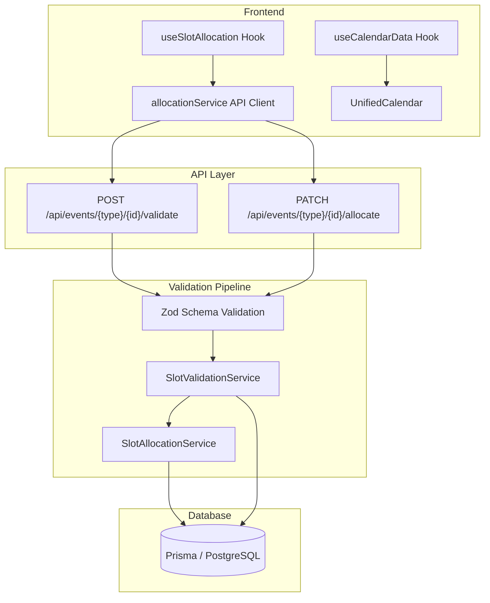

# Booking System

The booking system handles slot allocation and validation for all four event types: consultations, subscriptions, webinars, and classes. It supports three allocation modes (auto, manual, requested) with a three-layer validation pipeline.

## Core Concepts

- **30-minute atomic slots** -- all scheduling is built on 30-min intervals (48 per day)
- **4 event types** -- consultation (one-time, 1:1), subscription (recurring, 1:1), webinar (one-time, 1:many), class (recurring, 1:many)
- **3 allocation modes** -- auto (system finds slots), manual (user selects), requested (consultee pre-selects, consultant approves)
- **3 validation layers** -- Zod schemas (input format) -> SlotValidationService (business rules) -> Prisma (DB constraints)
- **Sunday-to-Saturday weeks** -- `SlotCalculationService.countWeeks()` is the single source of truth
- **`isTentative` flag** -- marks slots pending payment or reschedule; cleaned up after 30 min
- **`dayOfWeekForStartsAt` enum** -- source of truth for weekly availability day-of-week (not `getUTCDay()`)

## Source Code Map

### Backend Services (`utils/slotAllocation/`)

| File | Purpose |
|------|---------|
| `SlotCalculationService.ts` | Pure math: countWeeks, calculateRequiredSlots, getSlotsPerCall, groupSlotsByDay/Week, progress |
| `SlotValidationService.ts` | Unified validation: future check, conflict detection, schedule matching, event-specific rules |
| `SlotAllocationService.ts` | Allocation engine: auto/manual/requested modes, rescheduling, appointment creation |
| `types.ts` | Shared types: EventType, AllocationMode, AllocationRequest, ValidationResult, etc. |

### Zod Schemas (`schemas/slotAllocation/`)

| File | Purpose |
|------|---------|
| `validationSchemas.ts` | allocationRequestSchema, validationRequestSchema, eventIdSchema, formatZodError helper |

### Frontend Hooks (`app/dashboard/consultant/[consultantId]/(features)/shared/hooks/`)

| File | Purpose |
|------|---------|
| `useSlotAllocation.ts` | Central hook: toggleSlot, event-specific blocking, auto-expansion, weekly distribution |
| `useCalendarData.ts` | Calendar data sync: server-calculated bookingStatus, getSlotStatusForInterval |
| `useSubscriptionValidation.ts` | Subscription-specific frontend validation |

### Frontend Utilities (`app/dashboard/consultant/[consultantId]/(features)/shared/utils/`)

| File | Purpose |
|------|---------|
| `allocationService.ts` | API client wrapper for all allocation/validation endpoints |
| `allocationAlgorithms.ts` | Preference-based auto allocation with time/day scoring |
| `calendarUtils.ts` | Calendar display: mapWeeklySlots, mapCustomSlots, getConsultantAvailabilityForDay |

### API Routes (`app/api/events/`)

| Pattern | Method | Purpose |
|---------|--------|---------|
| `/api/events/consultations/{id}/allocate` | PATCH | Allocate consultation slots |
| `/api/events/consultations/{id}/validate` | POST | Validate consultation slots |
| `/api/events/subscriptions/{id}/allocate` | PATCH | Allocate subscription slots |
| `/api/events/subscriptions/{id}/validate` | POST | Validate subscription slots |
| `/api/events/webinars/{id}/allocate` | PATCH | Allocate webinar slots |
| `/api/events/webinars/{id}/validate` | POST | Validate webinar slots |
| `/api/events/classes/{id}/allocate` | PATCH | Allocate class slots |
| `/api/events/classes/{id}/validate` | POST | Validate class slots |

## Quick Navigation

| I want to... | Go to |
|--------------|-------|
| Understand the system architecture | [01-architecture.md](./01-architecture.md) |
| Learn event type rules and validation | [02-event-types-and-validation.md](./02-event-types-and-validation.md) |
| Understand slot math and calculations | [03-slot-math-and-calculations.md](./03-slot-math-and-calculations.md) |
| Look up API endpoints | [04-api-reference.md](./04-api-reference.md) |
| Debug an error or see recent fixes | [05-troubleshooting-and-changelog.md](./05-troubleshooting-and-changelog.md) |
| Understand the payment system | [../payments/architecture.md](../payments/architecture.md) |
| Check the database schema | [../../prisma/schema.prisma](../../prisma/schema.prisma) |
