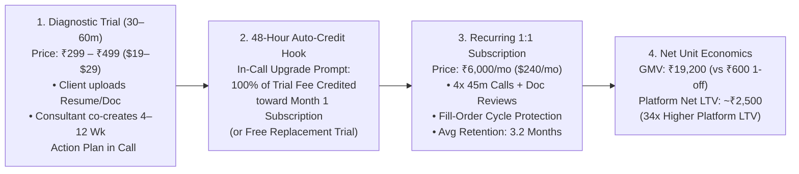

# 01 — Business Model Canvas & Unit Economics (`Familiarise by Practitionist`)

> **Version:** 1.0 (October 2026)
> **Parent Legal Entity:** **Practitionist (OPC) Private Limited** (`CIN: U62012HR2026OPC146217`)
> **Core Positioning:** The High-LTV Synchronous Expert Consulting, Retainer & Live Session Platform — Unifying 1:1 Consultations, Diagnostic Trials, Multi-Month Consultation Subscriptions, Live Webinars, and Live Group Classes with Stream.io HD Video, Collaborative Document Review, and a 2-Axis (`SPONSOR × HOST`) Enterprise Engine.

---

## 1. The 9-Block Business Model Canvas (At-a-Glance)

| **Key Partners** | **Key Activities** | **Value Propositions** | **Customer Relationships** | **Customer Segments** |
| :--- | :--- | :--- | :--- | :--- |
| • **Verified Domain Experts** (Tech, Business, Finance/CA, Legal, Career, Design, Marketing, Startups, Languages) • **Host Consulting Agencies & Coaching Academies** (`canHost=true`) • **Corporate L&D & University Sponsors** (`canSponsor=true`) • **Sister Platform:** **Elluminar by Practitionist** (Courses, Sandboxes & Rubric Projects) • **Infra Partners:** Stream.io (Video/Chat), Razorpay, Cashfree, Tazapay/Xflow, Supabase, Upstash, Novu, Resend | • **Operating the 3-Layer Zero-Collision Scheduling & Slot Allocation Engine** • **Converting Trials $\to$ Subscriptions & Webinars $\to$ Live Classes** • **Running the 26-Invariant Double-Entry Financial & Tax Spine** (GST, Sec 194-O TDS, MSME 43B(h)) • **Delivering High-Reliability Stream.io WebRTC + Document Review Sessions** | • **For Consultees / Clients:** Instant or request-based access to verified experts with **Trial-to-Subscription escrow protection**, side-by-side live document review, session recordings, AI action items, and 1-click corporate L&D GST invoices. • **For Consultants:** **0% platform fee on own-link clients** (`OWN_LINK`); automated timezone/slot allocation; high-LTV recurring retainers & group classes; zero WhatsApp spam. • **For B2B Sponsors:** Metered 1:1 coaching & seminar seats (`WALLET`, `LICENSE`, Net-60 `INVOICE` + PO 3-way match). • **For Host Agencies:** Turnkey multi-expert rate-cards & automated split payouts. | • **Diagnostic Trial $\to$ 48h Fee Credit into Monthly Subscription** • **Fill-Order Cycle Tranches & 48h First-Allocation SLA** • **Class Series Protection & Pro-Rata Make-Up/Exit Guarantee** • **Persistent `(Consultee, Consultant)` Workspace** (Docs, Recordings, Chat, Action Items)  --- **Channels** • **Consultant Direct Links** (`0%` take-rate magnet to win Topmate/Calendly experts) • **Live Webinars & Recording Replay Marketplace** (`/explore/recordings`) • **Native Flutter Mobile App** (`familiarise_mobile` on iOS/Android) • **B2B Enterprise Direct & Cross-Sell from Elluminar** | **1. B2C & Prosumer Clients (`ConsulteeProfile`):** • Professionals seeking career, architecture, startup, tax/CA, legal, or design advisory • Corporate employees using annual L&D stipends  **2. Expert Supply (`ConsultantProfile` & `HOST` Orgs):** • Independent senior practitioners & coaches • Boutique consulting firms & coaching academies  **3. Institutional Buyers (`SPONSOR` & `HYBRID` Orgs):** • Corporate HR / Engineering / Leadership teams • Universities (`HYBRID` sponsor + faculty host) |
| **Cost Structure** | | | **Revenue Streams** | |
| • **Expert & Host Org Payouts:** 80–100% of pre-GST GMV (`0%` take on `OWN_LINK`; `80%` on marketplace; `90%` combined to Host Org + Expert) • **Stream.io WebRTC & Chat Usage:** Capped via 480p 1:1 cap, elastic duration envelopes, 14-day `STREAM_S3` auto-transfer to Supabase/R2, and `+7d` chat freeze • **Payment Gateway Fees:** ~2% Razorpay INR (passed or absorbed per rail) • **Cloud & Mobile Infra:** Netlify, Railway (Dart Frog), Supabase Pro, Upstash Redis, Novu, Sentry | | | **1. B2C Marketplace Take-Rate (`10%–20%`):** • `20%` (`2000 bps`) on Marketplace-discovered 1:1 Consultations, Webinars, Classes & Recording Replays • Sliding Loyalty Take-Rate (`20% → 15% → 10%`) on multi-month `SubscriptionPlan` renewals **2. B2B Enterprise & Host Agency Take-Rate (`10%`):** • `10%` Platform / `10%` Host Org / `80%` Expert on `RateCard` engagements • Enterprise `LICENSED_SEAT`, `CREDIT_POOL`, and `WALLET` contracts + `overageSurchargeBps` **3. Recording Replay Marketplace (`/explore/recordings`)** | |

---

## 2. The Four Core Service Modalities & How They Fit Together

Familiarise models four synchronous/advisory service primitives in `prisma/schema.prisma`, intentionally excluding asynchronous LMS bloat (no quizzes, no graded homework assignments, no coding sandboxes—which live in sister platform **Elluminar**):

| Modality | Prisma Model | Target Use Case | Pricing & Scheduling Mechanics | Built-In Buyer & Expert Protections |
| :--- | :--- | :--- | :--- | :--- |
| **1. 1:1 Consultation** | `ConsultationPlan` $\to$ `Consultation` | Tactical 1-off expert session (architecture review, tax/legal consult, mock interview, resume/deck review). | `0.5h–4h` duration. Supports `INSTANT` slot booking (`useRequestedSlots`) or `REQUEST` mode (`24h` payment link after consultant approves). | `24h` earnings hold window; `AppointmentDocument` versioned file review (`PENDING -> IN_REVIEW -> APPROVED`); `SessionOutcome` attendance verification. |
| **2. 1:1 Diagnostic Trial** | `SubscriptionPlan` (`trialEnabled`) $\to$ `Trial` | Low-friction 30-min or 60-min introductory chemistry & goal-setting session before a multi-month retainer. | Free (`₹0`) or Paid (`₹199–₹999`). Strict partial unique index `idx_trials_one_active_per_pair` (max 1 trial per pair). | Auto-refunded if unanswered after `48h`; DMs blocked during trial to prevent off-platform leakage; **100% of Trial Fee credited** when upgrading to parent `SubscriptionPlan` within 48h. |
| **3. 1:1 Consultation Subscription** | `SubscriptionPlan` $\to$ `Subscription` | Ongoing multi-month 1:1 mentorship, executive coaching, or fractional advisory retainer (`1–6 months`, `1–4 sessions/week`). | Upfront payment (or B2B credit/seat deduction). Unlocks in **Fill-Order Monthly Cycles** (`computeSubscriptionEntitlement`: Cycle $k+1$ unlocks after Cycle $k$ is scheduled). | **48h First-Allocation SLA** (100% auto-refund if consultant fails to allocate Cycle 1 within 48h); opt-in renewal continuity (`renewedFromSubscriptionId`); `168h` (7-day) earnings hold. |
| **4. Live Webinars & Live Group Classes** | `WebinarPlan` $\to$ `Webinar` `ClassPlan` $\to$ `Class` | • **Webinar:** 1-session broadcast seminar/AMA (up to 1,000 seats). • **Class:** Multi-session live group coaching or tutoring batch (`M` occurrences). | Shared `Appointment` with $N$ `AppointmentParticipant`s. `ClassPlan` supports **Pro-Rata Late Join** (`lateJoinUntilSession: 1..3`) and **Multi-Creator `Collaborator` Splits** (`revenueShareBps`). | **Class Series Protection:** Host has 14 days to schedule a `makeUpSession` for any `VOIDED`/`HOST_ABSENT` session before automatic 1-session pro-rata refund; $\ge 3$ or $\ge 25\%$ missed sessions unlock a **100% Class Exit Right**. |

---

## 3. Unit Economics of Familiarise's Two High-LTV Growth Loops

### Loop A: Why `Diagnostic Trial` $\to$ `Monthly Subscription` Beats Topmate by 30x
Pure 1:1 call platforms (Topmate, Clarity.fm) average **1.2 bookings per client** (`~₹600` total GMV, `~₹72` platform LTV) because 80% of repeat relationships move to WhatsApp + personal UPI after Call #1. Familiarise solves this via the **Preply / Preplaced Retainer Loop**:

| Metric | Pure 1:1 Call Tool (Topmate) | Familiarise `Trial → Subscription` (India INR) | Familiarise `Trial → Subscription` (Global Diaspora) |
| :--- | :--- | :--- | :--- |
| **Entry Session Price** | `₹500` (30m one-off) | **`₹299 – ₹499`** (30m Diagnostic Trial) | **`$19 – $29`** (30m Diagnostic Trial) |
| **Trial $\to$ Subscription Conversion** | `< 5%` (leaks to WhatsApp/UPI) | **`25% – 35%`** (48h Trial Credit + Escrow + Doc Workspace) | **`28% – 40%`** (1-Click Employer L&D Invoice + Workspace) |
| **Monthly Subscription Price** | N/A | **`₹6,000 / month`** | **`$240 / month`** |
| **Average Retained Duration** | `1.2 calls` total | **`3.2 months`** (`12.8 sessions`) | **`3.8 months`** (`15.2 sessions`) |
| **Cumulative GMV per Converted Client** | `₹600` | **`₹19,200` (`32x` higher GMV)** | **`$912` (`30x` higher GMV)** |
| **Platform Net Take (`20% → 15% → 10%`)** | `₹72` | **`~₹2,500` (`34x` higher LTV)** | **`~$118` (`34x` higher LTV)** |

---

### Loop B: The `Live Webinar` $\to$ `Multi-Session Live Class & 1:1 Trial` Funnel
To help experts break through the 1:1 calendar ceiling (max 25 hours/week), Familiarise pairs **1,000-seat Stream.io Webinars** with **in-call upsells into Live Classes and 1:1 Trials**:

1. **Top-of-Funnel Event:** Consultant hosts a **45-min Live Webinar** (`₹0` or `₹99` commitment ticket) using Familiarise's backstage moderation and live seat-urgency counters (`200 registered → 90 live attendees`).
2. **In-Call Conversion Bridge:** During the final 10 minutes of the webinar, an interactive card inside `/meetings/[id]` offers attendees a **24-hour early-bird credit** toward the expert's **4-Week Live Class (`₹7,999`)** or a **1:1 Diagnostic Trial (`₹299`)**.
3. **Cohort + Retainer Yield:** Converting just **6% of live attendees to the Live Class** (`5.4 seats = ₹43,195`) and **10% to 1:1 Trials $\to$ 3 Subscriptions** (`₹57,600`) yields **`> ₹1,00,000` GMV (`₹12,000–₹15,000` net platform fee) from a single 45-minute webinar**.

---

## 4. Dual Take-Rate, Referral V2 & B2B Enterprise Revenue Model

### 4.1 B2C & Creator Referral V2 Take-Rate Matrix (`lib/referrals/`)
Implemented in `familiarise_web` (`PR #1990`) to eliminate creator onboarding friction while maximizing marketplace margin:

| Acquisition Source | Platform Fee (`platformBps`) | Consultant Share (`consultantBps`) | Strategic Rationale |
| :--- | :--- | :--- | :--- |
| **Consultant's Own Referral Link (`OWN_LINK` / `ExpertCustomerRelationship`)** | **`0%`** (`0 bps`) *(Only ~2% PG fee)* | **`100%`** (`10000 bps`) | Undercuts Topmate's 10% direct-link fee to zero, giving marquee consultants a no-brainer reason to move their bio link to `familiarisenow.com`. |
| **Familiarise Marketplace Discovery (Session / Month 1)** | **`20%`** (`2000 bps`) | **`80%`** (`8000 bps`) | Monetizes demand generated by Familiarise's `/explore/experts`, `/explore/programs`, SEO, and Webinar discovery network. |
| **Marketplace Subscription Renewal Loyalty Tiers (Horizon 2)** | **Months 2–3: `15%`** **Month 4+: `10%`** | **Months 2–3: `85%`** **Month 4+: `90%`** | Rewards consultants for retaining subscription clients on-platform rather than risking their verified rank and escrow protection for a 10% delta. |
| **Recording Replay Marketplace (`/explore/recordings`)** | **`20%`** (`2000 bps`) | **`80%`** (`8000 bps`) | Turns past live Webinars and Classes into high-margin passive replay revenue (`RecordingPurchase`). |

### 4.2 Two-Axis B2B Enterprise Revenue (`SPONSOR × HOST` in `lib/enterprise/`)
1. **Sponsor Organizations (`canSponsor=true` — Corporate L&D & Universities):**
   - Fund employee/student access to 1:1 Consultations, Subscriptions, Webinars, and Classes across **4 Commercial Rails**:
     - `WALLET`: Prepaid rupee deposit with low-balance alerts.
     - `LICENSE`: Per-seat (`LICENSED_SEAT`) or rupee-budget (`CREDIT_POOL`) program contracts.
     - `INVOICE`: Postpaid Net-60 corporate billing with **3-Way `PurchaseOrder` Match**, monthly accrual roll-up invoices (`OrganizationInvoice`), and automated dunning.
     - `PERSONAL`: Employee card payment with 1-click GST Tax Invoice & `/reimbursements` corporate expense export.
2. **Host Organizations (`canHost=true` — Consulting Agencies & Academies):**
   - Aggregate multiple `EXPERT` members under a single agency umbrella with customizable **3-Way `RateCard` Splits** (default **`10% Platform / 10% Host Org / 80% Expert`**, or **`10% Platform / 90% Host Org`** when `payoutRecipient = ORGANIZATION` for salaried faculty), settled via batch `OrganizationPayout`s with Section 194-O TDS and two-person approval rules.
