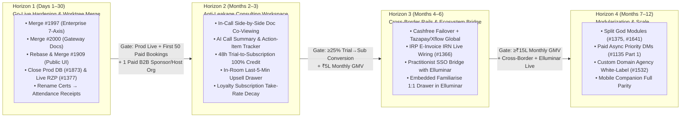

# 03 — Product Vision, 4-Horizon Roadmap & Issue/Worktree Triage (`Familiarise`)

> **Version:** 1.0 (October 2026)
> **Scope:** 4-Horizon Milestone-Gated Roadmap, Consolidation Plan for Active Git Worktrees (`familiarise_web_enterprise`, `familiarise_web_razorpay_audit`, `familiarise_web_public_ui`, `familiarise_web_landing`), and Triage of Open GitHub Issues (`#1124`–`#2000`).

---

## 1. Product Vision: The Operating System for Synchronous Human Expertise

Familiarise's vision is to become the **default global infrastructure for live professional advisory, recurring 1:1 mentorship retainers, and interactive group sessions**—where experts keep **100% (`0%` platform fee) on their own audience links**, convert **25%–35% of diagnostic trials into multi-month subscriptions**, scale 1-to-many via **Live Webinars & Group Classes**, and effortlessly serve **B2B Corporate L&D and Host Agencies** without ever worrying about timezone collisions, GST/TDS compliance, or WhatsApp disintermediation.

---

## 2. Consolidation Plan for Active Sibling Worktrees & Open PRs

Before starting new feature development, the four active sibling worktrees in `~/github/familiarise_web_*` must be cleanly merged or retired so `dev` is the single canonical trunk:

| Worktree / Branch | Open PR | Delta vs. `origin/dev` | Action Plan |
| :--- | :--- | :--- | :--- |
| **`familiarise_web_enterprise`** `feat/enterprise-productionization` | **PR `#1997`** | `+6,750 / -1,669` LOC across 97 files (+15 uncommitted review fixes) | **MERGE IN HORIZON 1 (Week 1):** Commit the 15 local CodeRabbit/SonarQube cleanups, rebase onto `origin/dev` (`+1` commit), verify Jest suite, merge PR `#1997`, and remove worktree (`git worktree remove`). Unlocks the complete 7-axis `(FundingSource × ProgramType × OverageBehavior)` enterprise engine. |
| **`familiarise_web_razorpay_audit`** `docs/payment-gateways-cashfree-tazapay-xflow-mor` | **PR `#2000`** | `+1` commit ahead of `origin/dev` (`056693e97`) | **MERGE IMMEDIATELY:** Clean docs-only PR adding the 2026 Cashfree/Tazapay/Xflow/MoR evaluation and FEMA guardrails. Merge PR `#2000` and remove worktree. |
| **`familiarise_web_public_ui`** `fix/public-pages-modern-ui` | **PR `#1909`** | `+6` ahead / `-38` behind `origin/dev` (`128 files`) | **REBASE & MERGE IN HORIZON 1 (Week 1–2):** Rebase onto `origin/dev`, resolve any conflicts with recent booking/payment PRs (`#1981`–`#1992`), merge PR `#1909` (ships modernized `/explore`, `/checkout`, PDF plan brochures, and guided booking steps), and remove worktree. |
| **`familiarise_web_landing`** `feat/landing-redesign` | **PR `#1903`** | `+1` ahead / `-170` behind `origin/dev` (`28 files`) | **CHERRY-PICK OR CLOSE (Superseded by `#1909`):** Stale by 170 commits and deletes `EnterpriseSection` / `BecomeExpertSection`. Extract any desired motion/visual tokens into `#1909`, close PR `#1903`, and remove worktree. |
| **`origin/feature/csmo-sales-marketing-strategy`** | Remote branch | 9 markdown files (`2,182 lines`) in `docs/sales-marketing/csmo-2026-launch/` | **CHERRY-PICK DOCS INTO `dev`:** Preserves the CSMO channel playbooks and outbound templates alongside `docs/business/`. |

---

## 3. Triage Matrix of Key Open GitHub Issues (`familiarise_web`)

Out of the **142 open issues** in `familiarise_web`, here is the prioritized engineering & business triage across **5 execution buckets**:

### Bucket 1: Horizon 1 Go-Live, Tax & Database Safety Blockers (Execute in Days 1–30)
| Issue | Title & Scope | Horizon 1 Action |
| :--- | :--- | :--- |
| **`#1906`** | `prisma db push` drops BetterAuth columns if run blind — schema-drift alignment needed | **CRITICAL P0:** Reconcile `prisma/schema.prisma` with live BetterAuth columns and `prisma/sql/known-drift.json` so production DDL deployments never drop auth columns. |
| **`#1873`** | Separate production Supabase database from `dev`/preview branches | **CRITICAL P0:** Provision dedicated production Supabase project with PITR backups, apply `prisma/sql/*.sql` triggers/constraints, and isolate env credentials. |
| **`#1377`** | Razorpay LIVE keys, webhooks, Route/RazorpayX payout enablement | **CRITICAL P0:** Switch production environment to live Razorpay PG & RazorpayX keys under **Practitionist (OPC) Pvt. Ltd.** and verify live webhook signatures. |
| **`#1859`** | Money audit failure modes across checkout, webhooks, refunds, disputes, payouts, and ledger | **HIGH P0:** Most seams were closed in PRs `#1983`, `#1984`, `#1988`, `#1989`, and `#1992`; verify remaining checklist items and close. |
| **`#1681` / `#1877`** | Enterprise productionization — close remaining runtime gaps on the `Organization` spine | **HIGH P0:** Resolved by merging **PR `#1997`** (`familiarise_web_enterprise`) and **PR `#1995`** (org-invoice GST & overage). |
| **`#1901` & `#1369`** | Sec 194-O TDS gross base & ₹5L threshold (`#1901`) + SAC code classification (`9983` vs `999293`/`999294`, `#1369`) | **HIGH P1:** Finalize CA sign-off on SAC `9983` (Consulting) vs `999293` (Commercial Coaching/Training) per plan type and verify Sec 194-O threshold flag in `lib/payments/payouts/`. |
| **`#1388`** | Referral credit GST treatment (post-tax tender vs pre-tax discount) | **HIGH P1:** Confirm current post-tax `REFERRAL_CREDIT` leg behavior in `deriveCheckoutAmount` matches GST invoice reporting and close. |

---

### Bucket 2: Horizon 2 Anti-Leakage Consulting Workspace & Conversion Engine (Months 2–3)
| Initiative / Issue | Scope & Deliverables | Business Impact |
| :--- | :--- | :--- |
| **In-Call Side-by-Side Document Co-Viewing** | Render `AppointmentDocument` PDFs/files directly inside `/meetings/[id]` alongside the Stream.io video call with live page-pin notes and status toggles (`IN_REVIEW -> APPROVED / NEEDS_REVISION`). | Eliminates screen-share squinting and makes Familiarise's live call room 10x better than plain Google Meet. |
| **AI Call Summary + Client Action-Item Tracker** | Post-call summary + checkable **Client Action Items** stored in relationship/document metadata (`#705`-safe JSONB) visible in `/dashboard/consultee` and `/dashboard/consultant`. | Anchors the client-consultant relationship on-platform between subscription calls without adding LMS homework bloat. |
| **48h Trial-to-Subscription 100% Fee Credit + In-Room Upsell Drawer** | Auto-apply 100% credit of a completed paid `Trial` when upgrading to its parent `SubscriptionPlan` within 48h, triggered via an in-room overlay during the last 5 minutes of the call. | Lifts `Trial → Subscription` conversion to 25%–35% and increases client LTV by 30x+. |
| **Attendance Receipts (Replacing `certificateProvided`)** | Replace "Certificate" wording on `WebinarPlan` and `ClassPlan` with printable **Session Attendance Receipts** linked to `MeetingAttendance` and `ConsumerInvoice`, reserving Skill Certificates for **Elluminar**. | Enforces the `Practitionist` ecosystem boundary and supports corporate L&D expense claims. |

---

### Bucket 3: Horizon 3 Cross-Border Payments, E-Invoicing & `Practitionist` Ecosystem Bridge (Months 4–6)
| Issue | Title & Scope | Horizon 3 Action |
| :--- | :--- | :--- |
| **`#2000` (Follow-Up)** | Multi-Gateway Failover (`Cashfree`) & Cross-Border Collection/Payouts (`Tazapay` / `Xflow`) | Implement `PaymentGateway.CASHFREE` as automated INR failover and `TAZAPAY` / `XFLOW` for international USD/EUR/GBP buyers and non-resident experts. |
| **`#1366`** | IRP E-Invoice generation (`irn`, `ackNo`, `signedQrCode`) in `lib/invoices/invoice-service.ts` | Wire live NIC/GSP IRP API integration for B2B `OrganizationInvoice`s once turnover approaches statutory e-invoicing thresholds (or when required by large enterprise AP departments). |
| **`#1363`** | Non-resident consultants hard-blocked pending Sec 195 / DTAA / Form 15CA-15CB workflow | Enable non-resident expert onboarding via Tazapay cross-border settlement rails after domestic INR volume stabilizes. |
| **Elluminar Cross-Product Bridge** | Shared `Practitionist SSO` + Embedded Familiarise 1:1 Booking Drawer inside `elluminar_web` | Allows Elluminar learners to book 1:1 Mock Interviews, Resume Reviews, and Career Retainers directly on Familiarise (replacing `elluminar_web` Issue `#19`). |

---

### Bucket 4: Horizon 4 Architecture Modularization & Selective Expansion (Months 7–12)
| Issue | Title & Scope | Horizon 4 Action |
| :--- | :--- | :--- |
| **`#1375` & `#1641`** | Split god modules (`allocationService.ts` [4,357 LOC], `checkout.ts` [3,808 LOC]) & modularize `/api/v1` | Refactor into cohesive sub-modules *after* Horizon 1–2 revenue gates are met (never refactor working money/scheduling code right before launch). |
| **`#1135` (Part 1 Only)** | Paid Async Priority DMs (Text/Voice-Note Q&A with 24h SLA auto-refund) | **KEEP Part 1 (Priority DMs)** for Horizon 4 as a lightweight Topmate-killer add-on; **DROP Part 2 (Digital Products/E-books)** to avoid Gumroad bloat. |
| **`#1532` (Selected)** | Custom Domain White-Labeling for `HOST` Agencies | Enable custom domain routing for high-volume `HOST` consulting agencies/academies. **(Drop SCORM/LTI from `#1532`—SCORM belongs strictly to `Elluminar` `#23`!)** |
| **`#1124`, `#1529`, `#1530`** | Netlify cold-start optimization, BetterAuth session hardening, and cybersecurity program | Ongoing operational hardening across Horizons 2–4. |
