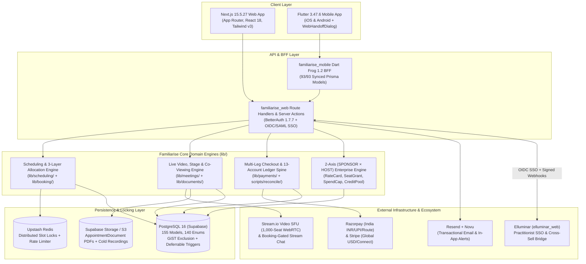
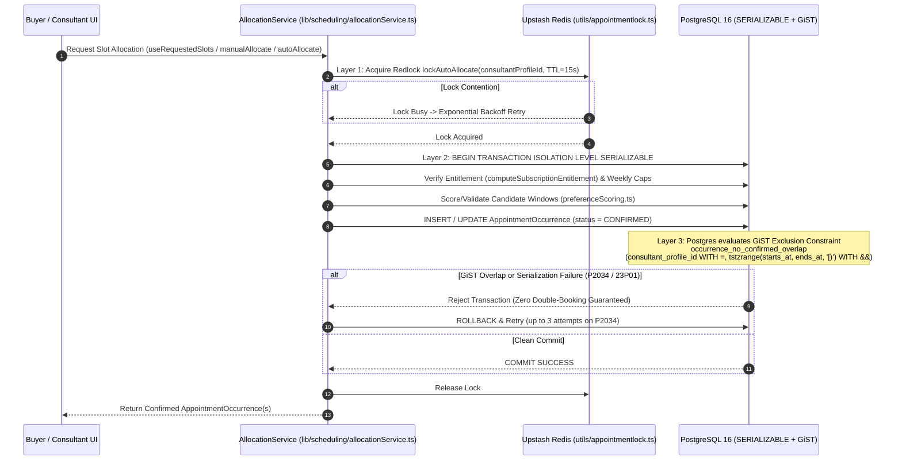
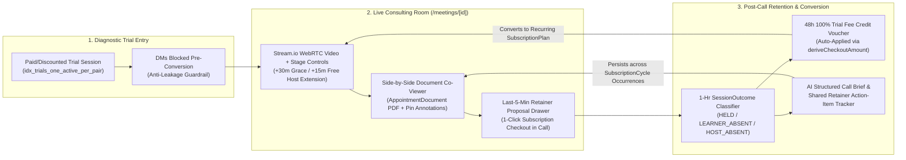
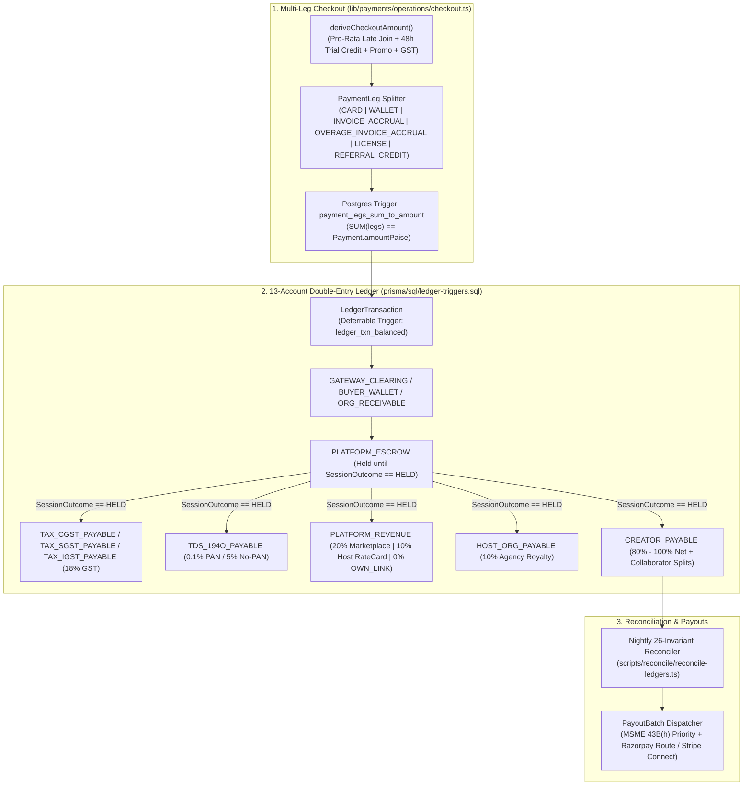

# 05 — High-Level Design (HLD)

> **Parent Legal Entity:** Practitionist (OPC) Private Limited (`CIN: U62012HR2026OPC146217`)  
> **Product:** Familiarise (`familiarise_web` + `familiarise_mobile`)  
> **Architecture Style:** Modular Monolith (Next.js 15 App Router + Mobile Dart Frog BFF) backed by PostgreSQL 16 (GiST + Deferrable Double-Entry Triggers), Upstash Redis (Distributed Locks & Rate Limiting), and Stream.io (WebRTC SFU + Chat)

---

## 1. System Context & C4 Container Architecture

Familiarise is architected as a **high-integrity transactional scheduling, live video collaboration, and double-entry financial platform** serving both B2C individual clients/consultants and B2B `SPONSOR × HOST` enterprise organizations.

---

## 2. Core Subsystem 1: 3-Layer Zero-Collision Slot Allocation Topology

Scheduling live human experts across timezones, recurring weekly subscriptions (`SubscriptionCycle`), and multi-session cohorts (`Class`) without double-booking is one of the hardest concurrency problems in marketplace engineering. Familiarise enforces a **3-Layer Defense-in-Depth Architecture**:

### Key Architectural Properties:
1. **Layer 1 — Application Distributed Mutex (`utils/appointmentlock.ts`):** Serializes concurrent allocation requests per `consultantProfileId` at the edge using Upstash Redis before hitting PostgreSQL.
2. **Layer 2 — `SERIALIZABLE` Isolation with `P2034` Retry (`lib/scheduling/allocationService.ts`):** Prevents phantom reads when verifying `SubscriptionCycle` weekly call caps (`callsPerWeek`) and consultant availability windows.
3. **Layer 3 — Database Kernel GiST Exclusion Constraint (`prisma/sql/check-constraints.sql`):** Even if a bug or direct SQL script bypasses application code, PostgreSQL physically blocks any two `CONFIRMED` or `PAYMENT_IN_PROGRESS` `AppointmentOccurrence` rows for the same `consultant_profile_id` whose `[starts_at, ends_at)` `tstzrange` intervals overlap.

---

## 3. Core Subsystem 2: Anti-Leakage Consulting Workspace & Trial-to-Retainer Loop

To defeat the #1 failure mode of 1:1 consulting marketplaces (**1-Call Off-Platform Leakage to WhatsApp + Google Meet + UPI**), Familiarise embeds the entire consulting workflow inside a persistent, stateful workspace (`/meetings/[id]` + `/dashboard/consultee/`):

---

## 4. Core Subsystem 3: Multi-Leg Checkout & 13-Account Double-Entry Financial Spine

Familiarise never mutates balances via ad-hoc `UPDATE wallet SET balance = balance - X` queries. Every financial event flows through an immutable, trigger-verified **Double-Entry General Ledger**:

### Commission & Split Routing Matrix (`lib/payments/core/splits.ts`)
| Booking Quadrant / Attribution | Platform Take Rate (`PLATFORM_REVENUE`) | Host Agency Royalty (`HOST_ORG_PAYABLE`) | Creator / Collaborator Pool (`CREATOR_PAYABLE`) |
|---|---|---|---|
| **Marketplace Discovery (`PLATFORM_DISCOVERY`)** | `20.0%` (`2000 bps`) | `0.0%` | `80.0%` (`8000 bps`, split across `Collaborator`s if applicable) |
| **Creator Direct Link (`OWN_LINK` / `ConsultantFeeWaiver`)** | `0.0%` (`0 bps`) | `0.0%` | `100.0%` (`10000 bps` minus gateway processing fee) |
| **Enterprise `SPONSOR × HOST` Agency (`RateCard`)** | `10.0%` (`1000 bps`) | `10.0%` (`1000 bps`) | `80.0%` (`8000 bps`) |

---

## 5. Core Subsystem 4: 2-Axis (`SPONSOR × HOST`) Enterprise Topology

Unlike single-sided B2B LMS portals, Familiarise models corporate organizations along **two orthogonal axes** (`familiarise_web_enterprise` PR `#1997`):
1. **Buyer Axis (`Organization` as `SPONSOR`):** Corporate HR/L&D teams or engineering leaders who fund employee coaching (`SeatGrant`), set departmental `SponsorSpendCap`s, manage `CreditPool`s, or sponsor `ProgramCohort` group classes via net-30 `INVOICE_ACCRUAL` billing.
2. **Supply Axis (`Organization` as `HOST`):** Boutique consulting firms, law/tax practices, or architecture advisories that roster multiple `ConsultantProfile`s (`HostMember`), negotiate custom `RateCard`s with `SPONSOR` organizations, and receive consolidated agency payouts (`HOST_ORG_PAYABLE`).

### 7-Axis Enterprise Checkout Resolution
When an enterprise employee books a session, the checkout engine resolves:
1. **Identity & SSO (`SsoConnection`)** -> 2. **Vendor Approval (`VendorApproval`)** -> 3. **Negotiated Rate Card (`RateCard`)** -> 4. **Seat/Cohort Entitlement (`SeatGrant` / `ProgramCohort`)** -> 5. **Spend Cap & Credit Pool (`SponsorSpendCap` / `CreditPool`)** -> 6. **Hybrid Overage Split (`INVOICE_ACCRUAL` + personal `CARD`/`WALLET`)** -> 7. **3-Way Settlement Split (`10% Platform / 10% Host Org / 80% Consultant`)**.

---

## 6. Deployment, Observability & Cross-Product Topology

- **Primary Web Runtime:** Next.js `^15.5.27` deployed on containerized Linux / Vercel-compatible edge infrastructure with strict security headers and patched image processing (`sharp >= 0.35.5`).
- **Database & Storage:** Supabase PostgreSQL 16 with PgBouncer connection pooling for transactional queries, direct connections for migrations/triggers, and Supabase Storage / S3 with signed URLs for `AppointmentDocument`s and transferred `Recording`s.
- **Background Cron & Event Workers (`app/api/cron/`, `jobs/`):**
  - `sla-breach-check`: Every 15 minutes (48h first-allocation SLA enforcement).
  - `session-outcome-classifier`: Hourly (`HELD` / `LEARNER_ABSENT` / `HOST_ABSENT` / `CUT_SHORT` evaluation + escrow release).
  - `recording-transfer`: Daily (transfers `STREAM_S3` recordings to `PLATFORM` storage before Stream's 14-day TTL).
  - `chat-lifecycle`: Daily (`+7d` freeze and `+90d` PII purge).
  - `reconcile-ledgers`: Nightly at 02:00 IST (26-invariant financial verification).
