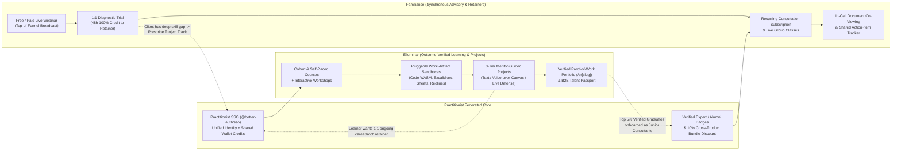

# 07 — Practitionist Ecosystem: `Familiarise` vs. `Elluminar` Portfolio Architecture & Boundary Matrix

> **Parent Legal Entity:** Practitionist (OPC) Private Limited (`CIN: U62012HR2026OPC146217`, Gurugram, Haryana, India — `https://practitionist.com`)  
> **Sibling Repositories:**  
> - **Familiarise (`familiarise_web` + `familiarise_mobile`):** Live 1:1 Expert Consulting, Diagnostic Trials, Recurring Consultation Subscriptions (Retainers), Live Webinars, and Live Group Classes.  
> - **Elluminar (`elluminar_web`):** Outcome-Verified Learning, Pluggable Work-Artifact Sandboxes/Canvases, and 3-Tier Mentor-Guided Project Execution OS.  
> **Strategic Status:** Locked Architecture Decision (October 2026)

---

## 1. Executive Decision: Why Two Products Under One Parent Company ("Federated Branded House")

Practitionist (OPC) Private Limited operates **two focused, purpose-built products** under one corporate umbrella rather than merging them into a single bloated codebase or letting them cannibalize each other:

1. **Familiarise (`familiarise.com` — *by Practitionist*):**
   - **Core Job-to-Be-Done:** *"Book an expert's live time, diagnose my specific problem in a low-risk Trial, review my documents together in real time, and retain them on a recurring Consultation Subscription or Live Class."*
   - **Mental Model:** **Synchronous Human Advisory & Retainers** (Preply + Intro.co + Luma + Maven Lightning Lessons, backed by an enterprise-grade scheduling, Stream.io WebRTC, and 26-invariant double-entry financial ledger).
   - **Domain Scope:** Horizontal high-trust advisory (Tech Architecture, Career/Executive Coaching, Legal/Tax/CA Advisory, Startup Fundraising, Design/Product Critiques, Clinical/Financial Second Opinions).

2. **Elluminar (`elluminar.com` — *by Practitionist*):**
   - **Core Job-to-Be-Done:** *"Master a skill by building real-world work artifacts inside interactive sandboxes/canvases, get rubric-scored mentor feedback across 3 tiers, and graduate with a cryptographically verified Proof-of-Work Portfolio (`/p/[slug]`)."*
   - **Mental Model:** **Asynchronous-First Outcome-Verified Execution & Pedigree** (KodeKloud + HelloInterview + Crio + Forage).
   - **Domain Scope:** Outcome-verified professional execution (Software/AI Engineering, System Design, Data/Analytics, Finance/Valuation Modeling, Product/Strategy Specs, Corporate/Legal Contract Redlining).

### Why We Rejected Full Codebase Consolidation (Merging `familiarise_web` + `elluminar_web`)
| Dimension | Why Merging into One Monolith Fails | Why Federated Two-Product Architecture Wins |
|---|---|---|
| **Schema & Engineering Velocity** | Merging `familiarise_web` (**155 Prisma models, 140 enums, 7,691 lines**, currently launch-frozen under `#705` + `familiarise_mobile` with 93 synced Dart models) with `elluminar_web` (**112 Prisma models, 13 domain schema files**) would create a **260+ model Franken-schema** and stall both launches for 4–6 months. | Each repo stays decoupled and deploys independently while sharing **Practitionist SSO (`@better-auth/sso`)** and signed cross-product webhooks. |
| **Buyer & Creator Cognitive Load** | A tax consultant, startup advisor, or executive coach wanting to sell a ₹2,500 diagnostic trial and ₹15,000/month retainer does **not** want to navigate an LMS with modules, quizzes, coding sandboxes, and rubric trees. | **Familiarise** remains a frictionless "Calendar + Live Consulting Room + Retainer" experience; **Elluminar** remains a structured "Curriculum + Interactive Sandbox + Rubric/Defense" experience. |
| **Mobile App Store Compliance** | `familiarise_mobile` is purpose-built around Apple App Store Guideline `3.1.3(b)` (1:1 live personal services) and `3.1.3(d)`/`3.1.3(a)` (`WebHandoffDialog`). Injecting self-paced recorded LMS courses into the same mobile binary triggers Apple `3.1.1` In-App Purchase (30% Apple tax) rejections. | Keeping `familiarise_mobile` strictly focused on live 1:1/group consulting preserves its clean App Store regulatory posture. |

---

## 2. The 8-Primitive Taxonomy & Hard Product Boundary Matrix

Every offering across the entire Practitionist ecosystem maps to **one of 8 canonical primitives** (4 in **Familiarise**, 4 in **Elluminar**). Overlap is strictly prohibited.

| Primitive | Owning Product | Format & Duration | Pedagogical / Interactive Mechanics | Output / Artifact Produced |
|---|---|---|---|---|
| **1. `Consultation` & `Trial`** | **Familiarise** | 1:1 Live Video (`15–60 min` single session or discounted diagnostic Trial) | Live Stream.io video + **In-Call Document Co-Viewing & Pin Annotation** (`AppointmentDocument`) + **48h 100% Trial-to-Subscription Fee Credit** | **AI Structured Call Summary** + **Shared Client Action-Item Checklist** |
| **2. `Subscription` (Retainer)** | **Familiarise** | 1:1 Recurring Live Advisory (`callsPerWeek` across `SubscriptionCycle` tranches) | Persistent Client-Consultant Retainer Workspace + rolling document versioning + async chat between scheduled calls | Ongoing advisory execution tracker & completed action-item history |
| **3. `Webinar`** | **Familiarise** | 1-to-Many Live Broadcast (`60–120 min`, up to 1,000 attendees via Stream.io SFU) | Backstage/Stage hand-raise moderation (`StageControls.tsx`), live Q&A, downloadable `PlanMaterial`, evergreen `RecordingPurchase` | **Session Attendance Receipt** (for corporate L&D reimbursement) + Funnel CTA into Subscriptions/Classes |
| **4. `Class`** | **Familiarise** | Small-Group Live Seminar Series (`2–12 sessions`, no LMS grading) | Multi-occurrence live group sessions (`lateJoinUntilSession`, 14-day host make-up window, `Collaborator` co-hosts) + live discussion & doc review | **Session Attendance Receipt** (strictly **no** quizzes, sandboxes, or verified skill certificates) |
| **5. `Workshop`** | **Elluminar** | Hands-On Execution Sprint (`2–6 hours`, live or guided) | **Mandatory Interactive Sandbox/Canvas** (Monaco/WASM, Excalidraw, Univer Sheets, or Tiptap) + automated checkpoints & mini-quizzes | **Graded Mini-Project Artifact** inside the learner's workspace |
| **6. `Course` (Cohort $\leftrightarrow$ Self-Paced)** | **Elluminar** | Multi-Module Curriculum (`Course -> Module -> Lesson`) | Video/Reading + Quizzes + Questionnaires + Assignments + Interactive Canvases + **One-Click Cohort $\to$ Self-Paced Converter** | **Course Completion + Graded Assignment Artifacts** |
| **7. `Mentor-Guided Project`** | **Elluminar** | 3-Tier Execution Track (`Sprint 1–2w`, `Capstone 4–6w`, `Flagship 8–12w`) | Milestone DAG (`ProjectSubmission`) + **AI Critic Pre-Screen** + **Tier 1 (Text Rubric) / Tier 2 (Async Voice-over-Canvas) / Tier 3 (Scheduled `DefenseSession`)** | **Verified Proof-of-Work Portfolio (`/p/[slug]`)** & **Cryptographic Credential (`/verify/[code]`)** |
| **8. `Fellowship / Role Track`** | **Elluminar** | Multi-Course + Multi-Project Career Track (`12–24 weeks`) | Bundled `Track` combining Courses + Workshops + Flagship Capstone + Final Oral Defense + B2B Talent Passport | **Employer-Verifiable Talent Passport** & GCC/Enterprise Hiring Shortlist |

---

## 3. Resolving the 4 Historical Overlap Traps (Locked Rules)

### Rule 1: Where Do 1:1 Mentorship Calls Live? (`Familiarise` vs. `Elluminar` Issue `#19`)
- **The Overlap Trap:** `elluminar_web` previously scaffolded `MentorOffering` and `MentorBooking` (`prisma/models/mentorship.prisma`, GitHub Issue `#19`) for standalone 1:1 ad-hoc calls (resume reviews, mock interviews, career Q&A). That duplicated 100% of `Familiarise`'s `ConsultationPlan` and `SubscriptionPlan` engine while lacking `Familiarise`'s 3-layer GiST slot locking, 48h SLA watchdog, and 26-invariant ledger.
- **The Locked Rule:**
  1. **Delete/Freeze standalone `MentorOffering` / `MentorBooking` (Issue `#19`) and `WEBINAR` in `elluminar_web`.**
  2. **All standalone 1:1 consultations, diagnostic trials, mock interviews, resume/architecture reviews, and recurring retainers live 100% on `Familiarise`.**
  3. **In `Elluminar`, human mentors only interact with learners inside a `Project` or `Course` context** via:
     - **Tier 1:** Asynchronous structured rubric grading (`RubricScore`) + inline artifact annotations.
     - **Tier 2:** Asynchronous 3–5 minute Loom-style **Voice-over-Canvas / Code Walkthrough** (`feedbackVideoUrl`).
     - **Tier 3:** Scheduled 15–30 minute **Milestone Checkpoint & Oral Defense (`DefenseSession`)** tied directly to a `ProjectSubmission` milestone.
  4. If an Elluminar learner wants extra 1:1 career coaching or weekly retainer calls with their mentor, clicking **"Book 1:1 Consultation / Retainer"** deep-links directly to that expert's **Familiarise profile** via Practitionist SSO.

### Rule 2: "Live Classes" (`Familiarise`) vs. "Live Cohort Courses" (`Elluminar`)
- **The Litmus Test:** *Does the program require learners to submit graded assignments, pass quizzes, or build inside an interactive sandbox/canvas to earn a verified skill credential?*
  - **NO $\rightarrow$ It is a `Class` on `Familiarise`:** Live synchronous group seminar series (e.g., *"4-Session Executive AI Strategy Seminar"*, *"Weekly GMAT Verbal Live Coaching Group"*, *"Startup Term-Sheet Negotiation Masterclass"*). Value is in the **live synchronous room, Q&A, and document review**.
  - **YES $\rightarrow$ It is a `Cohort Course` or `Workshop` on `Elluminar`:** Structured multi-module curriculum with quizzes, questionnaires, interactive sandboxes/canvases, and rubric-graded mini-projects.

### Rule 3: "Session Attendance Receipts" (`Familiarise`) vs. "Verified Skill Credentials" (`Elluminar`)
- **The Overlap Trap:** `familiarise_web` has `certificateProvided: Boolean` on `WebinarPlan` and `ClassPlan`. Issuing unverified "Skill Certificates" for passively watching a 60-minute webinar on Familiarise would destroy the employer signaling value of Elluminar's rubric-defended credentials.
- **The Locked Rule:**
  - **Familiarise** issues **Session Attendance Receipts** (confirming live attendance duration and invoice metadata so corporate employees can claim L&D reimbursement).
  - **Elluminar** holds the exclusive monopoly on **Verified Skill Credentials (`/verify/[code]`)** and **Proof-of-Work Portfolios (`/p/[slug]`)**, backed by automated sandbox checks, AI Critic logs, and human mentor rubric defenses.

### Rule 4: Complementary B2B Enterprise Positioning (`Familiarise Enterprise` vs. `Elluminar Enterprise`)
Both platforms serve B2B organizations under **Practitionist**, but solve completely distinct enterprise buyer needs:

| Dimension | **Familiarise Enterprise** (`/dashboard/organization/[orgId]`) | **Elluminar Enterprise & University** (`/org/[tenantSlug]`) |
|---|---|---|
| **Primary B2B Buyer** | VP Engineering, HR/People Ops, Executive Coaching Sponsors, Consulting Firm Partners (`SPONSOR × HOST`) | CTO / Engineering Directors, L&D Skill Transformation Leads, GCC Hiring Heads, University Deans (NEP 2020) |
| **Core B2B Product** | **Corporate 1:1 Coaching Credits (`CreditPool`), Fractional Technical/Legal/Exec Retainers (`SeatGrant`), Live Executive Seminars (`ProgramCohort`), and Multi-Consultant Agency Rosters (`HOST` Org `RateCard`s)** | **Outcome-Verified Technical/Business Upskilling Cohorts, Campus-to-Corporate (HTD) Bootcamps, Forage-Style Sponsored Capstone Simulations, and Verified Talent Passports** |
| **Billing & Financial Model** | 7-Axis Enterprise Checkout (`INVOICE_ACCRUAL` + `SponsorSpendCap` + Hybrid Overage + `10%/10%/80%` `SPONSOR × HOST` Royalty Split) | Per-Seat Cohort Licensing (`EnterpriseContract`), University Lab Site Licenses, and Sponsored Capstone Challenges |

---

## 4. The Cross-Product Flywheel & Technical Bridge Architecture

Instead of operating as isolated silos, **Familiarise** and **Elluminar** feed each other via a bi-directional acquisition and monetization flywheel:

### Concrete Cross-Product Integration Touchpoints
1. **Unified "Practitionist ID" (`@better-auth/sso`):**
   - Both `familiarise_web` (already running `better-auth` `1.7.7` with `@better-auth/sso`) and `elluminar_web` (migrating to `better-auth` per [`elluminar_web/docs/business/05-high-level-design-hld.md`](https://github.com/Practitionist/elluminar_web/pull/91)) share a common OIDC identity provider so users log in once across `familiarise.com` and `elluminar.com`.
2. **Consultant Diagnostic $\to$ Elluminar Track Prescription (`10%` Affiliate/Credit Bridge):**
   - When a consultant on **Familiarise** conducts a 1:1 Diagnostic Trial or Career Review and identifies that the client needs structured hands-on execution (e.g., *"You need to build a distributed Kafka + Redis system design capstone before interviewing at Uber"*), the consultant can attach an **Elluminar Track Prescription** inside the Familiarise Action-Item Tracker, granting the client a `10%` Practitionist Ecosystem discount and crediting the consultant with a referral bonus.
3. **Elluminar Capstone Graduate $\to$ Familiarise Retainer & Verified Consultant Supply:**
   - Every mentor on **Elluminar** automatically gets a **"Book 1:1 Retainer on Familiarise"** CTA on their profile (replacing Elluminar Issue `#19`).
   - Learners who pass a Tier-3 Flagship Oral Defense on **Elluminar** earn an **"Elluminar Verified Practitioner"** badge (`ELLUMINAR_CAPSTONE_PASSED` webhook) that displays on their **Familiarise** consultant profile when they monetize 1:1 consultations for junior peers.
