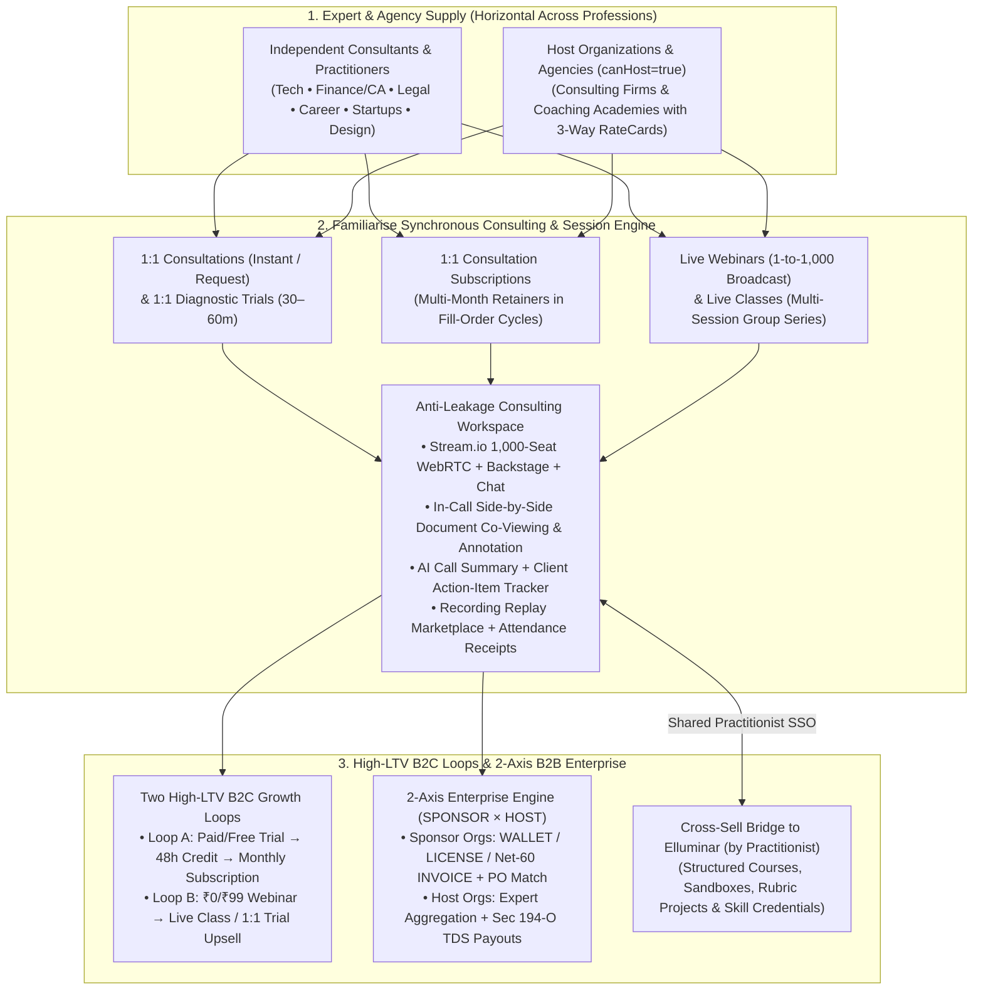

# Familiarise (`familiarise_web` + `familiarise_mobile`) — Business Strategy, Product Vision & System Architecture (`docs/business/`)

> **Document Status:** Canonical Decision of Record (October 2026)
> **Parent Legal Entity:** **Practitionist (OPC) Private Limited** (`CIN: U62012HR2026OPC146217`, `https://practitionist.com`)
> **Live Product Domain:** `https://familiarisenow.com`
> **Scope:** Complete Business Model Canvas, 2026 Consulting & Live-Session Competitive Teardown, 4-Horizon Product Vision & Issue Triage, Software Requirements Specification (SRS), High-Level Design (HLD), Low-Level Design (LLD), and the `Practitionist` Portfolio Boundary (`Familiarise` $\times$ `Elluminar`).
> **Relation to Existing Docs:** Preserves all 41 existing technical and compliance directories under `docs/` (`docs/start-here/`, `docs/prisma/`, `docs/enterprise/`, `docs/payments/`, `docs/stream/`, `docs/compliance/`, etc.) untouched.

---

## 1. Executive Thesis: What `Familiarise` Actually Is

**Familiarise is a Synchronous Expert Consulting, Retainer & Live Session Platform (B2C + B2B Enterprise)** that combines the best of **Preply / Preplaced** (*Trial $\to$ Recurring Subscription Retainers*), **Maven / Luma** (*Live Webinars $\to$ Multi-Session Group Classes*), and **Moxo / Simply.Coach** (*Persistent Client-Consultant Workspace with Joint Document Review & Stream.io HD Video*) across **all professional advisory verticals** (Technology, Business, Finance/Tax, Legal, Career Coaching, Design, Marketing, Startups, Healthcare Second Opinions, and Languages).

---

## 2. Key Strategic Decisions Locked In (`October 2026`)

| Dimension | Strategic Decision of Record | Why This Wins in the 2026 Market |
| :--- | :--- | :--- |
| **1. `Practitionist` Portfolio Identity** | **One Legal Company (`Practitionist OPC Pvt. Ltd.`), Two Focused Products:** • **`Familiarise`** = Synchronous Human Time & Advisory (*1:1 Consultations, Trials, Subscriptions, Webinars, Live Classes, Document Review*). • **`Elluminar`** = Pedagogical Mastery & Verified Execution (*Courses, Interactive Workshops, Quizzes/Assignments, Sandboxes/Canvases, Mentor-Guided Projects, Fellowships & Skill Credentials*). | Keeps Familiarise frictionless and horizontal for *all* advisory professions (lawyers, CAs, career coaches, engineers) while keeping `familiarise_web` (`155 models`, `#705` frozen) and `familiarise_mobile` (`93/93 models` synced) launch-ready without 6 months of schema-merge paralysis. |
| **2. Solving "1-Call Disintermediation"** | **Shift from One-Off Calls (Topmate Trap) to Two High-LTV Loops:** • **Loop A:** `Diagnostic Trial (30–60m)` $\to$ **100% Trial Fee Credited** if upgraded to a `SubscriptionPlan` within 48 hours. • **Loop B:** `Live Webinar` $\to$ In-room 1-click upsell into a `Live Class` or `1:1 Trial`. | Pure 1:1 call platforms suffer 80% off-platform leakage to WhatsApp/UPI after Call #1 (1.2 calls LTV). Preply/Preplaced's Trial $\to$ Subscription loop generates **30x+ higher GMV and LTV**. |
| **3. Anti-Leakage Consulting Workspace (Zero LMS Bloat)** | **Upgrade Meetings & Relationships Without Adding Quizzes/Sandboxes:** 1. **In-Call Side-by-Side Document Co-Viewing & Pin Annotation** (`AppointmentDocument`). 2. **AI Consultation Summary + Shared Client Action-Item Checklist**. 3. **In-Room Last-5-Min Next-Slot & Subscription Upgrade Prompt**. | Makes switching to "personal Google Meet + WhatsApp" a massive downgrade in organization and escrow safety, while preserving strict separation from Elluminar's LMS quizzes and coding sandboxes. |
| **4. Receipts vs. Skill Credentials** | **Familiarise Issues `Attendance Receipts`; Elluminar Issues `Verified Skill Credentials`:** Deprecate/rename `certificateProvided` on Familiarise `WebinarPlan` and `ClassPlan` to **Session Attendance Receipts** (for corporate L&D reimbursement). | Because Familiarise has no quizzes, assignments, sandboxes, or graded rubrics, reserving **Skill Certificates (`/verify/[code]`)** exclusively for **Elluminar** protects credential prestige across both brands. |
| **5. Dual Take-Rate & Referral V2 Economics** | **0% Platform Fee on Consultant-Sourced Links (`OWN_LINK` / `ConsultantFeeWaiver`)**; **20% Platform / 80% Consultant** on Marketplace Discovery (with loyalty decay to 15%/10% on multi-month subscription renewals); **10% Platform / 10% Host Org / 80% Expert** on B2B Host RateCards. | Beats Topmate's 10% direct-link fee to attract marquee experts with existing audiences while capturing 15–20% margin on marketplace-matched and enterprise-sponsored engagements. |
| **6. Multi-Gateway & MoR Compliance (`#2000`)** | **Primary INR: Razorpay + Cashfree Backup; Cross-Border: Tazapay / Xflow (No MoR for 1:1 Coaching):** Keep 1:1 live consulting off Dodo/Paddle/Polar (whose AUPs ban live human coaching). | Prevents sudden account freezes and reserve holds while enabling compliant Indian B2C/B2B GST invoicing, Sec 194-O TDS, and MSME Sec 43B(h) payout automation. |

---

## 3. Documentation Map (`docs/business/`)

| File | Document Title | Primary Contents |
| :--- | :--- | :--- |
| **[01-business-model-canvas.md](./01-business-model-canvas.md)** | **Business Model Canvas & Unit Economics** | Complete 9-Block BMC, `Trial → Subscription` and `Webinar → Class` Funnel Math, Dual Take-Rate & Host RateCard Economics, and B2B `SPONSOR × HOST` Revenue Streams. |
| **[02-competitive-teardown-and-market-wedge.md](./02-competitive-teardown-and-market-wedge.md)** | **2026 Consulting & Live-Session Competitive Teardown** | Deep teardown of Topmate, Intro.co, Clarity.fm, Stan Store, Preply ($1.2B), iTalki, Preplaced, MentorCruise, GrowthMentor, Maven, Luma, TagMango, and Moxo/Simply.Coach + **KEEP / MODIFY / ADD / DELETE** matrix. |
| **[03-product-vision-and-roadmap.md](./03-product-vision-and-roadmap.md)** | **Product Vision, 4-Horizon Roadmap & Issue/PR Triage** | 4-Horizon Execution Plan (H1 Go-Live & Enterprise Merge $\to$ H2 In-Call Doc Co-Viewing, AI Action Items & 48h Trial Credit $\to$ H3 Cross-Border Tazapay/Xflow & Mobile Parity $\to$ H4 Ecosystem Scale) + Audit of Open Issues & Active Worktrees. |
| **[04-software-requirements-specification.md](./04-software-requirements-specification.md)** | **Software Requirements Specification (SRS)** | Formal Functional (`FR-ID`, `FR-BOOK`, `FR-SCHED`, `FR-EVT`, `FR-STREAM`, `FR-DOC`, `FR-FIN`, `FR-ENT`, `FR-MOB`) and Non-Functional (`NFR-*`) requirements across all 155 Prisma models. |
| **[05-high-level-design-hld.md](./05-high-level-design-hld.md)** | **Company-Wide High-Level Design (HLD)** | System Context, C4 Container Topology (`familiarise_web` + `familiarise_mobile` Dart Frog + Stream.io + Supabase + Upstash), 3-Layer Slot Lock Architecture, 26-Invariant Ledger Spine, and 2-Axis Enterprise Topology. |
| **[06-low-level-design-lld.md](./06-low-level-design-lld.md)** | **Low-Level Design (LLD) & Subsystem Specifications** | GiST Slot Exclusion & Preference Scoring Specs, Fill-Order Subscription Cycle Math, Multi-Leg `PaymentLeg` & Trigger Specs, In-Call Doc Co-Viewing & AI Action-Item Schemas (`#705`-safe), and 48h Trial Credit Conversion Logic. |
| **[07-practitionist-ecosystem-familiarise-vs-elluminar.md](./07-practitionist-ecosystem-familiarise-vs-elluminar.md)** | **`Practitionist` Ecosystem: `Familiarise` vs. `Elluminar`** | Corporate & Product Portfolio Architecture, Side-by-Side Format Boundary Matrix, Enterprise B2B Split, and Cross-Product SSO/Upsell Flywheel. |
