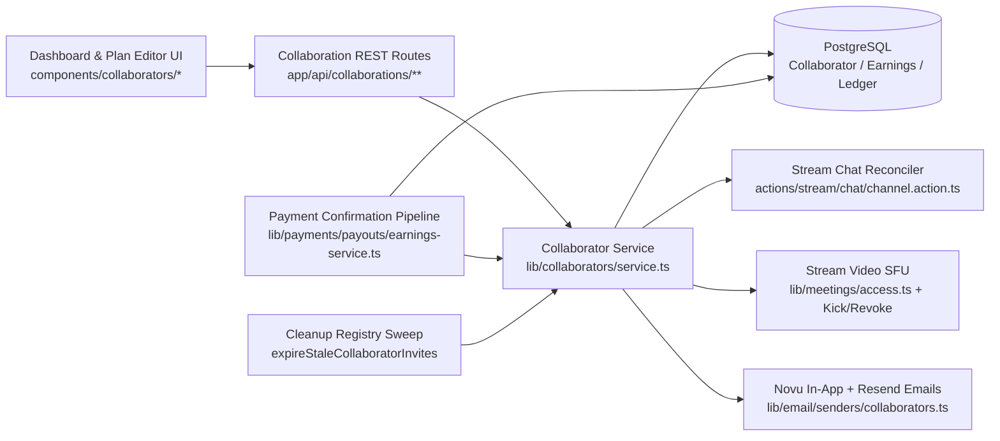

# Collaborator System — Architecture Overview

**Scope**: Group Offerings (`WebinarPlan` and `ClassPlan`) across B2C Solo Hosts, Organization-Hosted Plans, and Ownerless Organization Catalog Offerings.

## Overview

The Collaborator System enables team-taught webinars and classes with deterministic multi-party settlement, role-based real-time audio/video/chat permissions, double-booking conflict prevention, and transactional lifecycle notifications.

A primary host (consultant owner) or an authorized organization operator (`catalog.manage`) invites verified consultants to a webinar or class plan with an explicit role and gross revenue share (`1%–90%`, stored as integer basis points `100–9000`). Once accepted, collaborators receive automatic Stream Chat coordination and event channel access, Stream Video role assignments, co-host schedule overlap protection, and independent earnings settlement into their own consultant or host-organization ledger accounts.

---

## Core Architectural Invariants

| Domain                            | Invariant                                                                                                                                                                                                       | Enforcement Mechanism                                                                                |
| --------------------------------- | --------------------------------------------------------------------------------------------------------------------------------------------------------------------------------------------------------------- | ---------------------------------------------------------------------------------------------------- |
| **Offering Scope**                | Webinars and Classes only; 1:1 consultations and subscriptions are single-instructor                                                                                                                            | Schema foreign keys (`webinarPlanId`, `classPlanId`) + `collaborator_plan_xor` CHECK constraint      |
| **Single Merged Table**           | All webinar and class collaborations live in one `Collaborator` table discriminated by `collaboratorType`                                                                                                       | `Collaborator` Prisma model + `assertCollaboratorPlanXor()` + SQL CHECK constraint                   |
| **Seat & Presenter Cap**          | Maximum **3 active** (`PENDING` + `ACCEPTED`) collaborators per plan; maximum **1 active `PRESENTER`** (`CO_HOST` or `CO_INSTRUCTOR`)                                                                           | `Serializable` transaction check in `assertCollaboratorCapTx()` + partial unique SQL indexes         |
| **Minimum Host Share**            | Collaborator shares (`PENDING` + `ACCEPTED`) never exceed `9000 bps` (`90%`), guaranteeing at least `1000 bps` (`10%`) for the plan owner / host organization                                                   | `validateRevenueSharesTx()` under `Serializable` isolation + client-side `max` guard                 |
| **Immutable Accepted Terms**      | `role` and `revenueShareBps` on an `ACCEPTED` collaboration cannot be mutated in place (`409 Conflict`); host must remove and re-invite                                                                         | `CollaboratorTermsLockedError` in `updateCollaborator()`                                             |
| **Single-Fee Gross-Slice Math**   | Gross payment is divided into per-party gross slices first (`floor(gross * bps / 10000)` per collaborator, residual to `OWNER`); each slice has platform/rate-card fee applied **once**                         | `calculateRevenueSplit()` + `planEarningsForPayment()` + `createEarningsFromPayment()`               |
| **Ownerless Org Catalog Support** | Organization catalog plans with `consultantProfileId: null` settle the owner slice directly to `OrganizationEarnings` (`ORG_PAYABLE`) without requiring a host consultant row                                   | `RevenueSplit` (`consultantProfileId: string \| null`, `organizationId?: string \| null`)            |
| **Org-Blind Collaborator Splits** | Each accepted collaborator settles their gross slice through their **own** active HOST/HYBRID organization rate card (or standard B2C 20% fee if solo)                                                          | `resolveOrgSplit()` invoked per party without leaking the selling plan's org rate card               |
| **Learner Seat Exclusion**        | Accepted collaborators hold shadow `AppointmentParticipant` rows with `role: COLLABORATOR`, never consuming paid learner (`role: CONSULTEE`) seats                                                              | Filtered seat counts (`role: "CONSULTEE"`) across booking capacity queries                           |
| **Immediate Live SFU Revocation** | Removing or withdrawing a collaborator immediately revokes Stream Chat channels and executes Stream Video SFU permission revocation + `kickUser`                                                                | `revokeCollaboratorAccess()` + `revokeOpenCallPresenterRole()`                                       |
| **14-Day Stale Invite Sweep**     | Unanswered `PENDING` invitations with `updatedAt < now - 14d` transition via CAS `updateMany` to `DECLINED` (`respondedAt = now`), releasing reserved share capacity and emailing both invitee and inviter/host | `expireStaleCollaboratorInvites()` registered in `lib/cron/cleanup-registry.ts` under `withCronLock` |

---

## Source File Map

| Layer                       | File Path                                               | Responsibility                                                                                                                         |
| --------------------------- | ------------------------------------------------------- | -------------------------------------------------------------------------------------------------------------------------------------- |
| **Database & Constraints**  | `prisma/schema.prisma`                                  | `Collaborator`, `ConsultantEarnings`, `OrganizationEarnings`, `AppointmentParticipant` models & enums                                  |
| **Database Sidecars**       | `prisma/sql/check-constraints.sql`                      | `collaborator_plan_xor` CHECK constraint and partial unique presenter indexes                                                          |
| **Core Service**            | `lib/collaborators/service.ts`                          | Invite, accept/decline, inline pending edit, host remove, self-withdraw, live SFU/chat revocation, split math, stale expiry            |
| **Role & Tier Mapping**     | `lib/collaborators/roles.ts`                            | `PRESENTER_ROLES` (`CO_HOST`, `CO_INSTRUCTOR`), `isPresenterRole()`, and `tierForRole()` (`PRESENTER` vs `CREW`)                       |
| **Schedule Guard**          | `lib/collaborators/availability.ts`                     | `assertCollaboratorsAvailable()` & `assertCollaboratorsAvailableForWindows()` co-host overlap enforcement                              |
| **Notification Recipients** | `lib/collaborators/recipients.ts`                       | `collaboratorUserIds()` & `collaboratorUserIdsForEvent()` for booking, reschedule, cancellation & reminder fan-out                     |
| **Moderation & Erasure**    | `lib/collaborators/standing.ts`                         | `removeCollaboratorStanding()` transaction-safe `PENDING`/`ACCEPTED` retirement for bans and DPDP scrubs                               |
| **API Route Handlers**      | `lib/api/collaborations/member-handlers.ts`             | Shared `PATCH` / `DELETE` route handlers with null-owner & org-admin authorization guards                                              |
| **REST Endpoints**          | `app/api/collaborations/**`                             | Next.js App Router endpoints for personal/org listing, plan invites, invitation responses, and split previews                          |
| **Settlement & Ledger**     | `lib/payments/payouts/earnings-service.ts`              | Single-fee gross-slice decomposition, multi-party `ConsultantEarnings` / `OrganizationEarnings`, `booking:<paymentId>` ledger postings |
| **Transactional Email**     | `lib/email/senders/collaborators.ts`                    | Budgeted Resend senders for `INVITED`, `ACCEPTED`, `DECLINED`, `REMOVED`, `WITHDRAWN`, `EXPIRED`                                       |
| **Email Templates**         | `emails/collaborations/CollaborationLifecycleEmail.tsx` | React Email template for all 6 collaboration lifecycle events                                                                          |
| **Dashboard UI**            | `components/collaborators/*`                            | `CollaboratorsTab`, `InvitationsPanel`, `PendingInvitationCard`, `ActiveCollaborationCard`, `HostedPlanCard`                           |

---

## Documentation Index

1. [01 — Database Schema & Constraints](./01-database-schema.md)
2. [02 — Permissions, Roles & Authorization](./02-permissions-and-roles.md)
3. [03 — Multi-Party Revenue Sharing & Ledger Math](./03-revenue-sharing.md)
4. [04 — Stream Chat Integration & Moderation](./04-stream-chat-integration.md)
5. [05 — Stream Video Integration & Live SFU Controls](./05-stream-video-integration.md)
6. [06 — REST API, Lifecycle Sweeps & Transactional Emails](./06-api-and-lifecycle.md)

---

## Deprecated & Superseded Approaches

- **Separate `WebinarCollaborator` and `ClassCollaborator` Tables**: Previously modeled as two independent Prisma tables with separate services and duplicate migrations. Superseded by the single `Collaborator` table using `collaboratorType` + `collaborator_plan_xor`.
- **Post-Fee Pool Splitting**: Earlier settlement logic deducted a 20% marketplace fee off the entire booking first and passed the net pool into `calculateRevenueSplit()`, causing org-affiliated collaborators to suffer a second fee deduction when `resolveOrgSplit()` ran against their net share. Superseded by single-fee per-party gross-slice math.
- **Unenforced Per-Invite Capability Booleans & JSON Overrides**: Earlier schemas carried a free-form `permissions` JSON column (later replaced by `canApprovePayment`, `canViewAnalytics`, `canEditEvent`, `canSeeAttendees`), three of which were never read by any route. Superseded by deterministic `CollaboratorTier` (`PRESENTER` vs `CREW`) derived strictly from `role`.
