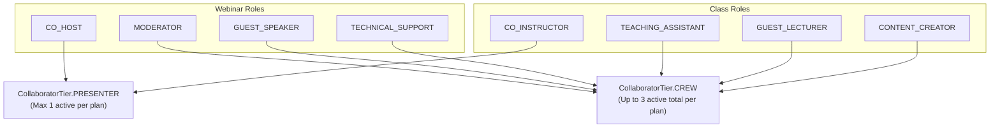

# Collaborator System — Permissions, Roles & Authorization

Collaborator authorization combines deterministic **role-to-tier derivation** (`CollaboratorRole -> CollaboratorTier`) with strict **plan ownership & organization `catalog.manage` verification**.

## Role-to-Tier Mapping

Every `CollaboratorRole` belongs to one offering kind (`WEBINAR` or `CLASS`) and maps deterministically to either `PRESENTER` or `CREW` via `tierForRole()` in `lib/collaborators/roles.ts`:

---

## End-to-End Capability Matrix

| Capability / Surface                                 | Primary Host (`OWNER`)     | Org Admin (`catalog.manage`)                   | `PRESENTER` (`CO_HOST` / `CO_INSTRUCTOR`) | `CREW` Collaborator             | Pending Invitee | Learner (`CONSULTEE`)       |
| ---------------------------------------------------- | -------------------------- | ---------------------------------------------- | ----------------------------------------- | ------------------------------- | --------------- | --------------------------- |
| **Edit plan metadata & pricing**                     | Yes                        | Yes (org plans)                                | No                                        | No                              | No              | No                          |
| **Invite / edit (`PENDING`) / remove collaborators** | Yes                        | Yes (org plans)                                | No                                        | No                              | No              | No                          |
| **Create / reschedule / cancel sessions**            | Yes                        | Yes (org plans)                                | No (protected by overlap guard)           | No (protected by overlap guard) | No              | No                          |
| **Protected by co-host overlap guard**               | Yes (Postgres GiST)        | —                                              | Yes (`ACCEPTED`)                          | Yes (`ACCEPTED`)                | No              | —                           |
| **View full attendee roster**                        | Yes                        | Yes (org plans)                                | Yes (`ACCEPTED`)                          | No (`404`)                      | No (`404`)      | No (`404`)                  |
| **View collaborator team list**                      | All `PENDING` + `ACCEPTED` | All `PENDING` + `ACCEPTED`                     | `ACCEPTED` only                           | `ACCEPTED` only                 | Own row only    | No (`403`)                  |
| **View revenue split preview**                       | Yes                        | Yes (org plans)                                | Yes (`ACCEPTED`)                          | Yes (`ACCEPTED`)                | No              | No                          |
| **Stream `collab-*` coordination chat**              | `channel_moderator`        | —                                              | Member (`ACCEPTED`)                       | Member (`ACCEPTED`)             | No              | No                          |
| **Stream event channel (`webinar-*` / `class-*`)**   | `channel_moderator`        | —                                              | `channel_moderator` (`ACCEPTED`)          | Member (`ACCEPTED`)             | No              | Member                      |
| **1:1 Student DM target eligibility**                | Yes                        | —                                              | Yes (`ACCEPTED`)                          | No                              | No              | —                           |
| **Stream Video SFU role**                            | `host` / `co_presenter`    | —                                              | `co_presenter` (`ACCEPTED`)               | `call_member` (`ACCEPTED`)      | No              | `call_member`               |
| **End call for everyone & start/stop recording**     | Yes                        | —                                              | Yes (`ACCEPTED`)                          | No                              | No              | No                          |
| **Receive settled revenue share**                    | Residual gross slice       | Org share (`OWNER` on ownerless catalog plans) | Configured `revenueShareBps`              | Configured `revenueShareBps`    | No (`0`)        | —                           |
| **Withdraw own collaboration (`DELETE`)**            | —                          | —                                              | Yes (`PENDING` / `ACCEPTED`)              | Yes (`PENDING` / `ACCEPTED`)    | Yes (`PENDING`) | No                          |
| **Consumes learner seat capacity**                   | No                         | No                                             | No (`role: COLLABORATOR`)                 | No (`role: COLLABORATOR`)       | No              | **Yes (`role: CONSULTEE`)** |

---

## Security & Authorization Invariants

### 1. Null-Owner Guard & Organization Catalog Authorization

Organization catalog offerings (`WebinarPlan` / `ClassPlan` with `organizationId != null`) may have `consultantProfileId: null` when published directly by an organization without a single owning consultant.

- **Strict Non-Null Identity Comparison**: Ownership checks never evaluate `plan.consultantProfileId === callerProfile?.id` raw because `null === undefined` / `null === null` would grant an unprofiled or unrelated caller full host privileges on ownerless catalog plans.
- **Explicit Dual Path**:
  1. **Personal Host Match**: `plan.consultantProfileId !== null && callerProfileId !== null && plan.consultantProfileId === callerProfileId`.
  2. **Organization Operator Match**: When `plan.organizationId !== null`, an active `Membership` on `plan.organizationId` whose `role` satisfies `hasOrgPermission(role, "catalog.manage")` is authorized to view, invite, update (`PENDING`), and remove collaborators even when `callerProfileId` is `null` (storing `invitedById: callerProfileId ?? null`).

### 2. Mutual Exclusion Between Learners and Collaborators

A user can never simultaneously hold a paid learner seat (`role: "CONSULTEE"`) and an active collaboration (`PENDING` / `ACCEPTED`) on the same plan:

- **At Invite & Accept Time**: `assertNotAttendee()` rejects (`409 CollaboratorIneligibleError`) any consultant who already holds a live `AppointmentParticipant` seat on the plan.
- **At Checkout & Settlement Time**: Checkout blocks collaborators from purchasing seats on their own plan, and `calculateRevenueSplit(..., { excludeBuyerUserId })` enforces a defense-in-depth exclusion at settlement so a race between acceptance and payment confirmation can never rebate a buyer from their own purchase.
- **Capacity Accounting**: Group session capacity queries filter strictly on `role: "CONSULTEE"` so shadow `role: "COLLABORATOR"` rows never reduce available learner seats.

### 3. Consultant Standing Gate (`assertInviteeEligible`)

Both `inviteCollaborator()` and `respondToInvitation(..., "ACCEPTED")` verify that the invitee's `ConsultantProfile` and `User` satisfy:

- `consultantProfile.deletedAt === null` and `user.erasedAt === null`
- `consultantProfile.verificationStatus === "VERIFIED"`
- Account is not actively suspended (`!(user.banned === true && (!user.banExpires || user.banExpires > now))`)
- Target plan is not archived (`plan.archivedAt === null`)

---

## Deprecated & Superseded Approaches

- **Naive `plan.consultantProfileId === callerProfileId` Owner Check**: Previously allowed two `null`/`undefined` values to compare equal on ownerless org catalog plans, bypassing host authorization. Replaced by strict non-null consultant matching plus explicit `hasOrgPermission(membership.role, "catalog.manage")` verification.
- **Per-Invite Boolean Capabilities (`canSeeAttendees`, `canEditEvent`, `canApprovePayment`, `canViewAnalytics`)**: Replaced by tier-derived capabilities (`tier: PRESENTER | CREW`). Roster visibility, event channel moderation, 1:1 student DM eligibility, and video host controls belong to `PRESENTER` (`CO_HOST` / `CO_INSTRUCTOR`).
- **Unfiltered `AppointmentParticipant` Counts**: Counting all participant rows regardless of `role` inflated learner enrolment counts whenever accepted collaborators had shadow `role: "COLLABORATOR"` rows. Learner enrolment queries filter explicitly on `role: "CONSULTEE"`.
