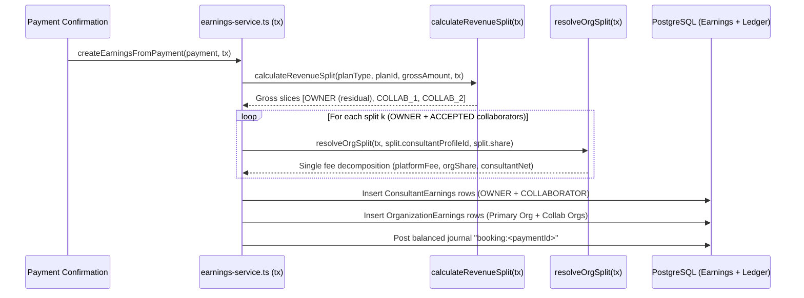

# Collaborator System — Multi-Party Revenue Sharing & Ledger Math

All multi-party settlement math in `lib/collaborators/service.ts` and `lib/payments/payouts/earnings-service.ts` uses **integer paise** and **integer basis points (`revenueShareBps`)** with zero floating-point rounding drift.

## Core Principle: Single Fee on Per-Party Gross Slices

When a participant pays `grossAmount` paise for a webinar or class with accepted collaborators, settlement divides **`grossAmount` directly into per-party gross slices first**, and then applies **at most one fee schedule** (either that party's active organization rate card or the standalone B2C marketplace rate) to each slice:

1. **Collaborator Gross Slices**: Each `ACCEPTED` collaborator $i$ receives:
   $$\text{grossSlice}_i = \left\lfloor \frac{\text{grossAmount} \times \text{revenueShareBps}_i}{10000} \right\rfloor$$
2. **Owner Residual Gross Slice**: The primary host (or owning catalog organization when `consultantProfileId === null`) receives the exact remainder so zero paise are ever minted or lost:
   $$\text{ownerGrossSlice} = \text{grossAmount} - \sum_{i} \text{grossSlice}_i$$
3. **Independent Single-Fee Decomposition Per Slice**:
   - **B2B Sponsored Booking (`isB2B = true`)**: `platformFeePaise = 0`; each party retains `100%` of their gross slice (or their org rate card's non-marketplace split).
   - **Standalone Solo Party (`resolveOrgSplit(...) === null`)**:
     $$\text{platformFeePaise}_k = \left\lfloor \frac{\text{grossSlice}_k \times 20}{100} \right\rfloor, \quad \text{consultantSharePaise}_k = \text{grossSlice}_k - \text{platformFeePaise}_k$$
   - **Org-Affiliated Party (`resolveOrgSplit(tx, profileId, grossSlice_k, ...)`)**:
     Decomposes $\text{grossSlice}_k$ **once** according to that party's own HOST/HYBRID organization rate card $(\text{platformBps}, \text{orgBps}, \text{consultantBps})$:
     $$\text{platformFeePaise}_k = \left\lfloor \frac{\text{grossSlice}_k \times \text{platformBps}}{10000} \right\rfloor$$
     $$\text{consultantSharePaise}_k = \left\lfloor \frac{\text{grossSlice}_k \times \text{consultantBps}}{10000} \right\rfloor$$
     $$\text{orgSharePaise}_k = \text{grossSlice}_k - \text{platformFeePaise}_k - \text{consultantSharePaise}_k$$
   - **Ownerless Organization Catalog Plan (`plan.consultantProfileId === null`, `organizationId = orgId`)**:
     `splits[0]` carries `{ consultantProfileId: null, organizationId: orgId, share: ownerGrossSlice, role: "OWNER" }`. The owner slice settles directly into `OrganizationEarnings` (`role: OWNER`, `orgSharePaise = ownerGrossSlice - ownerPlatformFee`) and credits `ORG_PAYABLE` without creating a null-consultant `ConsultantEarnings` record.

---

## Double-Entry Ledger Balance Invariant

Every multi-party settlement transaction posts an atomic journal keyed by `booking:<paymentId>` that satisfies exact zero-sum balance across all accounts:

$$\text{DEBIT}(\text{GATEWAY\_CLEARING}) = \text{CREDIT}(\text{PLATFORM\_REVENUE}) + \sum_{c} \text{CREDIT}(\text{CONSULTANT\_PAYABLE}_c) + \sum_{o} \text{CREDIT}(\text{ORG\_PAYABLE}_o)$$

Enforced at `COMMIT` by the PostgreSQL constraint trigger `ledger_balance_check` (`prisma/sql/ledger-triggers.sql`). Under `PG_POOL_MAX=1`, every query inside `createEarningsFromPayment` and `calculateRevenueSplit` executes strictly through the active transaction handle `tx`.

---

## Worked Numerical Scenarios

### Scenario A: Solo Host + Two Solo Collaborators (20% Platform Fee)

- **Gross Payment**: `₹1,000.00` (`100,000` paise)
- **Collaborators**: Co-Host (`2500 bps`), Moderator (`1500 bps`), Owner (`6000 bps` residual)

| Party                          | Gross Slice (paise) | Platform Fee (`20%`) | Org Share | Consultant Net (`CONSULTANT_PAYABLE`) | `shareBps`  |
| ------------------------------ | ------------------- | -------------------- | --------- | ------------------------------------- | ----------- |
| **Owner (`OWNER`)**            | `60,000`            | `12,000`             | `0`       | `48,000`                              | `6000`      |
| **Co-Host (`COLLABORATOR`)**   | `25,000`            | `5,000`              | `0`       | `20,000`                              | `2500`      |
| **Moderator (`COLLABORATOR`)** | `15,000`            | `3,000`              | `0`       | `12,000`                              | `1500`      |
| **Total**                      | **`100,000`**       | **`20,000`**         | **`0`**   | **`80,000`**                          | **`10000`** |

Ledger check: `100,000 DEBIT = 20,000 PLATFORM_REVENUE + 80,000 CONSULTANT_PAYABLE`.

---

### Scenario B: Org-Hosted Plan (`15%` Platform / `25%` Org / `60%` Consultant) + Org Collaborator (`15%` Platform / `15%` Org / `70%` Consultant)

- **Gross Payment**: `₹1,000.00` (`100,000` paise)
- **Splits**: Owner (`7000 bps` -> `70,000` paise gross), Co-Host (`3000 bps` -> `30,000` paise gross)

| Party                 | Gross Slice   | Platform Fee (`15%` once!) | Org Share (`ORG_PAYABLE`) | Consultant Net (`CONSULTANT_PAYABLE`) |
| --------------------- | ------------- | -------------------------- | ------------------------- | ------------------------------------- |
| **Host (`Org A`)**    | `70,000`      | `10,500`                   | `17,500` (`Org A`)        | `42,000`                              |
| **Co-Host (`Org B`)** | `30,000`      | `4,500`                    | `4,500` (`Org B`)         | `21,000`                              |
| **Total**             | **`100,000`** | **`15,000`**               | **`22,000`**              | **`63,000`**                          |

Ledger check: `100,000 DEBIT = 15,000 PLATFORM_REVENUE + 22,000 ORG_PAYABLE + 63,000 CONSULTANT_PAYABLE`. Neither slice is ever taxed twice.

---

### Scenario C: Ownerless Org Catalog Plan (`consultantProfileId = null`, `orgId = "org_1"`, `10%` Org Rate Card) + Accepted Solo Collaborator (`3000 bps`, `20%` Marketplace Fee)

- **Gross Payment**: `₹1,000.00` (`100,000` paise)
- **Owner Slice (`70,000` paise)**: Credited directly to `OrganizationEarnings` (`organizationId: "org_1"`, `role: OWNER` at `org_1`'s `10%` rate card schedule): `platformFee = 7,000`, `orgShare = 63,000`, `consultantShare = 0`.
- **Collaborator Slice (`30,000` paise)**: Credited to `ConsultantEarnings` (`role: COLLABORATOR` at `20%` solo schedule): `platformFee = 6,000`, `consultantShare = 24,000`.
- Ledger check: `100,000 DEBIT = 13,000 PLATFORM_REVENUE (7,000 + 6,000) + 63,000 ORG_PAYABLE + 24,000 CONSULTANT_PAYABLE`.

---

## Refunds & Payout Independence

- **Independent Payout Batches**: Each `ConsultantEarnings` and `OrganizationEarnings` row carries its own `holdUntil` timestamp and settles into separate `Payout` batches grouped by `consultantProfileId` or `organizationId`. If a collaborator has not completed Razorpay Route / bank onboarding (`payoutAccountReady === false`), only their payout waits; the host and other collaborators are paid on schedule.
- **Proportional Multi-Party Refunds**: `refundEarnings()` reverses every `ConsultantEarnings` and `OrganizationEarnings` row associated with `paymentId` proportionally using `prorate()`. Any sub-paisa floor remainder is absorbed by the platform so buyers receive full refunds and no party is over-clawed.

---

## Deprecated & Superseded Approaches

- **Post-Fee Net Pool Splitting (Double Fee Deduction)**: Previously, `earnings-service.ts` subtracted a top-level marketplace fee first (`pool = gross - fee`), passed `pool` into `calculateRevenueSplit()`, and then passed each collaborator's already-net share into `resolveOrgSplit()` — charging org-affiliated collaborators **two** platform fees (`20%` top-level + `platformBps` rate card fee). Superseded by slicing `grossAmount` per party first and deducting each party's fee schedule strictly once.
- **Crashing / Dropping Owner Share on Ownerless Org Catalog Plans**: Previously assumed `plan.consultantProfileId` was always non-null when creating the `OWNER` split row. Superseded by `consultantProfileId: string | null` + `organizationId?: string | null` on `RevenueSplit`.
- **Global Prisma Client Reads Inside Settlement Transactions**: Previously queried global `prisma` inside `calculateRevenueSplit()`, causing connection pool deadlocks under `PG_POOL_MAX=1`. All split queries strictly use the caller's transaction client `db`.
