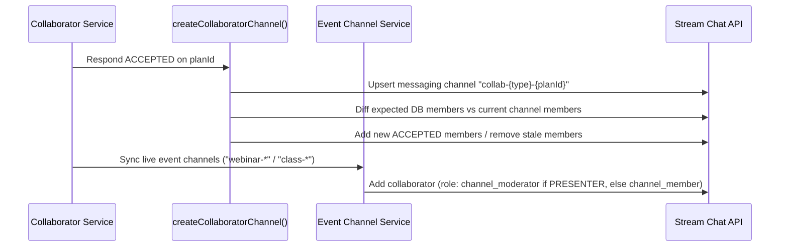

# Collaborator System — Stream Chat Integration & Moderation

Stream Chat connects collaborators across three distinct surfaces: private plan-level coordination channels (`collab-*`), public/enrolled group session channels (`webinar-*` / `class-*`), and 1:1 student support DMs (`dm-*`).

## Channel Taxonomy & Role Assignment

| Channel Purpose               | Channel ID Pattern               | Channel Type | Members                                                     | Moderator Role (`channel_moderator`)                  |
| ----------------------------- | -------------------------------- | ------------ | ----------------------------------------------------------- | ----------------------------------------------------- |
| **Collaborator Coordination** | `collab-webinar-{webinarPlanId}` | `messaging`  | Primary Host + all `ACCEPTED` collaborators                 | Primary Host                                          |
| **Collaborator Coordination** | `collab-class-{classPlanId}`     | `messaging`  | Primary Host + all `ACCEPTED` collaborators                 | Primary Host                                          |
| **Webinar Session Channel**   | `webinar-{webinarId}`            | `team`       | Primary Host + `ACCEPTED` collaborators + enrolled learners | Primary Host + accepted `PRESENTER` (`CO_HOST`)       |
| **Class Session Channel**     | `class-{classId}`                | `team`       | Primary Host + `ACCEPTED` collaborators + enrolled learners | Primary Host + accepted `PRESENTER` (`CO_INSTRUCTOR`) |
| **1:1 Student DM**            | `dm-{sortedUserIds}`             | `messaging`  | Enrolled learner + Primary Host **or** accepted `PRESENTER` | Channel creator                                       |

---

## Bidirectional Channel Reconciliation & Provisioning

### 1. Plan Coordination Channel (`createCollaboratorChannel`)

- Triggered automatically when a collaborator accepts (`respondToInvitation(..., "ACCEPTED")`).
- Uses `messaging` type (private, invite-only) rather than `team` so paid attendees can never view instructor logistics.
- Reconciles membership idempotently against PostgreSQL: adds newly accepted collaborators, keeps the Primary Host as `channel_moderator`, and removes any user whose DB row left `ACCEPTED`.
- Skips creation (`return null`) when fewer than 2 members exist (e.g., sole host with no accepted collaborators).

### 2. Event Session Channels & `channel_moderator` Rights

- When an event channel (`webinar-{id}` or `class-{id}`) is created or synced, all `ACCEPTED` collaborators on the parent plan are automatically added as channel members.
- Accepted collaborators with `tier === "PRESENTER"` (`CO_HOST` / `CO_INSTRUCTOR`) are granted Stream's `channel_moderator` role alongside the Primary Host so they can pin announcements, mute disruptive attendees, and delete spam messages in real time.
- Accepted `CREW` collaborators (`MODERATOR`, `TEACHING_ASSISTANT`, `GUEST_SPEAKER`, `GUEST_LECTURER`, `TECHNICAL_SUPPORT`, `CONTENT_CREATOR`) join as regular members.

### 3. 1:1 Student DM Eligibility

Enrolled learners (`AppointmentParticipant` with `role: "CONSULTEE"` and live booking status) may open 1:1 direct message threads with:

- The plan's **Primary Host** (`plan.consultantProfile.userId`), or
- An accepted **`PRESENTER`** collaborator (`CO_HOST` or `CO_INSTRUCTOR`) on that webinar or class plan.
  Crew collaborators (`tier === "CREW"`) are not exposed as direct student DM targets unless an explicit shared 1:1 engagement exists.

---

## Verified Revocation Pipeline

Whenever a collaborator leaves `PENDING`/`ACCEPTED` (via host `DELETE`, collaborator self-withdrawal, user moderation ban, or DPDP account scrub), `revokeCollaboratorAccess(planType, planId, userId)` executes independent cleanup steps:

1. **Shadow Participant Cancellation**: Cancels all non-cancelled `AppointmentParticipant` rows (`role: "COLLABORATOR"`) on the plan's live appointments.
2. **Event Channel Removal**: Calls `removeUserFromEventChannel(planType, event.id, userId)` for every webinar/class event on the plan and verifies each `{ success: boolean }` response; any failure marks `accessRevoked = false` and reports a single consolidated error to Sentry.
3. **Coordination Channel Removal**: Removes `userId` from `collab-{planType}-{planId}` (ignoring Stream 404 errors if a channel was never created).
4. **Durable Retry Outbox**: When triggered by moderation ban or DPDP erasure, any transient Stream failure writes a `StreamRevocationRetry` row driven to completion by `retry-moderation-enforcement`.

---

## Deprecated & Superseded Approaches

- **Fire-and-Forget Unchecked `removeUserFromEventChannel` Calls**: Previously awaited `removeUserFromEventChannel()` without inspecting `{ success: false }`, allowing removed collaborators to retain read/write access on live event channels when Stream rate-limited or failed transiently.
- **Append-Only Coordination Channel Membership**: Previously appended members on accept without pruning stale members or elevating `PRESENTER` collaborators to `channel_moderator` on session channels.
- **Legacy `consultation-{id}` / `subscription-{id}` Team Channels**: Replaced by direct `dm-*` 1:1 messaging channels.
