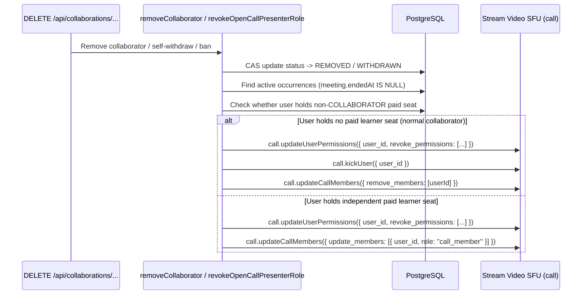

# Collaborator System — Stream Video Integration & Live SFU Controls

Stream Video calls are minted exclusively server-side (`provisionAppointmentMeeting` and `resolveMeetingAccess` in `lib/meetings/access.ts`), assigning role-gated SFU permissions at join time and enforcing immediate SFU disconnection on removal or withdrawal.

## Video Call Role Mapping

| Participant Type                                       | Server Access Role (`MeetingRole`) | Stream Call Member Role | SFU Capabilities                                                                                                                                                                 |
| ------------------------------------------------------ | ---------------------------------- | ----------------------- | -------------------------------------------------------------------------------------------------------------------------------------------------------------------------------- |
| **Primary Host (`OWNER`)**                             | `"host"`                           | `host` / `co_presenter` | Full host controls: publish audio/video/screen, mute participants, end call for everyone, start/stop cloud recording                                                             |
| **Accepted `PRESENTER` (`CO_HOST` / `CO_INSTRUCTOR`)** | `"host"` (`coPresenter: true`)     | `co_presenter`          | Full co-presenter controls: publish audio/video/screen, end call for everyone (`POST /api/meetings/[id]/end`), start/stop recording (`POST /api/stream/recordings/{start,stop}`) |
| **Accepted `CREW` Collaborator**                       | `"participant"`                    | `call_member`           | Join call within host/collaborator window, publish audio/video/screen; **cannot** end call for everyone or toggle recordings                                                     |
| **Paid Learner (`CONSULTEE`)**                         | `"participant"`                    | `call_member`           | Join call within consultee window (`CONSULTEE_JOIN_WINDOW_MS`); standard participant permissions                                                                                 |

---

## Live SFU Permission Revocation & Immediate Kick Flow

Removing an accepted collaborator from a plan while a session is open (`endedAt: null` within `MAX_CALL_DURATION_MS`) immediately strips their Stream Video SFU capabilities and evicts their active WebRTC transport:

### Enforcement Guarantees

1. **SFU Permission Revocation (`updateUserPermissions`)**: Revokes elevated host/co-presenter SFU permissions immediately so an in-flight WebRTC session cannot publish as presenter, mute others, or control screen-sharing while socket teardown completes.
2. **Active WebRTC Disconnection (`kickUser`)**: Disconnects the removed collaborator from live SFU media rooms immediately rather than waiting for JWT expiration.
3. **Call Member Roster Update (`updateCallMembers`)**:
   - Removes `[userId]` completely from `call.members` when the user has no paid learner seat.
   - Downgrades `[userId]` from `co_presenter` to `call_member` if the user separately holds a valid non-collaborator participant seat on the appointment.
4. **Consolidated Telemetry**: All open occurrences on the plan are processed concurrently via `Promise.allSettled`; any unexpected Stream error sets `accessRevoked = false` and emits at most one consolidated `reportSentryError` event per removal call.

---

## Deprecated & Superseded Approaches

- **Granting Host/Recording Controls to All Collaborator Roles**: Previously treated all accepted collaborators identically in video calls, allowing `CREW` roles (`TECHNICAL_SUPPORT`, `CONTENT_CREATOR`, `MODERATOR`, `TEACHING_ASSISTANT`) to end live sessions for everyone or stop recordings. Restricted strictly to `PRESENTER_ROLES` (`CO_HOST`, `CO_INSTRUCTOR`).
- **Passive Call Member Removal Without SFU `kickUser` & `updateUserPermissions`**: Previously removed users only from `call.members` or skipped open calls altogether, leaving an already-connected collaborator inside the live SFU room with presenter privileges until their client disconnected.
