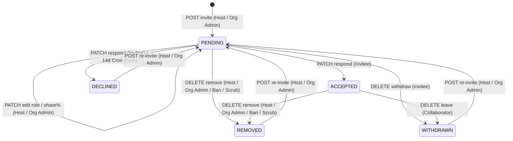

# Collaborator System — REST API, Lifecycle Sweeps & Transactional Emails

This document specifies all HTTP endpoints, state transitions, background cleanup sweeps, and transactional notification channels governing the collaborator lifecycle.

## Collaborator State Machine

Every state transition on `Collaborator.status` executes an atomic compare-and-swap (`updateMany` with the expected prior state in `WHERE`):

---

## REST API Reference

All routes require an authenticated session (`401 Unauthorized` otherwise). API inputs express shares as integer/decimal percentages (`1–90`); API responses return stored basis points (`revenueShareBps`, `100–9000`).

| Method & Endpoint                                       | Caller Authorization                                                                                    | Request Body / Params                                   | Response / Side Effects                                                                                                                                   |
| ------------------------------------------------------- | ------------------------------------------------------------------------------------------------------- | ------------------------------------------------------- | --------------------------------------------------------------------------------------------------------------------------------------------------------- |
| `GET /api/collaborations`                               | Authenticated user (`?orgScope=<id>&view=org` requires active org `catalog.manage`)                     | Query: `orgScope?`, `view?`                             | Returns `{ webinarCollaborations, classCollaborations, hostedWebinarPlans, hostedClassPlans, hostUser }`                                                  |
| `GET /api/collaborations/{type}/{planId}`               | Plan owner, org `catalog.manage`, accepted collaborator (`ACCEPTED` list), or pending invitee (own row) | —                                                       | Scoped collaborator list (`404` missing plan, `403` unauthorized)                                                                                         |
| `POST /api/collaborations/{type}/{planId}`              | Plan owner or active org `catalog.manage` operator                                                      | `{ consultantProfileId, role, revenueSharePercentage }` | `201 Created`; enforces max 3 active seats, max 1 `PRESENTER`, total `<= 90%`, verified standing, non-attendee check; sends Novu + Resend `INVITED` email |
| `PATCH /api/collaborations/{type}/{planId}/{id}`        | Plan owner or active org `catalog.manage` operator                                                      | `{ role?, revenueSharePercentage? }`                    | Updates **only `PENDING` rows** (`409` on `ACCEPTED` terms); re-validates presenter cap & `90%` share ceiling inside `Serializable` tx                    |
| `DELETE /api/collaborations/{type}/{planId}/{id}`       | Plan owner / org admin (`-> REMOVED`) OR own collaborator (`-> WITHDRAWN`)                              | —                                                       | CAS state flip + cancels shadow `AppointmentParticipant` + revokes Stream Chat & live Video SFU + sends Novu & Resend `REMOVED` or `WITHDRAWN` email      |
| `PATCH /api/collaborations/[id]/respond`                | Invited consultant (`consultantProfileId === callerProfile.id`)                                         | `{ response: "ACCEPTED" \| "DECLINED", planType }`      | Re-runs eligibility gates on `ACCEPTED`, writes shadow participant rows, reconciles `collab-*` channel, sends Novu + Resend `ACCEPTED`/`DECLINED` email   |
| `GET /api/collaborations/{type}/{planId}/revenue-split` | Plan owner, org operator, accepted collaborator, or staff                                               | `?amount=<paise>` (default `10000`)                     | Preview array of per-party gross slices (`[{ consultantProfileId, organizationId?, share, role }]`)                                                       |

---

## Background Sweeps & Double-Booking Guard

### 1. 14-Day Stale Invitation Expiration Sweep (`expireStaleCollaboratorInvites`)

Registered in `lib/cron/cleanup-registry.ts` under Postgres `withCronLock`:

- Scans `Collaborator` rows where `status = 'PENDING'` and `updatedAt < now - 14d`.
- Transitions stale rows atomically via conditional CAS `updateMany({ where: { id, status: "PENDING" }, data: { status: "DECLINED", respondedAt: now } })` (`PENDING --> DECLINED`), immediately freeing the reserved `revenueShareBps` capacity and `PRESENTER` slot on the parent plan.
- Sends budgeted Resend transactional emails (`sendCollaboratorInviteExpiredEmail`) to both the invitee and the inviter/host (`invitedBy?.user ?? plan.consultantProfile?.user`) notifying both parties that the pending invitation expired after 14 days without a response.

### 2. Co-Host Double-Booking Guard (`lib/collaborators/availability.ts`)

Whenever a host creates or reschedules webinar slots or class batches (`SchedulingService`, webinar/class CRUD routes):

- `assertCollaboratorsAvailable()` and `assertCollaboratorsAvailableForWindows()` check every `ACCEPTED` collaborator's confirmed and live-checkout commitments across all owned and collaborated plans.
- Rejects overlapping sessions inside the scheduling transaction with `CollaboratorUnavailableError` (`409 Conflict`) naming the conflicting co-host(s).

---

## Transactional Emails (`lib/email/senders/collaborators.ts`) & Reminder Fan-Out

All 6 collaboration lifecycle events render `CollaborationLifecycleEmail` (`emails/collaborations/CollaborationLifecycleEmail.tsx`) via `defineBudgetedEmailSender` (enforcing `deliver()` and `EMAIL_DELIVERY_MODE`):

| Event       | Sender Function                      | Recipient                   | Idempotent `entityRef`        |
| ----------- | ------------------------------------ | --------------------------- | ----------------------------- |
| `INVITED`   | `sendCollaboratorInvitedEmail`       | Invited Consultant          | `collaborator:<id>:invited`   |
| `ACCEPTED`  | `sendCollaboratorAcceptedEmail`      | Plan Owner                  | `collaborator:<id>:accepted`  |
| `DECLINED`  | `sendCollaboratorDeclinedEmail`      | Plan Owner                  | `collaborator:<id>:declined`  |
| `REMOVED`   | `sendCollaboratorRemovedEmail`       | Removed Collaborator        | `collaborator:<id>:removed`   |
| `WITHDRAWN` | `sendCollaboratorWithdrawnEmail`     | Plan Owner                  | `collaborator:<id>:withdrawn` |
| `EXPIRED`   | `sendCollaboratorInviteExpiredEmail` | Invitee & Inviter/Plan Host | `collaborator:<id>:expired`   |

### Appointment Reminder Fan-Out

`sendAppointmentReminders` (`scripts/appointments/send-appointment-reminders.ts`) spreads `collaboratorUserIds(planType, planId)` into every reminder notification alongside the host and paid learners, deduplicating per window using `appointment:${appointmentId}:${windowLabel}` (`24h` vs `1h`) so staging the `24h` reminder never suppresses the `1h` reminder.

---

## Deprecated & Superseded Approaches

- **Appointment-Scoped Reminder Deduplication Keys (`appointment:${appointmentId}`)**: Previously omitted the `:${windowLabel}` suffix, causing the `24h` reminder stage row in `FailedEmail` to suppress the subsequent `1h` reminder window. Replaced by `appointment:${appointmentId}:${windowLabel}`.
- **In-Place Term Mutation / Re-Consent on `ACCEPTED` Rows**: Flipping an `ACCEPTED` row back to `PENDING` on `PATCH` dropped the collaborator from settlement queries until they re-accepted, diverting their revenue share to the host. Replaced by locking `ACCEPTED` terms (`409 Conflict`).
- **Indefinite `PENDING` Share Reservation**: Previously `PENDING` invitations never expired, permanently locking up to `90%` of a plan's collaborator share budget if an invitee ignored their dashboard. Replaced by the 14-day `expireStaleCollaboratorInvites` sweep.
- **Standalone Advisory Availability Overlay Endpoint (`GET /api/collaborators/[id]/availability`)**: Removed in favor of server-enforced transaction-level conflict detection (`assertCollaboratorsAvailable`).
