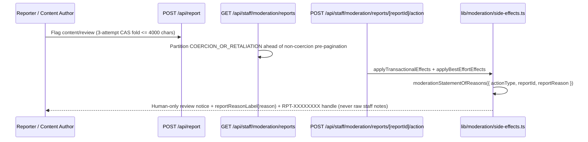

# 10 — Consumer Protection, Grievance Redressal & Review Transparency

> **Status:** Active across public statutory disclosures (`app/(pages)/constants.ts`, `app/(pages)/grievance/page.tsx`, `app/(pages)/reviews-policy/page.tsx`), unauthenticated/authenticated grievance intake (`app/api/contact/route.ts`), moderation statements of reasons (`lib/moderation/side-effects.ts`), priority report queuing (`app/api/staff/moderation/reports/route.ts`), multi-reporter aggregation (`app/api/report/route.ts`), and dispute evidence governance (`app/api/admin/disputes/**`).

## 1. Corporate Identity, Live-MX Mailbox & Statutory SLA Standard

Familiarise publishes verified corporate registry disclosures in `app/(pages)/constants.ts` and binds consumer support, grievance redressal, and content/review moderation SLAs to the strictest applicable Indian statutory ceiling:

- **Registered Entity & CIN:** `Practitionist (OPC) Private Limited` (`CIN: U62012HR2026OPC146217`), registered jurisdiction `Haryana, India` (`process.env.NEXT_PUBLIC_COMPANY_JURISDICTION?.trim() || "Haryana, India"`).
- **Live-MX Verified Mailbox (`resolveLiveMailbox()`):** Resolves `process.env.CONTACT_INBOX_ADDRESS?.trim() || "support@practitionist.com"`. `practitionist.com` holds verified live MX records and receives all compliance mail (`COMPANY_INFO.email`, `COMPANY_INFO.supportEmail`, and `GRIEVANCE_OFFICER.email`), whereas `familiarisenow.com` has zero MX records and is never advertised as a mailbox address.
- **Unfabricated Phone & Accurate Policy Dates:** `COMPANY_INFO.phone` and `GRIEVANCE_OFFICER.phone` evaluate `process.env.NEXT_PUBLIC_SUPPORT_PHONE?.trim() || ""`; when unset, `app/(pages)/grievance/page.tsx` omits the phone line entirely rather than rendering placeholder text or invented numbers. `POLICY_DATES` preserves true historical dates on unchanged documents (`termsLastUpdated: "July 12, 2026"`, `refundLastUpdated: "September 26, 2026"`) while stamping updated/new statutory pages (`privacyLastUpdated`, `grievanceLastUpdated`, `reviewsPolicyLastUpdated`) as `"October 10, 2026"`.

| Regime                                                            | Statutory Ceiling                                                    | Implemented Platform Standard                                                                                                 | Tracking Handle                    |
| ----------------------------------------------------------------- | -------------------------------------------------------------------- | ----------------------------------------------------------------------------------------------------------------------------- | ---------------------------------- |
| **IT (Intermediary Guidelines) Rules, 2021 — Rule 3(2)**          | Acknowledge <= 24 hours; dispose <= 15 days                          | Acknowledge **within 24 hours** (`STATUTORY_ACK_HOURS = 24`); resolve **within 15 days** (`STATUTORY_RESOLUTION_DAYS = 15`)   | `FAM-YYYY-NNNNNN` / `RPT-XXXXXXXX` |
| **Consumer Protection (E-Commerce) Rules, 2020 — Rule 4(4)–4(5)** | Acknowledge <= 48 hours; redress <= 1 month with ticket number       | Held to the stricter **within 24 hours** acknowledgement and **within 15 days** resolution standard                           | `FAM-YYYY-NNNNNN`                  |
| **Digital Personal Data Protection Act, 2023 — Sec. 13**          | Resolve data principal grievances within prescribed period           | Routed through the designated Grievance Officer and unified support ticket queue                                              | `FAM-YYYY-NNNNNN`                  |
| **BIS IS 19000:2022 & EU DSA Art. 16(5) / 17(3)**                 | Verified reviews, equal treatment, human moderation, reason & appeal | Verified paid bookings only; two-track rating aggregation; human-only moderation; statement of reasons + `RPT-` Support route | `RPT-XXXXXXXX`                     |

## 2. Public Compliance Pages & Atomic Public Grievance Intake

1. **Grievance Redressal Page (`app/(pages)/grievance/page.tsx`):**
   - Renders `GRIEVANCE_OFFICER` name, designation (`"Grievance & Nodal Compliance Officer"`), live-MX `mailto:` link, optional phone row, jurisdiction (`Haryana, India`), statutory timelines (`ACK_PROMISE_COPY` = `"within 24 hours"` and `"within 15 days"`), anti-scam notice (`ANTI_SCAM_NOTICE`), and direct CTAs to `/dashboard/go?to=support` and `/contactus?category=grievance`.
   - Lists statutory appellate forums: **Grievance Appellate Committee** (`https://gac.gov.in`, 30-day appeal window under IT Rules Rule 3A), **National Consumer Helpline** (`https://consumerhelpline.gov.in`), and **Data Protection Board of India** (DPDP Act Section 13(3)).
2. **Atomic Public Grievance Intake (`POST /api/contact` in `app/api/contact/route.ts`):**
   - Protected by per-IP sliding-window limiting (`spamLimiter` on `contact:<ip>`), Zod validation (`ContactBodySchema`), and silent honeypot rejection (`website`).
   - When `category === "grievance"`, `recordPublicGrievanceTicket` executes inside `prisma.$transaction`: resolves `session.user.id` (falling back to the earliest `ADMIN` or `STAFF` operator account when submitted logged out), atomically allocates `FAM-YYYY-NNNNNN` via `allocateTicketReference(tx, now)`, and inserts a backing `SupportTicket` (`title: "[Grievance] ..."`, `category: "GRIEVANCE"`, `status: "OPEN"`, `priority: "HIGH"`, `slaDeadlinesFor("HIGH", now)`).
   - If the visitor is unauthenticated and zero `ADMIN`/`STAFF` operator rows exist, `recordPublicGrievanceTicket` skips `allocateTicketReference` so no orphan sequence number is burned, and `POST /api/contact` returns HTTP `202` with `referenceNumber: null` and a 24-hour officer follow-up notice after staging/sending `sendContactInquiryEmail`.
3. **Reviews & Moderation Policy Page (`app/(pages)/reviews-policy/page.tsx`):**
   - Documents verified paid-booking eligibility, BIS IS 19000:2022 non-suppression and zero-editing rules, two-track aggregation (`ONE_TO_ONE` vs `GROUP`), the five report grounds (`COERCION_OR_RETALIATION`, `SPAM_OR_FAKE`, `HARASSMENT_OR_ABUSE`, `OFF_TOPIC`, `OTHER`), `"Not counted in rating"` exclusions, human-only review, and internal/out-of-court/judicial appeal paths.

## 3. Moderation Statement of Reasons, Priority Queue & Report Folding

- **DSA Art. 16(5) & 17(3) Statement of Reasons (`moderationStatementOfReasons` in `lib/moderation/side-effects.ts`):**
  - Attached to every disposition and enforcement notice (`MODERATION_REPORT_OUTCOME`, `CONTENT_REMOVED_NOTICE`, `REVIEW_EXCLUDED_FROM_RATING`, warnings, suspensions, bans, and profile unverification).
  - Cites the formatted policy ground via `reportReasonLabel(params.reportReason ?? "OTHER")` (`lib/labels/report-reasons.ts`) — **never exposing raw internal moderator `notes`** to reporters or moderated targets.
  - States explicitly that **a human moderator reviewed the report and no automated decision was used**, and instructs the recipient to open a Support request quoting `RPT-XXXXXXXX` (`formatReportReference(reportId)`) to appeal.
- **Pre-pagination `COERCION_OR_RETALIATION` priority (`GET /api/staff/moderation/reports`):**
  - Splits queries into `coercionWhere` (`reason: "COERCION_OR_RETALIATION"`) and `nonCoercionWhere` (`reason: { not: "COERCION_OR_RETALIATION" }`), computing exact cross-partition `skip` and `take` offsets before pagination so coercion, extortion, and retaliatory review flags always appear at the top of page 1 ahead of older or higher-count non-coercion reports.
- **Tail-preserving `4000`-char second-reporter fold (`POST /api/report`):**
  - When aggregating an additional report onto an existing `PENDING` or `UNDER_REVIEW` report, a 3-attempt CAS loop (`where: { id, reportCount: currentCount, status: { in: ["PENDING", "UNDER_REVIEW"] } }`) formats `\nReporter N+1 (reason): <280-char excerpt>` and clamps the existing prefix to `4000 - newestLine.length` (`MAX_AGGREGATED_DESCRIPTION_LENGTH = 4000`), guaranteeing the newest reporter's reason and excerpt are preserved intact at the tail.

## 4. Disputes & Chargeback Evidence Governance

- **Actionable Open Disputes & Overdue Visibility (`GET /api/admin/disputes` in `app/api/admin/disputes/route.ts`):**
  - Derives `ACTIONABLE_OPEN_STATUSES` directly from `OPEN_DISPUTE_WHERE.status.in` (`lib/backoffice/queue-predicates.ts`) excluding `"UNDER_REVIEW"`.
  - Computes `urgentDisputes` over `status: { in: ACTIONABLE_OPEN_STATUSES }` with `dueBy: { lte: now + 3d }` and **no lower-bound `gte: now` cutoff**, ensuring overdue open disputes remain surfaced as urgent until submitted or resolved, and orders actionable open rows ahead of closed/under-review rows by earliest `dueBy`.
- **Permission-Gated `evidencePack` & PII Redaction (`GET /api/admin/disputes/[disputeId]/route.ts`):**
  - Gates raw `evidence`, payer billing `email`, and `evidencePack` strictly behind `hasBackofficePermission(role, "disputes.manage")` (`ADMIN` only; `STAFF` receives `evidencePack: null` and redacted billing contact details).
  - Omits raw participant PII across both `payment.appointment` and `evidencePack`: session `attendances` rows are reduced to aggregate counts (`presentCount`, `recordsFound`, summary text) without user IDs or timestamps, and raw `supportThreads` / `supportCases` arrays are stripped from `payment.appointment` and normalized into summary status/reference metadata under `evidencePack.supportHistory`.

## Deprecated & Superseded Approaches

- **Dead-MX `support@familiarisenow.com` address, `Bengaluru, Karnataka` jurisdiction, fabricated phone numbers, and mass-overwritten policy dates:** Superseded in `app/(pages)/constants.ts` by live-MX `resolveLiveMailbox()` (`support@practitionist.com`), registered jurisdiction `Haryana, India` for `Practitionist (OPC) Private Limited` (`CIN: U62012HR2026OPC146217`), conditional phone omission when `NEXT_PUBLIC_SUPPORT_PHONE` is unset, and preserved historical dates (`July 12, 2026` / `September 26, 2026`) on untouched legal documents.
- **Unbacked public grievance emails without a `SupportTicket` or orphan sequence burns:** Previously, `/contactus?category=grievance` sent email without creating a tracked ticket, or allocated a `FAM-` reference before checking whether a `userId` existed. Superseded by atomic `recordPublicGrievanceTicket` inside `POST /api/contact`.
- **Leaking raw internal moderator `notes` in user notifications, post-pagination report sorting, and truncating newest reporter context:** Superseded by `moderationStatementOfReasons` citing `reportReasonLabel(reason)`, pre-pagination `COERCION_OR_RETALIATION` partitioning, and tail-preserving `4000`-char CAS folding.
- **Dropping overdue disputes (`dueBy >= now`) or exposing raw attendance/thread PII to non-`disputes.manage` staff:** Superseded by lower-bound-free `urgentDisputes` over `ACTIONABLE_OPEN_STATUSES` and `disputes.manage`-gated `evidencePack` redaction.
