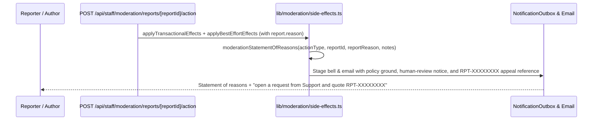

# 10 — Consumer Protection, Grievance Redressal & Review Transparency

> **Status:** Implemented across public compliance pages (`/grievance`, `/reviews-policy`, `/contactus`, `/support`, `/privacy`), shared constants (`app/(pages)/constants.ts`), support SLA clocks (`lib/support/sla.ts`), and moderation statements of reasons (`lib/moderation/side-effects.ts`).

## 1. Statutory Regimes & Unified SLA Standard

Familiarise sizes its consumer support, grievance redressal, and content/review moderation SLAs to the strictest applicable Indian statutory ceiling so a single unified support architecture satisfies every regime:

| Regime                                                            | Statutory Ceiling                                                     | Implemented Platform Standard                                                                                                 | Tracking Handle                    |
| ----------------------------------------------------------------- | --------------------------------------------------------------------- | ----------------------------------------------------------------------------------------------------------------------------- | ---------------------------------- |
| **IT (Intermediary Guidelines) Rules, 2021 — Rule 3(2)**          | Acknowledge <= 24 hours; dispose <= 15 days                           | Acknowledge **within 24 hours** (`STATUTORY_ACK_HOURS = 24`); resolve **within 15 days** (`STATUTORY_RESOLUTION_DAYS = 15`)   | `FAM-YYYY-NNNNNN` / `RPT-XXXXXXXX` |
| **Consumer Protection (E-Commerce) Rules, 2020 — Rule 4(4)–4(5)** | Acknowledge <= 48 hours; redress <= 1 month with ticket number        | Held to the tighter **24-hour acknowledgement** / **15-day resolution** SLA                                                   | `FAM-YYYY-NNNNNN`                  |
| **Digital Personal Data Protection Act, 2023 — Sec. 13**          | Resolve data principal grievances within prescribed period            | Routed through the same Grievance Officer and ticket queue                                                                    | `FAM-YYYY-NNNNNN`                  |
| **BIS IS 19000:2022 — Online Consumer Reviews**                   | Verified collection, equal treatment, transparent moderation & appeal | Verified paid bookings only; two-track rating aggregation; human moderator review only; written statement of reasons + appeal | `RPT-XXXXXXXX`                     |

## 2. Public Compliance Surfaces

1. **Grievance Redressal Page (`app/(pages)/grievance/page.tsx`)**:
   - Publishes `GRIEVANCE_OFFICER` name, designation, email (`support@familiarisenow.com`), jurisdiction (`Bengaluru, Karnataka, India`), acknowledgement promise (`within 24 hours`), and resolution promise (`within 15 days`).
   - Provides direct filing entry points to `/dashboard/go?to=support` (authenticated ticket intake) and `/contactus?category=grievance` (pre-selected Grievance Redressal category).
   - Lists statutory external escalation avenues:
     - **Grievance Appellate Committee (IT Rules Rule 3A):** `https://gac.gov.in` within 30 days.
     - **National Consumer Helpline (CCPA):** `https://consumerhelpline.gov.in`.
     - **Data Protection Board of India:** DPDP Act Section 13(3).
2. **Reviews & Moderation Policy Page (`app/(pages)/reviews-policy/page.tsx`)**:
   - Documents verified booking eligibility, two-track aggregation (`ONE_TO_ONE` vs `GROUP`), moderation grounds (`COERCION_OR_RETALIATION`, `SPAM_OR_FAKE`, `HARASSMENT_OR_ABUSE`, `OFF_TOPIC`, `OTHER`), `"Not counted in rating"` aggregate exclusions, human-only review guarantee, and the `RPT-XXXXXXXX` appeal path.
3. **Contact & Help Center Surfaces (`app/(pages)/constants.ts`, `app/(pages)/contactus/**`, `app/support/**`)**:
   - Single-sourced `ACK_PROMISE_COPY` (`within 24 hours`) derived from `STATUTORY_ACK_HOURS` in `lib/support/sla.ts` across all contact and Help Center surfaces.
   - Publishes anti-scam notice (`ANTI_SCAM_NOTICE`: support never requests OTPs, UPI PINs, card CVVs, or screen-sharing access) and payment/refund reconciliation guidance.

## 3. Moderation Statement of Reasons & Appeal Flow

Every moderation outcome notice (reporter disposition bell/email, content removal notice, review rating exclusion notice, warning, suspension, ban, and profile unverification) states:

- The specific policy ground evaluated (`reportReasonLabel(report.reason)`).
- Confirmation that a **human moderator** reviewed the report and **no automated decision** was used.
- The exact appeal path: open a request from Support and quote `RPT-XXXXXXXX`.

## Deprecated & Superseded Approaches

- **Separate standalone `Grievance` Prisma model and parallel `/dashboard/admin/grievances` queue**: Superseded by routing all grievances through `SupportTicket` with `FAM-YYYY-NNNNNN` references and `lib/support/sla.ts` deadlines so operators manage one unified queue with zero duplicate state machines.
- **Unverified `24–48 hours` response copy and bracket placeholders (`[EMAIL]`, `[PHONE]`, `[LAST UPDATED]`)**: Superseded by `ACK_PROMISE_COPY` (`within 24 hours`) derived directly from `STATUTORY_ACK_HOURS` and concrete contact disclosures in `app/(pages)/constants.ts`.
