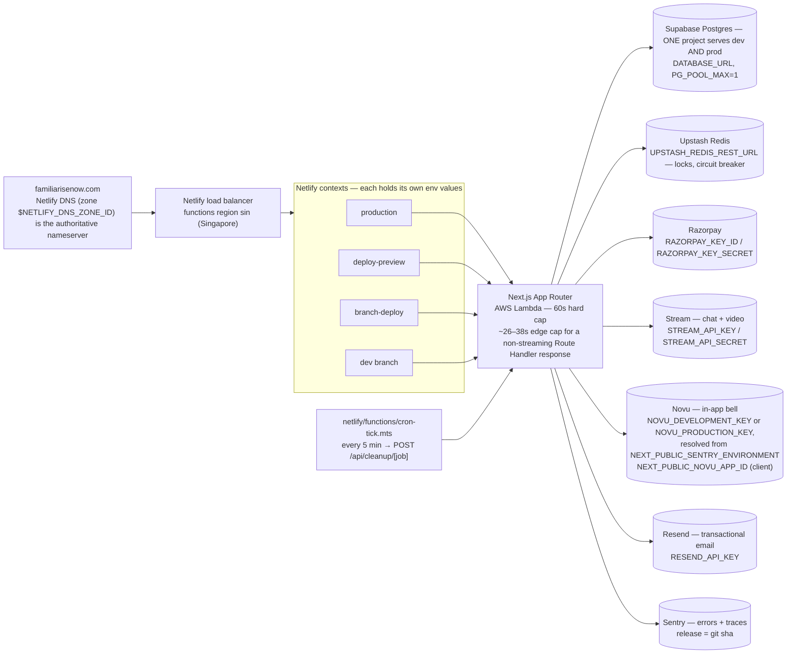

# Netlify Deployment — Full Reference Guide

> Written for junior developers who will maintain and extend Familiarise's deployment infrastructure.
> This document covers everything we learned the hard way, so you don't have to.

---

## Table of Contents

1. [Overview](#overview)
2. [Platform Limits, Plan, Region and the MCP](#platform-limits-plan-region-and-the-mcp)
3. [Site & Branch Architecture](#site--branch-architecture)
4. [Environment Variables — What's There and Why](#environment-variables--whats-there-and-why)
5. [The BetterAuth / "Invalid Origin" Incident](#the-betterauth--invalid-origin-incident)
6. [Netlify CLI Setup](#netlify-cli-setup)
7. [DNS Architecture on Netlify](#dns-architecture-on-netlify)
8. [Setting Up dev.familiarisenow.com](#setting-up-devfamiliariseonowcom)
9. [GCP OAuth Configuration](#gcp-oauth-configuration)
10. [The `netlify.toml` File](#the-netlifytoml-file)
11. [Deployment Workflow](#deployment-workflow)
12. [Gotchas, Errors & Debugging Log](#gotchas-errors--debugging-log)
13. [Checklist for New Environments](#checklist-for-new-environments)
14. [The Complete Netlify + Next.js SaaS Engineering Playbook & Experimental Ledger](#the-complete-netlify--nextjs-saas-engineering-playbook--experimental-ledger)
15. [Deprecated & Superseded Approaches](#deprecated--superseded-approaches)

---

## Overview

| Property               | Value                                                             |
| ---------------------- | ----------------------------------------------------------------- |
| Platform               | Netlify (Pro plan — `nf_team_pro`; account `type_slug` `orb-pro`) |
| Site name              | `familiarise`                                                     |
| Site ID                | `$NETLIFY_SITE_ID`                                                |
| Production URL         | `https://familiarisenow.com`                                      |
| Dev branch URL         | `https://dev.familiarisenow.com`                                  |
| Netlify default URL    | `https://familiarise.netlify.app`                                 |
| Dev branch Netlify URL | `https://dev--familiarise.netlify.app`                            |
| Netlify admin          | `https://app.netlify.com/projects/familiarise`                    |
| Netlify account        | `Practitionist-Deploys` (email: `<team-admin-email>`)             |
| GitHub repo            | `https://github.com/Practitionist/familiarise_web`                |
| DNS managed by         | Netlify DNS (zone ID: `$NETLIFY_DNS_ZONE_ID`)                     |

### Hosting machinery, end to end

The diagram below is the whole hosting picture in one place: how a request reaches this site, which Netlify context it lands in, and which third-party service reads which environment variable once the Next.js application is running. Each Netlify context — production, deploy-preview, branch-deploy and the `dev` branch itself — holds its own copies of every environment variable, which is why a leaked or rotated key in one context has no effect on the others and why a preview can never page a real user's inbox (`lib/novu/secret-key.ts` picks `NOVU_PRODUCTION_KEY` only when `NEXT_PUBLIC_SENTRY_ENVIRONMENT` is `production`). The registrar for `familiarisenow.com` is out of this repository's view; what the repository can state is that Netlify DNS is the zone's authoritative nameserver today; a request that resolves to it lands on Netlify's `sin` (Singapore) load balancer, the region chosen because it is the closest offered region to the Supabase project's `ap-south-1` database.



Two ceilings bound every request the Lambda serves: a page render is bounded by the 60-second synchronous execution limit because it can stream its shell early, while a Route Handler that awaits everything before returning JSON is bounded by the roughly 26–38 second edge/middleware inactivity timeout instead. Because one Supabase project backs both `dev` and production, every script that touches the database — a seed, a one-off backfill, a reconciliation dry run — is a production operation and should be treated with the same care as a change shipped through the app itself.

---

## Platform Limits, Plan, Region and the MCP

The facts below are kept in full, with sources and measurements, in `.claude/skills/deployment/netlify/`; this section is the summary that a deploy-time question usually needs.

Functions run in Singapore (`sin`, `ap-southeast-1`), the closest region Netlify offers to the Supabase project in Mumbai; Netlify has no Mumbai region. The Next.js server handler (`___netlify-server-handler`) runs on `@netlify/plugin-nextjs@5.15.x` (runtime API v2) under Node 22 at 1024 MB with streaming invocation, and `cron-tick` (`netlify/functions/cron-tick.mts`) is the single scheduled function, firing every five minutes (`*/5 * * * *`) to dispatch bounded, phase-staggered cleanup sweeps via `/api/cleanup/[job]`.

A request has two ceilings: the Lambda execution limit is 60 seconds, but the CDN edge returns `504 Inactivity Timeout` at ~26–34 seconds (or the middleware Edge Function crashes with `the edge function timed out` at ~37–38 seconds) to any non-streaming response that has not sent its first byte. Keep Route Handlers under ~25 seconds by using bounded `LIMIT` batches or set-based SQL queries. Critically, `next.config.mjs` MUST set `experimental.preloadEntriesOnStart: false` and `experimental.appDocumentPreloading: false`: because `@netlify/plugin-nextjs` runs `NextNodeServer` with `minimalMode: false`, leaving Next.js 15's default preloading enabled forces every cold Lambda instance to eagerly `webpackRequire` all 606 routes (1.67M module calls, ~500+ MB V8 heap) on startup — which caused the historic ~24–32s cold-start stall (`#1124`) and fatal 512 MB V8 heap OOMs (`#1972`). With entry preloading disabled, cold-start bursts across 12 concurrent requests complete in **0.97–1.90s** at **~33 MB V8 heap**.

The Netlify MCP (`@netlify/mcp`, configured in `.mcp.json.example`) reads projects, deploys, teams, and env vars and writes env vars; it cannot read logs or change limits. Warm its npx cache by hand before the first `/mcp` connect, because a cold install takes ~28 s against a 30 s connect timeout and a timed-out install leaves a torn cache. Function logs come from `netlify logs --url <deploy permalink> --json`; plan capabilities from `netlify api listAccountsForUser`; deploy history with per-function memory and region from `netlify api listSiteDeploys`. The recipes are in `.claude/skills/deployment/netlify/mcp-and-cli.md`.

---

## Site & Branch Architecture

Familiarise uses **two long-lived branches** in a trunk-based deployment flow:

```
feat/* / fix/*  ──► dev  ──► prod
                    │           │
                    │           └─► familiarisenow.com  (Netlify production)
                    └─────────────► dev.familiarisenow.com  (Netlify branch deploy)
```

### Branch → Deploy mapping

| Git branch    | Netlify context | URL                                                   |
| ------------- | --------------- | ----------------------------------------------------- |
| `prod`        | production      | `https://familiarisenow.com`                          |
| `dev`         | branch-deploy   | `https://dev.familiarisenow.com`                      |
| any PR branch | deploy-preview  | `https://deploy-preview-NNN--familiarise.netlify.app` |

### Allowed branches

Netlify is configured to auto-deploy only `prod` and `dev`. All other branches
only get a preview deploy when a pull request is open against them.

This is controlled in the Netlify site settings under **Build & deploy → Continuous deployment → Branch deploys**.
Via the API it's the `build_settings.allowed_branches` array.

### Why `prod` and not `main`?

The production branch is named `prod` (not `main` or `master`). This is intentional:

- `dev` is where active development happens and gets reviewed as a staging environment
- `prod` only receives merges from `dev` after QA sign-off
- `main` does not exist in this repo — don't create it

---

## Environment Variables — What's There and Why

All env vars live in the Netlify dashboard and are injected at build time.
They are **not committed to the repo** (`.env` is gitignored).
The `.env.sample` file is the canonical reference for what vars are needed.

### Critical auth variables

| Variable                      | Production value             | Local dev value         | Notes                                                                  |
| ----------------------------- | ---------------------------- | ----------------------- | ---------------------------------------------------------------------- |
| `BETTER_AUTH_SECRET`          | `<your-better-auth-secret>`  | same                    | 32+ char base64 secret for signing BetterAuth sessions                 |
| `BETTER_AUTH_URL`             | `https://familiarisenow.com` | `http://localhost:3000` | **This was the root cause of the invalid origin bug** — see below      |
| `BETTER_AUTH_TRUSTED_ORIGINS` | `https://familiarisenow.com` | `http://localhost:3000` | Comma-separated additional allowed CORS origins                        |
| `NEXT_PUBLIC_APP_URL`         | `https://familiarisenow.com` | `http://localhost:3000` | Used by auth client + for building absolute URLs (e.g. referral links) |

### Optional performance variables

These variables are not required for the app to boot, but they tune runtime behaviour. Leave them unset to accept the defaults.

| Variable               | Production value | Local dev value  | Notes                                                                                                                                                          |
| ---------------------- | ---------------- | ---------------- | -------------------------------------------------------------------------------------------------------------------------------------------------------------- |
| `PRISMA_SLOW_QUERY_MS` | unset (uses 500) | unset (uses 500) | Threshold in milliseconds above which Prisma logs a slow-query warning. Optional; defaults to `500`. Must be a positive number, otherwise the default is used. |

When a query runs longer than `PRISMA_SLOW_QUERY_MS`, `lib/prisma.ts` emits a `[Prisma:SLOW_QUERY]` `console.warn` so that missing indexes and N+1 patterns surface in any environment without enabling full query logging. The rationale is documented in [Navigation Performance](../performance/01-navigation-performance.md).

### Why `BETTER_AUTH_URL` is the most important variable

BetterAuth uses `BETTER_AUTH_URL` as the canonical base URL for:

1. **Origin validation** — it rejects auth requests whose `Origin` header doesn't match this URL or `trustedOrigins`
2. **Cookie domain** — session cookies are scoped to this domain
3. **OAuth callbacks** — the redirect URI sent to providers (Google, GitHub, etc.) is built from this URL

If this is set to `http://localhost:3000` in production (as it was initially), every sign-in attempt from a real browser will be rejected with `"invalid origin"`.

### Setting env vars in Netlify

Via the Netlify CLI:

```bash
# Set for production only
netlify env:set BETTER_AUTH_URL "https://familiarisenow.com" --context production

# Set for branch deploys (dev, etc.)
netlify env:set BETTER_AUTH_URL "https://familiarisenow.com" --context branch-deploy

# Set for ALL contexts at once (omit --context flag)
netlify env:set SOME_VAR "value"

# Remove a variable
netlify env:unset VARIABLE_NAME

# List all env vars as JSON (non-interactive)
netlify env:list --json
```

> **Tip:** `--context production` and `--context branch-deploy` are separate calls.
> Omitting `--context` sets the var in the `all` context (all contexts inherit it).

### The legacy NextAuth variables

When we audited the Netlify env vars, we found `NEXTAUTH_SECRET` and `NEXTAUTH_URL`
still set from a previous NextAuth migration. These were **removed** because:

- The app uses BetterAuth, not NextAuth
- Stale vars create confusion and can shadow real vars in some frameworks
- `NEXTAUTH_URL=http://localhost:3000` was harmless for BetterAuth but misleading

Removed via:

```bash
netlify env:unset NEXTAUTH_SECRET
netlify env:unset NEXTAUTH_URL
```

---

## The BetterAuth / "Invalid Origin" Incident

### Symptoms

- Login on `familiarisenow.com` fails immediately after clicking "Sign In"
- Browser console shows a `400` or `403` from `/api/auth/sign-in/email`
- Error message in the response body: `"invalid origin"`
- Login works fine on `localhost:3000`

### Root cause

`lib/auth.ts` was missing `secret`, `baseURL`, and `trustedOrigins`:

```typescript
// BEFORE (broken)
export const auth = betterAuth({
  database: prismaAdapter(prisma, { provider: "postgresql" }),
  // ... no secret, no baseURL, no trustedOrigins
});
```

BetterAuth, when it has no `baseURL`, tries to infer it from the incoming request.
In a Netlify serverless environment, this inference can return the internal function
URL, not the public domain. With no `trustedOrigins` list, any request whose `Origin`
doesn't match the inferred base URL is rejected.

Additionally, even if `lib/auth.ts` had `baseURL: process.env.BETTER_AUTH_URL`,
the Netlify env var `BETTER_AUTH_URL` was set to `http://localhost:3000` — so it
would still reject production requests.

### Fix applied

**`lib/auth.ts`** — added three new top-level fields:

```typescript
export const auth = betterAuth({
  secret: process.env.BETTER_AUTH_SECRET,
  baseURL: process.env.BETTER_AUTH_URL,
  trustedOrigins: process.env.BETTER_AUTH_TRUSTED_ORIGINS
    ? process.env.BETTER_AUTH_TRUSTED_ORIGINS.split(",")
    : [],
  // ... rest of config unchanged
});
```

**`lib/auth-client.ts`** — added `baseURL` so the client knows where to send requests:

```typescript
export const authClient = createAuthClient({
  baseURL: process.env.NEXT_PUBLIC_APP_URL,
  plugins: [customSessionClient<typeof auth>()],
});
```

**Netlify env vars** — fixed via CLI:

```bash
netlify env:set BETTER_AUTH_URL "https://familiarisenow.com" --context production
netlify env:set BETTER_AUTH_URL "https://familiarisenow.com" --context branch-deploy
netlify env:set BETTER_AUTH_TRUSTED_ORIGINS "https://familiarisenow.com" --context production
netlify env:set BETTER_AUTH_TRUSTED_ORIGINS "https://familiarisenow.com" --context branch-deploy
netlify env:set NEXT_PUBLIC_APP_URL "https://familiarisenow.com" --context production
netlify env:set NEXT_PUBLIC_APP_URL "https://familiarisenow.com" --context branch-deploy
```

### Why the fix also helps referral links

The `NEXT_PUBLIC_APP_URL` env var is also used when building referral link URLs
(e.g. `https://familiarisenow.com/r/andrewanfkgx`). Before this fix, referral
links were being generated as `http://localhost:3000/r/...` — completely broken
in production.

---

## Netlify CLI Setup

### Installation

```bash
npm install -g netlify-cli
netlify --version   # netlify-cli/24.x.x
```

### Authentication

```bash
netlify login       # opens browser OAuth flow
netlify status      # verify you're logged in
```

### Linking a local repo to a Netlify site

The CLI needs to know which Netlify site the current directory maps to.
Run this once in the repo root:

```bash
netlify link --id $NETLIFY_SITE_ID
```

This creates a `.netlify/` folder (gitignored automatically) that stores the site ID.
Without this, all `netlify env:*`, `netlify deploy`, and `netlify api` commands
will fail with `"You don't appear to be in a folder that is linked to a project"`.

### Listing your sites (to find the site ID)

```bash
netlify sites:list
```

Example output:

```
familiarise - $NETLIFY_SITE_ID
  url:  https://familiarisenow.com
  repo: https://github.com/Practitionist/familiarise_web
```

### Using the raw Netlify API

The CLI wraps the Netlify REST API via `netlify api <methodName>`.
All method names are camelCase versions of the OpenAPI operation IDs.

```bash
# List available API methods
netlify api --list

# Get site details
netlify api getSite --data '{"site_id": "$NETLIFY_SITE_ID"}'

# Update site settings
netlify api updateSite --data '{
  "site_id": "$NETLIFY_SITE_ID",
  "body": { "branch_deploy_custom_domain": "dev.familiarisenow.com" }
}'
```

> **Gotcha:** `netlify api` output is always JSON. Pipe through `python3 -c "import sys,json; ..."`
> or `jq` to read it. The CLI may also print interactive prompts (like "Show values? y/N")
> that hang in non-interactive shells — always use `--json` or pipe to avoid this.

---

## DNS Architecture on Netlify

The domain `familiarisenow.com` is managed entirely by **Netlify DNS**
(DNS zone ID: `$NETLIFY_DNS_ZONE_ID`). This means Netlify is the
authoritative nameserver — you do NOT manage DNS at a separate registrar
(GoDaddy, Namecheap, etc.) for this domain.

### Record types you'll see

| Type        | Purpose                                                                                                                                                       |
| ----------- | ------------------------------------------------------------------------------------------------------------------------------------------------------------- |
| `NETLIFY`   | Netlify's proprietary A-record equivalent. Points to a Netlify site. Handles Anycast routing + automatic SSL provisioning. Use this for apex and www records. |
| `CNAME`     | Standard alias record. Can point to any hostname. Netlify accepts CNAMEs to `*.netlify.app` domains but SSL provisioning requires extra steps.                |
| `NETLIFYv6` | Same as `NETLIFY` but for IPv6                                                                                                                                |
| `TXT`       | Text records — used for domain verification (Google Search Console, etc.)                                                                                     |
| `MX`        | Mail exchange records — not relevant for the app                                                                                                              |

### Current DNS records

| Type      | Hostname                   | Target                    | Purpose                   |
| --------- | -------------------------- | ------------------------- | ------------------------- |
| `NETLIFY` | `familiarisenow.com`       | `familiarise.netlify.app` | Production site           |
| `NETLIFY` | `www.familiarisenow.com`   | `familiarise.netlify.app` | www redirect to prod      |
| `NETLIFY` | `dev.familiarisenow.com`   | `familiarise.netlify.app` | Dev branch deploy         |
| `NETLIFY` | `*.dev.familiarisenow.com` | `familiarise.netlify.app` | Wildcard for dev subpaths |

> **Note on the `NETLIFY` type for `dev.familiarisenow.com`:** Even though the value
> shows `familiarise.netlify.app`, Netlify internally routes requests for this hostname
> to the dev branch deploy because `branch_deploy_custom_domain` is set to
> `dev.familiarisenow.com` in the site configuration. The `NETLIFY` record type
> lets Netlify control routing at the edge level.

### How to manage DNS records via CLI

```bash
# Get zone ID and all records
netlify api getDNSForSite --data '{"site_id": "$NETLIFY_SITE_ID"}'

# Create a DNS record
netlify api createDnsRecord --data '{
  "zone_id": "$NETLIFY_DNS_ZONE_ID",
  "body": {
    "type": "NETLIFY",
    "hostname": "example.familiarisenow.com",
    "value": "familiarise.netlify.app",
    "ttl": 3600
  }
}'

# Delete a DNS record (you need the record ID first)
netlify api deleteDnsRecord --data '{
  "zone_id": "$NETLIFY_DNS_ZONE_ID",
  "dns_record_id": "<record-id-from-get>"
}'
```

> **Gotcha:** The API method name is `deleteDnsRecord` (not `deleteDNSRecord` —
> case matters). Use `netlify api --list | grep -i dns` to find the exact method name.

---

## Setting Up dev.familiarisenow.com

This was the most complex part of the deployment setup. Here's the full story.

### Goal

We wanted:

- `familiarisenow.com` → serves the `prod` branch
- `dev.familiarisenow.com` → serves the `dev` branch (for staging/testing)

### What we tried (and what failed)

#### Attempt 1: `build_settings.branch_deploy_custom_domain` (nested)

```bash
netlify api updateSite --data '{
  "site_id": "...",
  "body": {
    "build_settings": {
      "branch_deploy_custom_domain": "dev.familiarisenow.com"
    }
  }
}'
```

**Result:** The field was silently ignored. `branch_deploy_custom_domain` came back
as `null`. The field is top-level on the site object, NOT nested under `build_settings`.

#### Attempt 2: Adding as `domain_aliases`

Adding `dev.familiarisenow.com` to the site's `domain_aliases` array would
provision SSL for it — but domain aliases always serve the **production** deploy,
not a branch deploy. This would have made `dev.familiarisenow.com` serve prod
content, the opposite of what we wanted.

#### Attempt 3: CNAME record to `dev--familiarise.netlify.app`

Creating a plain `CNAME` record:

```
dev.familiarisenow.com  CNAME  dev--familiarise.netlify.app
```

This would direct DNS correctly to the branch deploy URL, but Netlify won't
automatically provision an SSL certificate for a custom domain pointing via
CNAME unless the domain is also registered in the site's configuration.
Without SSL, browsers would show a certificate error.

#### What actually worked: top-level `branch_deploy_custom_domain`

The correct API call:

```bash
netlify api updateSite --data '{
  "site_id": "$NETLIFY_SITE_ID",
  "body": {
    "branch_deploy_custom_domain": "dev.familiarisenow.com"
  }
}'
```

This sets the `branch_deploy_custom_domain` field **at the top level** of the site
object. When set, Netlify:

1. Automatically creates `NETLIFY` type DNS records for `dev.familiarisenow.com`
   and `*.dev.familiarisenow.com`
2. Provisions SSL for these hostnames via Let's Encrypt
3. Routes all traffic to `dev.familiarisenow.com` to the `dev` branch deploy

> **Key lesson:** Always inspect the full site object (`netlify api getSite`) to
> understand which fields exist at which nesting level. Don't assume nested structure.

### How to inspect the full site object

```bash
netlify api getSite --data '{"site_id": "$NETLIFY_SITE_ID"}' \
  | python3 -c "
import sys, json
d = json.load(sys.stdin)
for k, v in d.items():
    if k not in ['published_deploy', 'user']:
        print(f'{k}: {json.dumps(v)[:120]}')
"
```

This is the fastest way to discover available configuration fields.

---

## GCP OAuth Configuration

Google OAuth requires the production domain to be registered as an
**Authorized JavaScript origin** and the BetterAuth callback route to be
registered as an **Authorized redirect URI**.

### Steps to update

1. Go to [console.cloud.google.com](https://console.cloud.google.com) → **APIs & Services → Credentials**
2. Click the OAuth 2.0 Client ID named **`familiarise-web-client`** (the Web application type)
3. Under **Authorized JavaScript origins**, add:
   - `https://familiarisenow.com`
   - `https://dev.familiarisenow.com`
   - `http://localhost:3000` (already present for local dev)
4. Under **Authorized redirect URIs**, add:
   - `https://familiarisenow.com/api/auth/callback/google`
   - `https://dev.familiarisenow.com/api/auth/callback/google`
   - `http://localhost:3000/api/auth/callback/google` (local dev)
5. Click **Save**. Changes propagate within ~5 minutes.

### Why `/api/auth/callback/google`?

BetterAuth's Google provider uses the route `POST /api/auth/callback/google`
for the OAuth2 code exchange. This is handled by the catch-all route at
`app/api/auth/[...all]/route.ts`. If this URI is not whitelisted in GCP,
the Google OAuth flow will fail with `redirect_uri_mismatch`.

### Google Client ID and Secret

These are stored in Netlify env vars:

- `GOOGLE_CLIENT_ID` = stored in Netlify (see `netlify env:list --json` — look for the `384845845365-` prefix confirming it belongs to the `familiarise` GCP project)
- `GOOGLE_CLIENT_SECRET` = stored in Netlify (check `netlify env:list --json`)

> **Security note:** Never commit these to the repo. The `.env` file is gitignored
> for exactly this reason.

---

## The `netlify.toml` File

Located at the repo root. Minimal configuration — most settings are managed
via the Netlify dashboard/API or `next.config.mjs` rather than in this file.

```toml
[build]
  command = "npm run build"
  publish = ".next"

[build.environment]
  NODE_VERSION = "22"
  # 6 GB V8 heap headroom for the webpack compile phase inside Netlify's 8 GB
  # build container. Note: this ONLY applies to the build container, NOT the
  # runtime AWS Lambda containers (which default to 512 MB V8 old-space on
  # 1024 MB memory).
  NODE_OPTIONS = "--max-old-space-size=6144"

# Skip Dependabot PR preview builds
[context.deploy-preview]
  ignore = "..."
```

### What to add if you need branch-specific env vars

You can set env vars per-context in `netlify.toml`. These are merged with
the dashboard env vars (dashboard wins on conflict):

```toml
[context.dev.environment]
  NEXT_PUBLIC_APP_URL = "https://dev.familiarisenow.com"
  BETTER_AUTH_URL = "https://dev.familiarisenow.com"
```

> **Warning:** Do NOT put secrets in `netlify.toml` — it's committed to the repo.
> Only put non-sensitive values like `NEXT_PUBLIC_APP_URL` here.

### Build & runtime configuration in `next.config.mjs`

Because `@netlify/plugin-nextjs` v5 (Runtime API v2) silently ignores classic `netlify.toml` bundling keys (`included_files`, `node_bundler`, `external_node_modules`) for the generated `___netlify-server-handler`, all critical build, bundle-size, and cold-start controls live in `next.config.mjs`:

- **`experimental.preloadEntriesOnStart: false` & `experimental.appDocumentPreloading: false`** (#1972 / #1124): Disables `NextNodeServer`'s cold-start `unstable_preloadEntries()` and `preloadAppDocument()` loops, which otherwise eagerly `webpackRequire` all 606 routes (1.67M calls, ~500+ MB V8 heap) on every cold Lambda boot when `minimalMode: false`.
- **Netlify 8 GB Build-Container Survival Tuning** (#1792 / #1795): When `process.env.NETLIFY === "true"`, sets `staticGenerationMaxConcurrency: 2`, `enablePrerenderSourceMaps: false`, `cpus: 1`, `widenClientFileUpload: false` (in `withSentryConfig`), and skips `eslint`/`typescript` during `next build` (enforced in GitHub Actions CI instead) to prevent Linux kernel OOM kills (`exit 137`).
- **`outputFileTracingExcludes`** (#1244 / #1527): Strips build-only toolchains (`typescript`, `esbuild`, `webpack`, `terser`), `sharp`/`@img/*` (handled by Netlify Image CDN), and `.next/server/**/*.map` (left behind by Sentry) so the unzipped `___netlify-server-handler` stays well below AWS Lambda's hard **250 MB** limit.
- **`outputFileTracingIncludes`** (#1365 / #1468): Explicitly pins `public/fonts/**` and `node_modules/react/**` on the statutory PDF invoice/credit-note routes so `@vercel/nft` does not strip files loaded dynamically via `fs` or custom JSX runtimes.
- **`serverExternalPackages`**: Keeps server-only SDKs (`pg`, `@prisma/adapter-pg`, `pg-pool`, `pg-connection-string`, `razorpay`, `stripe`, `resend`, `bcrypt`, `@stream-io/node-sdk`, `@novu/api`) out of webpack server/client bundles.
- **`RESOLVED_APP_URL` build-time origin override**: Recomputes `NEXT_PUBLIC_APP_URL`, `BETTER_AUTH_URL`, and `BETTER_AUTH_TRUSTED_ORIGINS` from `DEPLOY_PRIME_URL` when `CONTEXT !== "production"` so deploy previews authenticate against themselves instead of calling production.
- **`compiler.removeConsole`**: Uses `{ exclude: ["error", "warn"] }` in production so server-side diagnostics survive SWC compilation (#1122).
- **`experimental.optimizePackageImports` & `experimental.staleTimes`** (#887): Tree-shakes barrel imports and caches RSC payloads on the client router.

---

## Deployment Workflow

### Normal feature → staging → production flow

```bash
# 1. Work on a feature branch
git checkout -b feat/my-feature dev
# ... make changes ...
git push origin feat/my-feature

# 2. Open a PR against dev
# GitHub will show a Netlify preview deploy URL for the PR

# 3. Merge to dev (after review)
git checkout dev && git merge feat/my-feature && git push origin dev
# → Automatically deploys to dev.familiarisenow.com

# 4. When ready for production, merge dev into prod
git checkout prod && git pull origin prod
git merge dev --no-edit
git push origin prod
# → Automatically deploys to familiarisenow.com

# 5. Return to dev for the next feature
git checkout dev
```

### Checking deploy status

```bash
# View recent deploys (non-interactive)
netlify api listSiteDeploys \
  --data '{"site_id": "$NETLIFY_SITE_ID"}' \
  | python3 -c "
import sys, json
for d in json.load(sys.stdin)[:8]:
    print(f'[{d[\"state\"]:12}] {d[\"branch\"]:12} {d[\"created_at\"][:19]}')
"
```

States you'll see:

- `building` — build in progress
- `ready` — deployed successfully
- `error` — build failed (check Netlify dashboard for logs)
- `skipped` — build skipped (e.g. Dependabot branch)

### Manual redeploy (without a code push)

Useful when you've changed env vars and need a rebuild:

```bash
netlify deploy --build --prod   # rebuild and deploy to production
netlify deploy --build          # rebuild and deploy to a draft URL first
```

---

## Gotchas, Errors & Debugging Log

### 1. `netlify env:list` hangs waiting for user input

**Problem:** `netlify env:list` shows a prompt "Show values? (y/N)" which hangs
in non-interactive scripts.

**Fix:** Always use `netlify env:list --json` to get machine-readable output
without prompts:

```bash
netlify env:list --json
```

---

### 2. `"You don't appear to be in a folder that is linked to a project"`

**Problem:** `netlify status` shows you're logged in but every command fails.

**Cause:** The local directory isn't linked to a Netlify site. The `.netlify/`
folder with `state.json` is missing.

**Fix:**

```bash
netlify link --id $NETLIFY_SITE_ID
```

This creates `.netlify/state.json` in the repo root (gitignored automatically).

---

### 3. `netlify api` method name casing

**Problem:** `netlify api deleteDNSRecord` → `"is not a valid api method"`

**Cause:** Method names use the OpenAPI camelCase operation IDs. DNS abbreviations
are mixed-case (`Dns` not `DNS`).

**Fix:** Use `netlify api --list | grep -i dns` to find exact names:

```
deleteDnsRecord    ← correct
deleteDNSRecord    ← wrong
```

---

### 4. `netlify api` with body fields in the wrong nesting level

**Problem:** Setting `build_settings.branch_deploy_custom_domain` silently
did nothing — the field came back as `null`.

**Cause:** `branch_deploy_custom_domain` is a **top-level** field on the site
object, not nested under `build_settings`. The Netlify UI and some docs imply
otherwise.

**Fix:** Inspect the raw site object first to see where fields live:

```bash
netlify api getSite --data '{"site_id": "..."}' | python3 -c "
import sys, json
d = json.load(sys.stdin)
for k, v in d.items():
    print(k, ':', str(v)[:80])
"
```

Then set the field at the correct level in `updateSite`.

---

### 5. NETLIFY-type DNS records always show `familiarise.netlify.app` as value

**Problem:** After setting `branch_deploy_custom_domain`, all DNS records
(including `dev.familiarisenow.com`) show `familiarise.netlify.app` as the
value — not `dev--familiarise.netlify.app`.

**Cause:** This is correct behaviour. The `NETLIFY` DNS record type lets Netlify
route internally at the edge level based on the hostname. The `value` field
always points to the main site's Netlify subdomain — Netlify handles the
branch routing server-side using the `branch_deploy_custom_domain` configuration.
Do not try to change the value to `dev--familiarise.netlify.app`.

---

### 6. JSON parse errors from `netlify api`

**Problem:** Parsing API output fails with `JSONDecodeError: Expecting value`.

**Cause:** Some Netlify API responses are empty strings `""` (for 204 No Content).
Others return arrays, not objects.

**Fix:**

```bash
# Handle potentially-array responses
netlify api getDNSForSite --data '...' | python3 -c "
import sys, json
data = json.load(sys.stdin)
obj = data[0] if isinstance(data, list) else data
# ... use obj
"
```

---

### 7. `BETTER_AUTH_URL` set to localhost in production

**Problem:** Sign-in works locally but fails on the live site with `"invalid origin"`.

**Cause:** `BETTER_AUTH_URL` was set to `http://localhost:3000` in the Netlify
env vars. This was accidentally copied from the local `.env` file when the
Netlify project was first configured.

**Fix:**

```bash
netlify env:set BETTER_AUTH_URL "https://familiarisenow.com" --context production
netlify env:set BETTER_AUTH_URL "https://familiarisenow.com" --context branch-deploy
```

> **Lesson:** Always audit your Netlify env vars after initial setup.
> Run `netlify env:list --json` and compare every URL-type variable against
> the actual production domain. `localhost` in any env var is a red flag.

---

### 8. `NETLIFY` type vs `CNAME` for branch subdomains

**Problem:** We tried creating a `CNAME dev.familiarisenow.com → dev--familiarise.netlify.app`
but this doesn't automatically provision SSL and doesn't tell Netlify to
serve the branch from this hostname.

**Correct approach:** Use the `branch_deploy_custom_domain` site setting.
Netlify then automatically creates the right DNS records (NETLIFY type)
and provisions SSL. Do not manually create DNS records for branch subdomains
— let Netlify manage them.

---

### 9. `NODE_ENV=production` breaks the build — missing devDependencies

**Problem:** After fixing `NODE_ENV` from `test` to `production` on Netlify,
ALL deploy previews started failing with:

```
Error [ERR_MODULE_NOT_FOUND]: Cannot find package '@next/bundle-analyzer'
Error [ERR_MODULE_NOT_FOUND]: Cannot find module 'autoprefixer'
```

**Root cause:** When `NODE_ENV=production`, npm's `install` command skips
`devDependencies`. Build-critical packages like `autoprefixer`, `postcss`,
`tailwindcss`, `typescript`, and `@next/bundle-analyzer` were all in
`devDependencies`. With `NODE_ENV=test` (the previous value), npm installed
everything — so the build worked by accident.

**Why it worked before:** `NODE_ENV` was set to `test` on Netlify, which
is not a special npm lifecycle value, so npm treated it as development
and installed all dependencies including devDependencies.

**Two fixes applied:**

1. **`NPM_FLAGS=--include=dev`** — Set as a Netlify env var. This tells
   npm to install devDependencies even when `NODE_ENV=production`. This
   is the standard fix for Next.js on Netlify since the build step needs
   TypeScript, PostCSS, Tailwind, etc.

   ```bash
   netlify env:set NPM_FLAGS "--include=dev"
   ```

2. **Guarded `@next/bundle-analyzer` import** — Changed `next.config.mjs`
   from an unconditional top-level `import` to a conditional dynamic
   `await import()` that only loads when `ANALYZE=true`:

   ```javascript
   // BEFORE (breaks when package not installed)
   import bundleAnalyzer from "@next/bundle-analyzer";
   const withBundleAnalyzer =
     process.env.ANALYZE === "true"
       ? bundleAnalyzer({ enabled: true })
       : (config) => config;

   // AFTER (safe — never loads unless ANALYZE=true)
   const withBundleAnalyzer =
     process.env.ANALYZE === "true"
       ? (await import("@next/bundle-analyzer")).default({ enabled: true })
       : (config) => config;
   ```

**Key lesson:** When setting `NODE_ENV=production` on any hosting platform,
always ensure build tools in `devDependencies` are still installed. Either:

- Set `NPM_FLAGS=--include=dev` (recommended for Next.js)
- Or move build-critical packages to `dependencies` (not recommended —
  conflates runtime and build concerns)

**Packages that MUST be available at build time (currently in devDependencies):**

| Package                 | Why it's needed at build time                   |
| ----------------------- | ----------------------------------------------- |
| `typescript`            | Next.js compiles TypeScript during `next build` |
| `autoprefixer`          | PostCSS plugin loaded by Tailwind CSS           |
| `postcss`               | CSS processing during build                     |
| `tailwindcss`           | Utility CSS generation                          |
| `@types/node`           | TypeScript type definitions                     |
| `@types/react`          | TypeScript type definitions                     |
| `@types/react-dom`      | TypeScript type definitions                     |
| `@next/bundle-analyzer` | Optional — only if `ANALYZE=true` (now guarded) |

---

## Checklist for New Environments

If you ever need to set up a new deployment environment (e.g. `staging.familiarisenow.com`),
follow this checklist:

- [ ] Create the git branch (e.g. `staging`)
- [ ] Add it to `netlify api updateSite` `build_settings.allowed_branches`
- [ ] If using a custom domain, set `branch_deploy_custom_domain` or `deploy_preview_custom_domain` at the site level
- [ ] Run `netlify env:set BETTER_AUTH_URL "https://staging.familiarisenow.com" --context branch-deploy`
- [ ] Run `netlify env:set BETTER_AUTH_TRUSTED_ORIGINS "..." --context branch-deploy`
- [ ] Run `netlify env:set NEXT_PUBLIC_APP_URL "https://staging.familiarisenow.com" --context branch-deploy`
- [ ] Update GCP OAuth credentials to add the new origin and redirect URI
- [ ] Verify env vars: `netlify env:list --json | grep -i auth`
- [ ] Ensure `NPM_FLAGS=--include=dev` is set (required for Next.js builds with `NODE_ENV=production`)
- [ ] Push a commit to the branch and confirm the Netlify deploy succeeds
- [ ] Visit the new URL and confirm sign-in works end-to-end

---

## Quick Reference Commands

```bash
# Check current status
netlify status
netlify env:list --json

# Fix auth env vars (replace URL as needed)
netlify env:set BETTER_AUTH_URL "https://familiarisenow.com" --context production
netlify env:set BETTER_AUTH_URL "https://familiarisenow.com" --context branch-deploy
netlify env:set BETTER_AUTH_TRUSTED_ORIGINS "https://familiarisenow.com" --context production
netlify env:set NEXT_PUBLIC_APP_URL "https://familiarisenow.com" --context production

# Remove a stale variable
netlify env:unset OLD_VARIABLE_NAME

# Inspect site configuration
netlify api getSite --data '{"site_id": "$NETLIFY_SITE_ID"}' | python3 -m json.tool

# Inspect DNS records
netlify api getDNSForSite --data '{"site_id": "$NETLIFY_SITE_ID"}' | python3 -m json.tool

# Set branch deploy custom domain
netlify api updateSite --data '{
  "site_id": "$NETLIFY_SITE_ID",
  "body": { "branch_deploy_custom_domain": "dev.familiarisenow.com" }
}'

# Recent deploys
netlify api listSiteDeploys --data '{"site_id": "$NETLIFY_SITE_ID"}' \
  | python3 -c "import sys,json; [print(d['state'],d['branch'],d['created_at'][:19]) for d in json.load(sys.stdin)[:5]]"

# Trigger a manual production redeploy
netlify deploy --build --prod
```

---

## The Complete Netlify + Next.js SaaS Engineering Playbook & Experimental Ledger

> **Purpose of this section:** If you start another Next.js SaaS company tomorrow (on Netlify, AWS Lambda, OpenNext, or Docker), borrow this section directly on Day 1. It consolidates **every production outage, build failure, bundle-size limit, database pooling deadlock, cron race condition, and experimental dead end** encountered across 1,970+ PRs so you never have to repeat months of trial and error.

---

### 14.1 Master Taxonomy of Netlify + Next.js Failure Modes

| #      | Symptom / Error Message                                                                                                                                                                                                  | Layer                                                        | True Root Cause                                                                                                                                                                                                                                                                                                                                                                                                                                                                                                                      | Permanent Fix                                                                                                                                                                                                                                            |
| ------ | ------------------------------------------------------------------------------------------------------------------------------------------------------------------------------------------------------------------------ | ------------------------------------------------------------ | ------------------------------------------------------------------------------------------------------------------------------------------------------------------------------------------------------------------------------------------------------------------------------------------------------------------------------------------------------------------------------------------------------------------------------------------------------------------------------------------------------------------------------------ | -------------------------------------------------------------------------------------------------------------------------------------------------------------------------------------------------------------------------------------------------------- |
| **1**  | `504 Inactivity Timeout — Description: Too much time has passed without sending any data for document.` (~26–34s) **OR** `This edge function has crashed: the edge function timed out` (~37–38s) on cold starts / deploy | Runtime (`___netlify-server-handler` + Edge `middleware.ts`) | `@netlify/plugin-nextjs` v5 runs `NextNodeServer` with `minimalMode: false`. Next.js 15 defaults `experimental.preloadEntriesOnStart` and `appDocumentPreloading` to `true`, causing `new NextNodeServer()` to synchronously call `loadComponents()` across all **606 routes** (**1,676,071 `webpackRequire` calls**) on cold start — blocking the single-threaded event loop for 20–34s and consuming **496–512 MB V8 heap**, crossing Node 22's default **512 MB V8 old-space limit** on 1024 MB Lambda containers (#1124, #1972). | Set `experimental: { preloadEntriesOnStart: false, appDocumentPreloading: false }` and externalize server-only SDKs in `serverExternalPackages` in `next.config.mjs`. Cold starts drop from **29.5–37.6s (512 MB heap)** to **0.69–1.90s (33 MB heap)**. |
| **2**  | `504 Inactivity Timeout` on a specific slow API Route Handler while DB writes still succeed in the background                                                                                                            | CDN Edge (Apache Traffic Server)                             | Synchronous Lambda timeout is **60s**, but Netlify's CDN edge abandons any non-streaming HTTP response that hasn't sent its first byte within **~26–34s** (#1454).                                                                                                                                                                                                                                                                                                                                                                   | Keep non-streaming Route Handlers under **20–25s** via bounded `?limit=N` batches or rewrite row-by-row JS loops into set-based SQL `GROUP BY` / CTE queries.                                                                                            |
| **3**  | Netlify build fails with `FATAL ERROR: Reached heap limit Allocation failed - JavaScript heap out of memory` (`exit code 2`) during `"Creating an optimized production build"`                                           | Build Container (V8 Heap)                                    | Webpack compilation of 600+ routes exceeds Node's default 2–4 GB V8 heap limit (#932, #1795).                                                                                                                                                                                                                                                                                                                                                                                                                                        | Set `NODE_OPTIONS = "--max-old-space-size=6144"` in `netlify.toml`, `experimental.webpackMemoryOptimizations: true`, and skip `eslint`/`typescript` inside Netlify's `next build` (run them in GitHub Actions CI instead).                               |
| **4**  | Netlify build fails with `Killed` (`exit code 137`) during `"Generating static pages (N/334)"` or Sentry source-map finalize phase                                                                                       | Build Container (Linux Kernel 8 GB RSS OOM)                  | Next.js spawns prerender workers with `isolatedMemory` (`--max-old-space-size` stripped). Parent (6 GB) + 8 workers + Sentry's widened client source maps exceed the container's **8 GB physical RAM** (#1792, #1795).                                                                                                                                                                                                                                                                                                               | When `process.env.NETLIFY === "true"`, set `staticGenerationMaxConcurrency: 2`, `enablePrerenderSourceMaps: false`, `cpus: 1`, and `widenClientFileUpload: false` in `withSentryConfig`.                                                                 |
| **5**  | Deploy fails at `"Packaging Functions"` / `"Deploying Functions"` with `Invalid AWS Lambda parameters` / unzipped size > **250 MB**                                                                                      | AWS Lambda Packaging (`@vercel/nft`)                         | `withSentryConfig` generates `.next/server/**/*.map` and never deletes them; Next's file tracer also bundles build-time toolchains (`typescript`, `esbuild`, `webpack`, `terser`, `sharp`, `@img/*`) into `___netlify-server-handler` (#1158, #1244, #1527). Classic `netlify.toml` `included_files` is **silently ignored** by `@netlify/plugin-nextjs` v5.                                                                                                                                                                         | Use `outputFileTracingExcludes` in `next.config.mjs` to exclude `.next/server/**/*.map`, build toolchains, and `sharp`/`@img/*` (sheds ~80+ MB).                                                                                                         |
| **6**  | PDF invoices / credit notes render Hindi/Marathi fonts as tofu boxes or crash with missing `react/jsx-runtime` on Netlify only                                                                                           | AWS Lambda Packaging (`@vercel/nft`)                         | `@vercel/nft` only traces static `import`/`require` statements. Files read at runtime via `path.join(process.cwd(), "public/fonts/...")` or custom JSX runtimes outside webpack are omitted from the Lambda zip (#1365, #1468).                                                                                                                                                                                                                                                                                                      | Explicitly pin dynamic runtime files per route in `outputFileTracingIncludes` in `next.config.mjs`.                                                                                                                                                      |
| **7**  | Server-side `Prisma.$transaction` hangs for 30s and throws `P2028 Transaction API error`, or `Promise.all` queries run sequentially                                                                                      | Runtime + Database (`PG_POOL_MAX=1`)                         | Each Lambda instance serves 1 concurrent request with `PG_POOL_MAX=1` to protect Supabase connection limits. Calling the global `prisma` client (instead of `tx`) _inside_ an interactive `prisma.$transaction(async (tx) => ...)` waits forever for a 2nd pool connection (#1117, #1270, #1435, #1540).                                                                                                                                                                                                                             | Never use the global `prisma` client inside `prisma.$transaction`; pass `tx` through all helper functions. Avoid `Promise.all` fan-out over 10+ DB queries on a single connection.                                                                       |
| **8**  | Netlify build fails during `"Generating static pages"` with `PrismaClientKnownRequestError P2022: The column ... does not exist`                                                                                         | Build Prerender + Shared DB                                  | Static/ISR pages prerender against the live database during `next build`. If a PR reads a new column before the migration is applied to the database, `next build` crashes (#1724).                                                                                                                                                                                                                                                                                                                                                  | Always apply additive schema migrations (`ALTER TABLE ADD COLUMN`) to the database **before** running the Netlify build, or make DB-dependent pages dynamic (`force-dynamic`).                                                                           |
| **9**  | Deploy previews fail sign-in with CORS / `"invalid origin"` or accidentally call production `/api/auth/*`                                                                                                                | Build-time Env Inlining (`NEXT_PUBLIC_*`)                    | `NEXT_PUBLIC_APP_URL` is inlined into client bundles at build time, and Netlify does **not** expand `$DEPLOY_PRIME_URL` inside dashboard env vars.                                                                                                                                                                                                                                                                                                                                                                                   | Compute `RESOLVED_APP_URL` in `next.config.mjs` from `process.env.CONTEXT !== "production" ? process.env.DEPLOY_PRIME_URL : process.env.NEXT_PUBLIC_APP_URL` and override `env: { NEXT_PUBLIC_APP_URL, BETTER_AUTH_URL, BETTER_AUTH_TRUSTED_ORIGINS }`.  |
| **10** | Zero `console.error` / `console.warn` logs appear in `netlify logs --source functions` from application code                                                                                                             | SWC Compiler (`next.config.mjs`)                             | Setting `compiler: { removeConsole: true }` strips `console.*` on the **server** as well as the client (`vercel/next.js#48410`) (#1122).                                                                                                                                                                                                                                                                                                                                                                                             | Use `compiler: { removeConsole: process.env.NODE_ENV === "production" ? { exclude: ["error", "warn"] } : false }`, and never log raw PII to `console.*` (#1127).                                                                                         |
| **11** | Scheduled function (`cron-tick.mts`) fires **3× every 5 minutes** whenever any cleanup target returns `500`, or times out at `:00` / `:30`                                                                               | Netlify Scheduled Functions                                  | Undocumented Netlify behavior: any scheduled function returning HTTP `5xx` is immediately retried **3 times within ~10 seconds** (#1686). Also, Scheduled Functions have a hard **30s cap** and firing 23 targets at `:00` exceeded 30s (#1926).                                                                                                                                                                                                                                                                                     | Always return HTTP `200` from scheduled functions (report failures in the JSON body + Sentry check-in), and phase-stagger targets with `TARGET_OFFSET_MINUTES` (0, 5, 10) so each tick only fires 7–8 targets.                                           |
| **12** | Upstash Redis hits 500k monthly command cap mid-month, or Sentry silently drops all production errors after a dependency flap                                                                                            | Shared Vendor Quotas                                         | Deploy previews shared production's Upstash Redis instance (#1822), and an Upstash flap emitted thousands of error events that exhausted Sentry's monthly quota — after which Sentry returns `200 OK` for sessions while silently discarding errors (#1868, #1933).                                                                                                                                                                                                                                                                  | Split `UPSTASH_REDIS_REST_*` and `NOVU_*` per Netlify context (`--context production` vs `--context deploy-preview` / `branch-deploy`), add a per-process circuit breaker in `sentry.shared.config.ts`, and run a 30-minute `sentry-ingest-canary`.      |

---

### 14.2 Deep-Dive RCA: `504 Inactivity Timeout`, Edge Function Timeouts, & The `#1124` Cold-Start Stall (`#1972`)

This was our single hardest infrastructure investigation. It began as a recurring **~24–32s cold-start stall** (`#1124`) and culminated on **2026-10-03** in a **100% production outage** (`familiarisenow.com` and `dev.familiarisenow.com` both down). Understanding both the symptom mechanics and why four earlier hypotheses failed will save you weeks on any large Next.js App Router codebase.

#### A. Why Users Saw Two Different Error Screens for the Same Underlying Hang

When a request hits a Next.js site on Netlify, it passes through up to three layers before your route code executes:

```
Browser
  │
  ▼
1. Netlify CDN Edge (Apache Traffic Server — ATS)
  │  ├─► Static / ISR cached asset? Serves immediately.
  │  └─► Dynamic route:
  ▼
2. Netlify Edge Function (`middleware.ts` on Deno isolate, if matched)
  │  └─► Calls `NextResponse.next()` → forwards upstream to origin Lambda
  ▼
3. Origin AWS Lambda (`___netlify-server-handler`, `@netlify/plugin-nextjs` v5, Node 22, 1024 MB)
     └─► Instantiates `new NextNodeServer(...)` on cold start
```

When `___netlify-server-handler` hangs on cold start without sending a single response header byte:

1. **Routes that bypass Edge Middleware** (or where the ATS edge timer fires first, at **~26–34 seconds**):
   Apache Traffic Server closes the upstream connection and serves its built-in HTTP `504` HTML page:
   ```text
   Inactivity Timeout
   Description: Too much time has passed without sending any data for document.
   ```
2. **Routes that pass through Next.js Edge Middleware (`middleware.ts`)** (at **~37–38 seconds**):
   The Deno Edge Function (`___netlify-edge-bundler-next-middleware`) waits on `await NextResponse.next()` for the origin Lambda (`___netlify-server-handler`) to respond. At ~37–38 seconds, Netlify's Edge Function runtime kills the waiting middleware and renders:
   ```text
   This edge function has crashed
   An unhandled error in the function code triggered the following message:
   the edge function timed out
   ```
   **Critical insight:** Whenever you see `"the edge function timed out"` on a Next.js site whose `middleware.ts` is fast, **your middleware is NOT the culprit** — it is waiting on `___netlify-server-handler` (the Node.js origin Lambda) to answer!

---

#### B. Chronological Ledger of Hypotheses & Experiments (What Failed vs. What Worked)

Before discovering the true root cause inside `NextNodeServer`, we ran four rigorous experiments. Each taught us an important platform lesson, even though none of the first four solved the stall:

##### Experiment 1: Raising Lambda Memory & vCPU (`1024 MB → 2048 MB` in `netlify.toml`)

- **Hypothesis:** Cold starts are CPU-starved during V8 JIT compilation or garbage collection; doubling memory from `1024 MB` (`0.5 vCPU`) to `2048 MB` (`1.0 vCPU`) should halve cold-start duration.
- **Trap encountered during setup:** We first added `[functions."___netlify-handler"] memory = 2048` and `[functions."___netlify-odb-handler"] memory = 2048` in `netlify.toml`. **Result:** `netlify api searchSiteFunctions` showed `m` stayed at `1024`! Why? Because `@netlify/plugin-nextjs` v5 (Runtime API v2) replaced those v4 functions with a single function named **`___netlify-server-handler`**. Legacy function names in `netlify.toml` are **silently ignored**.
- **Actual A/B measurement (once applied to `[functions."___netlify-server-handler"]`):**
  - At `1024 MB`: 11/12 concurrent cold-burst requests took `27.8–31.0s` TTFB.
  - At `2048 MB` (verified `m=2048` on deploy `6a8954981e6f`): 11/12 requests took `35.9–37.6s` TTFB + 1 platform `500`.
- **Verdict:** **Reverted (`08b10ce4`).** Raising memory/CPU in `netlify.toml` doubled GB-hour billing without fixing the stall.

##### Experiment 2: Lazy-Initializing Third-Party SDKs (`#1221`)

- **Hypothesis:** Module-top-level `new Razorpay(...)`, `new Stripe(...)`, or Prisma client instantiation is blocking cold start.
- **Action:** Refactored payment and notification SDKs to lazy-initialize on first call; verified Prisma uses the lightweight WASM query compiler (`@prisma/adapter-pg`) with no native Rust binary.
- **Verdict:** **Kept (good hygiene), but did NOT fix the stall.** Cold bursts still stalled at `28–34s`.

##### Experiment 3: Zero-Import Isolation Probe (`/api/perf/probe-bare` vs `/api/perf/probe-full`, PR `#1656`) & Netlify Support Ticket `#1112198`

- **Hypothesis:** If we create a route (`app/api/perf/probe-bare/route.ts`) that imports **zero application modules** (only Node built-in `perf_hooks`) and measures `setTimeout(r, 50)` event-loop ticks, we can separate "application module load time" from "platform stall".
- **What we observed:** Even `/api/perf/probe-bare` stalled for **26–32 seconds** on cold start! Moreover, `moduleLoadedAt` was recorded early (~3.3s uptime), and then the `setTimeout(..., 50)` loop inside `probe-bare` froze for a single massive **24–26 second gap** (`idleProbe.maxGapMs: 26100ms`).
- **Why this fooled both us and Netlify Support (Ticket `#1112198`):** Because `probe-bare/route.ts` had zero imports of its own, both we and Netlify's support engineer concluded the application could not possibly be executing code during that 26-second gap, attributing it to _"contention in Netlify's shared AWS Lambda account pool in `ap-southeast-1`"_.
- **What was actually happening during that 26-second gap (discovered in `#1972`):** `NextNodeServer`'s constructor had kicked off an **unawaited background promise** (`this.unstable_preloadEntries()`) that was synchronously executing **1.67 million `webpackRequire` calls across all 606 routes** on the single-threaded Node.js event loop right in the middle of `probe-bare`'s `setTimeout` loop!

##### Experiment 4: Scheduled Keep-Warm Pingers (`keep-warm.mts`, PR `#1685`)

- **Hypothesis:** Firing 3 parallel keep-warm requests every 4 minutes will keep 3 Lambda containers warm in `ap-southeast-1` (where idle containers are reclaimed after ~5 minutes).
- **What we observed:**
  1. Any time a deploy happened or traffic exceeded 3 concurrent requests, new cold instances still stalled for ~28–34s.
  2. Lambda bills wall-clock duration from init to response: across a 12-hour production sample, just 3 cold-start stalls accounted for **63% of total billed GB-hours**.
- **Verdict:** **Retired and deleted.**

---

#### C. The Breakthrough (PR `#1972`): `NextNodeServer` `unstable_preloadEntries()` + Node 22's 512 MB V8 Heap Cap

On **2026-10-03**, after PR `#1948` (`2b54ca3a3`, merged to `prod` in PR `#1947` `b60b37217` at `09:57:06Z`) upgraded `@novu/api`, `@novu/nextjs`, `@sentry/nextjs`, and `prisma`, both `familiarisenow.com` and `dev.familiarisenow.com` went **100% down**: every single request to `/`, `/robots.txt`, `/api/health`, and `/api/perf/probe-bare` timed out after `31–38s` with `504 Inactivity Timeout` or `This edge function has crashed: the edge function timed out`.

By profiling `NextNodeServer` directly against the production `.next` build in a standalone Node.js script, we uncovered the exact mechanism in `node_modules/next/dist/server/next-server.js` (lines 518–616):

```javascript
// Inside NextNodeServer constructor (node_modules/next/dist/server/next-server.js):
if (!options.minimalMode) {
  const appDocumentPreloading =
    this.nextConfig.experimental.appDocumentPreloading;
  const preloadEntriesOnStart =
    this.nextConfig.experimental.preloadEntriesOnStart !== false;

  if (
    preloadEntriesOnStart ||
    (appDocumentPreloading === true &&
      Boolean(this.appPathRoutes || this.nextConfig.experimental.appDir))
  ) {
    // ⚠️ Fires IMMEDIATELY inside the NextNodeServer constructor!
    this.LoadingComponent = (
      preloadEntriesOnStart
        ? this.unstable_preloadEntries()
        : preloadAppDocument(this)
    ).catch((err) => {
      console.error("Failed to preload...", err);
    });
  }
}
```

Here is the chain of events that caused **both** the 6-week `#1124` cold-start stall and the `2026-10-03` outage:

1. **Why Vercel never hit this, while Netlify did (`minimalMode: false`):**
   Vercel's internal adapter instantiates `NextNodeServer` with `minimalMode: true`, which completely skips `if (!options.minimalMode)`. By contrast, **`@netlify/plugin-nextjs` v5 (and standalone Docker/`next start`) instantiates `NextNodeServer` with `minimalMode: false`**.
2. **Next.js 15's default `preloadEntriesOnStart: true`:**
   In `node_modules/next/dist/server/config-shared.js`, Next.js 15 defaults both `experimental.preloadEntriesOnStart` and `experimental.appDocumentPreloading` to **`true`**.
3. **What `this.unstable_preloadEntries()` actually does on a 606-route SaaS app:**
   The moment `@netlify/plugin-nextjs` creates `new NextNodeServer(...)` on a cold Lambda instance, `unstable_preloadEntries()` iterates over every route in `pagesManifest` (**6 routes**) and `appPathsManifest` (**600 routes** = **606 total routes**) and calls `loadComponents()` on every single one.
   - Instrumenting `webpackRequire` proved that `unstable_preloadEntries()` executes **1,676,071 module require calls** on the single-threaded Node.js event loop during cold start!
   - Even if the incoming request is `/api/perf/probe-bare` (which imports zero application code), `NextNodeServer`'s constructor has already queued the 606-route preload on the event loop, starving `setTimeout`, HTTP streaming, and database callbacks for **20–34 seconds**.
4. **Why PR `#1948` turned the 24–32s stall into a 100% `504 Inactivity Timeout` outage:**
   - **[build.environment] vs. Lambda Runtime `NODE_OPTIONS`:** Setting `NODE_OPTIONS = "--max-old-space-size=6144"` in `netlify.toml` under `[build.environment]` **only applies to the build container**. At runtime inside AWS Lambda, Node.js 22 runs on a `1024 MB` container where V8 automatically sets its default old-space heap limit to **50% of container RAM = `512 MB` (`--max-old-space-size=512`)**.
   - Before PR `#1948`, preloading all 606 routes peaked at ~`470–490 MB` V8 heap (`892–1012 MB` total container memory in Lambda REPORT logs) — just barely surviving after ~24–32s of heavy V8 garbage collection.
   - After PR `#1948` bumped `@novu/api`, `@novu/nextjs`, `@sentry/nextjs`, and `prisma`, preloading all 606 routes pushed V8 `heapUsed` to **`496–512 MB`** (`heapTotal: 536 MB`, `RSS: 642 MB`) inside `NextNodeServer` alone. Combined with `@netlify/plugin-nextjs`'s ~32–50 MB runtime wrapper overhead, **every cold Lambda container immediately crossed V8's 512 MB heap limit**, entering fatal `Mark-Compact` GC thrashing / OOM death before a single request could return a byte!

---

#### D. The Fix & Verified Benchmarks (Local + Live on Netlify `deploy-preview-1972`)

We made two changes in `next.config.mjs` (enforced by regression test `__tests__/lib/next-config-preload.test.ts`):

1. Set `experimental.preloadEntriesOnStart: false` and `experimental.appDocumentPreloading: false`.
2. Added `"@novu/api"` to `serverExternalPackages` so its 245-module SDK is loaded natively by Node only on routes that call Novu, rather than bundled into webpack server chunks.

| Benchmark Metric                                                                                                     | BEFORE (`preloadEntriesOnStart: true`, default)                      | AFTER (`preloadEntriesOnStart: false`, PR `#1972`)                      | Improvement                                       |
| -------------------------------------------------------------------------------------------------------------------- | -------------------------------------------------------------------- | ----------------------------------------------------------------------- | ------------------------------------------------- |
| **Routes loaded at cold start**                                                                                      | **606 / 606 routes** (`1,676,071 webpackRequire` calls)              | **1 route** (only the requested route, on demand)                       | **606× fewer routes loaded**                      |
| **Local cold-start `/api/perf/probe-bare` latency**                                                                  | `9,346 ms` (at 4 GB heap) / **OOM crash at 512 MB heap**             | **`692 ms`** (at 512 MB Lambda heap cap)                                | **13.5× faster (no OOM)**                         |
| **Cold-start V8 `heapUsed` / `RSS`**                                                                                 | **`496–512 MB` heap / `642 MB` RSS** (fatal GC thrash at 512 MB cap) | **`33 MB` heap / `123 MB` RSS**                                         | **15× lower V8 heap** (`-463 MB`)                 |
| **Live Netlify single cold start (`/api/perf/probe-bare`)**                                                          | `31,500–37,900 ms` (`504 Inactivity Timeout`)                        | **`1,326 ms` (`200 OK`, `maxGapMs: 1ms`)**                              | **~25× faster, 0% timeout**                       |
| **Live Netlify single cold start (`/api/health` with DB + Redis)**                                                   | `31,500–38,000 ms` (`504` / Edge Function timeout)                   | **`1,714 ms` (`200 OK`, `eventLoopStallMs: 9ms`, `dbLatencyMs: 66ms`)** | **~20× faster, 0% timeout**                       |
| **Live Netlify 12-request concurrent cold burst (`/api/perf/probe-bare?burst=1..12` across 8 new Lambda instances)** | **12/12 stalled at `29.5–37.9s`** (`maxGapMs: 26,100ms`, 504s/500s)  | **12/12 `200 OK` in `0.97s – 1.90s`** (`maxGapMs: 0–25ms`, 0 timeouts)  | **Eliminated the `#1124` burst stall completely** |

> **Golden Rule for Future SaaS:** In **every** Next.js 15+ application deployed to Netlify, AWS Lambda, OpenNext, or Docker containers with $\le 2\text{ GB}$ RAM, set `preloadEntriesOnStart: false` and `appDocumentPreloading: false` on Day 1. Paying ~50–150 ms to load a single route's modules on its first request is infinitely better than loading all 600 routes on every cold container boot and blowing past V8's 512 MB heap cap.

---

### 14.3 Build-Time 8 GB Container OOMs — The Two Distinct Deaths (`#932`, `#1792`, `#1795`)

Netlify Pro build containers have **8 GB of physical RAM**. As a Next.js SaaS grows past ~250 routes + Sentry + Prisma + rich UI libraries, builds start dying in two completely different ways. **Crucially, the fix for Death Type A makes Death Type B worse unless you pair them properly:**

#### Death Type A: V8 Heap Limit (`exit code 2`)

- **Log signature:**
  ```text
  Creating an optimized production build ...
  FATAL ERROR: Reached heap limit Allocation failed - JavaScript heap out of memory
  Build script returned non-zero exit code: 2
  ```
- **Cause:** Node's default V8 old-space heap (~2–4 GB) is too small to hold the webpack module graph for 600+ routes plus TypeScript/ESLint ASTs.
- **Fix:**
  1. In `netlify.toml`, set `NODE_OPTIONS = "--max-old-space-size=6144"` (6 GB V8 heap for the parent build process).
  2. In `next.config.mjs`, set `experimental.webpackMemoryOptimizations: true`.
  3. Skip `eslint.ignoreDuringBuilds: true` and `typescript.ignoreBuildErrors: true` when `process.env.NETLIFY === "true"` (and enforce `npm run typecheck` + `npm run lint` in GitHub Actions CI instead).

#### Death Type B: Linux Kernel OOM Killer (`exit code 137`)

- **Log signature:**
  ```text
  Generating static pages (166/334) ...
  Killed
  Command failed with exit code 137: npm run build
  ```
- **Cause:** Why did the container run out of 8 GB physical RAM when `--max-old-space-size=6144` was set?
  1. Next.js spawns child `jest-worker` processes for static page generation with `isolatedMemory: true`, which **strips `--max-old-space-size` from worker `NODE_OPTIONS`** (`vercel/next.js#95744`).
  2. By default, Next.js runs `4 workers × 8 concurrent pages = 32 pages in flight` while the parent process is still holding ~5–6 GB of webpack compilation state and source maps!
  3. At the end of the build, `@sentry/nextjs` with `widenClientFileUpload: true` loads the entire client source-map set into memory simultaneously during the finalize phase (`#1792`).
  4. Total container RSS crosses **8.0 GB**, and the Linux kernel OOM-kills the process with `SIGKILL` (`128 + 9 = 137`).
- **Fix (in `next.config.mjs`, scoped to `process.env.NETLIFY === "true"`):**
  ```javascript
  experimental: {
    ...(process.env.NETLIFY === "true"
      ? {
          staticGenerationMaxConcurrency: 2, // Down from 8 pages per worker
          enablePrerenderSourceMaps: false,  // Don't hold prerender maps in worker RAM
          cpus: 1,                           // 1 jest-worker instead of 4
        }
      : {}),
    webpackMemoryOptimizations: true,
  },
  // And inside withSentryConfig(..., { ... }):
  widenClientFileUpload: process.env.NETLIFY !== "true",
  ```
  _Note:_ None of these settings affect runtime speed for users; they simply bound build-time worker parallelism so peak container RSS stays under ~5.5 GB inside Netlify's 8 GB limit.

---

### 14.4 AWS Lambda 250 MB Unzipped Bundle Cap & File Tracer Traps (`#1158`, `#1244`, `#1527`, `#1365`, `#1468`)

AWS Lambda enforces a hard **250 MB unzipped deployment package limit** (`262,144,000` bytes). Neither Netlify Pro nor Enterprise can raise it.

#### Trap 1: Public Netlify Docs Recommend `netlify.toml` Settings That `@netlify/plugin-nextjs` v5 Silently Ignores

If you web-search `"___netlify-server-handler" 250MB`, Netlify's forum and docs advise adding:

```toml
[functions]
  included_files = ["!node_modules/some-heavy-pkg/**"]
  external_node_modules = ["..."]
```

**Do not waste time on this:** Netlify Support confirmed (Ticket `#1112198`) that `@netlify/plugin-nextjs` v5 (Runtime API v2) **silently ignores `node_bundler`, `included_files`, and `external_node_modules` in `netlify.toml`** for the generated `___netlify-server-handler`. Instead, `@netlify/plugin-nextjs` packages whatever Next.js's own `@vercel/nft` (Node File Tracer) emits into `.next/standalone`.

#### Trap 2: What Actually Bloats `___netlify-server-handler` Past 250 MB (and How to Strip It)

When we inspected the unzipped `___netlify-server-handler` bundle (`#1244`, `#1527`), three things were eating **~80–110 MB** of the 250 MB budget:

1. **Server Source Maps (`.next/server/**/*.map`):** `withSentryConfig` forces server `devtool: "source-map"` so it can upload stack traces during `next build`, and **never deletes the `.map` files afterwards**. Node does not run with `--enable-source-maps` in production, so packaging `.next/server/**/*.map` into the Lambda zip is pure dead weight.
2. **Build Toolchain Packages (`typescript`, `esbuild`, `webpack`, `terser`, `jest-worker`):** Traced transitively via Next/config imports, adding ~40 MB of compilers that never run at request time.
3. **`sharp` and `@img/*` Native Binaries:** Next.js's built-in image optimizer imports `sharp`, but on Netlify `/_next/image` is served by the **Netlify Image CDN** at the edge — `sharp` never executes inside `___netlify-server-handler` unless your own API routes call `import("sharp")` directly.

All three are stripped cleanly via **`outputFileTracingExcludes`** in `next.config.mjs` (bringing our zipped handler down to `68.8 MB`).

#### Trap 3: The Converse `@vercel/nft` Blind Spot — Missing Fonts & Custom JSX Runtimes (`#1365`, `#1468`)

Because `@vercel/nft` only follows static `import`/`require` statements:

- Reading a Devanagari font via `path.join(process.cwd(), "public/fonts/NotoSansDevanagari-Regular.ttf")` for GST tax invoices was invisible to the tracer — causing Hindi/Marathi buyer names to render as empty boxes (`□`) on Netlify while working locally (`#1365`).
- Loading a custom `react/jsx-runtime` outside webpack (`lib/pdf/react-runtime/jsx-runtime.ts` to avoid the React 19 vs `@react-pdf/renderer` reconciler clash) caused `node_modules/react/jsx-runtime.js` to be omitted from the deployed function (`#1468`).
- **Fix:** Always pin runtime filesystem assets in `outputFileTracingIncludes` in `next.config.mjs`.

---

### 14.5 Database & Connection Pooling Architecture on Serverless (`PG_POOL_MAX=1`, `#1117`, `#1270`, `#1435`, `#1540`, `#1724`)

Unlike Vercel Fluid Compute or an always-on Node server (which share one process and one connection pool across many concurrent requests), Netlify Functions run on standard AWS Lambda semantics: **1 concurrent request per warm container instance**, and a traffic burst of $N$ concurrent requests spins up $N$ separate Lambda containers.

1. **Why `PG_POOL_MAX=1` is mandatory per Lambda instance:**
   If each Lambda instance defaulted to `max: 10` connections in `pg-pool`, a burst of 15 Lambda containers would open 150 connections and immediately exhaust Supabase's transaction/session pooler limit. Therefore `lib/prisma.ts` sets `max: 1` (`PG_POOL_MAX=1`) in serverless environments.
2. **The Interactive Transaction Deadlock (`#1270`, `#1435`):**
   With `PG_POOL_MAX=1`, when your code enters an interactive transaction:
   ```typescript
   await prisma.$transaction(async (tx) => {
     await tx.appointment.update(...);
     // ❌ FATAL DEADLOCK under PG_POOL_MAX=1:
     // Calling the global `prisma` client inside `tx` tries to check out a 2nd
     // connection from the 1-connection pool, waiting until the 30s pool timeout!
     await someHelperThatUsesGlobalPrisma();
   });
   ```
   **Rule:** Every helper called inside `prisma.$transaction(async (tx) => ...)` **must** accept `tx: Prisma.TransactionClient = prisma` and run its queries on `tx`, never on the global `prisma` singleton.
3. **Avoid Unbounded `Promise.all` Query Fan-Out (`#1117`, `#1540`):**
   With `PG_POOL_MAX=1`, firing `await Promise.all([q1, q2, ..., q12])` on the same Lambda instance executes all 12 queries **serially** over the single connection (12 × 65 ms Singapore-to-Mumbai RTT = ~780 ms). Combine independent reads into a single SQL query / Prisma `include` or cap concurrency.
4. **Sequence Additive Schema Migrations Before Branch Builds (`#1724`):**
   Because one Supabase database serves `dev` and `prod` and static/ISR routes prerender against the live database during `next build`, any PR that adds a new Prisma column (`ConsultantProfile.bookingMode`) will fail its Netlify deploy preview build with `P2022: The column does not exist` unless the additive `ALTER TABLE ... ADD COLUMN` migration is applied to the database first.

---

### 14.6 Cron, Scheduled Functions, Background Functions, & Outbox Architecture (`#866`, `#1390`, `#1454`, `#1686`, `#1926`, `#1935`)

If your SaaS handles payments, bookings, refunds, emails, or webhooks, you need reliable background sweeps:

1. **Never rely on GitHub Actions `schedule:` for sub-hourly SLAs (`#866`):**
   ADR 22 measured GitHub Actions `*/15 * * * *` workflows firing roughly once every **~100 minutes** during peak GitHub load — 6× slower than declared. Use GitHub Actions only as an hourly/daily/weekly backstop (`cron-intra-day.yml`, `cron-daily.yml`, `cron-weekly.yml`), and use Netlify Scheduled Functions (`netlify/functions/cron-tick.mts` at `*/5 * * * *`) for latency-sensitive sweeps.
2. **Undocumented Netlify Scheduled Function Trap — Returning `5xx` Triggers 3× Immediate Retries (`#1686`):**
   Netlify's docs state that Scheduled Functions ignore their return body and do not mention retries. In production logs (`2026-09-17`), we proved that **whenever a Scheduled Function returns HTTP `500`, Netlify immediately re-invokes it 3 times within ~10 seconds** (`22:50:18`, `22:50:25`, `22:50:35`), re-firing every downstream job 3×!
   - **Rule:** Scheduled functions must **always return HTTP `200`** (`statusFor` in `cron-tick.mts`) and report target failures via structured logs + Sentry Crons check-in (`sendCheckIn("error", durationMs)`).
3. **Phase-Stagger Sub-Hourly Targets Under the 30-Second Scheduled Function Cap (`#1926`):**
   Netlify Scheduled Functions have a hard **30-second timeout**. When we had 23 cleanup sweeps all configured for `every 15 minutes` with no offset, all 23 fired simultaneously at `:00`, `:15`, `:30`, `:45` while `:05`, `:10`, `:20`, `:25` fired 0 targets. Use modulo phase offsets (`TARGET_OFFSET_MINUTES`: `0`, `5`, `10` in `cron-tick.mts`) so every 5-minute tick fires an even **7–8 targets** with a `15s–20s` per-target abort timeout.
4. **Disable `@sentry/node` ESM Loader Hooks in Standalone Functions (`#1935`):**
   When lazy-importing `@sentry/node` inside an `.mts` Netlify Function (`cron-tick.mts`), always pass `registerEsmLoaderHooks: false` to `Sentry.init({ ... })` so OpenTelemetry's `import-in-the-middle` hook does not wrap module loading.
5. **Prefer Set-Based SQL Over 15-Minute Background Functions (`#1454`):**
   Netlify Background Functions (`*-background.mts`) run up to 15 minutes and return `202 Accepted` immediately, **but they silently do NOT execute on Deploy Previews or branch deploys** (confirmed by Netlify Support, Ticket `#1112198`). Instead of maintaining complex multi-step cursor state for a Background Function, we rewrote `runLedgerReconciliation` (`scripts/reconcile/reconcile-ledgers.ts`) from row-by-row JS loops into **5 set-based SQL `GROUP BY` queries** that finish in **< 500 ms** inside a standard Route Handler.

---

### 14.7 Observability, Logging, & Environment Isolation Traps (`#900`, `#1086`, `#1122`, `#1127`, `#1634`, `#1822`, `#1868`, `#1933`)

1. **SWC `compiler.removeConsole: true` Deletes Server Logs Too (`#1122`):**
   Next.js's `compiler.removeConsole: true` runs on both client and server bundles (`vercel/next.js#48410`). Setting it to `true` silently stripped all ~1,110 `console.error` and `console.warn` calls from `___netlify-server-handler`! Always use:
   ```javascript
   compiler: {
     removeConsole:
       process.env.NODE_ENV === "production"
         ? { exclude: ["error", "warn"] }
         : false,
   },
   ```
   And because `console.error`/`warn` write directly to Netlify Function logs without passing through Sentry's `beforeSend` PII scrubber, **never pass raw request bodies, Prisma `err.meta`, or user emails/phones to `console.*`** (`#1127`).
2. **Per-Context Secret & Quota Split (`#1634`, `#1822`):**
   - When adding a new secret (`CRON_SECRET`), verify presence across **all** contexts (`netlify env:list --context production --json`, `--context branch-deploy`, `--context deploy-preview`). In `#1634`, `CRON_SECRET` was accidentally set only in `deploy-preview`, causing production ticks to 401 for 9 days.
   - Conversely, **never** let `deploy-preview` and `branch-deploy` share production's Upstash Redis or Novu instances (`#1822`): point `--context production` at the paid production Upstash/Novu credentials and `--context deploy-preview` / `--context branch-deploy` at a separate free-tier dev/preview instance.
3. **Never Let Expired `SENTRY_AUTH_TOKEN` Break Deploys (`#900`):**
   Always pass an `errorHandler` to `withSentryConfig` in `next.config.mjs` so an expired Sentry token or Sentry API hiccup logs a warning instead of failing the Netlify build.
4. **Protect Sentry Error Quota with a Circuit Breaker + Ingest Canary (`#1868`, `#1933`):**
   When Sentry's monthly error quota is exhausted, Sentry continues returning `200 OK` for sessions and transactions while **silently dropping 100% of error events**. Protect your quota with:
   - Per-process rate limiting / circuit breaker in `sentry.shared.config.ts` (`#1933`) so a 5-minute database or Redis flap cannot emit 5,000 events.
   - A 30-minute `sentry-ingest-canary` (`#1868`) that verifies a test event is actually stored and pages via email (not Sentry!) if ingest goes dark.

---

### 14.8 Copy-Paste Day-1 Config Template for Any New Next.js SaaS on Netlify

When bootstrapping a new Next.js 15+ App Router SaaS on Netlify, drop these patterns into `netlify.toml` and `next.config.mjs` on Day 1:

#### `netlify.toml` (Day-1 Template)

```toml
[build]
  command = "npm run build"
  publish = ".next"

[build.environment]
  NODE_VERSION = "22"
  # 6 GB V8 heap for the webpack build container (8 GB physical RAM on Netlify Pro).
  # Note: Does NOT apply to runtime AWS Lambda containers (which default to 512 MB V8 heap on 1024 MB RAM).
  NODE_OPTIONS = "--max-old-space-size=6144"
```

#### `next.config.mjs` (Day-1 Critical Serverless & Build Settings)

```javascript
// 1. Resolve per-deploy origin at build time so Deploy Previews talk to themselves, not prod:
const RESOLVED_APP_URL =
  process.env.CONTEXT && process.env.CONTEXT !== "production"
    ? (process.env.DEPLOY_PRIME_URL ?? process.env.NEXT_PUBLIC_APP_URL)
    : process.env.NEXT_PUBLIC_APP_URL;

const STRICT_BUILD = process.env.STRICT_BUILD === "true";

const nextConfig = {
  poweredByHeader: false,
  env: {
    ...(RESOLVED_APP_URL
      ? {
          NEXT_PUBLIC_APP_URL: RESOLVED_APP_URL,
          BETTER_AUTH_URL: RESOLVED_APP_URL,
          BETTER_AUTH_TRUSTED_ORIGINS: [
            ...new Set(
              [
                ...(process.env.BETTER_AUTH_TRUSTED_ORIGINS?.split(",") ?? []),
                RESOLVED_APP_URL,
              ]
                .map((s) => s.trim())
                .filter(Boolean),
            ),
          ].join(","),
        }
      : {}),
  },
  // 2. Offload lint & typecheck to GitHub Actions CI so Netlify's 8 GB build container doesn't OOM:
  eslint: {
    ignoreDuringBuilds: process.env.NETLIFY === "true" && !STRICT_BUILD,
  },
  typescript: {
    ignoreBuildErrors: process.env.NETLIFY === "true" && !STRICT_BUILD,
  },
  experimental: {
    // 3. Prevent Linux OOM killer (exit 137) during static page generation on Netlify's 8 GB container:
    ...(process.env.NETLIFY === "true"
      ? {
          staticGenerationMaxConcurrency: 2,
          enablePrerenderSourceMaps: false,
          cpus: 1,
        }
      : {}),
    webpackMemoryOptimizations: true,
    // 4. CRITICAL (#1972 / #1124): Prevent NextNodeServer from preloading all routes on cold start!
    // Cuts cold start from 25–38s (512 MB V8 heap OOM) to ~0.7–1.7s (33 MB V8 heap).
    preloadEntriesOnStart: false,
    appDocumentPreloading: false,
  },
  // 5. Keep unzipped Lambda function well under AWS Lambda's hard 250 MB cap (#1244, #1527):
  outputFileTracingExcludes: {
    "*": [
      "node_modules/typescript/**",
      "node_modules/@esbuild/**",
      "node_modules/esbuild/**",
      "node_modules/webpack/**",
      "node_modules/terser/**",
      "node_modules/sharp/**",
      "node_modules/@img/**",
      ".next/server/**/*.map",
    ],
  },
  // 6. Externalize heavy server-only SDKs so they aren't bundled into route chunks:
  serverExternalPackages: [
    "pg",
    "@prisma/adapter-pg",
    "pg-pool",
    "pg-connection-string",
    "razorpay",
    "stripe",
    "resend",
    "bcrypt",
    "@stream-io/node-sdk",
    "@novu/api",
  ],
  // 7. Keep server-side console.error and console.warn logs intact (#1122):
  compiler: {
    removeConsole:
      process.env.NODE_ENV === "production"
        ? { exclude: ["error", "warn"] }
        : false,
  },
};
```

---

## Deprecated & Superseded Approaches

The following approaches were previously tested or deployed on Netlify and have been permanently superseded. Do not re-introduce them:

- **Default `preloadEntriesOnStart: true` & `appDocumentPreloading: true` on Serverless (`#1124`, `#1972`)**: Next.js 15 defaults both flags to `true`, which caused `NextNodeServer` (running with `minimalMode: false` under `@netlify/plugin-nextjs` v5) to eagerly `webpackRequire` all 606 routes on every cold Lambda start — stalling the event loop for 20–34s and eventually crossing Node 22's 512 MB V8 old-space heap cap (`504 Inactivity Timeout`). Permanently disabled in `next.config.mjs` and guarded by `__tests__/lib/next-config-preload.test.ts`.
- **Scheduled Keep-Warm Pinger (`netlify/functions/keep-warm.mts` & `KEEP_WARM_CONCURRENCY`)**: Previously ran every 4 minutes to keep multiple Next.js Lambda containers warm while `#1124`'s cold-start stall was misattributed to AWS Lambda `ap-southeast-1` container provisioning. Retired once disabling `preloadEntriesOnStart` reduced cold starts across 12-way bursts to `0.97–1.90s`.
- **2048 MB Per-Function Memory Overrides in `netlify.toml`**: Tested via A/B deployment to mitigate cold-instance stalls; raising Lambda memory to 2048 MB doubled GB-hour billing without preventing `NextNodeServer`'s 606-route preload stall.
- **Standalone Background Function for Ledger Reconciliation (`netlify/functions/reconcile-ledgers-background.mts`)**: Previously used a 15-minute Netlify Background Function with multi-step database cursors (`advanceReconcileRun`, `ReconcileCursorState`) because row-by-row JS reconciliation timed out at the ~26 s edge cap (and Background Functions silently do not run on deploy previews). Superseded by rewriting `runLedgerReconciliation` (`scripts/reconcile/reconcile-ledgers.ts`) into 5 set-based SQL `GROUP BY` queries that complete in milliseconds inside standard Route Handlers (`/api/cleanup/reconcile-ledgers` and `/api/admin/reconcile-ledgers`).
- **41 Standalone Per-Job GitHub Actions Cron YAML Files & 50 `/api/cleanup/<job>/route.ts` Route Wrappers**: Previously each scheduled sweep had its own `.github/workflows/<job>.yml` file, `jobs/<domain>/<job>.ts` wrapper, and individual `/api/cleanup/<job>/route.ts` folder. Consolidated into a single dynamic route (`app/api/cleanup/[job]/route.ts` backed by `lib/cron/cleanup-registry.ts`), `netlify/functions/cron-tick.mts` for sub-15-minute phase-staggered sweeps, and 3 tiered GitHub Actions workflows (`cron-intra-day.yml`, `cron-daily.yml`, `cron-weekly.yml`).
