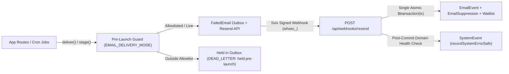

# Email Architecture & Delivery Pipeline

> Canonical architecture reference for outbound email delivery (`lib/email/`), pre-launch recipient gating (`EMAIL_DELIVERY_MODE`), Svix-signed Resend webhook ingestion (`POST /api/webhooks/resend`), ops alert routing, DNS authentication records, and operational runbooks.

**Last Updated**: 2026-10-10

---

## 1. Architecture Overview

Resend sends every transactional, operational, and newsletter email on the platform across isolated sending subdomains:

- **Transactional & Ops Mail**: Sent from `mail.familiarisenow.com` (`onboarding@`, `security@`, `notifications@`, `payments@`, `finance@`, `noreply@`, `system@`).
- **Newsletter & Waitlist Mail**: Sent from `news.familiarisenow.com` (`newsletter@`) to isolate bulk sender reputation from transactional delivery.
- **In-App Notifications**: Novu manages in-app notifications exclusively and never dispatches email.

---

## 2. Outbound Catalog (`lib/email/config.ts`)

### Transactional & Lifecycle Emails (`@mail.familiarisenow.com`)

| Type                                                                                                                       | Trigger                                                                                        | Sender           | Recipient                               | Channel                                   | Source Path                                                                                     |
| -------------------------------------------------------------------------------------------------------------------------- | ---------------------------------------------------------------------------------------------- | ---------------- | --------------------------------------- | ----------------------------------------- | ----------------------------------------------------------------------------------------------- |
| `WELCOME`, `EMAIL_VERIFICATION`                                                                                            | Verified signup, 6-digit verification code                                                     | `onboarding@`    | Customer                                | Outbox via `deliver()`                    | `emails/auth/`, `lib/email/index.ts`                                                            |
| `PASSWORD_RESET`, `PASSWORD_CHANGED`, `ACCOUNT_LINKED`, `EXISTING_ACCOUNT_SIGN_UP`                                         | Reset link, password changed, social account linked, sign-up attempt on an existing address    | `security@`      | Customer                                | Outbox via `deliver()`                    | `emails/auth/`, `lib/email/index.ts`                                                            |
| `ACCOUNT_SUSPENDED`, `ACCOUNT_BANNED`                                                                                      | Back-office moderation                                                                         | `security@`      | Customer                                | Outbox                                    | `emails/account/`, `lib/email/senders/people.ts`                                                |
| `SSO_PROVIDER_SUBMITTED`, `SSO_PROVIDER_APPROVED`, `SSO_PROVIDER_REVOKED`                                                  | SSO provider registered (to ADMINs), approved or revoked (to OWNERs)                           | `security@`      | Platform ADMINs, org OWNERs             | Direct via `deliver()`                    | `emails/organizations/SsoProviderEmail.tsx`, `lib/email/senders/sso.ts`                         |
| `SECURITY_EVENT`                                                                                                           | Authenticator or passkey added, backup codes regenerated or used, admin 2FA reset, 2FA lockout | `security@`      | Operator                                | Outbox via `deliver()`                    | `emails/auth/SecurityEventEmail.tsx`, `lib/auth/security-email.ts`                              |
| `APPOINTMENT_BOOKED`, `APPOINTMENT_CANCELLED`, `APPOINTMENT_RESCHEDULED`, `TRIAL_SESSION_SCHEDULED`, `NEW_BOOKING_REQUEST` | Booking lifecycle                                                                              | `notifications@` | Customer or consultant                  | Outbox, staged in the booking transaction | `emails/booking/`, `lib/email/senders/booking.ts`                                               |
| `APPOINTMENT_REMINDER`, `WINDOW_OPENED`, subscription unscheduled nudge                                                    | Reminder and nudge sweeps                                                                      | `notifications@` | Customer                                | Outbox, sent by cron                      | `emails/booking/`, `lib/email/senders/booking.ts`                                               |
| `PAYMENT_LINK`, `PAYMENT_LINK_REMINDER`, `PAYMENT_LINK_MANUAL_REMINDER`                                                    | Approved request awaiting payment, reminders                                                   | `payments@`      | Customer                                | Outbox                                    | `emails/payments/PaymentLinkEmail.tsx`, `lib/email/index.ts`, `lib/booking/remind-payment.ts`   |
| `PAYMENT_SUCCESS`, `PAYMENT_FAILED`                                                                                        | Payment webhook pipeline                                                                       | `payments@`      | Customer                                | Outbox staged in the webhook              | `emails/payments/`, `lib/payments/webhooks/staged-emails.ts`                                    |
| `REFUND_PROCESSED`, `REFUND_FAILED`                                                                                        | Refund settles or fails                                                                        | `payments@`      | Customer                                | Outbox                                    | `emails/payments/`, `lib/email/senders/money.ts`                                                |
| `VERIFICATION_DECIDED`, `ORG_CREATED`, `ORG_WELCOME`                                                                       | Verification decision, organisation created                                                    | `onboarding@`    | Applicant or org admin                  | Outbox                                    | `emails/verification/`, `emails/organizations/`, `lib/email/senders/onboarding.ts`              |
| `ORG_MEMBERSHIP_ROLE_CHANGED`, `ORG_MEMBERSHIP_REMOVED`, organisation invitation                                           | Membership change, invitation                                                                  | `notifications@` | Member                                  | Outbox                                    | `emails/organizations/`, `emails/org/`, `lib/email/senders/onboarding.ts`, `lib/email/index.ts` |
| `ORG_PAYOUT_FAILED`, `ORG_INVOICE_OVERDUE`, `ORG_WALLET_LOW`, `ORG_PROGRAM_OVERAGE_DUE`                                    | Organisation finance events                                                                    | `finance@`       | Org admin                               | Outbox                                    | `emails/orgs/`, `lib/email/senders/money.ts`                                                    |
| `SUPPORT_TICKET_RESPONSE`, `SUPPORT_TICKET_UPDATE`, `NEW_REVIEW_RECEIVED`                                                  | Support reply, ticket update, new review                                                       | `notifications@` | Customer or consultant                  | Outbox                                    | `emails/support/`, `emails/reviews/`, `lib/email/senders/people.ts`                             |
| `SUPPORT_TICKET_RECEIVED`                                                                                                  | Ticket created or escalated                                                                    | `notifications@` | Customer                                | `deliver()`, with an outbox bell          | `lib/support/create-ticket.ts`, `lib/email/senders/people.ts`                                   |
| `MODERATION_REPORT_OUTCOME`                                                                                                | Moderation action concludes a report                                                           | `security@`      | Reporter                                | `deliver()`, with an outbox bell          | `app/api/staff/moderation/reports/[reportId]/action/route.ts`, `lib/email/senders/people.ts`    |
| Contact inquiry                                                                                                            | `/contactus` form                                                                              | `notifications@` | Support inbox (`contactInboxAddress()`) | `deliver()`                               | `lib/email/index.ts`                                                                            |

### Single-Use Credentials Are Never Stored or Replayed

`EMAIL_VERIFICATION` (the 6-digit code) and `PASSWORD_RESET` (the reset link) are credential email types (`carriesCredential` in `lib/email/classify.ts`). `deliver()` stages their outbox row with `htmlBody: REDACTED_CREDENTIAL_BODY` and `textBody: null`, so a live code or link never reaches the `FailedEmail` table. If the first delivery attempt fails, the retry relay dead-letters the row without sending (`lastError = "not replayed: <type> carried a single-use credential"`); the user requests a fresh code or link directly from the auth page.

### Operational & Compliance Alerts (`Familiarise Ops <system@mail.familiarisenow.com>`)

| Alert                       | Trigger                                      | Recipient Variable                                       | Slack Mirror (`SLACK_OPS_WEBHOOK_URL`) | Source Path                                     |
| --------------------------- | -------------------------------------------- | -------------------------------------------------------- | -------------------------------------- | ----------------------------------------------- |
| Sentry ingest canary alert  | Ingest canary detects discarded errors       | `OBSERVABILITY_ALERT_EMAIL` (fallback: `supportEmail()`) | Yes (5s timeout, after send)           | `lib/observability/ingest-alert.ts`             |
| Sentry quota alert          | Accepted errors reach 70% monthly quota      | `OBSERVABILITY_ALERT_EMAIL` (fallback: `supportEmail()`) | No                                     | `lib/observability/quota-alert.ts`              |
| DPDP breach deadline alert  | Unreported breach nears 72h statutory window | `DATABREACH_ALERT_EMAIL`                                 | Yes (5s timeout, after send)           | `jobs/compliance/databreach-deadline-alerts.ts` |
| MSME payment deadline alert | Payouts near Section 43B(h) deadline         | `MSME_ALERT_EMAIL`                                       | No                                     | `jobs/compliance/msme-payment-alerts.ts`        |

### Newsletter & Waitlist (`newsletter@news.familiarisenow.com`)

| Type                            | Trigger                             | Recipient             | Guard & Channel                        | Source Path                                 |
| ------------------------------- | ----------------------------------- | --------------------- | -------------------------------------- | ------------------------------------------- |
| Waitlist confirmation & welcome | Double opt-in signup / confirmation | Subscriber            | `deliver()`                            | `emails/waitlist/`, `lib/email/index.ts`    |
| `WAITLIST_BROADCAST`            | Admin newsletter broadcast          | Confirmed subscribers | `heldRecipientDomain()` per subscriber | `app/api/admin/waitlist/broadcast/route.ts` |

---

## 3. Resend Webhook Verification, Atomic Transaction & Full Event Coverage (`POST /api/webhooks/resend`)

Resend delivers webhooks over Svix (`standardwebhooks.com`) signed with `RESEND_WEBHOOK_SECRET` (`whsec_...`).

### 1. Svix Cryptographic Verification & Replay Window

`app/api/webhooks/resend/route.ts` validates payload size (`readBodyWithinCap`), checks presence of `svix-id`, `svix-timestamp`, and `svix-signature`, and verifies the exact raw request buffer using `new Resend(...).webhooks.verify(...)`, enforcing HMAC-SHA256 authenticity plus Svix's **5-minute (300 s) timestamp tolerance** to block replay attacks. Invalid signatures return HTTP `401` without logging untrusted payload bytes.

### 2. Atomic Single-Transaction Persistence Under `PG_POOL_MAX=1`

Both `EmailEvent` creation (`@unique` on `svixId`) and recipient suppression / waitlist side effects execute inside **one atomic `prisma.$transaction(async (tx) => ...)`** passing `tx` sequentially to every helper:

- Duplicate redeliveries hit `EmailEvent.svixId` unique constraint (`isUniqueViolation`) and immediately return HTTP `200 { received: true, duplicate: true }`.
- If any database write fails mid-transaction, the entire transaction rolls back (`EmailEvent` is **not** committed) and the route returns **HTTP `500`** so Resend/Svix retries the delivery cleanly.

### 3. Complete Handled Resend Event Catalog

| Event Family                   | Event Name(s)                                                                                                                                   | Action                                                                                                                                                                                                                  |
| ------------------------------ | ----------------------------------------------------------------------------------------------------------------------------------------------- | ----------------------------------------------------------------------------------------------------------------------------------------------------------------------------------------------------------------------- |
| **Delivery & Bounce**          | `email.bounced`                                                                                                                                 | When `data.bounce?.type === "Permanent"`, upserts `EmailSuppression` (`HARD_BOUNCE`) via `tx` and transitions `Waitlist` (`PENDING`/`SUBSCRIBED` → `BOUNCED`). Transient bounces log `EmailEvent` only.                 |
| **Spam Complaints**            | `email.complained`                                                                                                                              | Upserts `EmailSuppression` (`COMPLAINT`) via `tx` and transitions `Waitlist` to `UNSUBSCRIBED`.                                                                                                                         |
| **Pre-Send Suppression Block** | `email.suppressed`                                                                                                                              | Fired when Resend blocks an outbound message due to upstream suppression; synchronizes `EmailSuppression` (`MANUAL`) via `tx` and marks `Waitlist` (`BOUNCED`) so future sends short-circuit locally without API calls. |
| **Audience / Contact Sync**    | `contact.created`, `contact.updated`, `contact.deleted`, `contact.topics.updated`                                                               | When `type === "contact.deleted"` or `type === "contact.updated"` with `unsubscribed === true`, upserts `EmailSuppression` (`MANUAL`) via `tx` and marks `Waitlist` (`UNSUBSCRIBED`).                                   |
| **Sending Domain Health**      | `domain.created`, `domain.updated`, `domain.deleted`                                                                                            | Calls `recordSystemErrorSafe` **after transaction commit** when `domain.updated` reports `status` as `"failed"` or `"not_started"`, or when `domain.deleted` fires.                                                     |
| **Telemetry & Inbound Events** | `email.sent`, `email.delivered`, `email.delivery_delayed`, `email.opened`, `email.clicked`, `email.failed`, `email.scheduled`, `email.received` | Persisted idempotently on `EmailEvent` for delivery auditing; `archive-webhook-events` prunes `EmailEvent` rows older than **90 days** every Sunday UTC midnight.                                                       |

---

## 4. Pre-Launch Delivery Guard (`EMAIL_DELIVERY_MODE`)

Enforced in `lib/email/delivery-guard.ts` across `stage()`, `attempt()`, `retry-failed-emails.ts`, and `heldRecipientDomain()`:

- **Mode**: Only `EMAIL_DELIVERY_MODE=live` disables the guard; any other value or unset defaults to `allowlist`.
- **Allowlist Matching**: Permits recipients on `familiarisenow.com` (and its subdomains) or explicit entries in comma-separated `EMAIL_ALLOWLIST` (exact addresses or `@domain`/`domain`). If any recipient in `to`, `cc`, or `bcc` is disallowed, the entire message is held in `FailedEmail` as `DEAD_LETTER` (`lastError = "held:pre-launch"`).
- **Production Launch Requirement**: Set `EMAIL_DELIVERY_MODE=live` in both Netlify production environment variables AND GitHub repository variables (`cron-intra-day.yml`, `cron-daily.yml`).

---

## 5. DNS Authentication, ImprovMX Forwarding & Runbooks

| Host                               | Type     | Value                                                                              | Purpose                                                                        |
| ---------------------------------- | -------- | ---------------------------------------------------------------------------------- | ------------------------------------------------------------------------------ |
| `@` (apex)                         | MX       | ImprovMX `mx1` & `mx2`                                                             | Routes `support@`, `ops@`, `dpdp@`, `billing@`, and `dmarc@` to operator inbox |
| `@` (apex)                         | TXT      | `v=spf1 -all`                                                                      | Prevents spoofing on non-sending root domain                                   |
| `_dmarc`                           | TXT      | `v=DMARC1; p=quarantine; rua=mailto:dmarc@familiarisenow.com`                      | Enforces DMARC alignment and aggregate reporting                               |
| `resend._domainkey.mail` / `.news` | TXT      | Resend DKIM public keys                                                            | Signs transactional (`mail.`) and newsletter (`news.`) traffic                 |
| `send.mail` / `send.news`          | MX + TXT | `feedback-smtp.ap-northeast-1.amazonses.com` + `v=spf1 include:amazonses.com ~all` | Return-Path bounce handling and SPF alignment                                  |

---

## Deprecated & Superseded Approaches

- **Non-Transactional `EmailEvent.create` Followed by Separate `suppressRecipient` Writes**: Superseded by a single Prisma `$transaction(tx)` in `app/api/webhooks/resend/route.ts` because committing `EmailEvent` outside a transaction caused transient DB errors on `EmailSuppression` / `Waitlist` writes to still answer HTTP `200`, permanently dropping hard-bounce suppressions on retry (`duplicate: true`).
- **Handling Only `email.bounced` and `email.complained` While Ignoring `email.suppressed`, `contact.*`, and `domain.*`**: Superseded by official Resend event coverage keeping local `EmailSuppression`, `Waitlist`, and domain health events synchronized with Resend.
- **Unbounded `EmailEvent` Growth**: Superseded by weekly 90-day pruning in `archive-webhook-events` alongside `WebhookEvent` and 30-day terminal `OutboundWebhookDelivery` rows.
