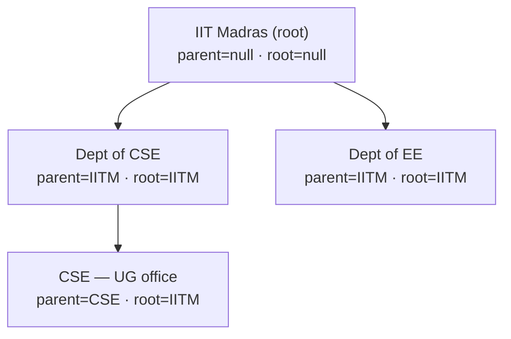

# Organization hierarchy

> Scope: the schema-only group-hierarchy columns on `Organization`
> (#771 D3) and what is — and isn't — wired in v1. Updated 2026-06-05.

`Organization` carries two self-relation hierarchy columns —
`parentOrganizationId` and `rootOrganizationId` — so a future
conglomerate-buyer rollout (Tata/Reliance/Birla-style subsidiary
groups) lands without a structural migration. Both are **nullable and
inert** in v1: no code reads or writes them, and the group-billing /
subsidiary-scoping APIs that would consume them are stubbed 501. The
columns exist to make the data model future-proof without committing to
the UX yet.

These columns were dropped in #768 (`4f80bac5` —
_"drop Organization hierarchy (parentId/rootId/depth)"_, which also deleted
`lib/api/organizations/hierarchy.ts` and the depth column) and deliberately
re-added in #771 D3 once a conglomerate buyer became a near-term prospect —
the cost of the **second** migration on a live table was the lesson that
motivated keeping the columns this time, even with the UI deferred. The
helpers that the drop removed have **not** come back; only the schema columns
did (see "What is NOT implemented" below).

## What the tree would look like (hypothetical, UI deferred)

The shape these columns exist to support — a conglomerate parent with
subsidiary orgs. Nothing below is wired in v1; this is purely what
`parentOrganizationId` / `rootOrganizationId` would encode once the
group-billing work (#771) ships:



Note the invariant the denormalised `rootOrganizationId` buys: every
descendant points its `root` at the **group root** (IITM), not its immediate
parent — so "every session booked by any IITM subsidiary this quarter" is a
flat `WHERE rootOrganizationId = '<iitm-root-id>'` instead of a recursive CTE.
The root org leaves both columns `null` rather than self-referencing (v1
runtime behaviour; see "Creation invariants" below). **This tree cannot be
created in v1** — `POST /api/organizations` accepts no `parentId` and every
org it mints is a flat, null-hierarchy root. IIT Madras is used here only
because it's the seeded campus org; the departments are illustrative.

## Schema

```prisma
model Organization {
  parentOrganizationId String?
  parentOrganization   Organization?  @relation("OrgHierarchy", fields: [parentOrganizationId], references: [id], onDelete: SetNull)
  childOrganizations   Organization[] @relation("OrgHierarchy")
  rootOrganizationId   String? // denormalized group root for fast subsidiary scoping
  ...
}
```

- `parentOrganizationId` — direct parent, nullable (root / standalone
  orgs leave it `null`). `onDelete: SetNull` so deleting a parent
  orphans rather than cascades its subsidiaries.
- `rootOrganizationId` — denormalised group-root id, intended for fast
  subtree scoping. Nullable; **not** self-populated in v1 (a standalone
  org leaves it `null` rather than pointing at itself).

There is **no `depth` column** and **no `@@index`** on either field yet
— both are intentionally deferred until the subsidiary-scoping APIs that
need them ship. Denormalising the root id (rather than walking
`parentOrganizationId` recursively) is the chosen shape so a future
report — "every session booked by any Wipro subsidiary this quarter" —
runs as a flat `WHERE rootOrganizationId = '<wipro-root-id>'` instead of
a recursive CTE. That query is not built yet; the column is the
forward-commitment to it.

## What is NOT implemented (everything, in v1)

The hierarchy is schema-only. Nothing below exists yet:

- **No helpers.** There is no `lib/api/organizations/hierarchy.ts` and
  no `deriveHierarchyFromParent` / `rootIdOf` / `descendantIdsOf`
  function anywhere in the tree. Subtree scoping is a TODO(#771), not a
  utility you can call.
- **No population.** `POST /api/organizations` does not accept a
  `parentId` in its body and never sets `parentOrganizationId` or
  `rootOrganizationId` — every org created in v1 is a flat,
  null-hierarchy root.
- **No re-parenting.** Moving a subtree under a new root would require a
  transactional walk that rewrites every descendant's denormalised root
  id. Out of scope for v1.
- **No subtree UI** (nested sidebar, breadcrumb, "switch to parent").
- **No subtree-scoped `requireOrgAccess`.** Platform admins still bypass
  the check; org-level membership is scoped to a single org row (a user
  must be a member of each subsidiary independently).
- **No consolidated-reporting cron.** The roll-up that cross-foots
  spend / earnings across a subtree is a follow-up once the columns are
  actually populated.

## Creation invariants (v1)

Every org `POST /api/organizations` creates is a standalone root:
`parentOrganizationId = null`, `rootOrganizationId = null`. The handler
generates the org id upfront with `randomUUID()` — but that is so the
`BillingAccount` can reference `ownerOrgId` inside the same transaction,
**not** to self-populate a root id. There is no public or admin path in
v1 that sets either hierarchy column; nesting will arrive with the
#771 group-billing work.

## Why keep the columns if there's no UI

Because:

1. The cost of two unused nullable columns is near zero.
2. The cost of adding them later is a structural migration on a table
   with uptime-critical relations — exactly the cost #768 incurred when
   it dropped them and #771 D3 paid again to re-add. (No backfill enters
   the equation here: the DB is pre-MVP and gets reset, so re-adding the
   columns is free of historical-row rewriting — the expensive part is
   purely the schema/relation change against a live table later.)
3. The cost of *not* having them when a conglomerate buyer asks tomorrow
   is a feature gap we can't close in a week.

Shipping the columns now lands the schema commitment while keeping both
the helpers and the UI deferred until a real multi-BU customer lands.

## Seed

`prisma/seedFiles/15a-create-organizations.ts` creates only flat,
standalone orgs — it sets neither `parentOrganizationId` nor
`rootOrganizationId` (both stay `null`), matching the v1 runtime. There
is no seeded subtree to exercise, because there are no helpers to
exercise it with.

## Related docs

- `organization-types` — the flat capability model the hierarchy
  sits alongside.
- `scenarios-and-examples` — Wipro, which motivates the feature.
