# Enterprise layer — overview

> **Scope:** organization primitives, programs, wallets, contracts, invoices,
> payouts, SSO, consent, HRIS, audit log.
> **Audience:** engineers working on anything under `app/api/organizations/**`,
> `app/api/admin/organizations/**`, `app/dashboard/organization/**`, and the
> related `lib/api/organizations/**`, `lib/labels/org-labels.ts`,
> `lib/enterprise/**` modules.

The enterprise layer is a capability-driven B2B surface on top of the
marketplace. Every organization is defined by two orthogonal booleans and
(if it sponsors) one funding source; every API gate reads from a typed
`Membership` row rather than from BetterAuth's own member table.

## Mental model

An organization is described by two axes:

1. **Capability** — what the org is allowed to do.
   - `canSponsor`: pays for its members' sessions.
   - `canHost`: hosts experts who earn through the org.
   - Both true → HYBRID. Both false → INERT (transitional; rejected at
     create time).
2. **FundingSource** — *how* sponsored sessions are paid for. Set on the
   single `BillingAccount` row that belongs to a sponsor org. Values:
   `PERSONAL`, `WALLET`, `INVOICE`, `LICENSE`, `PROJECT` (v2-reserved).

The third primitive — **Program** — is where the commercial terms live.
Every booking that an org sponsors is attributed to a Program, and every
Program subtype (`LICENSED_SEAT`, `CREDIT_POOL`) is a row in its own
config table. See `16-programs.md`.

### `OrgWorkspaceProfile`

Orthogonal to Membership: `OrgWorkspaceProfile` is a per-user profile row
(mirrors `StaffProfile` / `AdminProfile`) that exists for any user who
operates at least one org. `POST /api/organizations` provisions one
inside the creation transaction; `prisma/scripts/backfill-org-workspace-profiles.ts`
covers existing OWNERs. The profile id surfaces on the BetterAuth
session and backs the operator home at
`/dashboard/org-workspace/:orgWorkspaceId/home`, which redirects single-org
operators straight into that org, shows a chooser for multi-org
operators, and a "create an organization" CTA for operators whose
orgs have all been deactivated. See
`docs/onboarding/onboarding-system-reference.md` §0 for the full
profile-model roster.

### Schema map — Organization at the centre

The ER diagram below covers the enterprise-specific models in
`prisma/schema.prisma`. Fields shown are the load-bearing ones (id,
key FKs, status enums, settlement-relevant amounts); see the model
definitions for the full list. For a flowchart-style view that clusters
models by subsystem, see [`reference/schema-diagram.md`](reference/schema-diagram.md).

```mermaid
erDiagram
    Organization ||--o{ Membership          : "typed members"
    Organization ||--o{ Member              : "BetterAuth bridge"
    Organization ||--o{ Invitation          : "pending invites"
    Organization ||--o| BillingAccount      : "at most one (canSponsor)"
    Organization ||--o| OrganizationPayoutAccount : "at most one (canHost)"
    Organization ||--o| OrganizationSSOSettings   : "at most one"
    Organization ||--o{ OrgDomainClaim      : "verified domains"
    Organization ||--o{ Contract            : "commercial agreements"
    Organization ||--o{ OrganizationInvoice : "invoices"
    Organization ||--o{ PurchaseOrder       : "POs"
    Organization ||--o{ OrgInvoiceCounter   : "per-FY seq counters"
    Organization ||--o{ OrganizationEarnings: "host earnings"
    Organization ||--o{ OrganizationPayout  : "host payouts"
    Organization ||--o{ OrgAuditLog         : "audit trail"
    Organization ||--o| HrisConfig          : "directory sync (opt)"
    Organization ||--o{ RateCard            : "owned cards"

    User ||--o{ Membership                  : "joined orgs"
    User ||--o| OrgWorkspaceProfile         : "operator identity"
    User ||--o{ ConsentArtifact             : "DPDP grants"

    Membership ||--o| Member                : "betterAuthMemberId"
    Membership ||--o{ ProgramAssignment     : "entitled to"
    Membership }o--o| RateCard              : "override (optional)"

    BillingAccount ||--o{ Contract          : "funded by"
    BillingAccount ||--o| BillingSubscription : "recurring billing"
    BillingAccount ||--o{ WalletEntry       : "wallet ledger"
    BillingAccount ||--o{ FundingLedgerEntry: "funding ledger"
    BillingAccount ||--o{ OrganizationInvoice : "billed"

    Contract ||--o{ Program                 : "subtypes"
    Contract ||--o| BillingSubscription     : "cycle"
    Contract }o--o| PurchaseOrder           : "linked PO"
    Contract }o--o| RateCard                : "negotiated card"

    Program ||--o| LicensedSeatConfig       : "if LICENSED_SEAT"
    Program ||--o| CreditPoolConfig         : "if CREDIT_POOL"
    Program ||--o{ ProgramAssignment        : "member-scoped"

    ProgramAssignment ||--o{ BookingUtilization : "cap accounting"
    BookingUtilization ||--|| Payment       : "1:1 lock"

    OrganizationInvoice ||--o{ SettlementLedgerEntry : "issued / paid"
    OrganizationPayout  ||--o{ SettlementLedgerEntry : "sent / reversed"
    OrganizationPayout  ||--o{ OrganizationEarnings  : "rolled up"

    Organization {
        string  id              PK
        string  slug            UK
        OrgStatus status
        bool    canSponsor
        bool    canHost
        string  parentId        FK
        string  rootId
        string  pan
        string  gstin
        string  gstStateCode
        MsmeStatus msmeStatus
        bool    msmeWrittenAgreementOnFile
        string  invoiceNumberPrefix
        string  billingContactEmail
        string  supportContactEmail
        string  billingAccountId FK
    }
    BillingAccount {
        string         id          PK
        string         ownerOrgId  UK
        FundingSource  fundingSource
        Currency       currency
        int            walletBalance "paise (WALLET only)"
        int            creditLimit   "paise (INVOICE only)"
    }
    Contract {
        string         id              PK
        string         organizationId  FK
        string         billingAccountId FK
        ContractStatus status
        date           effectiveFrom
        date           effectiveTo
        int            paymentTermsDays "Net-NN"
        string         rateCardId      FK
    }
    Program {
        string       id           PK
        string       contractId   FK
        ProgramType  type         "LICENSED_SEAT | CREDIT_POOL"
        json         coveredPlanTypes
        json         allowedCategories
    }
    ProgramAssignment {
        string id            PK
        string programId     FK
        string membershipId  FK
        date   periodStart
        date   periodEnd
        int    engagementsUsed
        int    overageCount
    }
    BookingUtilization {
        string id              PK
        string programAssignmentId FK
        string paymentId       UK "1:1 with Payment"
        int    engagementsConsumed
        int    priceAtBookingPaise
        int    platformBpsAtBooking
        int    orgBpsAtBooking
        int    consultantBpsAtBooking
        date   reversedAt
    }
    OrganizationInvoice {
        string           id              PK
        string           organizationId  FK
        string           invoiceNumber   "unique per (org, FY)"
        int              fiscalYear
        OrgInvoiceStatus status
        int              subtotalPaise
        int              igstPaise
        int              cgstPaise
        int              sgstPaise
        int              totalPaise
        string           irn
        IrpStatus        irpStatus
    }
    OrgInvoiceCounter {
        string organizationId PK
        int    fiscalYear     PK
        int    nextSeq        "atomic ON CONFLICT increment"
    }
    OrganizationPayout {
        string         id                PK
        string         organizationId    FK
        int            amountPaise       "= netPayout − TDS"
        int            netPayoutPaise
        int            tdsAmountPaise
        string         tdsSectionApplied "194O default"
        date           mustPayByDate     "MSME 43B(h) deadline"
        PayoutStatus   status
        string         gatewayPayoutId   UK
        string         idempotencyKey    UK
    }
    OrganizationPayoutAccount {
        string  id                       PK
        string  organizationId           UK
        string  accountNumberEncrypted   "AES-GCM"
        string  razorpayFundAccountId
        PayoutAccountStatus status
    }
    Membership {
        string       id                 PK
        string       organizationId     FK
        string       userId             FK
        MemberRole   role
        MemberStatus status
        string       consulteeProfileId FK
        string       consultantProfileId FK
        string       rateCardOverrideId FK
        PayoutRecipient payoutRecipient
    }
    OrgWorkspaceProfile {
        string userId PK
    }
    ConsentArtifact {
        string id                  PK
        string userId              FK
        json   purposeCodes
        date   grantedAt
        date   withdrawnAt
        string hash                "SHA-256 tamper-evident"
        date   auditRetainedUntil  "+ 7y"
    }
```



## Index

| # | Doc | Focus |
|---|-----|-------|
| 00 | `00-overview.md` | This file. |
| 01 | `01-organization-types.md` | Capability booleans, the INERT guard, HYBRID semantics. |
| 02 | `02-funding-and-programs.md` | `FundingSource` enum and Program subtypes; old-name mapping. |
| 03 | `03-earnings-and-revenue.md` | `RateCard` resolution, bps math, snapshot fields. |
| 04 | `04-roles-and-permissions.md` | Unified `MemberRole` rank ladder + every API gate. |
| 05 | `05-organization-lifecycle.md` | `OrgStatus` state machine; contract and program lifecycles. |
| 06 | `06-expert-lifecycle.md` | Expert apply/approve; `PayoutRecipient`. |
| 07 | `07-payout-pipeline.md` | Earnings roll-up, `OrganizationPayout` cron, India statutory fields. |
| 08 | `08-sso-and-authentication.md` | `OrganizationSSOSettings`, `SsoProvider`, `OrgDomainClaim`. |
| 09 | `09-wallet-and-ledger.md` | `WalletEntry`, `FundingLedgerEntry`, atomic debit. |
| 10 | `10-invoicing.md` | `OrganizationInvoice`, GST breakdown, IRN, PO 3-way match. |
| 11 | `11-public-pages-and-discovery.md` | Org catalog, ILIKE search, and how org identity surfaces on the marketplace explore page. |
| 12 | `12-dashboard-pages.md` | Every page under `app/dashboard/organization/[orgId]/**`. |
| 13 | `13-feature-flags-and-rollout.md` | `ENABLE_PROVIDER_ORGS` + capability-gated UI. |
| 14 | `14-scenarios-and-examples.md` | Four worked end-to-end scenarios. |
| 15 | `15-concurrency-and-locking.md` | Atomic patterns in `lib/api/organizations/**`. |
| 16 | `16-programs.md` | Program / assignment / `BookingUtilization` internals. |
| 17 | `17-hierarchy.md` | `parentId` / `rootId` / `depth` columns; UI deferred. |
| 18 | `18-three-ledger-discipline.md` | Usage / Funding / Settlement ledger invariants. |
| 19 | `19-harness-verdict.md` | Scenario-by-scenario verdict table. |
| 20 | `20-payment-legs.md` | `PaymentLeg` model and stackable funding. |
| 21 | `21-api-reference.md` | Exhaustive route table with roles and audit actions. |
| 22 | `22-route-migration-table.md` | Old-route → new-route map. |
| 23 | `23-runbooks.md` | Incident-response procedures + scheduled operational tasks. |
| 24 | `24-monitoring.md` | Log event taxonomy, alert thresholds, dashboards. |
| 25 | `25-idempotency-keys.md` | Every side-effect endpoint's idempotency key + anti-patterns. |
| 28 | `28-jit-and-session-refresh.md` | JIT auto-join, `sessionGeneration` marker, role-change refresh without forced logout. |
| 30 | `30-rate-limiting.md` | Coverage matrix for auth + SSO + wallet endpoints; why BetterAuth's built-in limiter is disabled. |

### `explainers/` — narrative high-level docs

| File | Purpose |
|------|---------|
| `explainers/complete-guide.md` | End-to-end walkthrough across all enterprise concepts. |
| `explainers/billing-architecture.md` | Billing-account / funding-source / contract / program architecture. |

### `reference/` — lookup-style docs

| File | Purpose |
|------|---------|
| `reference/money-glossary.md` | Plain-English definitions of Refund / Reimbursement / Payout / Referral / Credits + all ~45 money-related models and enums. **Start here if a money term is confusing.** |
| `reference/schema-diagram.md` | Visual map of the enterprise Prisma schema. |
| `reference/sso-error-codes.md` | Every typed HTTP error code emitted by the SSO + auth routes, paired with the humanized copy + operator fix. |

### `playbooks/` — actionable how-tos

| File | Purpose |
|------|---------|
| `playbooks/billing-sales.md` | Non-technical pitch framed around capability pairs + funding. |
| `playbooks/billing-technical.md` | Technical playbook for every capability × funding combo. |
| `playbooks/sso-testing.md` | Mock IdP recipes for local + CI SSO tests. |

## Ground-truth files

Every doc below defers to the following files when the prose drifts:

- `prisma/schema.prisma` — the schema is the source of truth. Docs cite
  model and field names verbatim.
- `lib/labels/org-labels.ts` — capability, role, status, and funding-source
  labels + Zod narrowers consumed by dashboard and wizard code.
- `lib/enterprise/audit-actions.ts` — the typed constant object that backs
  every `OrgAuditLog.action` string we emit.
- `lib/enterprise/role-transitions.ts` — `isBlockedRoleTransition`, the
  single source of truth for the disjoint LEARNER ↔ EXPERT rule.
- `lib/labels/personal-dashboard.ts` — `resolvePersonalDashboardHref`
  (priority: `orgWorkspaceProfile → consultantProfile → consulteeProfile`).
- `lib/labels/org-errors.ts` — humanized copy for `ORG_NOT_VERIFIED`
  and `ROLE_TRANSITION_BLOCKED` (surfaced via `humanizeOrgError`).
- `lib/profiles/ensure-consultee-profile.ts` — lazy
  `ensureConsulteeProfile(db, userId)` called from checkout, slot
  request-for-approval, and LEARNER invite accept.
- `lib/auth.ts` (the `customSession` hook) — the live session payload;
  also the `databaseHooks.user.create.after` hook, which no longer
  force-creates a `ConsulteeProfile` on signup.
- `lib/auth-helpers.ts` — `requireOrgAccess`, `requireOrgOwner`,
  `orgRoleSatisfies`, and `ORG_ROLE_RANK`.
- `lib/api/organizations/{wallet,program-helpers,rate-card,hierarchy}.ts`
  — the transactional primitives referenced across the ledger, program,
  rate-card, and hierarchy docs.
- `types/org-details.ts` — shared `OrgDetailsResponse` shape +
  `flattenOrgDetails` helper; consumed by the org layout and
  `useOrgRole`.

## Session shape

The customSession hook flattens each active membership into:

```
{
  organizationId,
  organizationName,
  organizationSlug,
  organizationLogo,
  role,                // MemberRole
  departmentLabel,
  canSponsor,
  canHost,
  fundingSource,       // FundingSource | null
  walletBalance        // int paise | null
}
```

There is no `kind`, `billingMode`, `creditBalance`, `contractEndDate`, or
`organizationProfileId` on the session anymore. UI code derives the badge
via `deriveCapabilityKind(canSponsor, canHost)` and reads fundingSource
directly — labels come from `lib/labels/org-labels.ts`.

At the user level (outside the `organizationMemberships[]` list) the
session also carries the four profile-id FKs — `consultantProfileId`,
`consulteeProfileId`, `staffProfileId`, `adminProfileId`,
`orgWorkspaceProfileId` — surfaced from `lib/auth.ts` so client code can
resolve the "Personal Dashboard" href via
`resolvePersonalDashboardHref` without re-querying the DB.

## Seed / production-shaped grid

For local development, tour rehearsals, and any agent reasoning about
"what the dashboard should look like for a real org", refer to the
deterministic cohort below. Slugs and emails are stable handles —
prefer them over raw IDs in tests, prompts, and docs (IDs change
across `prisma migrate reset`). Source: `prisma/seedFiles/15a-create-organizations.ts`.

| Slug | Capability | Funding | Program | Notes |
|---|---|---|---|---|
| `wipro` | Sponsor (canSponsor=true, canHost=false) | INVOICE | LICENSED_SEAT | PO + draft monthly invoice; pure buyer-side. |
| `learnpro-academy` | Host (canSponsor=false, canHost=true) | — | — | Payout account + 10/10/80 RateCard + EXPERT memberships. |
| `iit-madras` | Hybrid (canSponsor=true, canHost=true) | WALLET | CREDIT_POOL | Both money flows live in parallel. |
| Rahul's solo org | Host (canSponsor=false, canHost=true) | — | — | Single-consultant convenience org; dynamic slug. |

**Tour owner:** `tour-owner@familiarise.dev`, password from
`SEED_PASSWORD` (default `SeedPass123!`). Created with
`UserRole = ORG_WORKSPACE` and `OrgWorkspaceProfile`; OWNER of `wipro` so
the operator portfolio (`/dashboard/org-workspace/<id>/home`) renders
populated on first sign-in.

`19-harness-verdict.md` cross-references this grid for the harness
table; if a row here changes, update both files together.
