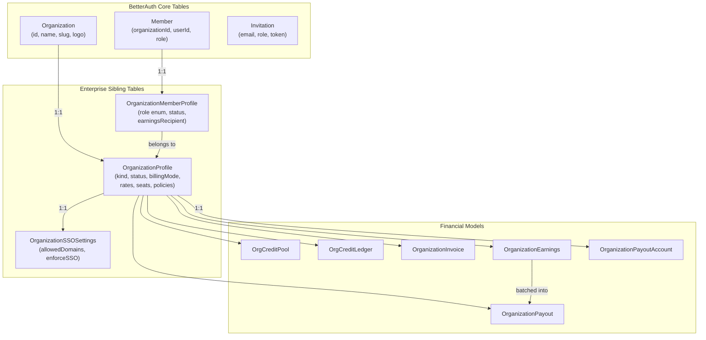

# Enterprise System

**Status**: Implemented (Apr 2026)
**Branch**: `feature/enterprise`
**Scope**: Organization management, billing, SSO, payouts

## Overview

The Enterprise system is a B2B layer built on top of the Familiarise B2C marketplace. It allows companies, schools, and consulting agencies to manage their employees or consultants as a single entity, sponsor training sessions, control billing, and enforce SSO. Organizations are first-class Prisma models paired with BetterAuth's built-in `Organization` and `Member` tables through a "dual-table" pattern: BetterAuth handles auth primitives (login, invitation tokens, session scoping), while our `OrganizationProfile` and `OrganizationMemberProfile` models carry all business logic (billing mode, revenue rates, role enum, payout accounts).

### Goals

- Allow companies to sponsor and track employee training in bulk (BUYER)
- Allow consulting agencies to host freelance consultants with revenue sharing (PROVIDER)
- Support hybrid organizations that both buy and sell (HYBRID)
- Provide 4 billing modes for BUYER/HYBRID orgs, spanning the spectrum from analytics-only to unlimited licenses (PROVIDER orgs have `billingMode = NULL` — they earn, they don't pay)
- Enforce SSO and domain-based auto-join for corporate security
- Give platform admins full operability over every org without needing membership

### Key Design Decisions

| Decision | Choice | Rationale |
|----------|--------|-----------|
| Dashboard layout | OrgSwitcher + `/dashboard/organization/[orgId]/home` | Reuse existing sidebar component; no separate branded layouts |
| PROVIDER deferred | Gated by `ENABLE_PROVIDER_ORGS` flag (default `false`) | Revenue-split billing is compliance-sensitive; ship BUYER first |
| All 4 BUYER billing modes | Shipped in one PR | Modes share 90% of checkout logic; splitting would create merge conflicts |
| Full SSO admin UI | `OrganizationSSOSettings` model + BetterAuth `ssoProvider` table | Our policy fields (domain allowlist, enforce flag) live in our model; SAML/OIDC config in BetterAuth's |
| Discovery | Both `/explore` badge + `/explore/companies` page | PROVIDER consultants show org badge on cards; orgs get a dedicated listing page |
| Multi-org consultants | Allowed | A freelancer can belong to multiple agencies; `resolveOrgSplit` picks the **oldest** active PROVIDER/HYBRID membership (`orderBy: createdAt asc`) for deterministic routing. The explore badge query uses the same ordering, so earnings and badge always resolve to the same org. |
| Admin verification | Required for PROVIDER/HYBRID orgs | `OrganizationStatus.PENDING_VERIFICATION` until platform admin approves |
| Single role per org | No dual membership | One `OrganizationMemberProfile` per user per org; simplifies permission checks |
| Configurable payout frequency | `PayoutFrequency` enum: WEEKLY, BI_WEEKLY, MONTHLY | Stored on `OrganizationProfile.payoutFrequency` (default MONTHLY) |
| Plan catalog control | `enforceOrganizationPlans` boolean on `OrganizationProfile` | When true, PROVIDER/HYBRID consultants can only use org-created plans |
| HYBRID = independent flows | BUYER + PROVIDER streams run independently | A HYBRID university's learner purchases and professor payouts don't interfere |
| earningsRecipient flag | `CONSULTANT` or `ORGANIZATION` on `OrganizationMemberProfile` | Internal/salaried consultants have their share redirected to the org |

---

## Architecture

### Data Model

```
BetterAuth Core Tables                    Enterprise Siblings
(auto-managed by BetterAuth)              (our business logic)
┌─────────────────────┐                   ┌────────────────────────────┐
│ Organization        │    1:1            │ OrganizationProfile        │
│  id, name, slug,    │──────────────────►│  kind, billingMode, status │
│  logo, metadata     │                   │  rates, seats, contract    │
└─────────────────────┘                   └────────────┬───────────────┘
                                                       │
┌─────────────────────┐                   ┌────────────┴───────────────┐
│ Member              │    1:1            │ OrganizationMemberProfile  │
│  userId, orgId,     │──────────────────►│  role (typed enum), status │
│  role (string)      │                   │  consultantProfileId,      │
└─────────────────────┘                   │  earningsRecipient,        │
                                          │  customConsultantPayoutRate│
┌─────────────────────┐                   └────────────────────────────┘
│ Invitation          │                                │
│  email, role,       │                   ┌────────────▼───────────────┐
│  status             │                   │ OrganizationSSOSettings    │
└─────────────────────┘                   │  allowedEmailDomains,      │
                                          │  enforceSSO,               │
                                          │  defaultRoleForAutoJoin    │
                                          └────────────────────────────┘

Financial Models (linked to OrganizationProfile)
┌──────────────┐  ┌──────────────────┐  ┌─────────────────────┐
│ OrgCreditPool│  │ OrgCreditLedger  │  │ OrgCreditPurchase   │
│  balance     │  │  delta, reason   │  │  creditsPurchased   │
│  totalPurch. │  │  balanceAfter    │  │  amountPaid         │
└──────────────┘  └──────────────────┘  └─────────────────────┘

┌───────────────────┐  ┌─────────────────────┐  ┌───────────────────────┐
│ OrganizationInvoice│  │ OrganizationEarnings │  │ OrganizationPayout    │
│  amount, status    │  │  grossAmount, orgShare│  │  amount, periodStart │
│  billingCycle      │  │  platformFee, status  │  │  periodEnd, status   │
└───────────────────┘  └─────────────────────┘  └───────────────────────┘

┌───────────────────────┐  ┌────────────────┐
│ OrganizationPayoutAcct│  │ OrgAuditLog    │
│  bankName, ifscCode   │  │  action, actor │
│  stripeConnectId      │  │  target, details│
└───────────────────────┘  └────────────────┘
```

The following Mermaid diagram shows the same relationships interactively (renders in GitHub and VS Code):



### Quick Reference

**Organization Types**

| Kind | Description |
|------|-------------|
| `BUYER` | Companies/schools that sponsor employee or student training |
| `PROVIDER` | Consulting agencies hosting freelance consultants (feature-flagged) |
| `HYBRID` | Both BUYER and PROVIDER streams (e.g., a university) |

**Billing Modes**

| Mode | Description |
|------|-------------|
| `TAG_ONLY` | Learner pays normally; payment tagged with org for reporting |
| `SEAT_PACK` | Org pre-purchases credits; learner checkouts deduct from pool |
| `INVOICED_MONTHLY` | Learners book freely; org gets a NET-X invoice at month-end |
| `PREPAID_UNLIMITED` | Flat-fee license; no per-session billing; sessions free for learners |

**Earnings Modes**

| Mode | When | Split |
|------|------|-------|
| Marketplace (B2C) | Independent consultants or BUYER orgs | 80% consultant / 20% platform |
| Agency Split (B2B) | PROVIDER/HYBRID orgs | Configurable 3-way (default 85/5/10) |
| Platform-only | HYBRID with salaried consultants | 100% platform+org / 0% consultant |

---

## Key Files

| File | Purpose |
|------|---------|
| `prisma/schema.prisma` (lines 458-955) | All enterprise models, enums, and relations |
| `lib/auth-helpers.ts` | `requireOrgAccess`, `orgRoleSatisfies`, `ORG_ROLE_RANK` |
| `lib/feature-flags.ts` | `ENABLE_PROVIDER_ORGS` flag |
| `lib/payments/payouts/earnings-service.ts` | `resolveOrgSplit`, `createEarningsFromPayment`, `refundEarnings` |
| `lib/payments/payouts/constants.ts` | `PAYOUT_CONSTANTS` (platform fee 20%, hold periods) |
| `lib/payments/operations/checkout.ts` | Org billing mode branching in checkout flow |
| `lib/payments/operations/org-credits.ts` | `deductCredits`, `creditRefund`, `purchaseCredits` |
| `app/dashboard/organization/[orgId]/layout.tsx` | Sidebar items, role-based nav visibility |
| `app/api/organizations/route.ts` | Org CRUD (create, list) |
| `app/api/organizations/[orgId]/route.ts` | Org details, PATCH settings |
| `app/api/organizations/[orgId]/consultants/route.ts` | PROVIDER consultant management |
| `app/api/organizations/[orgId]/payouts/route.ts` | Org payout history |
| `app/api/organizations/[orgId]/payout-account/route.ts` | Org bank account management |
| `app/api/organizations/public/` | Public org listing for `/explore/companies` |

---

## Reading Order

1. **This file** -- overview and mental model
2. **[01 -- Organization Types](./01-organization-types.md)** -- BUYER vs PROVIDER vs HYBRID, decision tree
3. **[02 -- Billing Modes](./02-billing-modes.md)** -- how each mode affects checkout and refunds
4. **[03 -- Earnings and Revenue](./03-earnings-and-revenue.md)** -- 2-way vs 3-way split, worked examples
5. **[04 -- Roles and Permissions](./04-roles-and-permissions.md)** -- 6 roles, API guards, dashboard visibility
