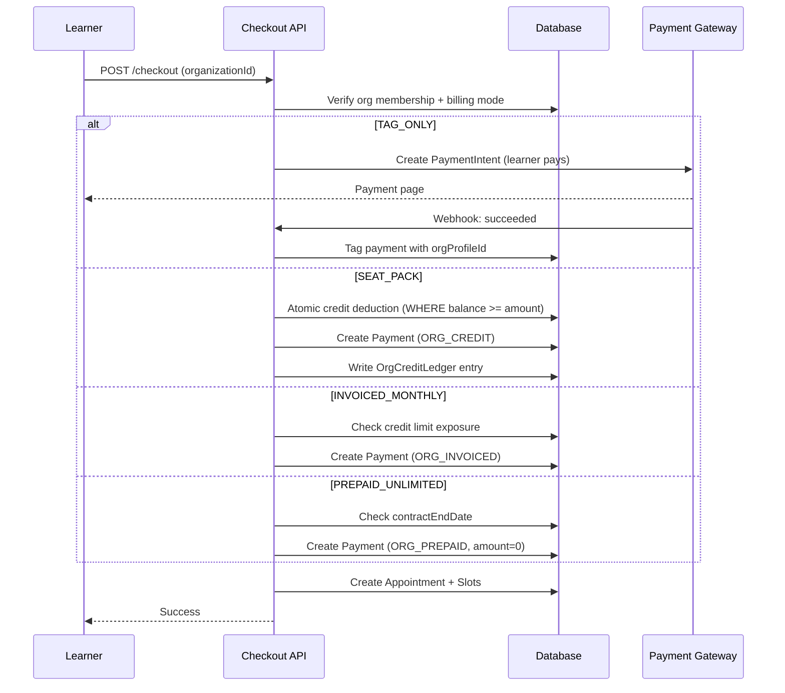

# Billing Modes

**Status**: Implemented (Apr 2026)
**Branch**: `feature/enterprise`
**Scope**: `OrganizationBillingMode` enum, checkout branching, credit pool, invoicing

## Overview

Every BUYER or HYBRID organization selects one of four billing modes at creation time. The billing mode determines how learners pay for sessions and who receives the gateway charge. Once the org processes its first payment, the billing mode is effectively immutable -- changing it would invalidate existing financial records.

**PROVIDER organizations do not have a billing mode.** `OrganizationProfile.billingMode` is nullable; PROVIDER orgs have it set to `NULL`. PROVIDER orgs earn money (payouts from 3-way earnings split), they don't spend it through billing. The PATCH `/api/organizations/[orgId]` endpoint rejects any attempt to set `billingMode` on a PROVIDER org with a 400. Billing-mode-aware dashboard nav (Billing, Credits) is hidden for PROVIDER orgs.

| Decision | Choice | Rationale |
|----------|--------|-----------|
| 4 modes in one PR | TAG_ONLY through PREPAID_UNLIMITED | Modes share 90% of checkout logic; differ only at the payment-creation branch |
| Credits in paise | 1 credit unit = 1 paise | Avoids float arithmetic; matches Payment.amount units |
| Atomic credit deduction | Raw SQL `UPDATE ... WHERE balance >= amount` | Prevents overdraft under concurrent transactions |
| Immutable ledger | `OrgCreditLedger` row per state change | Audit trail for compliance; `balanceAfter` enables point-in-time reconciliation |
| Contract dates | `contractStartDate` / `contractEndDate` on `OrganizationProfile` | PREPAID_UNLIMITED expiry checked at checkout time |
| Referral credits blocked | Org-funded bookings strip `useReferralCredits` | Mixing personal incentives with employer spend creates accounting conflicts |

---

## TAG_ONLY

The lightest mode. The learner pays at checkout with their own card, exactly like an independent booking. The only difference: the `Payment` row is tagged with `organizationProfileId` for reporting.

**Money flow**: Learner's card --> Gateway --> standard 80/20 split.

**Checkout behavior**: No branching in `checkout.ts`. The org context is resolved early (line 1569) but `orgBillingMode === "TAG_ONLY"` means none of the enterprise payment flags fire. The gateway flow proceeds unchanged.

**Example**: Wipro creates a TAG_ONLY org to track which employees are using the platform. Employee Sita books a ₹3,000 consultation and pays from her personal card. Wipro sees the booking in their analytics dashboard but doesn't pay anything.

**Refund routing**: Standard gateway refund to learner's card.

---

## SEAT_PACK

The org pre-purchases credits into an `OrgCreditPool`. When a learner checks out, the session fee is deducted from the pool instead of charging the learner's card. The gateway is skipped entirely.

```
Purchase Flow
┌──────────┐    pays ₹10,00,000    ┌───────────┐    webhook confirms    ┌──────────────┐
│ Org Admin│───────────────────────►│ Gateway   │───────────────────────►│ purchaseCredits│
│          │                       │ (Stripe)  │                       │ +10,00,000 paise│
└──────────┘                       └───────────┘                       └──────┬───────┘
                                                                              │
                                                                              ▼
                                                                    ┌──────────────────┐
                                                                    │ OrgCreditPool    │
                                                                    │ balance: 10,00,000│
                                                                    └──────────────────┘

Booking Flow
┌──────────┐    books ₹2,000 session    ┌───────────────┐    atomic deduct    ┌──────────────────┐
│ Learner  │───────────────────────────►│ checkout.ts   │──────────────────►│ OrgCreditPool    │
│ (member) │                            │ isOrgCredit   │                   │ balance -= 2,000 │
└──────────┘                            │ Payment = true│                   └──────┬───────────┘
                                        │ paymentMethod │                          │
                                        │  = ORG_CREDIT │                          ▼
                                        └───────────────┘               ┌──────────────────┐
                                                                        │ OrgCreditLedger  │
                                                                        │ delta: -2000     │
                                                                        │ reason: "booking"│
                                                                        └──────────────────┘
```

**Example**: "Delhi Public School" pays ₹10,00,000 via Stripe. `purchaseCredits()` adds 10,00,000 paise to the pool. Student Arjun books a ₹1,000 career counseling session. `deductCredits()` atomically decrements the pool by 1,00,000 paise (₹1,000) and writes a ledger row.

**Credit pool mechanics** (file: `lib/payments/operations/org-credits.ts`):
- `deductCredits()` -- raw SQL `UPDATE ... WHERE balance >= amount` prevents overdraft
- `creditRefund()` -- atomic increment on refund
- `purchaseCredits()` -- atomic increment + updates `totalPurchased`
- Every operation writes an `OrgCreditLedger` row with `delta`, `reason`, and `balanceAfter`

**Refund routing**: Credits returned to pool via `creditRefund()`. Learner's card is never charged, so no gateway refund.

---

## INVOICED_MONTHLY

Learners book freely without paying. Bookings are tagged with `paymentMethod = "ORG_INVOICED"` and succeed immediately (no gateway). At month-end, a cron job aggregates all unbilled payments into an `OrganizationInvoice` with NET-X payment terms (default 30 days, configurable via `paymentTermsDays`).

```
Booking Flow
┌──────────┐    books session    ┌───────────────┐    synthetic payment    ┌──────────────┐
│ Learner  │────────────────────►│ checkout.ts   │───────────────────────►│ Payment      │
│ (member) │                     │ isOrgInvoiced │                       │ method:      │
└──────────┘                     │ Payment = true│                       │ ORG_INVOICED │
                                 └───────────────┘                       │ status:      │
                                                                         │ SUCCEEDED    │
                                                                         └──────────────┘

Monthly Cron (1st of each month)
┌───────────────────┐    aggregates unbilled    ┌──────────────────────┐
│ Cron Job          │──────────────────────────►│ OrganizationInvoice  │
│ invoice-generator │   payments for prior      │ status: SENT         │
└───────────────────┘   month                   │ dueDate: +30 days    │
                                                │ items: [line items]  │
                                                └──────────────────────┘
```

**Credit limit enforcement**: If `orgInvoiceCreditLimit` is set (in paise), checkout calculates exposure = unbilled payments (net of refunds) + outstanding invoices. If exposure >= limit, the booking is rejected.

**Example**: TCS creates an INVOICED_MONTHLY org with `orgInvoiceCreditLimit = 50,00,000` (₹50,000). Employees book freely throughout April. On May 1st, the cron generates an invoice for ₹38,000. TCS pays via wire transfer within 30 days. If the unbilled total hits ₹50,000 before month-end, new bookings are blocked.

**Refund routing**: If the invoice is unpaid, unbill the payment (remove from invoice line items). If already paid, issue a credit note against the next invoice.

---

## PREPAID_UNLIMITED

A flat-fee enterprise license for a fixed contract period. Learners book sessions for free (amount = 0). No per-session billing. The org pays a lump sum upfront, and `contractStartDate` / `contractEndDate` on `OrganizationProfile` define the license window.

**Checkout behavior**: `isOrgPrepaidUnlimited = true` in `checkout.ts` (line 1725). Checkout verifies `contractEndDate > now()` before proceeding. The `Payment` row has `amount = 0`, `paymentMethod = "ORG_PREPAID"`, and `paymentStatus = SUCCEEDED`.

**Example**: IIT Bombay pays ₹1,00,00,000 (₹1CR) for a 1-year unlimited license. 5,000 students book freely. Each booking creates a zero-amount Payment tagged with the org. The consultant still earns the standard 80/20 split on the plan's `originalAmount` (their listed price) -- the platform absorbs the discount as a cost of the enterprise deal.

**Refund routing**: N/A. Sessions are free for learners. If the contract is terminated early, the lump-sum refund is handled off-platform as a business negotiation.

---

## Comparison Table

| | TAG_ONLY | SEAT_PACK | INVOICED_MONTHLY | PREPAID_UNLIMITED |
|---|----------|-----------|------------------|-------------------|
| Who pays at checkout | Learner (personal card) | Org (credit pool) | Nobody (deferred) | Nobody (pre-paid) |
| Per-session cost to org | None | Session price | Session price | None (flat fee) |
| Gateway involved | Yes | No | No | No |
| `paymentMethod` | `CARD` | `ORG_CREDIT` | `ORG_INVOICED` | `ORG_PREPAID` |
| Credit pool | N/A | Yes (`OrgCreditPool`) | N/A | N/A |
| Invoice | N/A | N/A | Yes (`OrganizationInvoice`) | N/A |
| Contract period | N/A | N/A | N/A | `contractStartDate`/`contractEndDate` |
| Refund routing | Gateway refund to learner | Credits back to pool | Unbill or credit note | N/A |
| Credit limit | N/A | Pool balance | `orgInvoiceCreditLimit` | N/A |
| Org analytics | Session count + cost | Session count + credits used | Invoice totals | Session count |

---

## Checkout Flow

The following sequence diagram shows how `checkout.ts` branches for each of the four billing modes when an organization context is present.



```
checkout.ts — Enterprise Billing Branch (lines 1714-1751)

                    ┌─────────────────────────────┐
                    │ Is organizationId present?   │
                    └──────────┬──────────────────┘
                               │
                    ┌──────────▼──────────────────┐
                    │ Resolve OrganizationProfile  │
                    │ Verify caller is active member│
                    │ Strip referral credits        │
                    └──────────┬──────────────────┘
                               │
              ┌────────────────┼────────────────┐────────────────┐
              ▼                ▼                ▼                ▼
        orgBillingMode   orgBillingMode   orgBillingMode   orgBillingMode
        = TAG_ONLY       = SEAT_PACK      = INVOICED_     = PREPAID_
                                           MONTHLY         UNLIMITED
              │                │                │                │
              ▼                ▼                ▼                ▼
        Normal gateway   Skip gateway    Skip gateway    Check contract
        flow unchanged   syntheticId =   syntheticId =   expiry, then
                         org_credit_*    org_invoiced_*  syntheticId =
                                                         org_prepaid_*
              │                │                │                │
              └────────────────┴────────────────┴────────────────┘
                                       │
                                       ▼
                              Create Payment row
                              (paymentMethod set per branch)
                                       │
                                       ▼
                         ┌─────────────────────────┐
                         │ SEAT_PACK only:          │
                         │ deductCredits() inside   │
                         │ Serializable transaction │
                         └─────────────────────────┘
```

---

## Edge Cases

| Scenario | Behavior |
|----------|----------|
| Billing mode change after first payment | Not allowed. No API endpoint supports changing `billingMode` after creation. |
| SEAT_PACK credits exhausted mid-checkout | `deductCredits()` raw SQL returns 0 rows -- throws "Insufficient credits" |
| PREPAID_UNLIMITED contract expired | Checkout checks `contractEndDate > now()` -- returns error message asking admin to renew |
| Concurrent SEAT_PACK deductions | Atomic `UPDATE ... WHERE balance >= amount` serializes deductions; only one succeeds if balance is tight |
| INVOICED_MONTHLY over credit limit | Exposure calculation (unbilled net + outstanding invoices) >= `orgInvoiceCreditLimit` blocks checkout |
| Learner tries to use referral credits on org booking | Silently stripped: `useReferralCredits` forced to `false` for all org-funded bookings |
| TAG_ONLY org member books without org context | Works normally -- treated as a personal booking, not tagged |
| SEAT_PACK refund | `creditRefund()` atomically increments pool balance and writes a `delta > 0` ledger row with reason "refund" |
