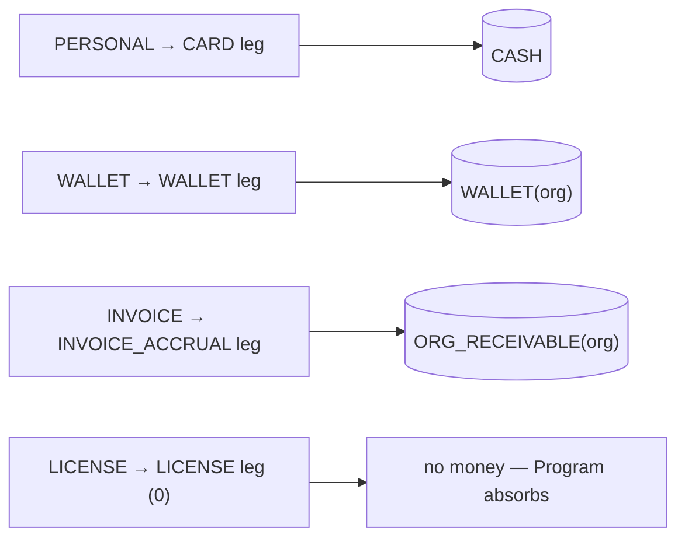

# Funding sources and programs

Sponsor-side orgs (`canSponsor=true`) attach exactly one `BillingAccount`
row. The account carries a `fundingSource` enum that controls how
sessions are paid for. Most commercial variations (seat caps, overage
behaviour, session rollover) live one layer below, on `Program` rows
hanging off `Contract`s.

## `FundingSource` enum (schema.prisma)

```prisma
enum FundingSource {
  PERSONAL // learner pays own card; Payment.organizationId tagged only
  LICENSE // flat enterprise license (was PREPAID_UNLIMITED)
  WALLET // credit pool (was SEAT_PACK)
  INVOICE // NET-X postpaid (was INVOICED_MONTHLY)
}
```

The `PROJECT` value was dropped from the enum — it never modelled a real
arrangement and carried no config. Per-engagement fixed-fee / hourly
billing, if it ever ships, lands as a `Program` subtype, not a funding
source.

Labels and taglines come from `FUNDING_SOURCE_LABEL` and
`FUNDING_SOURCE_TAGLINE` in `lib/labels/org-labels.ts`.

## Mapping from the old billing modes

| Old `OrgBillingMode`    | New `FundingSource` | Notes |
|-------------------------|---------------------|-------|
| `TAG_ONLY`              | `PERSONAL`          | Members pay at checkout; the org is attribution-only. |
| `SEAT_PACK`             | `WALLET`            | Credits live as paise on `BillingAccount.walletBalance`. |
| `INVOICED_MONTHLY`      | `INVOICE`           | Roll-up invoice at month-end; `PaymentLeg.source=INVOICE_ACCRUAL`. |
| `PREPAID_UNLIMITED`     | `LICENSE`           | Flat fee contract; `coveredEngagementsPerCycle=null` on the LICENSED_SEAT Program. |

## Funding-source matrix

| FundingSource | Wallet column | Credit limit column | Per-booking leg (`PaymentLeg.source`) | Invoice rhythm |
|---------------|---------------|---------------------|---------------------------------------|----------------|
| `PERSONAL`    | `null`        | `null`              | `CARD` (on the learner's card)        | None |
| `WALLET`      | `Int` paise (balance) | `null`      | `WALLET` (debit from balance)         | None |
| `INVOICE`     | `null`        | `Int` paise (optional, `null` = unlimited) | `INVOICE_ACCRUAL` (rolled up) | Cron rolls `Payment`s into one `OrganizationInvoice` at month-end |
| `LICENSE`     | `null`        | `null`              | `LICENSE` (no money moves; Program absorbs it) | None (flat fee already paid) |

Pre-launch verified: the "unmetered" experience of a LICENSE org is not
a separate funding model — it's a `LICENSED_SEAT` Program with
`coveredEngagementsPerCycle = null`. The old PREPAID_UNLIMITED enum value
pretended the two were distinct; they are not.

Each funding source determines which ledger account a sponsored booking debits (via its `PaymentLeg.source` → the `BOOKING` posting; see [payment legs](13-payment-legs.md) and [ledger & postings](08-ledger-and-postings.md)):



## Programs layer

A `Contract` holds commercial terms. A `Program` sits under the contract
and defines the per-booking rules. Two subtypes ship:

```prisma
enum ProgramType {
  LICENSED_SEAT
  CREDIT_POOL
}
```

`PROJECT` + `RETAINER` are NOT enum values yet — they're named in the
schema header comment as conceptually reserved, but the enum carries only
the two shipped subtypes (and only those two have config tables). Adding
them later is a non-destructive enum extension, so nothing is pre-stamped.

Each subtype has its own config table:

```prisma
model LicensedSeatConfig {
  programId                  String          @id
  ratePerSeatPaise           Int
  cycle                      BillingCycle    // MONTHLY | QUARTERLY | ANNUAL
  coveredEngagementsPerCycle Int?            // null = unlimited (LICENSE)
  overageBehavior            OverageBehavior @default(BLOCK)
  activeSeatCount            Int             @default(0)
  priceCapPerEngagementPaise Int?
  overageSurchargeBps        Int?            // #775 bps markup on the overage marginal
  maxOveragePerCyclePaise    Int?            // #768 circuit breaker: cumulative cap, then BLOCK
}

model CreditPoolConfig {
  programId               String          @id
  cycle                   BillingCycle    // when does the pool reset?
  creditsPerCycle         Int             // hard cap (1 credit = ₹1)
  minimumCreditsPerPeriod Int?            // optional commitment minimum
  overageBehavior         OverageBehavior @default(BLOCK) // #775 parity with LicensedSeatConfig
  overageSurchargeBps     Int?            // #775 bps markup on the over-budget marginal
  maxOveragePerCyclePaise Int?            // #768 circuit breaker (see LicensedSeatConfig)
}
```

`CreditPoolConfig` gained the same overage trio as `LicensedSeatConfig`
(#775): `overageBehavior` + `overageSurchargeBps` + `maxOveragePerCyclePaise`.
The pool's money cap is `creditsPerCycle × 100` paise; bookings past it
route per `overageBehavior` (BLOCK / CHARGE_MEMBER / CHARGE_ORG), with the
optional bps surcharge and a cumulative-overage ceiling that falls back to
BLOCK once exceeded. The surcharge is applied to the real pass-through
engagement price — consulting rates are heterogeneous, so there's no flat
per-unit tier, just this one bps knob.

`CREDIT_POOL` was simplified post-Arch-4: 1 credit is fixed at ₹1
(100 paise). The dormant `premiumMultiplier` field was dropped and
`creditValuePaise` was retired in favor of the fixed mapping —
finance, audit, and reconciliation all read in rupees end-to-end with
no translation layer. Per-tier rate adjustments live on a Program
rate-card override rather than as JSON escape hatches.

## Config lock & archive

A Program's money config is editable only while nothing rides on it.
`Program.configLockedAt` is stamped in the same transaction that creates
the **first** `ProgramAssignment` (not at program-create, so a typo on a
brand-new program is still fixable). Once non-null, the
`LOCKED_PROGRAM_FIELDS` set in `lib/enterprise/config-lock.ts` —
`type`, `coveredPlanTypes`, `ratePerSeatPaise`,
`coveredEngagementsPerCycle`, `creditsPerCycle`, `overageBehavior`,
`overageSurchargeBps`, `priceCapPerEngagementPaise`,
`maxOveragePerCyclePaise` — is read-only. A retroactive money edit would
rewrite bookings already settled at the old terms, so the rule is: locked
is locked. Changing money terms means **archive this program + create a
new one** (the same immutable pattern as a RateCard bump or contract
supersession). A bounded count check (assignments / bookings / overage
events) stays as a belt-and-braces fallback so a legacy row with a null
column still reads locked.

`Program.archivedAt` is the soft-delete: once `configLockedAt` is set the
program is never hard-deleted (financial history rides on it), so
archiving hides it from active lists while preserving the trail. Contract
terms lock on the same principle — see the deep-dive in
[26-contract-lifecycle.md](26-contract-lifecycle.md).

## `OverageBehavior`

Drives what happens when a program hits its per-cycle cap mid-session.
It applies to **both** subtypes — `LICENSED_SEAT` (metered by engagement
count) and `CREDIT_POOL` (metered by `consumedPaise` against
`creditsPerCycle × 100`):

| Value           | Behaviour                                                                 |
|-----------------|---------------------------------------------------------------------------|
| `BLOCK`         | Checkout returns 402. `ProgramAssignmentLimitError` in `lib/api/organizations/program-helpers.ts`. |
| `CHARGE_MEMBER` | Learner pays the overage on their own card. Recorded as `wasOverage=true` on the `BookingUtilization`. |
| `CHARGE_ORG`    | Overage is rolled into the next `OrganizationInvoice` cycle via a distinct `PaymentLeg.source = OVERAGE_INVOICE_ACCRUAL` leg (kept separate from the base `INVOICE_ACCRUAL` so the `@@unique([paymentId, source])` doesn't collide). |

Each overage materialises an `OverageEvent` row carrying
`basePaise` / `surchargePaise` / `marginalPaise` (marginal = base +
surcharge, where surcharge = base × `overageSurchargeBps` / 10000). Two
guards bound the runaway: `priceCapPerEngagementPaise` caps the
per-engagement pass-through price, and `maxOveragePerCyclePaise` caps the
cumulative marginal within the cycle — once exceeded, subsequent bookings
fall back to `BLOCK` regardless of `overageBehavior`. The OverageEvent
charge state machine and CHARGE_MEMBER timeout telemetry are detailed in
[21-programs.md](21-programs.md).

## `CoveredPlanType`

`Program.coveredPlanTypes: CoveredPlanType[]` enumerates which product
lines a Program applies to. Values: `CONSULTATION`, `CLASS`, `WEBINAR`,
`SUBSCRIPTION`. An empty array means "any plan type" (wildcard).

## `BillingCycle` and `BillingSubscription`

When a Program sits on a subscription billing cadence, a single
`BillingSubscription` row hangs off the Contract and tracks:

- `model`: `SubscriptionModel` (`FLAT_FEE | PER_SEAT`) — the discriminator
- `cycle`: `MONTHLY | QUARTERLY | ANNUAL`
- `ratePerSeatPaise` or `flatFeePaise` (mutually exclusive via `model`)
- `activeSeatCount` (aggregated across programs)
- `currentCycleStart`, `currentCycleEnd`, `nextInvoiceDate`

The job that walks active subscriptions and emits invoices is implemented
(`jobs/billing/generate-subscription-invoices.ts`, #681 — daily 01:00 IST,
amount = `flatFeePaise` for FLAT_FEE or `activeSeatCount × ratePerSeatPaise`
for PER_SEAT, claimed via a conditional `nextInvoiceDate` advance) but is
NOT yet wired to a GitHub Actions workflow — TODO(#681). The INVOICE-funding
month-end roll-up is a separate live cron
(`jobs/cleanup/consolidated-invoice-rollup.ts` →
`.github/workflows/consolidated-invoice-rollup.yml`; crons are GitHub
Actions invoking `jobs/**`, not Netlify functions). The hand-rolled
`POST /api/organizations/[orgId]/billing-account/invoices` still exists as
an operator escape hatch.

Per-cycle entitlement reset is a separate concern: `ProgramAssignment`s
are advanced (ROLLED to a fresh period or CLOSED) by the nightly cycle
engine — see [27-cycle-engine-and-rollover.md](27-cycle-engine-and-rollover.md).

## Capability × funding combinations

The sell-supported matrix — capability (`canSponsor`/`canHost`, see [01](01-organization-types.md)) × funding source. The create call sets the booleans + (for sponsors) `fundingSource`; checkout writes the leg shown (→ which ledger account it debits, see [13-payment-legs](13-payment-legs.md)). Worked end-to-end cases: [50-scenarios-and-examples](50-scenarios-and-examples.md).

| Capability | Funding | Create (key fields) | Checkout leg → ledger | Cron |
|---|---|---|---|---|
| SPONSOR | PERSONAL | `canSponsor:true, fundingSource:PERSONAL` | `CARD` → Dr CASH | none |
| SPONSOR | WALLET | `…WALLET` (`walletBalance=0`) | `WALLET` → Dr WALLET(org); top-up posts `Dr CASH / Cr WALLET` | none (top-up is webhook-driven) |
| SPONSOR | INVOICE | `…INVOICE, requiresPO?, paymentTermsDays` | `INVOICE_ACCRUAL` → Dr ORG_RECEIVABLE; pay → `Dr CASH / Cr ORG_RECEIVABLE` | invoice roll-up + accrual settle |
| SPONSOR | LICENSE | `…LICENSE` + `LICENSED_SEAT` program, `coveredEngagementsPerCycle=null` | `LICENSE` (`amountPaise=0`) → no money moves | subscription invoice (flat fee) |
| HYBRID | any above | `canSponsor:true, canHost:true` | sponsor leg as above **plus** an `OrganizationEarnings` row on the host side | + payout cron |
| HOST | — | `canHost:true` + `OrganizationPayoutAccount` | no sponsor leg; earns `OrganizationEarnings` on member bookings | payout cron (`orgpayout:` posting) |

`ENABLE_HOST_ORGS` (renamed from the dead `ENABLE_PROVIDER_ORGS`) gates the entire host side: while false (the pre-MVP default) `canHost=true` and `role=EXPERT` are rejected at create with 501, the host routes (`payouts`/`payout-account`/`earnings`/`rate-cards`) return 501, and the earnings split in `lib/payments/payouts/earnings-service.ts` takes the sponsor-only path. The sponsor-side funding sources above are unaffected by the flag. See [25-feature-flags-and-rollout.md](25-feature-flags-and-rollout.md).

## Related docs

- `09-wallet-and-topups.md` — wallet top-ups, debits, refunds.
- `12-invoicing.md` — invoice generation, GST, PO 3-way match.
- `21-programs.md` — deeper dive into Program / ProgramAssignment /
  BookingUtilization / OverageEvent.
- `13-payment-legs.md` — the `PaymentLeg` model that carries
  per-source breakdown of every payment.
- [26-contract-lifecycle.md](26-contract-lifecycle.md) — contract terms
  lock, supersession, auto-renew, expiry cascade.
- [27-cycle-engine-and-rollover.md](27-cycle-engine-and-rollover.md) —
  per-cycle ProgramAssignment ROLL/CLOSE engine.
